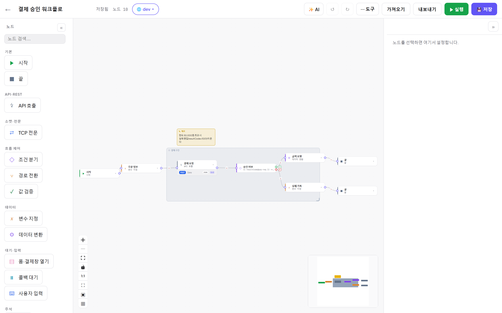
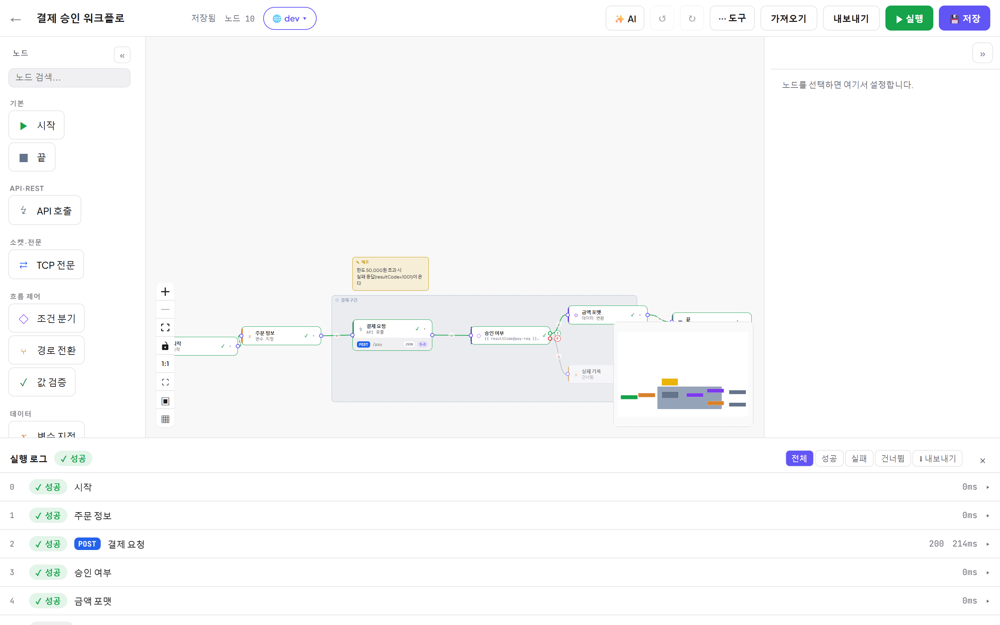

# FlowLink

REST API 워크플로 오케스트레이션 플랫폼. HTTP·조건분기·폼(결제창)·콜백 대기·사용자 입력·변환·TCP 전문 노드로
워크플로를 그려 실행하고, 미완성 API 는 내장 **Mock 서버**로 세워 전체 흐름을 먼저 테스트한다.
자연어로 플로우를 만드는 **AI 어시스턴트** 내장. UI 는 전부 한국어.



- **Backend** — Spring Boot 3.3 / Kotlin 1.9 (Java 21) / JPA + Flyway / **Oracle**(기본, 로컬 dev 는 H2 파일)
- **Frontend** — React 19 / Vite / @xyflow/react / Zustand / React Query — **빌드하면 백엔드 jar 에 동봉**되어 한 프로세스로 서빙

## 빠른 시작 — 단일 jar (화면+API 한 프로세스 :18080)

프론트(dist)가 jar 안에 들어가므로 **프로세스 하나**면 화면과 API 가 모두 뜬다(nginx·별도 프론트 서버 불필요).

```bash
# Linux / macOS / Git Bash — 기본 프로파일 h2(로컬 파일 DB, 인증 없음)
bash scripts/start.sh --build     # 최초 1회: 프론트+백엔드 빌드 후 실행. 이후엔 --build 없이
bash scripts/status.sh
bash scripts/stop.sh
```
```powershell
# Windows (PowerShell) — 같은 lifecycle
powershell -ExecutionPolicy Bypass -File scripts\start.ps1 -Build
powershell -ExecutionPolicy Bypass -File scripts\status.ps1
powershell -ExecutionPolicy Bypass -File scripts\stop.ps1
```
준비되면 **http://localhost:18080** 를 연다. (⚠ `.sh` 와 `.ps1` 은 세트로 — PID 규약이 달라 섞으면 안 됨)

## 사용법 배우기 (스크린샷 가이드)

실제 화면 스크린샷 60여 장으로 쓴 사용 설명서가 있다:

| | |
|---|---|
| 🚀 **[심플가이드](docs/guide/심플가이드.md)** | 10분 안에 첫 워크플로 만들고 실행하기 |
| 📚 **[심화가이드 (15챕터)](docs/guide/README.md)** | 에디터·노드 14종·토큰 바인딩·실행/디버깅·환경/시크릿·트리거·Mock 서버·버전/협업·폼/콜백 심층까지 전 기능 |
| 💎 **[편의 기능 모음](docs/guide/14-편의기능.md)** | 워크플로 간 붙여넣기, 정렬 툴바, 숨은 제스처 — 알면 2배 빨라지는 것들 |

## 무엇이 되나

- **워크플로**: START→…→END 그래프. HTTP(서버/클라이언트)·SET·IF·SWITCH·ASSERT·FORM·WAIT(콜백)·INPUT·TRANSFORM·TCP 노드. `{{ 키@노드 }}` 토큰 바인딩.
- **콜백 대기**: `wait` 노드 콜백을 **백엔드가 `/relay/{execId}/cb/{nodeId}` 로 직접 받아** 자동 재개(별도 프로세스 없음, 탭 닫아도 완결). → [폼·콜백 연동 가이드](docs/guide/15-폼-콜백-연동.md)
- **내장 Mock 서버**: "Mock 서버" 탭에서 가짜 대상 시스템(HTTP/TCP)을 정의·서빙(`/mock/{slug}/**`). 상태·순차응답·콜백 발사·요청로그 지원. → [Mock 가이드](docs/guide/10-Mock-서버.md)
- **AI 어시스턴트**: 에디터 우측 ✨ AI 패널에서 자연어로 플로우 생성/수정. 키 없이 stub 모드, 또는 GitHub Copilot·Anthropic 키 연동.
- **실행 정확성**: 비동기 워커 풀 + 내구 재개(서버 재시작 생존), 트리거(cron·webhook), 실행 이력·비교·스위트, 버전 히스토리, 시크릿 볼트, 환경(dev/staging/prod), 실시간 협업.



## 프론트엔드 개발 (핫리로드)

프론트를 고치며 개발할 때만 vite dev 서버를 따로 띄운다(그 외엔 위 단일 jar 로 충분):

```bash
# 1) 백엔드 실행 (위 scripts/start.sh 또는)  cd backend && sh gradlew bootRun
# 2) 프론트 dev 서버
cd frontend && npm install && npm run dev    # http://localhost:5173  (/api·/relay·/mock·/ws → :18080 프록시)
```

## 운영 배포 (선택 기능은 env 로)

메인 앱은 도커가 아니라 서버(EC2 등)에서 `scripts/` 로 뜬다. 지원 인프라(Vault)만 도커로 띄운다.

```bash
# GitHub 로그인 + Vault 시크릿 + Oracle 을 켜서 기동(예)
export FLOWLINK_AUTH_GITHUB_ENABLED=true FLOWLINK_AUTH_JWT_SECRET=<시크릿>
export FLOWLINK_VAULT_ENABLED=true FLOWLINK_VAULT_ADDRESS=http://<vault>:8200 FLOWLINK_VAULT_TOKEN=<토큰>
export SPRING_PROFILES_ACTIVE=oracle FLOWLINK_DB_URL='jdbc:oracle:thin:@//<host>:1521/FREEPDB1'
bash scripts/start.sh

docker compose -f infra/docker-compose.yml up -d      # Vault(시크릿 저장소)
```
- **로그인**: 미설정이면 dev(로그인 없음). `FLOWLINK_AUTH_GITHUB_ENABLED=true` 면 GitHub 계정(디바이스 플로우)으로 로그인 → **같은 로그인이 어시스턴트 Copilot 연결까지 이어짐**. 게스트도 앱 사용 가능(AI 만 로그인 게이트). 표준 OIDC(Auth0/Entra 등)도 issuer-uri 로 지원.
- 상세 런북: **[infra/README.md](infra/README.md)**.

## 더 보기

- **[docs/guide/](docs/guide/README.md)** — 사용 가이드 (심플 + 심화 15챕터, 스크린샷)
- **[CLAUDE.md](CLAUDE.md)** — 아키텍처·구조·최근 변경 상세 (유지보수 진실원)
- **[backend/README.md](backend/README.md)** — 백엔드 구조·API·설정
- **[frontend/README.md](frontend/README.md)** — 프론트 구조·개발
- **[infra/README.md](infra/README.md)** — 배포(앱=서버, Vault=도커, GitHub 로그인, Oracle)
