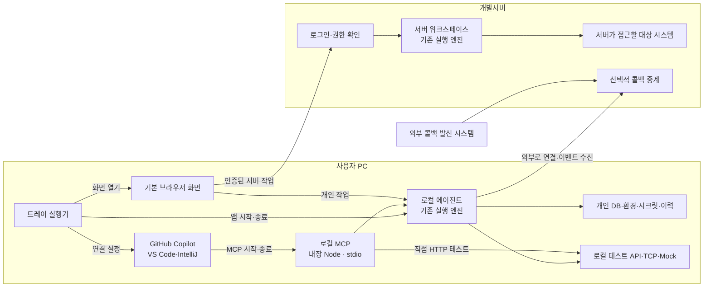

# FlowLink 설치형 앱·로컬 에이전트 전환 계획

> 이 문서는 초기 설계 기록이다. 이후 [노드별 혼합 실행 계획](HYBRID_AGENT_PLAN.md)과 [UI 스토리보드](FLOWLINK_STORYBOARD.html)를 거쳤으며, 현재 재설계 제안은 [목표 아키텍처](FLOWLINK_TARGET_ARCHITECTURE.md)를 참고한다. 새 제안의 사용자 승인·구현 완료와 기존 기록은 구분한다.

작성일: 2026-10-02 · 기준 브랜치: `codex/trim-config` · 상태: 설계 초안, 구현 전

현재 코드의 상세 분석은 [PROJECT_ANALYSIS.md](PROJECT_ANALYSIS.md)를 참고한다.

## 1. 해결할 문제와 목표

개발서버에 FlowLink와 MCP를 올리면 HTTP·TCP 요청의 출발지도 개발서버가 된다. 사용자가 PC에서 화면을 열더라도 서버의 `localhost`는 사용자 PC가 아니다. 브라우저의 client HTTP 모드는 CORS·TCP·문자셋 등의 제약이 있어 전체 실행 경로를 대신하기 어렵다.

목표는 설치 후 개인 워크스페이스를 자신의 PC에서 실행하고, 로그인하면 서버의 공유 기능에 접근하는 것이다. 기본 브라우저로 화면을 열고 트레이에서 화면 열기와 MCP 연결을 제공한다. 사용자가 MCP 프로세스를 따로 설치·실행하거나 토큰을 직접 다루는 과정을 줄인다.

첫 버전은 기존 React 화면과 Kotlin 실행 엔진을 재사용한다. 새로운 네트워크 실행 엔진이나 노드별 분산 실행은 만들지 않는다.

## 2. 합의된 방향과 설계 제안

| 구분 | 내용 |
|---|---|
| 사용자 방향 | 설치 프로그램이 화면과 로컬 에이전트를 제공한다. |
| 사용자 방향 | 개인 워크스페이스는 개인 PC에서 실행한다. |
| 사용자 방향 | 서버에 접근하려면 로그인해야 한다. |
| 사용자 확정 | 개인 정의·환경·시크릿·실행 이력을 PC에 저장하고 선택적으로 공유한다. |
| 사용자 확정 | 기본 브라우저로 화면을 열고 트레이 아이콘에서 화면 열기·MCP 연결을 제공한다. |
| 사용자 확정 | MCP는 VS Code와 IntelliJ의 GitHub Copilot에 연결한다. |
| 제안 | 첫 배포 대상은 Windows로 잡고 다른 OS는 같은 구조로 확장한다. |
| 제안 | 서버 워크스페이스의 실행은 서버에서 수행한다. 공유 플로우를 PC에서 시험하려면 개인 워크스페이스로 복사한다. |

첫 MCP 연결은 PC의 AI·IDE 클라이언트 → 로컬 MCP로 확정한다. 기본 설치에는 PC 실행을 위한 원격 작업 전달 채널이 필요하지 않다. 외부 시스템의 콜백 수신을 위한 서버 중계는 별개의 기능이다.

## 3. 권장 구조: 같은 엔진을 PC와 서버에서 사용

여기서 로컬 에이전트는 통신 중계뿐 아니라 **개인 워크스페이스의 실행과 저장을 담당하는 로컬 런타임**이다. 이미 있는 Spring Boot 앱을 설치형으로 실행하고 필요한 서버 연결 기능을 붙인다.

PC와 서버는 같은 소스의 실행 엔진을 사용하지만 DB와 실행 상태는 각각 소유한다. 두 프로세스가 하나의 DB를 공유하지 않는다. 실행은 처음 선택한 런타임에서 끝까지 진행하며, 연결 장애 때문에 실행 위치를 바꾸지 않는다.

화면은 선택한 접속 위치에만 요청한다. 첫 검증에서는 개인 화면과 기존 서버 화면을 분리해 사용할 수 있다. 통합 화면에서는 로컬 API와 등록된 서버 API의 경로·세션을 구분하고 서버 주소만 바꾸는 전역 axios 설정으로 처리하지 않는다. 서버 연결을 로컬에서 중계한다면 등록한 서버와 허용한 API만 전달하며 임의 URL 프록시는 제공하지 않는다.

## 4. 자원의 소유 위치

| 자원 | 개인 워크스페이스 | 서버 워크스페이스 |
|---|---|---|
| 워크플로·폴더·버전 | 개인 DB | 서버 DB |
| 실행 엔진·실행 상태·이력 | 내 PC | 서버 |
| 환경 변수·시크릿 | 개인 저장소 | 서버 저장소, 서버 권한 적용 |
| 전문 스펙·사용자 변환 | 개인 런타임에서 사용할 정의 | 서버에서 승인된 정의 |
| HTTP·TCP Mock | 내 PC에서 열리는 주소·포트 | 서버에서 열리는 주소·포트 |
| 서버 로그인 정보 | OS 사용자별 보호 저장소 | 서버가 발급·검증·폐기 |
| 외부 콜백 중계 | 명시적으로 선택할 때 서버에 임시 전달 | 기존 서버 콜백 수신 |

현재 워크플로·Mock에는 워크스페이스 경계가 있지만 환경·시크릿·전문·변환은 같은 경계가 적용되어 있지 않다. 최소한 개인 런타임과 서버의 저장소를 분리하고, 서버 자원의 공유 범위는 API와 권한 검사까지 일치시켜야 한다. 팀별 환경 격리를 화면 필터만으로 처리하지 않는다.

개인 데이터의 소유자는 기본적으로 PC의 OS 사용자다. 서버에 다른 계정으로 로그인했다고 개인 파일의 소유권을 바꾸거나 자동 업로드하지 않는다.

## 5. 실행 위치와 환경을 분리한다

사용자가 보는 선택은 다음 세 가지다.

| 선택 | 의미 | 예시 |
|---|---|---|
| 워크스페이스 | 정의와 권한의 소유 범위 | 개인, 결제팀 |
| 실행 위치 | 실제 요청을 보내는 컴퓨터 | 내 PC, 개발서버 |
| 대상 환경 | URL·포트·변수·시크릿의 묶음 | 로컬 테스트, 개발, 운영 |

예: `개인 / 내 PC / 개발`은 내 PC의 에이전트가 개발 API를 호출한다. `개인 / 내 PC / 로컬 테스트`에서 `127.0.0.1`은 내 PC다. `팀 / 개발서버 / 개발`에서는 개발서버가 요청한다. 첫 버전의 실행 위치는 워크스페이스로 결정하고 화면에 분명히 표시한다.

환경에는 base URL, TCP host·port, 일반 변수, 시크릿 참조, 콜백 수신 방식을 둔다. 실제 접근 가능 여부는 실행 위치의 네트워크에 달려 있다. 접속 실패만으로 로컬 주소를 서버 주소로 바꾸지 않는다.

기존 HTTP `reqMode: server`는 선택한 런타임의 실행 엔진이 요청한다는 뜻으로 유지한다. 설치 버전에서는 PC의 엔진이므로 화면에 실행 위치를 함께 표시하고 브라우저 요청 모드와 구분한다. 브라우저 요청의 CORS·문자셋 제약은 그대로 존재한다.

환경 변수와 에이전트 설정도 구분한다. 에이전트 설정에는 서버 접속 주소, 로컬 앱/MCP 포트, 프록시·CA 신뢰, 데이터 경로를 둔다. 진단 화면은 OS·앱·Java·Node 버전과 실행 위치·접속 상태를 보여준다. 사내망 검증은 Java와 Node 양쪽의 TLS 신뢰, 프록시와 loopback 통신을 확인하며 임의 셸 명령으로 진단하지 않는다.

실행 시작 시 다음 내용을 확정하고 이력에 남긴다.

- 워크스페이스·플로우 버전·입력, 런타임/장치 식별자와 앱 버전.
- 선택한 환경 식별자와 이름, 사용한 변수의 스냅샷.
- 시크릿의 참조와 변경 식별 정보, 전문 스펙·사용자 변환의 버전 또는 내용 해시.
- 콜백 경로와 제한 시간, 실행한 사용자 및 시작 시각.

시크릿 값과 민감한 변수는 평문 이력에 넣지 않는다. 변수 스냅샷이 필요하면 보호 저장하고 표시·내보내기는 마스킹한다. 서버 로그인이 만료되거나 환경을 편집해도 진행 중 실행의 조건은 바뀌지 않는다.

현재 `rerun`은 플로우 버전과 input만 복원하고 env/envName은 빠뜨린다. 이를 먼저 고친다. 첫 버전은 저장된 환경 변수와 이름을 복원하고 시크릿은 참조로 다시 조회한다. 시크릿의 변경 여부를 확인해 표시하며, 원래 값을 복원할 수 없으면 같은 조건으로 재현된다고 설명하지 않는다. 시크릿의 과거 버전 보관은 별도 요구가 생길 때 추가한다. 외부 시스템 상태까지 동일한 결과를 보장하는 기능으로 설명하지 않는다.

실행 전에는 필요한 변수·시크릿·전문·변환과 콜백 경로를 검증한다. 환경 이름 중복이나 없는 참조를 다른 워크스페이스의 값으로 채우지 않는다. 이 규칙은 전체 실행·단일 노드·일괄 실행·트리거에서 공통으로 적용한다.

## 6. 설치·로그인·로컬 보호

1. 설치하고 실행하면 개인 저장소를 열고 로컬 에이전트를 시작한다. 첫 검증의 저장 경로 제안은 `%LOCALAPPDATA%\FlowLink`다.
2. 개인 작업은 서버 로그인과 독립적으로 사용할 수 있다. 서버 연결과 AI 등 서버 기능은 로그인 버튼으로 시작한다.
3. 서버 로그인은 기존 GitHub 인증을 우선 재사용한다. 로그인 성공 뒤에도 현재 승인·워크스페이스 역할은 서버가 확인한다.
4. 로그아웃은 해당 서버 세션과 자격 증명을 정리한다. 개인 데이터와 로컬 실행은 유지한다. 여러 서버를 지원할 때 자격 증명은 서버별로 나눈다.

서버 로그인과 로컬 API/MCP 보호는 별개다. 현재 개발 모드의 permitAll과 광범위한 CORS를 설치 버전의 보안 모델로 삼지 않는다. 로컬 관리 API와 MCP는 loopback에 바인딩하고 정확한 Origin/Host 검사와 로컬 세션 보호를 적용한다. MCP 클라이언트는 연결 승인 후 발급한 로컬 자격 증명을 사용하며, 서버 로그인이 없어도 개인 기능을 사용할 수 있다. 로컬 세션과 서버 토큰은 워크플로 대상 URL에 전달하지 않는다.

시크릿 암호화의 현재 고정 개발 키는 설치 배포 전에 OS 사용자별 키로 교체한다. 키와 서버 토큰은 OS 보호 저장소를 사용한다. 백업·복원에는 키 복구 방식도 포함하고, 키가 없는데 빈 저장소로 자동 초기화하지 않는다. 서버의 Vault 지원은 재사용한다.

HTTP·TCP Mock의 기본 바인딩도 loopback으로 제한한다. 다른 PC의 접근이 필요한 경우에만 사용자가 네트워크 노출을 선택한다. 관리 API는 함께 공개하지 않는다.

## 7. 콜백은 별도의 역방향 문제다

로컬에서 외부 API를 호출할 수 있어도 외부 시스템이 로컬 PC로 콜백할 수 있다는 뜻은 아니다. 실행 전에 직접 수신과 서버 중계 중 하나를 선택한다.

- **직접 수신:** 발신자가 PC에 도달할 수 있는 로컬 테스트에서 기존 `/relay/{execId}/cb/{nodeId}`를 사용한다.
- **서버 중계:** 로그인한 로컬 에이전트가 서버에 콜백 경로를 등록하고 외부로 연결해 이벤트를 가져온다. 초기 구현은 HTTP polling으로 시작한다.

서버 중계의 최소 계약:

1. 외부 요청이나 FORM 팝업보다 먼저 실행·대기 노드별 경로, 만료 시각, 콜백 응답을 등록한다. 외부 URL은 추측하기 어려운 토큰을 사용하고 등록·조회는 인증한 소유자만 할 수 있다.
2. 서버는 콜백의 method·필요한 headers·body를 제한된 크기로 영속화한 뒤 설정된 응답을 반환한다. ACK와 로컬 실행 완료는 구분한다.
3. 대기 노드에 도달하기 전 들어온 이벤트도 보관한다. 현재 직접 수신은 아직 suspension이 없으면 소비되지 않으므로 조기 콜백 버퍼를 공통 수신 경로에 추가한다.
4. 로컬은 eventId를 영속화하고 기존 대기 재개·CAS 처리를 재사용한다. 중복 이벤트로 같은 대기를 두 번 재개하지 않으며 로컬 저장을 확인한 뒤 수신 확인을 보낸다.
5. PC가 잠시 끊겨도 이벤트는 만료까지 보관한다. 실행 취소·대기 타임아웃·서버 경로 만료의 순서를 정하고, 늦게 온 이벤트를 새로운 실행에 쓰지 않는다.

콜백 본문은 중계 서버를 거친다는 사실을 설정에 표시하고 암호화·TTL·크기 제한·소유자 확인을 적용한다. 개인 워크플로 전체나 시크릿을 중계 등록에 올릴 필요는 없다. 재시작 후 대기 복구는 현재 DB suspension을 활용하며, 일반 실행 중 장애는 현재처럼 명시적으로 실패 처리한다. 외부 호출을 무조건 재시도하거나 전체 실행의 exactly-once를 보장하지 않는다.

서버에서 개인 Mock으로 들어오는 호출과 일반 webhook도 역방향 접근 문제다. 첫 버전의 콜백 중계를 범용 HTTP/TCP 터널로 확대하지 않는다. 실제로 필요한 수신 기능을 별도 계약으로 추가한다.

## 8. 개인 ↔ 서버 공유는 명시적인 복사부터

기존 워크스페이스 export/import를 확장한다. 첫 버전에는 자동 양방향 동기화를 넣지 않는다.

- 가져오기/공유 전에 대상 워크스페이스와 생성될 자원·충돌·누락 의존성을 보여준다.
- 워크플로가 참조하는 전문 스펙과 사용자 변환을 함께 확인하고 새 ID로 가져오면 그래프 참조도 재매핑한다. 실행 가능한 사용자 변환은 대상의 승인 절차를 따른다.
- 환경은 이름·일반 변수의 템플릿과 시크릿 참조를 선택적으로 복사한다. 시크릿 값·실행 로그·서버 토큰은 기본 공유 대상에서 제외한다. 그래프에 직접 적힌 민감 값도 검사한다.
- Mock 주소·포트는 대상 런타임 기준으로 다시 확인한다. TCP Mock과 트리거는 가져오기만으로 실행하지 않는다.
- 현재 서버에 있는 개인 데이터는 명시적으로 내려받는다. 복사가 성공해도 원본은 유지한다.

현재 export에는 폴더·현재 버전 플로우·Mock만 포함된다. 이를 그대로 완전한 워크스페이스 백업으로 취급하지 않는다. 개인 DB 전체 백업과 공유용 묶음은 목적이 다르다.

## 9. 설치 패키지와 운영

Windows 첫 패키지는 Java 21 `jpackage`로 기존 JAR·빌드된 React 화면·앱 전용 Java 런타임을 묶는 방식을 먼저 검증한다. 기존 `mcp/src/index.js`와 의존성·전용 Node 런타임도 포함한다. 사용자 PC에 Java·Node·npm을 별도로 설치하게 하지 않는다. `jpackage`는 런타임을 포함한 패키지를 만들 수 있으며 대상 OS에서 빌드해야 한다. Windows 설치 파일 생성에는 별도 빌드 도구가 필요하다. [Oracle Java 21 패키징 가이드](https://docs.oracle.com/en/java/javase/21/jpackage/packaging-overview.html)

트레이는 Java의 `SystemTray`와 `Desktop.browse`를 사용하는 작은 실행기로 먼저 검증한다. 브라우저 화면을 유지하므로 별도 웹뷰 엔진은 필요하지 않다. 설치형 실행기에는 `java.desktop`과 GUI 지원을 포함하고 서버 기동은 현재 방식을 유지한다. [SystemTray API](https://docs.oracle.com/en/java/javase/21/docs/api/java.desktop/java/awt/SystemTray.html), [Desktop API](https://docs.oracle.com/en/java/javase/21/docs/api/java.desktop/java/awt/Desktop.html)

- `npm run build → bootJar → app-image 실행 검증 → 설치 파일 생성` 순서로 진행한다. 현재 bootJar가 프론트 빌드까지 대신하지는 않는다.
- 처음에는 Java 런타임을 과하게 줄이지 않는다. HTTP/TLS·H2·전문 문자셋·사용자 변환을 포함한 실제 실행으로 필요한 모듈을 검증한다.
- 실행기는 로컬 앱을 OS 사용자별 단일 인스턴스로 관리한다. 중복 실행은 기존 화면을 연다. 설치형 MCP는 IDE가 내장 Node로 stdio 프로세스를 실행·종료하며 같은 개인 앱을 사용한다. 앱과 MCP의 수명 주기를 구분한다.
- 브라우저 창을 닫아도 개인 앱은 유지한다. 트레이의 종료를 선택하면 진행 중 실행의 처리를 안내하고 앱의 포트를 정리한다. IDE의 MCP 프로세스는 앱을 다시 시작한 뒤 갱신된 접속 키를 읽는다. 화면 없이 진행 가능한 실행과 FORM·INPUT처럼 화면이 필요한 실행을 구분한다.
- 설치 파일과 데이터 폴더를 분리한다. 앱 종료·강제 종료·PC 절전 후 상태를 분명히 표시하고, 삭제 시 개인 데이터의 삭제 여부를 사용자가 선택한다.
- 업데이트는 첫 버전에서 수동 재설치로 시작한다. DB 변경 전 백업하고 스키마 버전을 확인한다. 기존 H2 `ddl-auto:update`만으로 안전한 업데이트·롤백을 보장하지 않는다.
- 서버 연결 시 API 계약 버전을 확인한다. 지원하지 않는 버전이면 서버 기능만 막고 개인 작업은 유지한다. 회사 인증서 신뢰 설정을 재사용하되 TLS 검증 해제를 설치 기본값으로 두지 않는다.

## 10. 구현 순서와 완료 기준

| 단계 | 작업 | 완료 기준 |
|---|---|---|
| 0. 최소 검증 | 기존 앱·MCP를 별도 개인 DB·loopback 포트로 실행하고 트레이·Java/Node 포함 app-image를 만든다. | Java·Node 없는 Windows에서 트레이 → 브라우저가 열리고 로컬 HTTP·TCP·Mock 호출의 출발지가 PC임을 확인한다. VS Code·IntelliJ Copilot 양쪽에서 개인 MCP 도구를 호출하고 시작 시간·메모리 사용량을 기록한다. |
| 1. 실행 경계 | 개인/서버 접속·로그인·캐시를 분리하고 환경·시크릿 범위와 실행 메타데이터, rerun을 고친다. | 같은 이름의 개인/서버 환경이 섞이지 않는다. 서버 로그인 만료 후에도 개인 실행이 가능하고 재실행이 선택했던 환경을 복원한다. |
| 2. 서버 연결·공유 | 기존 서버 인증·역할을 적용하고 의존성을 포함한 복사를 제공한다. 트레이의 VS Code·IntelliJ 연결 동선을 완성한다. | 승인 전/후·VIEWER/EDITOR 권한이 서버에서 적용된다. 복사한 전문·변환 참조가 유효하고 시크릿 값이 자동 공유되지 않는다. 사용자가 MCP를 별도 설치·실행하지 않는다. |
| 3. 콜백 완결 | 조기 콜백 버퍼와 인증된 서버 중계를 연결하고 FORM·WAIT·INPUT 흐름을 확인한다. | 외부 시스템 → 서버 중계 → PC 재개가 동작한다. 선도착·중복·연결 단절·대기 중 재시작·타임아웃을 검사한다. |
| 4. 첫 배포 | 개인 키 보호, 설치·업데이트·백업/복원·종료·버전 호환을 검증하고 설치 파일을 배포한다. | 깨끗한 PC에서 설치 → 개인 테스트 → 로그인 → 서버 공유 → 로그아웃까지 직접 완료한다. 업데이트 후 데이터·시크릿·대기 상태의 처리 결과를 확인한다. |

첫 커밋은 단계 0의 수동 검증 가능한 실행·패키징 경로에 한정한다. 로컬 런타임이 실제로 동작하는지 확인한 다음 경계와 데이터 변경을 진행한다. 각 단계는 결과를 검증한 뒤 다음 단계로 넘어간다.

## 11. 반드시 통과할 시나리오

| 시나리오 | 기대 결과 |
|---|---|
| 서버 접속 없이 설치 앱 실행 | 개인 플로우·환경·Mock 사용 가능 |
| 개인 HTTP가 `127.0.0.1` 호출 | 사용자 PC의 테스트 서비스에 도달 |
| 개인 TCP·비UTF-8 전문·변환 실행 | 기존 엔진과 같은 결과, 브라우저 fetch에 의존하지 않음 |
| 트레이 MCP 연결 → VS Code·IntelliJ Copilot에서 각각 개인 플로우 실행 | 로컬 MCP가 개인 런타임을 호출하고 실행 출발지·환경을 반환 |
| 브라우저 닫기·트레이에서 다시 열기 | 에이전트·MCP 유지, 데이터·실행 상태 복원 |
| 개인 환경 편집 직후 서버 화면 전환 | 지연 저장과 늦은 API 응답이 서버 자원을 덮어쓰지 않음 |
| 같은 이름의 로컬/서버 환경과 시크릿 | 선택한 범위의 값만 사용, 이력에서 출발지와 환경 확인 |
| 원래 실행 이후 환경을 수정하고 rerun | 원래 조건을 복원하거나 변경/복원 불가를 명시 |
| 로그인 만료·로그아웃·계정 전환 | 서버 작업은 재인증, 개인 데이터는 유지, 다른 계정에 자동 공유하지 않음 |
| 콜백이 WAIT 이전에 도착 | 버퍼에서 해당 대기에 한 번 적용 |
| 중계 중 PC 단절·대기 중 재시작 | 만료 전 재접속해 대기 상태와 이벤트 처리, 중복 재개 없음 |
| 외부 사이트가 로컬 관리 API 호출 | 로컬 세션/Origin/Host 검사를 통과하지 못하면 차단 |
| 앱 중복 실행·포트 충돌·업데이트 실패 | 기존 데이터 유지, 복구 가능한 상태와 오류 표시 |

문서 작성 시 기존 분석에서 확인한 테스트 기준은 백엔드 273건 통과, 프론트 빌드·lint 통과다. 위 시나리오는 앞으로 구현하면서 추가할 인수 기준이며 아직 통과한 것으로 간주하지 않는다.

## 12. 현재 코드에서 우선 볼 위치

| 영역 | 출발점 |
|---|---|
| 로컬 기동·패키징 | [scripts/start.ps1](../scripts/start.ps1), [backend/build.gradle.kts](../backend/build.gradle.kts), [SpaStaticConfig](../backend/runtime/src/main/kotlin/com/flowlink/common/web/SpaStaticConfig.kt) |
| 실행 메타데이터·재실행·복구 | [ExecutionService](../backend/runtime/src/main/kotlin/com/flowlink/execution/ExecutionService.kt), [RunRequest](../backend/runtime/src/main/kotlin/com/flowlink/execution/dto/RunRequest.kt), [Execution](../backend/runtime/src/main/kotlin/com/flowlink/core/domain/Execution.kt) |
| 접속·세션·환경 상태 | [client.ts](../frontend/src/api/client.ts), [AuthContext.tsx](../frontend/src/auth/AuthContext.tsx), [auth.ts](../frontend/src/auth/auth.ts), [environments.ts](../frontend/src/lib/environments.ts) |
| 환경·시크릿 경계 | [EnvironmentService](../backend/runtime/src/main/kotlin/com/flowlink/environment/EnvironmentService.kt), [Environment](../backend/runtime/src/main/kotlin/com/flowlink/core/domain/Environment.kt), [Secret](../backend/runtime/src/main/kotlin/com/flowlink/core/domain/Secret.kt) |
| 워크스페이스 권한·복사 | [WorkspaceService](../backend/runtime/src/main/kotlin/com/flowlink/workspace/WorkspaceService.kt), [WorkspaceTransferService](../backend/runtime/src/main/kotlin/com/flowlink/workspace/WorkspaceTransferService.kt) |
| 콜백·수신 URL | [RelayController](../backend/runtime/src/main/kotlin/com/flowlink/execution/RelayController.kt), [RelayBaseResolver](../backend/runtime/src/main/kotlin/com/flowlink/settings/RelayBaseResolver.kt) |
| 로컬 관리 API·키·TCP 바인딩 | [SecurityConfig](../backend/runtime/src/main/kotlin/com/flowlink/security/SecurityConfig.kt), [CryptoConfig](../backend/runtime/src/main/kotlin/com/flowlink/common/crypto/CryptoConfig.kt), [StateCrypto](../backend/runtime/src/main/kotlin/com/flowlink/execution/engine/StateCrypto.kt), [TcpMockRegistry](../backend/runtime/src/main/kotlin/com/flowlink/mock/TcpMockRegistry.kt) |
| MCP 기동·인증·도구 대상 | [index.js](../mcp/src/index.js), [client.js](../mcp/src/client.js), [oauth.js](../mcp/src/oauth.js) |

## 13. 트레이와 MCP 연결

트레이 메뉴의 첫 구성은 `화면 열기 / MCP 연결 / 서버 로그인·상태 / 실행 상태 / 종료`다. MCP 연결을 누르면 `VS Code Copilot / IntelliJ Copilot`을 선택하는 연결 화면을 연다. 실제 접속 주소, 로컬 연결 승인, 서버 로그인 상태와 오류를 보여주고 도구 호출로 성공 여부를 확인한다. Copilot의 GitHub 로그인과 FlowLink 서버 로그인은 각각 해당 서비스의 세션이며 하나의 토큰으로 취급하지 않는다.

IDE 연결 동선:

- **VS Code:** 공식 `code --add-mcp` 등록 기능을 우선 사용한다. 첫 구현은 기본 사용자 프로필에 등록하며 기존 서버 항목을 보존한다. 여러 프로필 선택은 후속 작업이다. CLI가 없으면 지원 버전의 사용자 MCP 설정에 넣을 항목과 설정 열기 안내를 제공한다. 설치형은 내장 Node의 `command`·`args`를 등록한다. 서버 HTTP 연결은 `type: http`와 서버 URL을 사용한다. [VS Code MCP 등록 안내](https://code.visualstudio.com/docs/agent-customization/mcp-servers), [HTTP 설정 참조](https://code.visualstudio.com/docs/agents/reference/mcp-configuration)
- **IntelliJ:** GitHub Copilot Chat의 Agent 모드 → MCP 설정 → Add MCP Tools 경로에서 사용할 서버 설정을 생성·복사한다. 설치형 stdio는 `servers` 아래 `command`·`args`를 사용한다. 기존 서버 설정 전체를 덮어쓰지 않는다. 첫 버전은 이 공식 동선을 이용하고 별도 IntelliJ 플러그인은 만들지 않는다. [GitHub의 JetBrains MCP 안내](https://docs.github.com/en/copilot/how-tos/copilot-in-your-ide/customize-copilot/extend-copilot-with-tools-and-context/extend-copilot-chat-with-mcp?tool=jetbrains)

두 IDE의 실제 버전·Copilot 확장 버전을 기록하고 도구 목록 조회 → 로컬 HTTP·TCP 플로우 실행까지 검증한다. 설치형은 기존 MCP SDK/도구 등록을 재사용하는 **stdio를 먼저 적용**한다. IDE는 설치된 Node와 개인 접속 파일 경로만 설정한다. 서버 HTTP MCP의 OAuth는 유지한다. 사용자가 PAT나 서버 토큰을 설정 JSON에 평문으로 붙여넣는 방식을 기본으로 삼지 않는다. 조직 계정은 Copilot의 MCP 사용 정책도 확인한다.

첫 지원 범위는 PC에서 실행하는 IDE 세션이다. VS Code Remote SSH·WSL·Dev Container나 원격 IDE에서는 MCP 클라이언트가 실행되는 위치도 확인해야 한다. 해당 세션의 `localhost`를 사용자 Windows PC라고 가정하지 않는다. 연결 안내에 이 차이를 표시하고 원격 세션 지원은 별도 검증한다.

| 연결 대상 | 경로 | 실행 출발지 |
|---|---|---|
| PC에서 실행되는 AI 클라이언트 | IDE → 설치된 Node MCP(stdio) → 개인 런타임 | 사용자 PC |
| 웹 AI의 서버 워크스페이스 작업 | 웹 AI → 기존 서버 MCP → 서버 런타임 | 서버 |
| 웹 AI의 개인 워크스페이스 작업, 향후 요구 | 웹 AI → 서버 MCP → 인증된 장치 작업 전달 → 개인 런타임 | 사용자 PC, 작업 전달 추가 구현 필요 |

기존 MCP는 시작 시 하나의 `FLOWLINK_URL`을 고정하므로 로컬 MCP는 개인 런타임을 바라보게 시작한다. 화면의 워크스페이스 선택만으로 이미 연결된 MCP의 대상을 조용히 바꾸지 않는다. 상태·도구 결과에는 연결 위치와 실제 실행 위치를 표시한다. FORM·INPUT·client HTTP는 기존 브라우저 협업이 필요하므로 MCP 실행 시 해당 대기를 안내하고 화면에서 이어갈 수 있게 한다.

2026-10-02 구현·검증 결과와 설치 방법은 [DESKTOP_AGENT_PROGRESS.md](DESKTOP_AGENT_PROGRESS.md)에 기록한다. 이 계획의 0단계 전체 완료와 배포 준비 완료 여부는 실제 IDE·새 Windows 환경 검증까지 확인한 뒤 판정한다.

MCP의 전체 실행·단일 노드·일괄 실행도 화면과 같은 환경 해석·검증 계약을 사용한다. 현재 단일 노드 도구는 envName만 보내고 env 변수는 보내지 않으므로 이 경로까지 확인한다. 도구가 반환하는 본문·로그·변수는 Copilot에 제공되는 데이터다. 개인 PC에 저장한다는 이유로 모든 결과를 그대로 반환하지 않으며 시크릿 마스킹을 적용한다.

향후 웹 AI에서 개인 PC 작업을 요구하면 장치 등록·인증된 작업 전달·유효 시간·수락/취소/결과·소유자 검사를 별도로 추가한다. 관리 API를 인터넷에 노출하거나 만료된 작업을 재접속 후 실행하지 않는다. 이 작업 채널과 7절의 외부 콜백 채널은 수신 대상과 권한이 다르므로 구분한다.

## 14. 첫 버전에서 늘리지 않을 범위

기본 UI 편집·실행은 IDE 연결 없이도 사용하게 한다. AI를 통한 조작은 사용자가 선택한 Copilot MCP 연결을 우선한다. 현재 내장 어시스턴트를 확대하는 작업은 첫 설치 버전의 선행 조건으로 삼지 않는다. 개인 정의를 서버 AI에 보내는 기능을 유지할 경우 보내는 시점과 내용을 표시하고 민감 값은 제외한다.

서버 중계로 PC 실행을 지시하더라도 한 실행은 로컬 엔진에 맡긴다. 노드마다 PC와 서버를 왕복하는 실행 프로토콜로 확장하지 않는다.

자동 동기화·충돌 병합, 임의 장치/노드별 실행 위치 선택, 범용 역방향 TCP 터널, 자동 업데이트 서비스, 실행 엔진 교체는 실제 필요가 생긴 때 별도로 설계한다.

### 현재 소스의 역할별 빌드 경계

`runtime` 공유 코드에 `server-app` / `desktop-app` 실행 모듈이 의존한다. 산출물과 명령은 [역할별 빌드 안내](../backend/README.md)를 따른다. DesktopSession·DesktopConnection은 아직 runtime에 남으며, 독립 에이전트/조정기 분리는 완료되지 않았다. 이 메모는 과거 검증 기록을 변경하지 않으며, 기존 0.3.7 MSI가 새 분리 JAR를 포함했다는 의미도 아니다.
