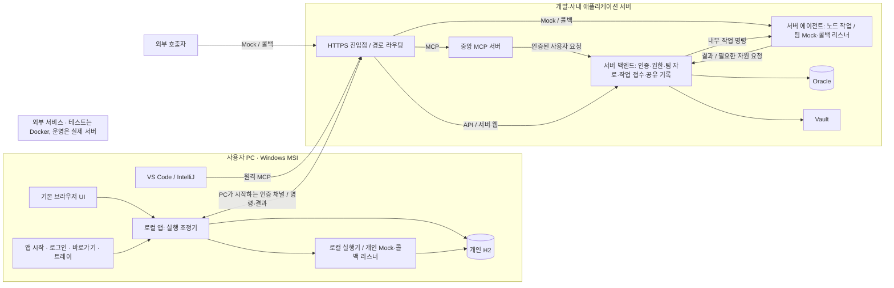

# FlowLink 목표 아키텍처

> 2026-10-06 모듈 리팩토링: 현재 소스·빌드 경계는 `flow-agent / flow-server / flow-desktop / flow-mcp`이며 [역할별 빌드 안내](../backend/README.md)를 따른다. 아래의 이전 설계와 검증 기록은 당시 제안·상태를 보존한 것으로, 현재 모듈 구성이나 새 빌드의 검증 결과를 뜻하지 않는다.

2026-10-03 · 기준 브랜치 `codex/trim-config`

**추가 요구 반영:** Oracle·Vault의 Docker는 테스트용이다. 운영은 실제 서비스 주소·인증·신뢰 설정으로 연결한다. MCP 서버는 중앙 서버에만 둔다. 사용자가 노드 실행 위치와 호출 대상(Mock 포함)을 선택한다. 현재 구현 우선순위는 에이전트 계약·연결·혼합 실행이며, 전체 웹 UI와 Windows 앱 디자인을 병행한다. 팀 수 증가에 따른 목록 확장은 그 뒤에 둔다.

**상태: 제품·실행·설치 담당의 상호 검토를 거친 설계 제안. 사용자 요구로 지정된 사항과 추가 설계 선택을 구분하며, 구현 완료를 뜻하지 않는다.** 아키텍처 문서 작성과 이후 허용된 UI 개선의 진행은 별개로 기록한다. 기존 릴리스 기록은 당시 검증 범위의 기록으로 유지한다. MCP 테스트 제외 지시는 유지한다.

## 1. 아키텍처의 중심

**서버에는 공용 백엔드와 서버 에이전트, PC에는 개인 저장소와 실행 조정 기능을 가진 로컬 앱을 둔다. 하나의 워크플로에서 노드마다 PC 또는 서버가 작업한다.**

자료의 소유 공간, 노드의 실행 위치, Mock·콜백의 수신 위치는 서로 다른 개념이다. 공간을 선택했다고 모든 노드의 실행 위치가 결정되거나, 노드 실행 위치를 바꿨다고 Mock이 다른 컴퓨터로 이동하지 않는다.

### 사용자 요구로 확인된 사항

- Windows MSI로 설치한다. 사용자 PC에 Docker가 필요하지 않다.
- 기본 브라우저에서 작업한다. 트레이는 편의 기능이며 유일한 진입점이 아니다.
- 개인 워크스페이스의 정의·환경·시크릿·실행 이력은 PC의 H2에 저장한다.
- 공용·팀 워크스페이스의 생성·정의·권한·공유 이력은 서버에서 관리한다.
- Windows 앱에서 서버에 로그인한다. 로그인 전후 모두 개인 공간을 이용할 수 있다.
- 한 워크플로 안에서 로컬 노드와 서버 노드를 섞는다. 에이전트를 선택하고 호출하는 역할은 로컬에 둔다.
- 제품의 실행 에이전트는 PC와 서버 두 종류다. 개발에 참여하는 AI 하위 에이전트와 별개다.
- 개인 Mock은 PC에서, 공용·팀 Mock은 서버 에이전트에서 리슨한다. 공용·팀 흐름의 콜백도 서버에서 받는다.
- 실행 위치가 달라지면 주소·네트워크 접근성·환경·시크릿의 해석도 달라진다.
- 설치 과정에서 서버 정보와 IDE용 MCP 설정을 연결한다. VS Code·IntelliJ의 PC 클라이언트가 대상이다.
- MCP 서버는 중앙 서버에만 배치한다. 로컬에는 실행 에이전트를 설치하며 별도의 MCP 서버를 요구하지 않는다.
- Oracle·Vault는 현재 격리된 Docker 환경으로 검증하며 운영에서는 실제 서비스에 연결한다.
- 개발용 외부 인증은 모킹할 수 있다. MCP 프로토콜·도구·IDE 연결 테스트는 하지 않는다.

### 이번에 선택한 설계 제안

수동 실행은 공간에 관계없이 **로컬 앱의 실행 조정기(Coordinator)** 하나가 그래프의 다음 노드를 결정한다. 서버 백엔드는 권한과 공유 자료를 관리하고 서버 작업을 접수한다. 서버 에이전트는 맡겨진 개별 작업을 수행한다.

이는 로컬에 단순 전달기만 두는 것보다 역할이 명확하다는 검토 결과다. 다만 **서버 노드만 있는 수동 워크플로도 PC 앱이 켜져 있어야 끝까지 진행한다.** 사용자에게 이미 확정받은 요구가 아니라 이번 설계의 중요한 선택과 제약이다. PC 없이 도는 예약·무인 실행은 별도의 실행 조정 주체가 필요하므로 이 설계의 구현 완료 항목에 포함하지 않는다.

## 2. 배포 구성과 통신



- 배포 단위는 **Windows 앱 패키지, 서버 백엔드, 서버 에이전트, 중앙 MCP 서비스**다. 중앙 MCP는 같은 서버의 프로토콜 어댑터로 운영하며 별도 실행 엔진을 두지 않는다. Windows 패키지는 필요한 런타임을 포함하며 로컬 MCP 서버·stdio 도우미를 필수로 설치하지 않는다. 로컬 조정기와 로컬 실행기는 앱 내부 구성요소다. 제품의 실행 에이전트는 여전히 PC와 서버 두 종류다.
- 서버의 백엔드·MCP·에이전트는 같은 호스트·Docker 네트워크에서 시작할 수 있다. 서버 에이전트의 작업 명령 API는 외부 공개하지 않는다. HTTP Mock·콜백 경로와 지정한 TCP 리스너만 필요한 범위로 노출한다.
- PC가 서버로 연결하므로 일반적인 실행 명령을 위해 PC에 외부 수신 포트를 열 필요는 없다. 외부 시스템이 개인 Mock·개인 콜백을 직접 호출하는 경우의 PC 도달성은 별도 조건이다.
- 첫 구현은 HTTPS 명령·이벤트 전달과 서버 DB의 작업 기록으로 구성한다. 메시지 브로커나 에이전트 군집 관리 시스템을 선행 도입하지 않는다.
- Oracle·Vault의 배치 방식은 에이전트 계약에 넣지 않는다. 테스트의 Docker 서비스 주소를 실제 서버 주소·계정·Vault 인증·TLS 신뢰 설정으로 바꾸어도 같은 자원 제공자 인터페이스를 사용한다. Docker에서의 성공을 운영 접속 검증 완료로 표시하지 않는다.

## 3. 각 구성요소가 소유하는 책임

| 구성요소 | 책임 | 포함하지 않는 책임 |
|---|---|---|
| Windows 앱의 개인 자원 API | 개인 워크플로·환경·필드·전문·Mock·시크릿·이력의 H2 읽기/쓰기 | 팀 계정·권한 관리, Oracle 접속 |
| 로컬 실행 조정기 | 실행 계획 고정, 다음 노드·분기 결정, 실행 위치 선택, 작업 발행, 진행 상태 저장 | 서버 시크릿 전체 조회, 서버 네트워크 호출 대행 |
| 로컬 실행기 | PC의 HTTP·TCP·변환 등 작업, 허용된 자원 해석, 개인 리스너 | 팀 권한을 임의로 승인하거나 서버 작업을 대신 실행 |
| 서버 백엔드 | 로그인·권한, 공용·팀 자료, 버전, 실행 등록, 작업 접수·인가, 공유 기록, 배포 정보 | 수동 그래프의 다음 노드 계산, PC 개인 H2 관리 |
| 서버 에이전트 | 서버 HTTP·TCP·변환 작업, 공용·팀 Mock·콜백 수신, 작업 결과 보고 | 사용자 관리, Oracle 직접 접속, 전체 그래프 진행 |
| 브라우저 UI | 편집·검색·관찰·실행 요청·사용자 입력·폼 팝업·기존 브라우저 HTTP 협업 | 그래프 실행 엔진, TCP 실행, 로그인 토큰 보관, 다음 노드 진행 |
| 중앙 MCP 서버 | IDE 요청을 인증하고 백엔드 또는 선택된 PC의 조정기로 전달 | 로컬 MCP 서버 강제, 별도 실행 엔진, 에이전트 자동 선택 |

PC에 개인 CRUD용 API가 필요한 것은 H2를 읽고 쓰기 위해서다. **서버 백엔드 전체를 PC에도 설치한다는 뜻이 아니다.** 공유 라이브러리는 재사용하되, 앱 시작점·의존성·DB 설정·등록되는 서비스가 분리되어야 한다.

에이전트 구현에서 먼저 고정할 계약은 호출 작업과 리스너 관리다. 호출 작업은 작업 ID·선택 위치·허용된 입력/자원 참조를 받아 HTTP/TCP 요청 결과와 실제 실행 위치를 반환한다. 리스너 관리는 Mock/콜백의 정의 버전 적용·시작·중지·상태 조회를 제공하고, 실제 bind 주소·공개 주소·적용 버전·실패 원인을 반환한다. 두 에이전트는 같은 계약을 구현하며 Oracle·Vault·개인 H2는 각 자원 제공자 뒤에 둔다.

## 4. 저장 정본과 실행 중 임시 데이터

| 데이터 | 정본 | 다른 곳에 허용되는 데이터 |
|---|---|---|
| 개인 정의·환경·필드·Mock·시크릿·이력 | PC 개인 H2 | 사용자가 명시적으로 공유한 자료만 서버에 새 자원으로 등록 |
| 공용·팀 정의·환경·권한·공유 이력 | 서버 Oracle | 권한 있는 실행을 위한 버전 스냅샷·진행용 임시 데이터만 PC에 보관 |
| 그래프의 다음 노드·분기·재개 지점 | 실행을 시작한 PC의 체크포인트 | 서버에는 보고된 진행 상태를 표시하되 서버가 다음 노드를 다시 계산하지 않음 |
| 서버 작업의 접수·진행·완료 결과 | 서버 작업 기록 | PC는 작업 ID로 결과 수신·조회 |
| 팀 시크릿 | Vault 값 또는 서버의 암호화 저장소 | 허용된 실행기에 필요한 값만 메모리로 전달 |
| 에이전트 미전송 결과·콜백 수신분 | 해당 에이전트의 보호된 영속 저널 | 서버 수신 확정 후 중복 제거·보관 정책에 따라 정리 |

팀 실행용 PC 캐시도 실제 복제다. 이를 “팀 데이터는 PC에 전혀 저장되지 않는다”고 설명하지 않는다. 개인 워크스페이스 테이블과 별도 저장 구역에 두고 서버·계정·기기·실행 ID로 격리한다. 개인 목록이나 오프라인 편집 자료로 나타나지 않는다. 로그아웃·계정 변경 시 접근을 차단하되, 진행 중 체크포인트는 보호된 상태로 보존하고 동일 계정 재인증 및 현재 권한 확인 후에만 사용한다. 명시적 취소·완료 및 보관 정책에 따라 삭제한다. 로그아웃 후 팀 실행을 계속할 수 있다고 가정하지 않는다.

개인 H2의 시크릿 값은 암호화하고 키는 OS 보호 저장소로 관리한다. 체크포인트·공유 이력·일반 로그에는 시크릿 원문을 저장하지 않는다. 필요한 출력만 후속 노드에 전달하며 개인 환경 전체나 실행 컨텍스트 전체를 서버로 올리지 않는다. 시크릿을 변형해 일반 출력으로 내보내는 경우까지 자동 탐지가 보장되는 것은 아니므로, 기록 허용 범위와 명시적 출력 설정도 함께 필요하다.

개인 실행에서 서버 노드를 사용하면 서버에는 그 작업의 최소 명령·인가·결과 기록이 생긴다. 이것은 개인 워크플로 전체나 개인 이력을 팀 자료로 자동 공유하는 것과 구분한다.

중앙 MCP로 개인 자료를 조회하거나 실행 결과를 받으면 사용자가 요청하고 허용한 자료는 중앙 서버를 일시적으로 경유한다. H2의 정본은 PC에 있으며 전체 동기화·팀 자원 자동 등록은 하지 않는다. 기기별로 허용한 자원·행위 범위 안에서 필요한 ID·필드·결과만 응답하고 시크릿 원문이나 일반 로그의 무제한 본문 기록을 허용하지 않는다. 중앙 MCP를 이용한 개인 작업에는 서버 접속이 필요하지만, 개인 브라우저 작업의 오프라인 사용은 유지한다.

## 5. 한 워크플로의 실제 실행

### 개인 공간: PC 조회 → 서버 호출 → PC 검증

1. PC H2에서 정의 버전을 읽는다. 로컬 조정기가 노드별 실행 위치와 환경 바인딩을 고정하고 사전 검사한다.
2. PC 조회 노드는 로컬 실행기가 개인 환경을 해석해 호출한다. `127.0.0.1`은 이 PC다.
3. 서버 노드에 도달하면 앱의 서버 로그인과 지정한 서버 공간의 실행 권한을 확인한다. 필요한 노드 명령·입력·자원 참조만 서버 백엔드에 보낸다. 전체 개인 그래프는 보내지 않는다.
4. 서버 백엔드는 권한과 명령을 기록하고 서버 에이전트에 맡긴다. 서버 환경·Vault 값은 실행 직전에 필요한 범위로 해석한다.
5. 서버 결과를 받은 로컬 조정기가 PC 검증 노드를 실행한다. 개인 실행 이력은 H2에 남는다.

### 팀 공간: PC 대상 호출 → 서버 대상 호출 → 서버 콜백 수신 → 후속 노드

1. 서버의 팀 정의 버전과 권한을 확인하고 실행을 등록한다. PC에는 해당 실행의 스냅샷과 체크포인트만 둔다.
2. 로컬 조정기가 각 명령을 서버에 등록해 확인받은 뒤 지정한 실행기를 호출한다. PC 노드는 선택한 개인 자원 또는 PC 사용이 허용된 팀 자원을 사용한다.
3. 서버 노드는 서버 자원을 사용한다. 각 작업 결과는 서버 공유 이력에 정책에 맞게 기록한다.
4. 이 워크플로의 WAIT 수신 위치는 서버다. 앞 노드가 사용할 콜백 URL은 실행 시작 단계에서 등록해 발급한다. 앞의 HTTP 노드가 PC에서 실행되었다고 WAIT를 PC에 만들지 않는다.
5. 서버 에이전트가 콜백을 수신·보관하고 로컬 조정기가 결과를 소비해 다음 노드를 결정한다. PC가 꺼져 있으면 콜백은 받되 다음 노드는 진행하지 않는다.

노드 명령과 결과는 최소한 실행 ID, 정의 버전, 노드 ID, 시도 ID, 실행 위치, 자원 참조를 식별한다. START·END·SWITCH 등의 그래프 제어는 조정기에 둔다. HTTP·TCP·변환·계산·조건 평가 등 실행 대상 작업의 결과를 받아 조정기가 경로를 선택한다. FORM·INPUT은 연결된 브라우저의 사용자 상호작용을 기다린다.

### 기존 브라우저 HTTP의 호환 경계

새 HTTP 노드의 기본 실행 위치는 PC 또는 서버 에이전트다. 기존 `reqMode=client`는 브라우저의 쿠키·origin·CORS에 의존할 수 있으므로 네이티브 PC 호출로 자동 변환하지 않는다. 기존 정의는 명시적인 **브라우저 HTTP 협업 동작**으로 보존하고 실제 호출 주체를 화면에 표시한다. 로컬 조정기가 요청과 결과를 관리하며 브라우저가 제3의 제품 에이전트나 그래프 실행기가 되는 것은 아니다.

이 단계에는 연결된 브라우저가 필요하다. 전송 전 브라우저가 없으면 대기하고, 전송 도중 창이 닫혀 결과를 확인할 수 없으면 결과 불명으로 처리한다. 네이티브 전용 시크릿을 브라우저에 발급하는 호환 예외는 만들지 않는다. 해당 참조는 사전 검사에서 차단하고 명시적인 PC/서버 네이티브 실행 이관을 안내한다. 호환 보존은 이번 설계 선택이며 새 브라우저 전용 기능을 확대한다는 뜻은 아니다.

## 6. 환경·IP·자원을 연결하는 규칙

워크플로는 기존 환경 참조와 자원 ID를 사용한다. 주소를 추측해 치환하는 새 규칙이나 반드시 만들어야 하는 별도 연결 자원은 추가하지 않는다.

| 동일한 논리 항목의 예 | PC 노드에서 해석 | 서버 노드에서 해석 |
|---|---|---|
| `paymentBaseUrl` 환경 키 | 선택한 개인 환경의 `http://127.0.0.1:9100` | 선택한 서버 공간 환경의 `https://payment-dev.internal` |
| 인증 시크릿 참조 | 개인 시크릿 또는 PC 전달이 허용된 팀 시크릿 | 지정한 팀 자원의 Vault/서버 시크릿 |
| Mock 참조 | 그 Mock이 실제 리슨하는 주소 | 같은 Mock의 서버에서 도달 가능한 공개 주소가 있을 때만 호출 가능 |

실행 설정에서 **PC용 환경과 서버용 공간·환경을 명시적으로 매핑**한다. 다른 사람의 PC로 옮겨 실행하면 그 사람의 개인 바인딩을 선택한다. 공유 그래프에 작성자의 IP·개인 시크릿 값을 저장하지 않는다. 기본 바인딩은 개인 설정으로 재사용할 수 있지만, 실행 시작 시 선택 버전을 고정해 도중의 환경 편집이 실행을 바꾸지 않게 한다.

사전 검사에는 노드별 `실행 위치 / 자원 소유 공간 / 선택 환경 / 해석된 대상 주소 / 누락·권한 문제`를 보여준다. 시크릿 값은 보여주지 않는다. 누락된 키를 다른 공간의 동명 값으로 채우거나, 연결 실패 시 실행 에이전트를 자동으로 바꾸지 않는다.

주소 형식과 명확한 loopback 불일치는 사전 검사할 수 있다. 실제 네트워크 도달성을 설정만으로 보장했다고 표시하지 않는다. 연결 검사는 해당 에이전트 관점에서 부작용 없는 방식이 가능한 경우에만 제공한다.

### 팀 시크릿을 PC에서 사용하는 경우

팀 자료 사용 권한과 시크릿을 PC로 전달하는 허용은 별개다. 권고안은 시크릿별 `서버 전용 / PC 사용 허용` 정책을 두고 서버 전용을 기본값으로 삼아 기존 관리 권한자가 변경하도록 하는 것이다. 새 역할 체계 전체를 도입할 필요는 없다.

PC 사용이 허용된 값은 실행 권한·작업·참조·기기 신원을 검증한 뒤 네이티브 실행기로 전달한다. 브라우저용 원격 프록시에는 시크릿 해석 API를 노출하지 않는다. 값은 PC 메모리와 의도한 대상 요청에 존재하므로 해당 PC를 신뢰한다는 결정이다. 짧은 발급 허가가 Vault 정적 값의 수명을 줄이거나 이미 전달한 값을 회수하는 것은 아니다.

서버 전용 값을 PC 노드가 요구하면 사전 검사에서 해당 노드·시크릿 이름과 해결 방법을 안내한다. 서버에서 실행하거나 허용된 자원 참조를 명시적으로 선택해야 한다. 개인의 동명 시크릿으로 조용히 대체하지 않는다.

## 7. Mock·콜백·TCP 리스너

- **개인 Mock 정의 → 개인 H2 → 로컬 리스너**, **팀 Mock 정의 → Oracle → 서버 에이전트 리스너**다. Mock 저장과 리스너 기동 성공을 구분한다.
- Mock은 워크플로 실행 없이도 기동할 수 있다. 백엔드가 승인한 리스너 등록을 기준으로 서버 에이전트가 공간·자원·버전 범위 안에서 정의와 필요한 자원을 요청한다. 콜백 리스너도 승인된 등록에 권한을 한정한다.
- 화면에는 정의 버전, 실제 적용 버전, 리슨 상태, 실제 호출 주소, 충돌·실패 이유를 표시한다. 단지 저장되었다는 이유로 “실행 중”이라고 표시하지 않는다.
- TCP 포트는 같은 에이전트 안에서 여러 공간이 경쟁한다. 포트 예약·충돌 검사는 공간별 DB 중복 검사만으로 끝내지 않고 해당 실행기 전체를 기준으로 한다.
- HTTP 주소는 공간과 자원 식별자를 포함해 이름 충돌을 피한다. 사용자용 공개 주소와 내부 bind 주소를 구분한다. Docker 내부 서비스 주소를 PC에 복사할 주소로 보여주지 않는다.
- WAIT 수신 위치도 정의 소유 공간을 따른다. 개인 WAIT는 PC, 팀 WAIT는 서버다. 조기 콜백을 받을 수 있도록 앞 노드 실행 전에 등록한다. 수신·만료는 리스너가 기록하고 그래프 진행은 조정기가 맡는다.
- 개인의 `127.0.0.1` Mock·WAIT를 서버가 호출할 수 있다고 가정하지 않는다. 실제 도달 주소가 없으면 해당 조합을 막고 실행 위치 변경 또는 명시적 서버 자원 게시 등 가능한 행동을 안내한다. 자동 터널은 기본 구성에 없다.
- 사용자 작성 Mock HTML과 관리 화면은 별도 origin으로 격리한다. 콜백은 실행별 추측 불가능한 제한된 식별자로 접근하고 일반 관리 API의 권한을 부여하지 않는다.

## 8. 실행 상태와 장애 시 동작

팀 실행에는 한 시점에 하나의 PC 조정 주체만 둔다. 서버는 기기와 실행 세대를 확인하고 명령 순번·작업 ID로 중복 등록을 제거한다. **새 팀 명령은 서버 등록 확인 후 발행한다.** 서버는 다음 노드를 계산하지 않으며, 접수된 개별 작업은 계속 처리할 수 있다.

팀 명령의 노드 설정은 등록된 불변 정의 버전과 대조한다. PC에서 임의로 보낸 설정이나 자원 ID만 믿고 권한을 부여하지 않는다. 개인 흐름의 서버 명령은 전체 개인 그래프를 요구하는 대신 지정한 서버 공간의 실행 권한, 허용 작업, 입력·자원 범위를 검사한다.

PC 체크포인트는 진행 상태의 정본이고 서버 이력은 서버가 확인한 명령·결과의 정본이다. PC 보고가 끊기면 공유 화면은 마지막 확인 시각과 “PC 연결 대기”를 표시한다. 마지막 보고를 현재의 완료 상태로 추측하지 않는다. 이미 접수한 서버 작업의 결과 보고는 조정기 연결 만료와 별개로 받을 수 있어야 한다.

| 상황 | 동작 |
|---|---|
| 브라우저만 닫음 | 로컬 앱의 비대화형 작업은 계속. FORM·INPUT·기존 브라우저 HTTP는 연결을 기다림. 전송 중 끊긴 브라우저 HTTP는 결과 불명으로 처리 |
| PC 앱 종료·PC 꺼짐 | 전체 그래프의 다음 노드 진행 중단. 개인 리스너도 중단. 이미 접수한 서버 작업·서버 Mock·콜백 수신은 서버가 정상인 동안 유지 |
| 서버와 PC 연결 끊김 | 개인 로컬 전용 실행은 가능. 팀의 새 명령과 개인 실행의 서버 단계는 연결 대기. 자동 로컬 대체 없음 |
| 서버 백엔드 장애 | 새 인가·자원 해석 중단. 서버 에이전트는 이미 필요한 자료를 확보한 작업·리스너만 유지하고 미전송 결과를 영속 보관. 무제한 가용성을 주장하지 않음 |
| 서버 에이전트 장애 | 해당 작업·리스너 사용 불가 표시. 백엔드 접수 성공을 실제 호출 성공으로 표시하지 않음 |
| 외부 호출 후 응답 유실 | 결과 불명 상태. 작업 상태 조회·결과 재전송은 가능하지만 부작용 있는 요청을 자동 재호출하지 않음 |
| PC 앱 재시작 | 같은 기기의 체크포인트와 알려진 작업 결과를 대조한 뒤 재개. 다른 PC의 자동 실행 승계는 초기 범위 밖 |
| 로그아웃·권한 회수 | 새 팀 명령 중단, 팀 캐시 접근 차단. 진행 중 체크포인트는 보호 상태로 보존하며 재인증·현재 권한 확인 없이는 재개 불가. 이미 외부에 발생한 효과를 취소했다고 표시하지 않음. 개인 공간 사용은 유지 |

작업 접수와 외부 호출 시작은 영속 기록을 남긴다. 전송 중복 제거가 외부 시스템의 exactly-once 실행을 보장하지는 않는다. 서버 에이전트는 Oracle 자격 증명 대신 개별 작업 또는 승인된 리스너 등록 범위로 제한된 내부 자원 API를 사용한다. 결과·콜백은 확인 응답 전 영속화하고 중복 소비를 막는다.

## 9. 설치·로그인·화면 진입·MCP

1. 서버 웹에서 MSI를 받는다. 배포 메타데이터에 서버 주소·표시 이름·호환 버전을 담되 인증 토큰은 넣지 않는다.
2. 설치 후 앱을 시작하고 기본 브라우저를 연다. 시작 메뉴·바로가기·트레이가 같은 앱에 연결되며 중복 실행은 기존 프로세스로 전달한다.
3. 개인 공간은 서버 로그인 없이 열린다. 팀을 사용할 때 Windows 앱에서 로그인을 시작하고 인증 완료를 앱 세션에 연결한다. OAuth가 외부 브라우저에서 완료되더라도 토큰을 사용자가 복사하지 않는다.
4. 기본 작업 화면은 로컬 앱이 제공한다. 한 화면에서 개인과 로그인한 서버의 팀 공간을 함께 찾는다. 팀 자료 변경은 서버 백엔드가 최종 인가한다.
5. 로컬 URL·북마크도 유효한 세션이면 바로 열린다. 세션이 없으면 자료를 노출하지 않는 안내 화면에서 설치 앱으로 다시 연결한다. 원시 401 JSON이나 “트레이에서만 열라”는 안내로 끝내지 않는다.
6. 서버 웹은 앱 설치 없이 팀 자료 조회·편집·관리·다운로드를 제공한다. 수동 실행은 **“설치 앱에서 실행”**으로 표시하고 서버 주소·흐름 ID·선택 버전을 앱에 인계한다. 설치·로그인 후에도 원래 실행 대상으로 돌아온다. 앱이 계정·권한·버전을 다시 확인한다.
7. VS Code·IntelliJ용 MCP는 중앙 서버의 인증된 원격 MCP 주소로 연결한다. 로컬 MCP 서버·stdio 도우미를 기본 구성에서 제외한다. Windows 앱은 서버가 제공하는 MCP 주소와 연결 안내를 보여준다. 사용자에게 앱 토큰·PC 내부 접근 토큰을 IDE 설정으로 복사하게 하지 않는다. IDE별 원격 전송·인증·설정 지원은 별도 호환성 확인 대상이며 지금 연결 완료를 주장하지 않는다.

로컬 브라우저 세션은 HttpOnly 쿠키와 제한된 일회용 진입 절차로 보호한다. 외부 페이지가 임의로 PC API를 호출하지 못하도록 origin 검사·요청 위조 방지를 유지한다. 커스텀 URL 스킴 실행만으로 인증된 것으로 취급하지 않는다. 네이티브 앱의 기기 인증과 로컬 연결 권한을 실제로 확인해야 한다.

MCP 항목은 연결 설계이며 테스트 통과를 뜻하지 않는다. 이번 및 이후 검증 계획에서도 사용자 지시가 바뀌지 않는 한 프로토콜 호출·도구 실행·IDE 등록 테스트는 제외한다.

### 중앙 MCP가 내 PC를 사용하는 경로

`IDE → 중앙 MCP → 백엔드의 인증된 명령 중계 → 연결된 내 PC의 조정기 → 사용자가 지정한 PC/서버 에이전트`

- PC가 서버에 인증된 outbound 채널을 연다. 첫 구현은 HTTPS 장기 폴링과 결과 POST 하나의 전달 방식으로 시작한다. WebSocket은 필요에 따라 대체할 수 있으나 두 채널을 동시에 운영하는 것을 선행 요구하지 않는다.
- MCP의 사용자 신원과 Windows 앱의 기기 인증을 연결하고, 사용자에게 선택된 PC를 분명히 표시한다. IP 주소로 PC를 추정하지 않는다. 팀 자원 권한이 다른 사람의 PC 실행 권한을 뜻하지 않는다.
- 팀 자료 조회·편집과 서버 Mock 관리는 서버에서 처리할 수 있다. 개인 자료와 수동 워크플로 실행은 선택된 PC에 전달한다. MCP는 다음 노드나 실행 위치를 임의로 정하지 않는다.
- MCP 프로세스는 HTTP·TCP 대상 시스템을 직접 호출하지 않는다. 단발 호출도 선택된 에이전트의 작업 계약을 사용한다. 단발 서버 작업은 `MCP → 백엔드 인가 → 서버 에이전트`로 PC 없이 처리할 수 있고, 단발 PC 작업은 연결된 해당 PC가 처리한다. 이것이 워크플로 그래프의 서버 진행을 허용하는 것은 아니다.
- 실행 재개는 이미 수행한 호출의 결과를 접수하는 동작과 새 호출을 구분한다. 기존 브라우저 협업의 결과를 재개하는 과정에서 에이전트가 같은 요청을 다시 보내지 않는다.
- 실행 시작 명령은 `commandId`로 중복을 제거한다. 같은 요청을 다시 받으면 PC가 기존 실행 ID를 반환한다. PC가 미연결이면 기본적으로 실패를 알리며, 명령을 무기한 쌓았다가 나중에 실행하지 않는다. 전달 중인 명령에는 시작 유효기한을 둔다.
- 응답 시간 초과가 곧 실행 실패는 아니다. 재요청 전 접수 상태·기존 실행 ID를 확인한다. 서버로 자동 대체 실행하지 않는다.
- 로컬 조정기를 유지하는 현재 제안에서는 서버 노드만 있는 수동 그래프도 PC가 필요하다. 이는 MCP를 중앙에 배치해서 생기는 제약이 아니라 조정기 위치에 관한 설계 선택이다.

원격 MCP의 전송 근거: [MCP 공식 Streamable HTTP 명세](https://github.com/modelcontextprotocol/modelcontextprotocol/blob/main/docs/specification/2025-11-25/basic/transports.mdx). 에이전트 제어 채널은 FlowLink 내부 계약이며 MCP 연결 자체를 PC 터널처럼 사용하지 않는다.

## 10. 이 구조가 UI에 요구하는 변화

UI의 기본 단위는 사용자의 작업과 공간이다. 관리 화면 전체를 에이전트 관리 콘솔로 바꾸지 않는다.

현재 UI 작업은 실행 위치·호출 대상·Mock 선택, 실제 주소·상태의 판독성, Windows 앱의 시작·로그인·연결 화면을 우선한다. 팀 수 증가에 대한 목록 확장은 후속 항목으로 남겨 두되, 전체 UI의 공통 컨트롤·대화상자·반응형 개선은 병행한다. 호출 대상은 직접 입력한 시스템 주소 또는 사용자가 선택한 Mock이며, 선택한 Mock의 소유 공간과 리스너 위치는 명시적으로 확인한다.

| 사용자 작업 | 화면의 책임 |
|---|---|
| 공간 찾기 | 개인 공간을 항상 제공. 팀 목록은 검색·최근 사용·즐겨찾기·페이지/가상 목록으로 확장. 수십 개 팀을 고정 사이드바에 모두 펼치지 않음 |
| 워크플로 작성 | 노드별 PC/서버 실행 위치와 호출 대상 선택. 저장 공간과 실행 위치를 같은 배지로 표현하지 않음 |
| 실행 준비 | 선택한 PC·서버 환경, 노드별 해석 주소·권한·누락을 한 표에서 확인. 노드마다 같은 환경을 반복 입력하게 하지 않음 |
| Mock 운영 | 공간·프로토콜·리슨 상태로 검색/필터. 정의 편집과 실행 상태를 함께 확인. “사용할 Mock”은 실제 호출 대상 선택을 뜻해야 함 |
| 환경·필드·시크릿 관리 | 이름·공간·환경·사용처로 검색하고 참조 관계를 확인. 시크릿 값 노출 없이 실행 위치 허용 정책을 이해할 수 있게 함 |
| 실행 확인 | 노드별 실제 실행 위치·사용 환경·작업 상태·대기 원인·마지막 확인 시각을 표시. 서버 접수와 외부 호출 성공을 구분 |
| 앱 연결 관리 | 서버 로그인·현재 PC 상태·앱 버전·화면 열기·IDE 설정 안내 제공. 트레이 밖에서도 같은 정보 접근 가능 |

이 항목은 UI 구조의 기준이다. 현재 화면의 글자 잘림·팝업 위치·대비 문제를 해결했다고 주장하는 내용이 아니다. 화면 설계와 검증은 이 구조를 기준으로 별도로 진행해야 한다.

## 11. 코드와 배포 경계

권고 모듈 경계는 다음과 같다. 실제 이름보다 의존 방향과 패키징 결과가 중요하다.

```text
contracts          실행 명령·결과·자원 참조 계약
runtime-core       그래프/토큰/표현식과 실행기 공통 로직
node-runtime       HTTP/TCP/변환/Mock/콜백 처리, 자원 제공자 인터페이스
personal-store     H2, 개인 자료 API, 개인 시크릿 보호
desktop-app        로컬 조정기 + 실행기 + personal-store + UI/로그인/트레이
server-data        Oracle, 팀 자료·권한·작업 기록, Vault 연동
server-api         server-data + 인증/API + 서버 UI/다운로드
server-agent       node-runtime + 내부 자원 클라이언트 + 실행 저널
mcp-service        중앙 원격 MCP 전송 + 사용자 인가 + 서버/선택 PC로 요청 전달
frontend           공통 React 화면, 로컬/서버 진입에 맞는 기능 구성
```

- `desktop-app`은 `server-data/server-api`에 의존하지 않는다. PC 패키지에 Oracle 드라이버·팀 관리 서비스·서버 인증 제공자·Vault 관리 백엔드가 들어가지 않는다.
- `server-agent`는 `server-data`에 의존하지 않는다. 환경·필드·전문·플러그인·시크릿은 허가된 작업 또는 리스너 등록에 필요한 범위로 백엔드에 요청한다.
- 두 앱의 데이터 마이그레이션은 각 저장소가 소유한다. 개인 DB와 서버 DB를 같은 기본 URL·프로파일 변경으로 서로 열지 않는다.
- Kotlin/Java 21·React와 재사용 가능한 실행 로직은 유지한다. 모듈 분리는 기존 전체 애플리케이션을 이름만 바꿔 세 번 띄우는 방식으로 구현하지 않는다.
- 서버 배포물은 백엔드·MCP 서비스·서버 에이전트를 구분한다. 테스트용 Oracle·Vault Docker 컨테이너는 운영의 실제 Oracle·Vault 서비스로 교체 가능한 의존 서비스다. PC MSI는 자체 실행에 필요한 런타임을 포함하고 Docker와 로컬 MCP 서버를 요구하지 않는다.
- 배포 메타데이터와 작업 계약에 버전을 두고 앱/백엔드/에이전트의 호환성을 검사한다. 호환되지 않을 때 잘못 실행하기보다 필요한 업데이트를 안내한다.

## 12. 현재 구현과 목표의 차이

현재 상태는 이번 설계와 동일하지 않다. 아래는 파일과 담당자 검토에서 확인한 사실이다.

| 현재 | 목표 |
|---|---|
| 동일한 전체 `flowlink.jar`를 PC desktop 프로파일과 서버에서 실행 | 별도 앱 시작점·의존성·배포물 |
| 단일 Gradle 앱, Oracle/H2 드라이버 동봉 | 개인 저장소와 서버 저장소의 물리적 모듈·패키징 분리 |
| desktop 프로파일이 로컬 기능을 추가하고 공통 서비스가 넓게 등록됨 | 로컬/서버 전용 서비스가 상대 배포물에 등록되지 않음 |
| 개인은 PC 엔진, 팀은 서버 엔진이 그래프 진행; 로컬 dispatcher가 작업을 가져옴 | 모든 수동 그래프의 진행을 로컬 조정기로 통일 |
| 유효한 로컬 쿠키가 있으면 URL 직접 진입 가능하나 세션이 없을 때 트레이로 안내 | 바로가기·설치 앱 인계·북마크 세션 재연결을 동등한 진입 동선으로 제공 |
| 기존 MCP의 `http_request` 등은 MCP 프로세스에서 대상에 직접 요청 | 중앙 MCP는 요청 입구, 실제 호출은 사용자 선택 에이전트. 결과 재개와 신규 호출을 구분 |

근거: [Gradle 구성](../backend/build.gradle.kts), [현재 모듈 구성](../backend/settings.gradle.kts), [앱 시작점](../backend/server-app/src/main/kotlin/com/flowlink/server/ServerApplication.kt), [공간 서비스](../backend/runtime/src/main/kotlin/com/flowlink/workspace/WorkspaceService.kt), [현재 디스패처](../backend/desktop-app/src/main/kotlin/com/flowlink/desktop/DesktopDispatcher.kt), [로컬 세션](../backend/runtime/src/main/kotlin/com/flowlink/desktop/DesktopSession.kt).

MCP 직접 호출의 현재 근거는 [MCP 서비스 소스](../mcp/src/index.js)의 `http_request`와 실행 재개 처리다. 소스 확인만 수행했으며 프로토콜 호출 테스트는 하지 않았다.

기존 [혼합 실행 계획](HYBRID_AGENT_PLAN.md)에는 팀 그래프의 서버 진행과 서버 무인 실행에 관한 이전 방향이 있다. 이번 제안과 충돌하는 부분이며 구현 완료의 근거로 재사용하지 않는다. 기존 [0.3.3 릴리스 기록](reviews/2026-10-03-release-0.3.3.md)의 개별 검증 결과와 새 아키텍처의 완성 여부는 별개다.

## 13. 토론에서 검토한 대안

| 쟁점 | 대안·반론 | 이번 선택 |
|---|---|---|
| 그래프 진행 | 서버가 진행하고 PC는 전달만 하면 서버 전용 무인 실행에 유리. 그러나 공간별 진행 주체와 로컬의 에이전트 선택 책임이 갈림 | 수동 실행은 로컬 한 주체. PC 필요 제약을 명시 |
| PC 프로그램 범위 | 전체 서버 JAR 재사용이 빠르지만 DB·권한·컴포넌트 책임이 다시 섞임 | 공통 라이브러리는 재사용, 앱 조립·의존성은 분리 |
| 서버 에이전트 DB 접근 | 같은 호스트에서 repository 공유가 간단해 보이나 팀 권한·Vault 로직이 중복되고 서버 전체 코드가 다시 필요해짐 | 좁은 내부 자원 API, Oracle 직접 접근 없음 |
| 팀 실행 자료의 PC 보관 | “복제 없음”이라고 하면 실행 스냅샷·체크포인트와 모순 | 임시 복제 사실, 계정 경계·용도·정리 정책을 명시 |
| 서버 웹이 직접 PC 호출 | 구현 가능하지만 origin·인증·로컬 접속 정책이 복잡해짐 | 로컬 작업 화면 기본, 서버 웹에서 설치 앱으로 인계 |
| 팀 시크릿의 PC 사용 | 전면 금지는 사내 PC 연동을 막고 전면 허용은 권한 의미를 훼손 | 시크릿별 PC 허용 + 실제 기기/작업 인가 |
| 기존 브라우저 HTTP | 네이티브 PC로 자동 이관하면 브라우저 쿠키·origin 의존 흐름을 깨뜨림 | 기존 정의의 협업 동작 보존, 신규 기본은 PC/서버 에이전트 |
| MCP 배치 | 기존 로컬 stdio 제안은 개인 오프라인 IDE에 유리하지만 사용자는 중앙 MCP를 선택 | 중앙 MCP만 배치, PC outbound 명령 채널. 오프라인 개인 브라우저 사용과 중앙 MCP 접속 조건을 구분 |

검토 참여: `product_adoption_review`(사용자 작업·소유권), `continuous_product_discovery`(실행·저장·장애 경계), `resource_experience`(설치·접속·패키징). 담당자들은 상호 반론을 교환했으며 루트가 계약을 통합했다. 이 합의는 사용자 승인을 대신하지 않는다.

## 14. 구현 순서와 완료 판정

이 문서 작성이 구현 착수를 뜻하지 않는다. 구현을 재개할 때에는 다음 경계부터 순서대로 검증한다.

1. **에이전트 계약과 연결:** 호출 클라이언트·Mock/콜백 리스너의 책임을 먼저 구현 경계로 고정한다. 사용자/기기 등록, 명령·결과, 작업 중복 제거, 실행 위치·자원 참조, 수신 상태 계약을 검토한다. 중앙 MCP는 이 계약을 이용하는 진입점이며 프로토콜 테스트 없이 설계·소스 경계만 확인한다.
2. **배포·DB 분리 및 혼합 실행:** 기존 데이터를 보존하면서 별도 앱 조립을 만든다. 개인·팀 각각 `PC → 서버 → PC`를 실제 실행해 출발지, 정의·자원 버전, 저장 위치를 확인한다. PC에 서버 서비스/Oracle이 없고 서버 에이전트에 팀 repository 권한이 없는지 확인한다.
3. **자원·수신 경계:** 환경 키가 같은 상황, 사용자 선택 Mock, 실제 호출 주소, TCP 포트 충돌, 조기 콜백, 시크릿 위치 정책을 확인한다. Oracle·Vault는 Docker 테스트 서비스로 검증하되 실제 서버 연결 설정으로 바꿀 수 있어야 한다.
4. **병행 UI 개선:** 웹의 작성·실행·자원 선택과 Windows 앱의 시작·로그인·상태 화면을 함께 다듬는다. 설치 → 개인 작업 → 모의 로그인 → 혼합 실행 → 결과 확인을 검증한다. 개인 공간은 계속 보이고 트레이를 거치지 않는 진입도 가능해야 한다.
5. **운영 경계와 후속 확장:** 브라우저 종료·PC 종료·연결 단절·중복 명령의 상태 표시를 확인한다. 많은 팀/환경/Mock/필드/시크릿의 목록 확장은 이 핵심 경로 뒤에 검증한다.

각 단계는 확인한 시나리오와 증거를 기록한다. 빌드·단위 테스트·MSI 생성만으로 제품 완료를 선언하지 않는다. 실제 GitHub 연동과 모의 인증은 구분하며, MCP 테스트 제외 지시를 유지한다. 서버 무인 실행·다른 PC의 실행 승계·일반 터널을 구현된 기능처럼 표시하지 않는다.


### 현재 소스의 역할별 빌드 경계

`runtime` 공유 코드에 `server-app` / `desktop-app` 실행 모듈이 의존한다. 산출물과 명령은 [역할별 빌드 안내](../backend/README.md)를 따른다. DesktopSession·DesktopConnection은 아직 runtime에 남으며, 독립 에이전트/조정기 분리는 완료되지 않았다. 이 메모는 과거 검증 기록을 변경하지 않으며, 기존 0.3.7 MSI가 새 분리 JAR를 포함했다는 의미도 아니다.
