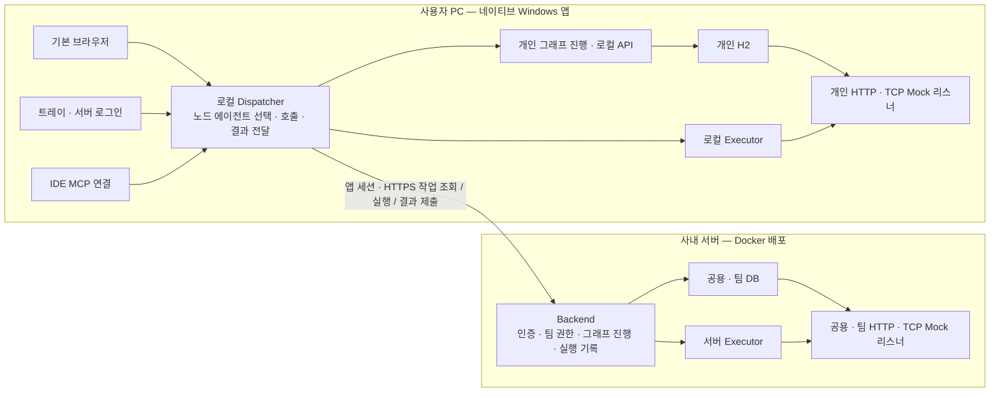

# FlowLink 에이전트 구조와 화면 계획 — 기존 설계와 구현 기록

> 2026-10-03 재설계 검토: [목표 아키텍처 제안](FLOWLINK_TARGET_ARCHITECTURE.md)을 별도로 작성했다. 아래는 기존 설계·구현 기록이며, 특히 팀 그래프의 진행 주체와 배포 경계는 새 제안과 다르다. 새 제안의 사용자 승인·구현 완료를 뜻하지 않으며 현재 실행 중인 앱도 이 문서 변경으로 바뀌지 않는다.

2026-10-03 · `codex/trim-config` · **0.3 구현 반영. 실제 검증 범위와 배포 시 남은 연동은 [릴리스 기록](HYBRID_AGENT_RELEASE.md)을 기준으로 한다.**

[클릭 가능한 UI 스토리보드](FLOWLINK_STORYBOARD.html) · [최종 구현·검증 기록](HYBRID_AGENT_RELEASE.md) · [초기 프로젝트 분석](PROJECT_ANALYSIS.md)

## 1. 바로잡은 목표

실행 위치를 워크플로 전체에 고정했던 이전 계획을 대체한다. **하나의 워크플로에서 노드마다 실행 에이전트를 선택하는 사내 연동 도구**로 구현했다. 아래 설계 원칙과 실제 검증 범위는 구분하며, 검증 판정은 10절에 정리한다.

예: `내 PC의 주문 Mock 조회 → 개발서버에서 결제 API 호출 → 내 PC에서 응답 검증`. 세 노드는 같은 워크플로와 같은 실행 ID에 속한다.

확정 요구:

- 네이티브 Windows MSI, 기본 브라우저 화면, 트레이. PC에 Docker를 설치하지 않는다.
- 개인 정의·환경·시크릿·이력은 PC의 **H2**에 저장한다.
- 공용·팀 정의·권한·이력은 원격 서버 DB에 저장한다. 팀 생성도 서버에서 한다.
- Windows 앱에서 로그인하고, 로그인 후에도 개인 공간을 계속 사용한다.
- 로컬 앱이 노드의 에이전트를 선택하고 호출한다. 브라우저는 편집·관찰·사용자 입력을 담당한다.
- 개인 Mock은 PC가, 개인 이외의 공용·팀 등 원격 워크스페이스 Mock은 서버 에이전트가 리슨한다. 원격 흐름의 콜백 수신도 서버에서 한다.
- IDE MCP는 앱 로그인·라우팅을 재사용한다. **요청에 따라 MCP 테스트는 수행하지 않는다.**
- 외부 인증·연동은 개발 환경에서 모킹한다. 모킹을 실제 연동 완료로 간주하지 않는다.

## 2. 저장, 실행, 리슨은 다른 결정이다

| 결정 | 결정 기준 | 예 |
|---|---|---|
| 워크플로 저장 위치 | 워크스페이스 | 개인=H2, 결제팀=서버 DB |
| 노드 실행 위치 | 각 노드의 에이전트 | 주문 조회=이 PC, 결제 요청=서버 |
| Mock 정의와 리슨 위치 | Mock의 워크스페이스 | 개인 Mock=PC, 팀 Mock=서버 |
| 환경·시크릿 해석 | 실행 에이전트와 선택 환경 | PC 로컬 테스트 / 서버 개발 |
| 실행 상태·이력 원본 | 워크플로의 워크스페이스 | 개인 실행=H2, 팀 실행=서버 DB |

**팀 워크플로의 로컬 노드**와 **개인 워크플로의 서버 노드**가 모두 가능하다. 에이전트를 바꿔도 저장 공간이나 Mock의 리슨 위치는 바뀌지 않는다.

개인 흐름에서 서버 노드를 실행하려면 로그인이 필요하다. 서버로 전달하는 것은 그 노드의 명세와 필요한 입력이다. 개인 워크스페이스 전체·시크릿 저장소·개인 이력을 자동 업로드하지 않는다. 팀 흐름에 사용한 PC 결과는 허용한 필드가 서버의 해당 실행에 반영된다. 실행 전에 전달 필드를 보여준다.

## 3. 배치 구조

### 책임 분담

- **서버 Backend:** 인증·팀 권한, 공용·팀 정의, 원본 실행 상태, 작업 claim과 결과 확정, 배포 정보.
- **로컬 Dispatcher:** 브라우저와 독립적인 백그라운드 작업. 실행 계획을 받아 `local/server`를 실제 에이전트에 매핑하고 호출한다. 앱 로그인 세션을 사용한다.
- **각 Executor:** 한 노드의 HTTP/TCP·변환·검증을 실행한다. 자기 환경과 시크릿을 해석하고 표준 결과를 반환한다.
- **그래프 진행 코드:** 기존 `FlowExecutor`의 순서·분기·바인딩 의미를 재사용한다. 개인은 H2, 팀은 서버 DB를 원본 상태로 사용한다. 프론트엔드에 별도 실행 엔진을 만들지 않는다.

PC에는 개인 H2를 읽는 로컬 API가 필요하다. 이것과 서버 Backend를 구분한다. 팀 DB를 PC로 내려받아 개인 DB처럼 운영하지 않는다. 첫 구현은 Kotlin 코드와 프로파일을 재사용하며 별도 메시지 브로커를 도입하지 않는다.

서버→PC 인바운드 포트를 열지 않는다. 로컬 앱이 서버에 작업을 조회하고 결과를 제출하며, 작업 원본은 DB에 저장한다. **초기 계획은 long polling이었으나 실제 구현은 인증된 500ms 간격 short polling이다.** 운영 연결은 HTTPS를 사용하며 격리 검증 환경은 loopback HTTP를 사용했다.

### 팀 흐름의 PC→서버→PC 실행

1. 앱이 서버에서 팀 권한·고정된 플로우 버전을 확인하고 실행을 생성한다.
2. Backend가 노드 1의 작업을 내준다. Dispatcher가 `local`을 **실행을 시작한 사용자 PC**로 해석한다.
3. PC가 개인 Mock을 호출하고 허용된 `orderId`, `amount`를 서버의 같은 실행에 제출한다.
4. Backend가 결과를 한 번 확정하고 노드 2를 내준다. Dispatcher가 서버 Executor 실행을 요청한다.
5. 서버가 개발 API/팀 Mock을 호출한다. 서버 환경·시크릿은 서버 안에서 해석한다.
6. 노드 3의 검증을 PC가 처리한다. Backend가 팀 DB에 최종 결과를 기록한다.

개인 흐름은 그래프·진행 상태가 H2에 있다. 같은 Dispatcher가 서버에 단일 노드를 위임하고 결과를 H2의 실행에 연결한다.

## 4. 노드별 선택

| 노드 | UI 선택 | 처리 |
|---|---|---|
| HTTP / TCP | 이 PC / 서버 | 해당 에이전트가 실제 네트워크 요청 |
| TRANSFORM / SET / IF / ASSERT | 이 PC / 서버 | 해당 에이전트에서 해석·처리. 분기는 원본 그래프에 반영 |
| WAIT | 공간에 따른 수신 에이전트 표시 | 개인 흐름은 PC, 공용·팀 흐름은 서버에 수신 경로를 미리 등록 |
| INPUT / FORM | 사용자 화면, 이 PC | 입력 창·결제창은 PC에서 표시. 결과는 실행 원본에 반영 |
| START / END / SWITCH | 흐름 제어 | 그래프의 진행·분기 관리. 네트워크 위치 선택 없음 |
| NOTE / GROUP | 실행 없음 | 캔버스 주석 |

기존 `reqMode=client`는 브라우저 fetch다. 로컬 에이전트 실행과 구분한다. 새 UI의 기본 HTTP 모드는 에이전트 실행이며 브라우저 요청은 고급 옵션으로 남긴다.

팀 그래프의 `local`은 작성자의 고정 장치가 아니라 실행자의 PC다. 여러 PC에서 실행할 때 각 실행의 장치와 작업 소유권을 구분한다.

공유 그래프에는 `주문 Mock`, `로컬 테스트 환경` 같은 논리 참조를 저장한다. 실행자의 앱에서 자기 H2 자원에 매핑하고 실행 계획에 실제 주소를 표시한다. 작성자 PC의 개인 Mock UUID·절대 파일 경로를 팀 그래프에 고정하지 않는다. 필요한 매핑이 없는 다른 PC에서는 실행 전에 설정을 요청한다.

원격 작업은 실행 시작 때 선택한 장치·플로우 버전·허용 작업에 묶는다. 앱이 로그인되어 있다는 이유만으로 서버의 임의 작업이나 미승인 플러그인을 PC에서 실행하지 않는다. PC 전용 트리거는 로컬 API, 서버 전용 무인 트리거는 Backend가 같은 작업 계약으로 시작한다.

## 5. Mock: 생성 공간이 리스너를 결정한다

| Mock 공간 | 정의 저장 | 리슨 프로세스 | 주소 예 |
|---|---|---|---|
| 개인 | PC H2 | 로컬 에이전트 | `http://localhost:18180/mock/ws/{개인 공간 UUID}/orders/**`, TCP loopback 주소 |
| 공용 | 서버 DB | 서버 에이전트 | 서버 HTTP 주소, 서버 할당 TCP 포트 |
| 팀 | 서버 DB·팀 권한 | 서버 에이전트 | 팀별 HTTP 경로, 서버 할당 TCP 포트 |

**저장 공간 / 리슨 에이전트 / 바인딩 주소 / 외부에 알려줄 주소 / 실제 리슨 상태**를 함께 표시한다. `저장됨`과 `리슨 중`을 구분한다.

서버 연결이 끊기면 원격 리스너 상태는 `확인 불가`와 마지막 확인 시각을 표시한다. PC에서 확인할 수 없다는 이유로 서버 리스너를 중지했다고 표시하거나 로컬에 대체 리스너를 열지 않는다.

- 개인 Mock 기본 바인딩은 loopback이다. 로그인했다고 서버에서 대신 리슨하지 않는다.
- 공용·팀 Mock 생성·수정·시작·중지는 앱이 서버 관리 API로 요청한다.
- 서버 TCP Mock은 허용 포트 풀에서 할당한다. Docker publish·방화벽·표시 주소가 같은 설정을 사용한다. HTTP는 기존 HTTPS 진입점을 사용한다.
- `localhost`는 호출한 에이전트 자신의 컴퓨터다. 서버 노드가 개인 loopback Mock을 선택하면 실행 전 접근 불가를 표시한다. 실행 에이전트를 자동으로 바꾸지 않는다.
- 개인↔팀 공유는 명시적 복사다. 목적지에서 별도 리스너를 시작하고 원본을 유지한다. 포트·공개 주소는 목적지에서 다시 정한다.
- 서버 HTTP 경로는 공간별 이름 범위를 사용한다. 팀별 같은 slug와 TCP 포트 충돌을 검증한다.

## 6. 환경·시크릿·전문·변환

실행 계획에 **PC 환경 + 서버 환경**을 동시에 표시한다. 예: `PC=로컬 테스트`, `서버=개발`. 각 노드는 자기 에이전트의 환경을 사용한다. 이름이 같아도 값과 저장소는 별개다.

- `{{ key@env }}`와 `{{ name@secret }}`는 실행할 에이전트에서 해석한다. 서버 로그인 토큰을 워크플로 대상 API에 붙이지 않는다.
- 시크릿 원문은 다른 에이전트·브라우저·작업 패킷에 전달하지 않는다. 결과에 포함된 알려진 시크릿도 경계에서 차단/마스킹한다.
- 다음 노드가 참조하는 입력과 허용된 결과 필드만 타입을 보존해 전달한다. 컨텍스트 전체를 보내지 않는다.
- TCP 전문·변환은 ID만 같다고 호환된다고 보지 않는다. 실행 전 버전/해시와 에이전트 지원 여부를 확인한다.
- 없는 의존성은 목적지에 명시적으로 배포·승인하거나 실행을 막는다. 다른 공간의 정의·시크릿으로 대체하지 않는다.
- 서버 환경·시크릿·전문·변환에도 워크스페이스 경계를 적용한다. 기존 테넌트 공통 데이터는 서버 공용 범위로 이관하고 팀 범위를 추가한다.

## 7. 단절·중복·콜백

실행은 `executionId`, 작업은 `taskId=(executionId, nodeId, attempt)`로 식별한다. claim, 결과 확정, ACK를 분리한다.

| 상황 | 동작과 화면 |
|---|---|
| 실행 전에 서버 단절 | 서버 노드 계획을 차단. PC 전용 개인 흐름은 사용 가능 |
| PC 노드 완료 뒤 서버 단절 | 결과 유지, 다음 서버 노드에서 `연결 대기`. 이후 노드 진행 중지 |
| 결과 제출 중 단절 | 암호화한 미확인 결과 보관. 같은 taskId로 재전달하여 한 번만 반영 |
| 외부 요청 처리 여부 불명 | `결과 미확인`. 결제 같은 요청을 자동 재실행하지 않음 |
| 브라우저 종료 | 앱 Dispatcher와 실행은 계속. INPUT/FORM은 사용자 화면 대기 |
| PC 재시작 | 체크포인트·작업 기록으로 복구. 처리 여부 불명이면 수동 확인 |
| 서버 재시작 | 팀 상태·lease·결과를 DB에서 복구. 같은 실행에 PC가 재접속 |
| 로그아웃 | 신규 원격 작업 중지, 원격 세션 종료. 개인 공간·H2 유지 |

다른 에이전트로 자동 우회하거나 재연결 때 새 실행을 만들지 않는다. 외부 시스템까지 exactly-once를 보장하지 않는다.

WAIT 수신 경로는 워크플로 공간의 에이전트에 먼저 등록해 앞선 HTTP/FORM에서도 사용한다. 공용·팀 등 원격 공간에서는 서버 에이전트가 리슨하며, 앞선 HTTP 노드를 PC에서 실행해도 수신 위치는 서버다. 조기 콜백은 버퍼링하고 중복·타임아웃·취소를 같은 작업으로 처리한다. 개인 흐름의 PC loopback에 외부 시스템이 도달하지 못하면 명시적 네트워크 설정이나 원격 공간으로의 복사가 필요하며 실행 전에 안내한다. 로그인 연결을 범용 HTTP/TCP 터널로 취급하지 않는다.

서버 무인 스케줄은 서버 전용 흐름을 지원한다. 실행을 시작한 장치가 없는 서버 무인 실행에 PC 노드가 포함되면 거절한다. 임의 PC에 배정하지 않으며, 지정 PC의 상시 예약 실행은 이번 검증 완료 항목에 포함하지 않는다.

## 8. 화면 스토리보드와 실제 구현

**PC=파랑, 서버=청록**을 사용하고 텍스트·아이콘을 함께 표시한다. 전역 `실행 위치: 서버` 대신 저장 공간과 각 노드의 출발지를 구분한다.

| 화면 | 주요 UI | 확인할 내용 |
|---|---|---|
| 연결·로그인 | PC + 사내 서버 상태, 앱 로그인, IDE 연결 | 서버 정보 자동 입력, 토큰 수동 입력 없음 |
| 워크스페이스 | 개인 / 서버 공용 / 팀 목록 동시 표시 | 로그인·서버 단절 중에도 개인 공간 유지 |
| 혼합 워크플로 | 기존 캔버스의 노드 에이전트 배지·설정, 실행 계획, 실행 로그 | 팀 흐름에서 PC→서버→PC |
| 실행 계획 | 출발지·환경·의존성·전달 필드·상태 원본 | 어디서 무엇을 보내는지 사전 확인 |
| Mock 서버 | 공간별 리슨 에이전트·주소·실제 상태 | 생성 위치와 실제 소켓 일치 |
| 단절·복구 | 노드별 결과, 연결 대기/결과 미확인, 개인 공간 이동 | 복구와 재실행의 차이 |

스토리보드의 PC·서버 두 레인은 개념 설명용이다. **실제 화면은 기존 캔버스에 노드별 배지를 표시하고, 실행 계획과 실행 로그에서 출발지·환경·결과를 확인하는 형태로 구현했다.** 공간·Mock·환경·시크릿·필드에는 검색, 개수, 내부 스크롤과 긴 이름 처리를 추가했다.

스토리보드 버튼과 `node scripts/test/storyboard-check.cjs`는 예시 상태만 검증한다. 실제 앱의 혼합 실행, 대량 목록 검색·선택 유지, 450개 필드 중 한 항목 수정·저장은 별도로 검증했으며 [릴리스 기록의 실제 화면과 결과](HYBRID_AGENT_RELEASE.md)를 참조한다.

## 9. 구현된 코드 경계

### A. 실행 계약·데이터 경계

`GraphNode`의 에이전트 참조와 실행 시작 시 장치·환경·버전·입력 범위 고정을 구현했다. 작업·결과·lease 및 암호화 체크포인트를 DB에 저장하고 환경·시크릿·전문·변환에 공간 경계를 적용했다. 실제 실행 검증은 격리 H2 기반이며 Oracle은 초기화·업그레이드 SQL을 제공한다.

혼합 실행과 관리형 단일 노드 실행은 **작업 생성 → Executor 결과 반영 → 분기 진행**을 사용한다. 결과 적용·다음 체크포인트·ACK는 트랜잭션으로 묶고 기존 토큰·분기 의미를 유지한다. 서버 전용 기존 직접 실행 경로도 호환하며, 재실행·스위트·트리거의 실제 동작을 회귀 검증했다.

### B. 앱 Dispatcher·두 Executor

조회·claim·실행·결과 전달은 네이티브 Dispatcher가 담당한다. 서버 요청은 앱 로그인 프록시를 사용한다. 두 Executor에 HTTP/TCP/변환을 연결했으며 실제 PC 프로세스·Docker 재시작과 중복 요청 방지를 검증했다.

팀 실행용 PC journal은 개인 워크스페이스와 분리한다. 작업 ID·미확인 결과만 암호화해 짧게 보관하고 ACK 후 정리한다. 팀 정의·서버 이력을 개인 H2 자원으로 복제하지 않는다.

팀 실행 작업은 서버 실행에 연결한다. 개인 흐름에서 위임한 서버 작업은 별도 위임 작업으로 보관하며 서버에 PERSONAL 워크스페이스나 플로우 버전을 만들지 않는다. 서버에는 호출자·장치·작업 ID·처리 상태의 최소 감사 기록을 남기고, 전달한 입력·결과는 ACK와 보존 정책에 따라 정리한다. 개인 실행 이력 원본은 계속 H2다.

### C. Mock·콜백·화면

Mock의 저장 위치와 리슨 에이전트를 고정하고 실제 상태를 조회한다. HTTP 경로는 `/mock/ws/{공간 UUID 또는 public}/{slug}`이며 서버 TCP는 허용 포트 풀을 사용한다. WAIT 조기 수신함·중복 방지·복구, 통합 공간 탐색·노드 에이전트·실행 계획·로그를 구현했다.

API는 `localApi/serverApi`를 명시적으로 사용하고 Query key에 서버·워크스페이스를 포함한다. 공간 선택 때문에 전역 axios 주소를 바꾸거나 개인 목록을 숨기지 않는다.

### D. 패키지·MCP 연결·배포

Dispatcher와 Java·Node를 포함한 MSI, 서버 다운로드 링크·자동 배포 정보, 로그인·트레이·IDE 설정 동선을 구현했다. MCP 라우팅 코드는 앱의 개인·서버 연결을 재사용한다. **사용자 요청에 따라 MCP 프로토콜·도구 호출·VS Code/IntelliJ 실연결은 테스트하지 않았다.**

운영 배포 설정은 개발 모킹과 분리했다. 실제 GitHub 앱 등록, 운영 Oracle/Vault, 사내 CA·프록시, 코드 서명은 사내 배포 환경에서 검증할 항목으로 남는다.

## 10. 검증 판정과 남은 연동

| 구분 | 현재 판정 |
|---|---|
| 혼합 실행·자원 경계 | 개인/서버 혼합 실행 REST, 콜백·TCP·단일 노드 REST, 백엔드 단위·통합 테스트 통과 |
| 실제 재시작 | PC 프로세스·Docker 재시작 후 동일 실행 복구, 외부 요청 재발송 없이 UNKNOWN 보존 확인 |
| 기존 기능 | 개인 14개·서버 팀 14개 REST 통과. 테스트 설정·트리거 복원 완료 |
| 실제 UI | 대량 공간·Mock·환경·시크릿·필드 검색과 편집 보존, 화면에서 PC→서버→PC 실행 확인 |
| 설치 패키지 | MSI 테이블의 언어·아이콘·업그레이드·자동 실행 조건 검사. 실제 설치 마법사 클릭·업데이트 전체 동선 검증과 구분 |
| 로그인 | 개발 모킹으로 검증. 실제 GitHub 앱 연동은 미검증 |
| 운영 연동 | Oracle/Vault, 사내 CA·프록시, 코드 서명은 미검증 |
| MCP | 사용자 요청으로 프로토콜·도구·IDE 실연결 미테스트 |

정확한 테스트 수, 재현 명령, 화면 증거와 배포 절차는 [FlowLink 0.3 릴리스 기록](HYBRID_AGENT_RELEASE.md)에 모았다. 스토리보드나 이전 0.2.0 결과를 실제 연동 검증으로 대체하지 않는다.
