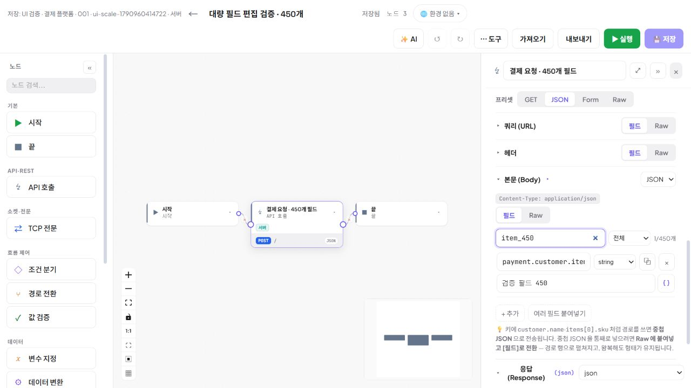
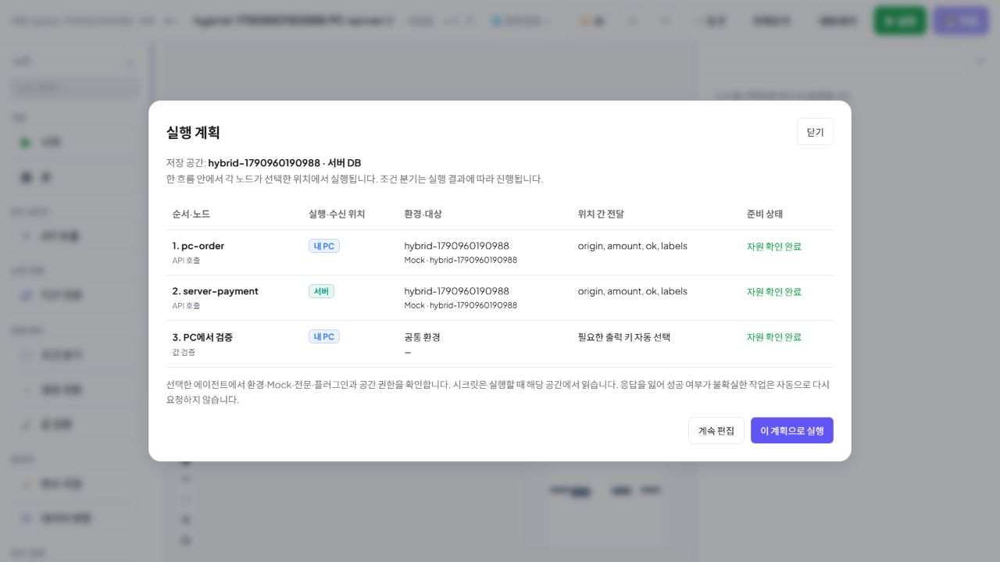
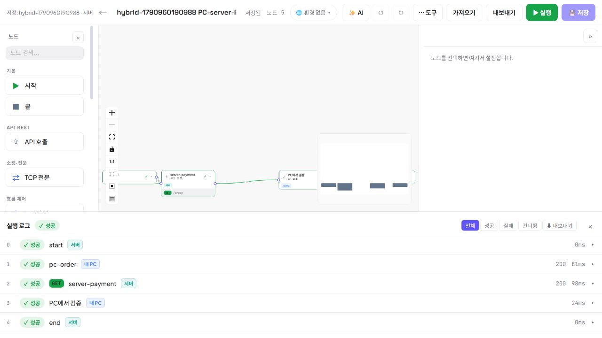
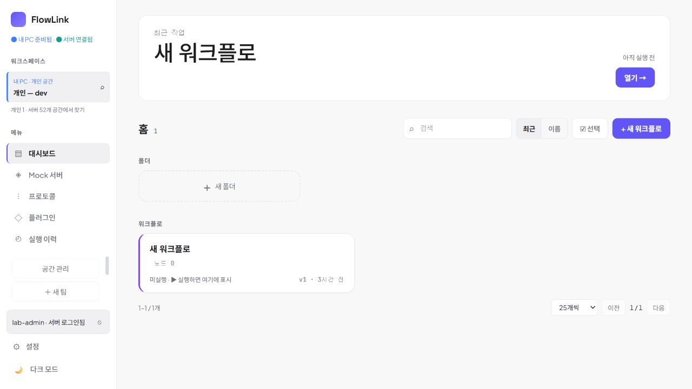

# FlowLink 0.3.3 — 혼합 실행과 Windows 앱

2026-10-03 · `codex/trim-config`

최신 화면 재설계와 실제 대량 데이터 검증은 [사용성 검증](USABILITY_VALIDATION.md), 독립 리뷰와 채택 근거는 [제품·디자인 리뷰](reviews/2026-10-03-product-design-review.md)에 기록했다. Oracle·Vault는 [실제 Docker 검증](ORACLE_VAULT_VALIDATION.md)을 완료했다.

0.3.3은 최신 서버·검증 앱 변경을 포함한 MSI로 실제 0.3.2 설치에서 업그레이드했다. 설치 전후 개인 파일 9개의 보존, 기존 자원·장치 ID·키·서버 계정 유지, 기존 암호화 fixture 실행을 확인했다. 실제 설치 앱 18180에서 기존 개인 워크플로가 열리고 최종 화면 번들 `index-DVV_SSSb.js`가 표시된다. 서버 metadata와 HTTP 다운로드도 0.3.3으로 일치한다. 해시와 상세 증거는 [0.3.3 릴리스 결과](reviews/2026-10-03-release-0.3.3.md)에 기록했다.

이전 0.3.2 최종 MSI도 실제 0.3.1 설치에서 정상 업그레이드했다. 이 문서의 기존 테스트 수는 해당 시점의 검증 이력이며, 이후 추가된 변경의 전체 테스트 수로 확대하지 않는다. 개인 PC는 Docker 없이 동작한다.

## 실행·저장 경계

하나의 실행 ID 안에서 노드마다 `내 PC`와 `서버`를 선택한다. 설치된 Windows 앱의 Dispatcher가 작업을 받아 해당 실행기에 전달한다. 화면을 닫아도 Dispatcher는 계속 처리한다. 사용자 입력·폼 화면처럼 브라우저가 필요한 노드는 화면에서 응답할 때까지 대기한다.

| 대상 | 저장 | 실제 실행/수신 |
|---|---|---|
| 개인 공간 | PC의 H2 | PC Mock·TCP·WAIT 콜백 |
| 공용·팀 공간 | 서버 DB | 서버 Mock·TCP·WAIT 콜백 |
| 노드 실행 위치 | 노드별 선택 | 선택한 PC/서버 실행기 |
| 환경·시크릿·전문·플러그인 | 각 공간별 | 실행할 위치에서 해석 |

로그인 후에도 개인 공간을 계속 볼 수 있다. 서버의 팀 목록과 개인 목록은 같은 탐색 화면에 보이지만 API와 캐시는 분리된다. 원격 정의·실행 이력을 개인 H2로 복제하지 않는다. Dispatcher의 재전송 정보는 별도의 암호화 저널에 기록한다.

다른 실행 위치로 보낼 때는 필요한 상위 출력과 허용한 결과 키만 전달한다. 원본 요청·응답과 시크릿을 그대로 전달하지 않는다. 실행 계획은 필요한 환경·Mock·전문·플러그인의 존재와 참조 버전을 확인하며, 실행기가 같은 버전인지 다시 검사한다.

## 실패·재시작 동작

작업 생성·대기 체크포인트와 결과 적용·다음 작업 생성을 DB 트랜잭션으로 묶는다. 결과 재전송은 같은 작업 ID로 처리한다. 외부 호출 중 프로세스가 끊기면 성공 여부를 추측해 다시 호출하지 않고 `결과 확인 필요(UNKNOWN)`로 유지한다. 사용자가 대상 시스템을 확인하거나 해당 실행을 취소한다.

WAIT에 도달하기 전에 들어온 콜백도 암호화한 수신함에 보관한다. 첫 콜백을 사용하며 중복 콜백은 결과를 덮어쓰지 않는다. WAIT 주소는 워크플로를 소유한 공간의 런타임 주소다. 개인 공간의 localhost 콜백을 인터넷에 공개하는 터널은 포함하지 않는다.

## 목록이 많을 때의 화면

- 현재 공간을 고정하고 별도 전환창에서 개인·공용·팀을 검색한다.
- Mock은 검색, 종류·상태 필터, 정렬, 25/50/100개 페이지와 페이지 간 선택을 제공한다. 숨겨진 선택도 개수를 표시한다.
- 환경·변수·시크릿·전문·필드는 검색 및 목록 내부 스크롤을 사용한다. 긴 이름과 값이 작업 버튼을 밀어내지 않도록 배치한다.
- 시크릿 저장 위치와 적용 환경을 표시하고 저장 후 원문 입력을 비운다. 모달에는 키보드 포커스 유지·복귀를 적용한다.

검증용 격리 서버에 공간 520개(기존 52개 유지), Mock 240개, 환경 60개, 한 환경의 변수 363개, 시크릿 180개, HTTP 필드 450개를 생성했다. 모든 값은 테스트 데이터이며 실제 자격 증명을 사용하지 않았다.

## 자동 검증

| 항목 | 결과 |
|---|---|
| 백엔드 전체 단위·통합 테스트 | 306개 통과, 실패·skip 0 |
| 개인/서버 혼합 실행 REST | 23개 통과 |
| 콜백·TCP·단일 노드 실행 REST | 14개 통과 |
| 실제 Windows 프로세스·Docker 재시작 | 13개 통과 |
| 기존 기능 REST | 개인 14개 + 서버 팀 14개 통과, 설정·트리거 복원 완료 |
| 대량 목록 순수 로직 | 100개 공간·240개 Mock 검색/페이지/선택 통과 |
| 첫 실행 라우팅·공간 격리 회귀 | 루트·기존 공간 쿼리·미등록 경로·상세 링크·늦은 응답의 공간 격리 통과 |
| 프론트 빌드·lint | 통과, Fast Refresh 경고 20개 |
| 설치 UI·기동 변경 후 desktop 테스트 | 초기 8개, 최종 desktop/distribution 대상 9개 통과, 종료 시 비활성 AWT 초기화·추가 인자에서 개인 프로파일 유실 문제 수정 |
| 설치된 Windows 앱 수명주기 | 모든 창·트레이 종료, 추가 인자 기동, 중복 실행 인계 3개 통과 |

재시작 검증은 실제 PC 호출을 서버 Mock이 한 번 받은 시점에 PC 앱을 재시작했다. 같은 외부 요청이 다시 발송되지 않고 UNKNOWN으로 보존되는 것을 확인했다. 개인·팀의 대기 실행은 동일 ID로 복원해 PC→서버→PC를 완료했다.

실제 브라우저에서 53개 개인·서버 공간 중 팀을 검색하고, 240개 Mock의 페이지 이동·선택 유지·숨겨진 선택 표시·꺼짐 80개 필터를 확인했다. 1280×720 화면에서 작업 메뉴의 네 변이 화면 안에 있음을 확인했다. 환경 60개/변수 363개, 시크릿 180개, 노드 필드 450개 검색과 모달 Esc 복귀도 확인했다.

노드 설정의 공간·환경·Mock 검색도 실제 화면에서 확인했다. 필터 밖 현재 선택을 유지하며, 450번째 필드만 검색해 수정·저장한 뒤 REST로 450개 전체 보존과 첫 필드 불변을 확인했다. 혼합 실행은 화면의 사전 점검 → 실행 → 내 PC/서버/내 PC 결과까지 성공했다.

설치 앱의 첫 진입(`/`)에서는 워크플로 이동과 공간 쿼리 보충이 경쟁해 빈 화면이 발생했다. 두 경로가 같은 정규화 함수를 사용하도록 수정하고, 새 브라우저 티켓과 개인 공간 쿼리로 진입해 실제 워크플로 목록이 열리는 것을 확인했다.







```powershell
# 격리 agent-lab 데이터만 대상으로 실행. 실제 개인 저장소에 실행하지 않는다.
powershell -File scripts/test/hybrid-runtime.ps1 -AgentFile .run/agent-lab/preview/agent.json
powershell -File scripts/test/hybrid-listeners.ps1 -AgentFile .run/agent-lab/preview/agent.json
powershell -File scripts/test/hybrid-restart.ps1 -AgentFile .run/agent-lab/preview/agent.json
```

## 서버 배포와 설치파일

운영 서버는 `infra/server.compose.yml`을 사용한다. `agent-lab`의 모의 로그인을 운영 설정에 포함하지 않는다. 서버는 Oracle 접속 정보, 영속 암호화 키, 외부 HTTPS 주소, MCP 외부 주소, TCP Mock의 도달 가능한 호스트와 다운로드 디렉터리를 환경변수로 받는다. TCP Mock 포트 풀은 9091–9190이다.

현재 실행 중인 로컬 검증 서버는 `http://127.0.0.1:18080`, 설치 앱은 `http://127.0.0.1:18180`이다. 앱 화면은 트레이의 열기 메뉴로 인증된 브라우저를 열어 사용한다. 별도 검증 데이터가 있는 PC 런타임은 18182에 보존했다.

- [로컬 검증용 MSI 다운로드](http://127.0.0.1:18080/downloads/FlowLink.msi)
- 산출물: `backend/build/windows-installer-0.3.3/FlowLink-0.3.3.msi`
- 크기: 196,511,829 bytes
- SHA-256: `1B5A844D709A0AD4FC9467D9209C82F4D8E000A4933DCD1B3D0878087F9414D3`
- 서버에서 실제 다운로드한 파일과 위 산출물의 SHA-256 일치 확인.

이 검증 MSI에는 로컬 검증 서버 `http://127.0.0.1:18080`이 설정되어 있다. 사내 배포용은 아래 명령의 `-ServerUrl`에 실제 서버 주소를 넣어 빌드하고, 생성한 MSI를 서버 다운로드 디렉터리에 배치한다. 설치한 사용자가 서버·MCP 주소를 직접 입력할 필요는 없다.

개인 PC에는 Java·Node를 포함한 MSI만 설치한다. Docker는 필요하지 않다. 설치 프로그램과 개인 데이터 폴더를 분리해 업데이트해도 H2와 키를 보존한다. 배포 서버 주소는 MSI 빌드 시 지정하며 실행 후 서버 배포 메타데이터에서 MCP 주소를 가져온다.

한글 설치 마법사, 설치 완료 후 실행 선택, 첫 실행·서버 로그인·IDE 설정·트레이의 동선과 이미지는 [Windows 설치 UX](WINDOWS_INSTALLER_UX.md)에 기록했다. MSI의 언어·아이콘·업그레이드·자동 실행 조건은 실제 설치파일 테이블로 검사했다. 시작/로그인 이미지는 같은 Swing 컴포넌트를 렌더한 결과이며 실제 설치 마법사 클릭 캡처는 아니다.

실제 Windows에서 0.2→0.3 업그레이드와 최종 패키지 설치를 수행했다. 기존 개인 워크플로·공간·장치 ID·암호화 키·로그인 상태를 보존했으며, 무인 설치는 앱을 자동 실행하지 않는다. 같은 버전의 개발 중간 MSI를 다시 빌드한 파일로 복구하려는 시도는 Windows SecureRepair 검증에 차단됐다. 보호 설정을 바꾸지 않고 개인 데이터를 백업한 뒤 중간 앱만 제거·재설치했다. 운영 업데이트는 버전을 올린 MSI로 배포한다.

초기 0.3 검증 MSI를 실제 설치한 뒤 첫 실행 티켓으로 `/flows`에 진입했다. 기존 개인 워크플로 1개와 개인 공간 1개가 유지되고, 서버 연결 및 서버 공간 52개가 표시됐다. 브라우저 콘솔 오류는 없었다.



```powershell
powershell -ExecutionPolicy Bypass -File scripts/package-desktop.ps1 `
  -Type msi -SkipBuild -JdkPath C:\path\to\jdk21 -WixPath C:\path\to\wix3 `
  -ServerUrl https://flowlink.example.internal
```

Vault AppRole 배포는 FLOWLINK_VAULT_TRANSIT_ENABLED=true와 FLOWLINK_VAULT_ADDRESS, FLOWLINK_VAULT_APPROLE_ROLE_ID, FLOWLINK_VAULT_APPROLE_SECRET_ID를 서버 환경에 제공한다. 해당 값은 infra/server.compose.yml에서 컨테이너에 전달한다. 검증용 dev Vault를 운영 저장소로 재사용하지 않는다.

현재 저장소는 Flyway를 사용하지 않는다. 새 Oracle 설치는 `backend/runtime/src/main/resources/db/init.sql`, 기존 Oracle에는 `upgrade-workspace-resources.sql`, `upgrade-agent-execution.sql`, `upgrade-agent-tasks.sql`을 DBA 절차에 따라 적용한다. 개인 H2는 앱이 기존 자원 범위를 이관한다. DB와 암호화 키를 함께 백업해야 한다.

## 검증 범위

GitHub 로그인은 사용자 요청에 따라 모킹으로 진행했다. **MCP 프로토콜·도구 호출·VS Code/IntelliJ 실연결 테스트는 실행하지 않았다.** 실제 GitHub 앱 등록, 운영 Oracle/Vault, 사내 CA·프록시, 코드 서명은 사내 환경에서 최종 연동할 항목이다. 테스트 통과 수에 이 항목들을 포함하지 않는다.


현재 소스의 실행 모듈과 빌드 경로는 [역할별 빌드 안내](../backend/README.md)를 따른다. 이미 배포된 0.3.7 MSI에 이 모듈 분리가 포함되었다는 뜻은 아니다.
