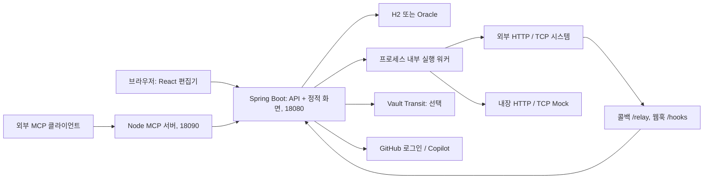

# FlowLink 프로젝트 분석

> 이 문서는 초기 분석 시점의 스냅샷이다. 이후 에이전트 요구에 대한 최신 계획은 [노드별 혼합 실행 설계](HYBRID_AGENT_PLAN.md)에 정리했다.

> 분석일: 2026-10-02 (한국 시간)  
> 대상 브랜치: `codex/trim-config`  
> 기준 커밋: `b1ab71a` — `origin/refactor/trim-config`에서 분기한 상태

## 1. 분석 범위와 핵심 판단

현재 체크아웃의 소스, 의존성 선언, 실행 스크립트, Oracle 초기 스키마, 테스트를 기준으로 분석했다. 기존 `AGENTS.md`에는 이전 브랜치의 구조와 변경 이력이 혼재하므로 현재 구현과 대조했다. 아래에서 **확인 사실**은 코드 또는 이번 실행 결과에 근거하며, 개선 우선순위는 그 사실에 대한 **분석 판단**이다.

FlowLink는 HTTP API와 TCP 전문을 그래프로 연결하고, 대상 시스템을 Mock으로 대체하며, 실행 결과를 검증하는 연동 개발·테스트 도구다. 캔버스 편집뿐 아니라 비동기 실행, 콜백 복구, 버전 관리, 워크스페이스 권한, 스크립트 플러그인, Copilot 어시스턴트, MCP 연결까지 구현되어 있다.

**분석 판단:** 현재 구조는 한 서버에서 운영하는 사내 연동 도구에 잘 맞는다. 일반적인 멀티테넌트 SaaS나 분산 워크플로 엔진 수준의 격리·실행 보장은 제공하지 않는다. 기능을 더 늘리기 전에 실제 설정에 맞는 문서, 그래프 검증, 암호화 운영 기준, 핵심 실행 회귀 테스트를 정비하는 것이 효과적이다.

이번 작업은 분석 문서만 추가했다. 빌드 검증을 위해 프론트엔드와 MCP의 기존 lockfile대로 로컬 의존성을 설치했으며, 애플리케이션 소스·설정·lockfile은 변경하지 않았다. 실서비스 데이터에 대한 테스트, Oracle·Vault·실제 GitHub/Copilot 연동 검증은 수행하지 않았다.

## 2. 기술 구성과 규모

| 영역 | 현재 구성 | 비고 |
|---|---|---|
| 백엔드 | Spring Boot 3.3.5, Kotlin 1.9.25, Java 21 | Spring MVC, JPA, Spring Security, WebSocket |
| 프론트엔드 | React 19, TypeScript 6, Vite 8 | React Router 7, React Flow 12, Zustand 5, React Query 5, axios |
| 코드 편집 | CodeMirror 6, js-beautify | JSON·HTML·XML·JavaScript 편집 |
| DB | 기본 `local`: H2 파일 / `dev`: Oracle | Flyway 없음, Oracle 초기 DDL 수동 적용 |
| 표현식 | Spring SpEL | 읽기 전용 평가 컨텍스트 |
| 스크립트 확장 | GraalJS 24.1.2, Bouncy Castle 1.80 | JS 플러그인과 암복호화·코덱 지원 |
| MCP | Node.js, Express 5, MCP SDK, Zod 4 | 별도 프로세스, Streamable HTTP |
| 선택 인프라 | Vault Transit, AppRole | 로컬 AES-GCM을 대체하는 저장 암호화 |

프론트엔드 버전은 `package.json`의 선언 계열이며, 이번 빌드에서 확인한 Vite는 8.1.0이다.

| 코드 규모 | 확인 결과 |
|---|---:|
| 백엔드 운영 Kotlin 파일 | 190개 |
| 백엔드 운영 Kotlin 코드 | 약 16,125줄 |
| 백엔드 `*Test.kt` 파일 | 48개 |
| 프론트엔드 `src` 파일 | 132개 |
| Oracle 초기 DDL 테이블 | 18개 |
| MCP 도구 등록 | 57개 |

파일 수는 현재 소스 디렉터리 기준이다. 테스트 실행 수는 파일 수와 다르며 §9에 별도로 기록했다.

근거: [백엔드 빌드](../backend/build.gradle.kts), [프론트 패키지](../frontend/package.json), [MCP 패키지](../mcp/package.json), [Oracle DDL](../backend/src/main/resources/db/init.sql).

## 3. 시스템 구조



### 3.1 저장소 경계

| 디렉터리 | 역할 | 구조상 의미 |
|---|---|---|
| `backend/` | API, 실행 엔진, Mock, 인증, 저장 | 단일 Gradle 모듈의 모듈러 모놀리스 |
| `frontend/` | 캔버스·설정·실행 로그·관리 화면 | 독립 npm 프로젝트, 배포 시 JAR에 포함 |
| `mcp/` | 에이전트용 REST 중계와 OAuth | 실행 엔진을 복제하지 않고 기존 API 재사용 |
| `plugins/` | `sample`, `des-cipher` JAR 예제 | 앱과 분리된 독립 Gradle 빌드 |
| `scripts/` | 시작·중지·상태 확인 | Windows/셸별 앱 및 MCP 프로세스 관리 |
| `infra/` | Vault, 선택 Oracle | 메인 앱은 Compose에 포함하지 않음 |
| `docs/` | 추적되는 설계·계획 문서 | 분석 전에는 스크립트 플러그인 문서 2개 |
| `site/` | 로컬에 남아 있는 정적 가이드 산출물 | Git ignore 대상, 현재 추적 문서의 원본 아님 |

현재 `backend/settings.gradle.kts`에는 하위 모듈 `include`가 없다. 예전 `transform-spi`·`plugin-sample` 구조는 현재와 다르다. SPI는 앱 소스에 있으며, 독립 플러그인 프로젝트는 같은 규격의 사본을 컴파일하고 JAR에서 제외해 앱의 런타임 클래스를 사용한다.

### 3.2 백엔드 패키지

| 패키지 | 주요 책임 |
|---|---|
| `core` | 엔티티, 그래프 모델, 정적 검증, 리포지터리 |
| `definition`, `folder` | 워크플로·폴더 CRUD, 불변 버전, 복원·보존 |
| `execution` | 비동기 실행, 노드 결과 저장, 대기 상태 영속화·재개 |
| `protocol` | 공유 TCP 명세, 바이트 인코딩·프레이밍·송수신 |
| `mock` | HTTP/TCP Mock, 조건·템플릿·코덱, 상태·요청 기록 |
| `plugin`, `transform`, `codec` | JS 플러그인 승인, GraalJS 런타임, 변환·코덱 레지스트리 |
| `trigger`, `suite` | CRON·웹훅 실행, 워크플로 일괄 실행 |
| `workspace`, `security` | 공용·개인·팀 권한, 가입 승인, GitHub 인증·JWT |
| `environment`, `secret`, `settings` | 환경변수·입력값·암호화 시크릿·앱 설정 |
| `assistant` | Copilot 호출, 그래프·Mock·프로토콜 제안, 대화·프롬프트 저장 |
| `presence` | 커서·편집 상태·그래프 스냅샷 WebSocket 중계 |
| `maintenance`, `notify`, `common` | 이력 보존, 알림, 암호화·오류·테넌트·정적 화면 |

패키지 역할은 구분되어 있지만 빌드 수준 의존성 강제는 없다. 예를 들어 `core.graph.GraphValidator`가 `execution.config.ExecutionProperties`에 의존한다. 향후 물리 모듈 분리 시 현재 패키지 이름만으로 독립성이 보장되지는 않는다.

## 4. 워크플로 실행 흐름

### 4.1 저장

1. React Flow의 노드·엣지를 Zustand `editorStore`에서 편집한다.
2. 그래프를 API 모델로 변환해 새 `FlowVersion`으로 저장한다.
3. 서버는 노드 ID·중복·엣지 참조·노드 수를 검증한다.
4. `Flow.currentVersion`을 갱신한다. `Flow.@Version` 충돌은 409로 처리한다.
5. 과거 버전 복원도 새 버전을 생성한다. `pinned` 버전은 자동 버전 정리에서 제외된다.

버전별 그래프는 JSON 문자열로 저장한다. JPA 엔티티 관계를 대거 조합하기보다 UUID를 사용해 서비스에서 연결하는 방식이다.

### 4.2 실행

1. `POST /api/v1/flows/{flowId}/runs`가 접근 권한과 실행 버전을 확인한다.
2. `Execution(RUNNING)`을 저장하고 입력·환경·시크릿을 컨텍스트에 넣는다.
3. 모든 WAIT 노드의 콜백 URL을 미리 확정해 선행 노드에서도 참조할 수 있게 한다.
4. 프로세스 내부 워커 풀에 실행을 제출하고 응답을 반환한다. 기본 워커 8개, 큐 100개이며 포화 시 429를 반환한다.
5. 워커의 `FlowExecutor`가 위상정렬 순서로 활성 노드를 순차 실행한다. IF/SWITCH는 선택한 포트의 하위 경로를 활성화한다.
6. 노드 결과를 각각 저장하며 첫 실패에서 실행을 종료한다. HTTP 노드는 2xx를 성공으로 판정한다.
7. 브라우저 처리가 필요하거나 콜백을 기다리면 `WAITING`과 pending 명세를 반환한다.

**비동기의 의미:** HTTP 요청 스레드와 실행을 분리했다. 한 실행 내부의 노드 병렬 처리나 외부 내구 큐는 구현하지 않았다. HTTP/TCP I/O 동안 해당 워커는 대기한다.

### 4.3 대기와 재개

| 대기 유형 | 처리 주체 | 재개 방식 |
|---|---|---|
| HTTP `reqMode=client` | 브라우저 `fetch` | 응답을 `/executions/{id}/resume`에 전달 |
| FORM | 브라우저 팝업 또는 iframe | 폼 제출 후 즉시 재개 |
| INPUT | 브라우저 입력 모달 | 입력값 전달 또는 취소 |
| WAIT | 백엔드 콜백 수신·타이머 | `/relay/{execId}/cb/{nodeId}` 또는 타임아웃 |

대기 상태는 암호화한 `ExecutionSuspension` 스냅샷으로 DB에 저장하며, 메모리 맵은 빠른 재개용 캐시다. 조건부 DELETE의 영향 행 수로 콜백·타임아웃·수동 재개 중 승자를 정한다. 재시작 후 스냅샷을 복원하고 WAIT 타임아웃을 다시 예약한다. 스냅샷 없이 남은 RUNNING/WAITING 실행은 FAILED로 정리한다.

다만 **실행 중인 일반 노드나 큐에 제출된 작업의 재시작 복구는 제공하지 않는다.** 스냅샷 저장 실패 시 로그를 남기고 메모리 상태로 계속 진행하므로 그 실행의 재시작 내구성도 사라진다. 외부 요청과 결과 저장을 하나의 원자적 작업으로 묶지 않으므로 정확히 한 번 실행하는 보장도 없다.

브라우저는 일반 실행 약 400ms, WAIT 약 1초 간격으로 상태를 조회한다. 중지 버튼은 pending 노드를 취소할 수 있지만, 일반 노드가 실행 중이면 화면 추적만 멈추고 서버 작업은 계속된다.

근거: [ExecutionService](../backend/src/main/kotlin/com/flowlink/execution/ExecutionService.kt), [FlowExecutor](../backend/src/main/kotlin/com/flowlink/execution/engine/FlowExecutor.kt), [Editor](../frontend/src/routes/Editor.tsx).

### 4.4 노드와 바인딩

실행 노드는 START, END, SET, HTTP, IF, SWITCH, ASSERT, TRANSFORM, TCP, FORM, INPUT, WAIT의 12종이다. NOTE/GROUP은 표시용이고 실행에서 제외된다. 알 수 없는 타입은 UNKNOWN으로 실패한다.

| 문법 | 의미 |
|---|---|
| `{{ key }}` | 컨텍스트에 적재된 출력의 역순 탐색 |
| `{{ key@nodeId }}` | 지정 노드 출력 |
| `{{ key@req:nodeId }}` | 지정 노드 요청값 |
| `{{ key@env }}` / `{{ key@input }}` | 선택 환경 / 실행 입력 |
| `{{ name@secret }}` | 현재 테넌트와 선택 환경의 시크릿 |
| `{{ user.name@nodeId }}` / `{{ items[0].id@nodeId }}` | 중첩 객체·배열 경로 |

bare 토큰의 실제 구현은 그래프 조상을 새로 탐색하는 방식이 아니라 컨텍스트의 최근 출력부터 찾는 방식이다. 여러 분기를 합치는 흐름에서는 명시적 소스를 쓰는 편이 결과를 예측하기 쉽다. 문자열 전체가 토큰 하나면 원래 값의 타입을 유지하며, 다른 텍스트와 섞이면 문자열로 치환한다. 해석하지 못한 문자열 토큰은 빈 문자열이 된다.

근거: [TokenResolver](../backend/src/main/kotlin/com/flowlink/execution/engine/TokenResolver.kt), [ExecutionContext](../backend/src/main/kotlin/com/flowlink/execution/engine/ExecutionContext.kt).

## 5. 주요 기능과 저장 경계

| 기능 | 구현 상태 | 저장·수명 |
|---|---|---|
| 워크플로·버전 | 생성·저장·복원·보존, 폴더·워크스페이스 이동 | DB의 그래프 스냅샷 |
| 실행·노드 로그 | 비동기 실행, 이력 필터, 단일 노드 실행, 재실행 | 전체 실행은 DB, 단일 노드 실행은 이력 미저장 |
| HTTP Mock | 경로·조건·템플릿·콜백·상태·순차 응답·코덱 | 정의·버전은 DB, 런타임 상태·요청 기록은 메모리 |
| TCP·프로토콜 | 공통 헤더·전문별 필드·길이·문자셋, 미리보기·Mock | 명세는 DB, 리스너·통신 로그는 프로세스 내부 |
| 플러그인 | transform / fieldCodec / messageCodec, 초안·제출·승인·반려 | DB의 승인본을 레지스트리에 적재 |
| 트리거·스위트 | CRON·웹훅, 지정 플로우·폴더 일괄 실행 | 트리거는 DB, 실제 실행은 기존 엔진 사용 |
| 환경·시크릿 | 변수·환경별 시크릿·플로우 입력 | DB, 시크릿 값은 암호화·목록은 이름만 반환 |
| 협업 | 커서·편집 중 표시·저장 알림·그래프 중계 | 방·참여자 상태는 메모리 |
| AI | 플로우·Mock·프로토콜 제안, 세션·프롬프트 | Copilot 연결 시 외부 호출, 미연결 시 stub |
| MCP | 워크플로·Mock·프로토콜·실행·플러그인 등 도구 | REST API 재사용, 요청별 서버/transport |

HTTP Mock 요청 기록은 서버당 최대 100개, TCP 로그는 최대 200개다. Mock 상태와 기록은 재시작하면 초기화된다. 그래프 협업은 전체 스냅샷의 마지막 쓰기 우선 방식이며, CRDT나 변경 단위 병합이 아니다.

트리거 스케줄러는 20초 간격으로 조회하므로 초 단위 CRON을 정밀한 타이머로 볼 수 없다. 서버 요청 밖에서 실행할 때 콜백 주소는 저장된 설정이 없으면 `http://localhost:18080`으로 폴백한다. 외부 콜백이 필요한 무인 실행은 도달 가능한 주소 설정이 필요하다.

`rerun`은 원본 버전과 입력을 재사용하지만 원 실행의 환경변수·`envName`을 복원하지 않는다. 따라서 환경별 값까지 포함한 완전한 재현으로 해석하면 안 된다.

근거: [MockRuntimeStore](../backend/src/main/kotlin/com/flowlink/mock/MockRuntimeStore.kt), [PresenceHandler](../backend/src/main/kotlin/com/flowlink/presence/PresenceHandler.kt), [TriggerScheduler](../backend/src/main/kotlin/com/flowlink/trigger/TriggerScheduler.kt), [RelayBaseResolver](../backend/src/main/kotlin/com/flowlink/settings/RelayBaseResolver.kt).

## 6. 프론트엔드 구조와 유지보수성

서버 데이터는 React Query, 편집 그래프는 Zustand, 화면 내부 상태는 React 로컬 상태로 나눈다. 그래프 변환, 토큰 문법, 바디 변환, 코드 포맷, Mock 규칙 등의 순수 로직도 `lib/`에 존재한다. 기능 추가 시 기존 함수와 상태 경로를 재사용할 수 있는 기반이 있다.

라우트는 워크플로 목록·편집기, 실행 이력, Mock 목록·편집기, 프로토콜, 플러그인, 관리 콘솔이다. Undo/Redo, 복사·붙여넣기, 노드 검색, 자동 저장, 충돌 안내, 실행 애니메이션, 전문 미리보기, 토스트가 이미 있다. 예전 가이드의 미구현 목록과 다르다.

변경 영향이 집중되는 파일은 다음과 같다. 줄 수는 이번 체크아웃 기준의 대략적인 값이다.

| 파일 | 줄 수 | 유지보수 부담 |
|---|---:|---|
| `frontend/src/panels/PropertyPanel.tsx` | 1,947 | 여러 노드 타입·설정·실행 보조 UI가 한 파일에 집중 |
| `frontend/src/routes/Dashboard.tsx` | 907 | 폴더 탐색·워크스페이스·드래그 이동·목록 조작 |
| `backend/.../execution/ExecutionService.kt` | 831 | 실행·재개·복구·조회·기록·단일 실행 |
| `frontend/src/routes/Editor.tsx` | 829 | 저장·단축키·협업·브라우저 실행 드라이버 |
| `mcp/src/index.js` | 775 | 도구 정의와 안내·API 중계가 한 파일에 집중 |
| `frontend/src/routes/MockServerEditor.tsx` | 729 | Mock 정의 편집과 런타임 관찰 |

**분석 판단:** 파일 크기만 보고 전면 분리할 필요는 없다. `TcpNodePanel`, `HttpRequestEditor`, `NodeExecutionLog`, `Modal` 같은 기존 분리 패턴을 따라 실제 수정 대상의 책임만 추출하는 것이 회귀 위험을 줄인다. 그래프 모델은 Kotlin과 TypeScript 양쪽에서 유지하므로 노드 필드 변경 때 DTO·어댑터·UI·실행 엔진을 함께 확인해야 한다.

## 7. 실행·설정·배포

### 7.1 현재 실행 방법

```powershell
# 저장소 루트: 기존 JAR 실행 / 프론트+백엔드 빌드 후 실행
powershell -ExecutionPolicy Bypass -File scripts\start.ps1
powershell -ExecutionPolicy Bypass -File scripts\start.ps1 -Build
powershell -ExecutionPolicy Bypass -File scripts\status.ps1
powershell -ExecutionPolicy Bypass -File scripts\stop.ps1
```

Linux/Git Bash는 `scripts/start.sh`, `status.sh`, `stop.sh`를 사용한다. 셸 세트와 PowerShell 세트는 PID 규약이 달라 섞으면 안 된다.

프론트 빌드 후 백엔드 `bootJar`를 실행하면 `frontend/dist`를 `flowlink.jar`에 동봉한다. `bootJar` 자체가 프론트 빌드를 수행하지 않으며 dist가 없어도 백엔드 JAR 빌드는 가능하다. 시작 스크립트는 Node가 있으면 MCP도 기본 기동하며 `FLOWLINK_MCP_PORT=0`으로 끌 수 있다.

시작 확인 엔드포인트는 **`/api/v1/auth/config`**다. 현재 빌드에는 Actuator·Springdoc 의존성이 없으므로 예전 `/actuator/health`·Prometheus·Swagger 안내는 현재 검증 방법으로 사용할 수 없다.

### 7.2 주요 설정

`flowlink.*` 기본값은 각 `*Properties`에 있다. 아래 표는 YAML에서 명시한 환경변수와 코드가 바인딩하는 Spring 설정 키를 구분해 적었다.

| 설정 | 기본·현재 동작 |
|---|---|
| `SPRING_PROFILES_ACTIVE` | 미설정 시 `local`; Oracle은 `dev` |
| `FLOWLINK_PORT` | 18080 |
| `FLOWLINK_CONTEXT_PATH` | 빈 값; `/flowlink` 같은 경로 배포 지원 |
| `FLOWLINK_H2_FILE` | `~/flowlink-h2db/flowlink` |
| `FLOWLINK_DB_URL/USER/PASSWORD` | `dev` Oracle 연결 override |
| `flowlink.auth.github-enabled` | false; true면 GitHub 로그인 사용 |
| `flowlink.auth.guest-enabled` | false; true면 MCP용 익명 API 통로 개방 |
| `flowlink.auth.jwt-secret` | 미설정 시 설정 테이블에 난수 생성·저장 |
| `flowlink.auth.token-ttl-hours` | 720시간, 30일 |
| `flowlink.execution.worker.pool-size / queue-capacity` | 8 / 100 |
| `flowlink.execution.max-nodes-per-run` | 200 |
| `flowlink.vault.transit.enabled` | false; true면 Vault 암복호화 사용 |
| `flowlink.vault.address / token` | Vault 주소·정적 토큰 |
| `flowlink.vault.approle.role-id / secret-id` | 둘 다 설정하면 AppRole 사용 |
| `flowlink.plugins.jar-enabled` | false; 서버에 배치한 JAR 로드는 선택 경로 |
| `flowlink.plugins.script.timeout-ms / statement-limit` | 2,000ms / 2,000,000문장 |
| `flowlink.retention.execution-days / flow-versions-keep` | 90일 / 플로우당 100버전; 0 이하로 비활성화 |
| `FLOWLINK_MCP_PORT` | 시작 스크립트 기본 18090 |

실행 HTTP 기본 제한은 연결 5초, 읽기 30초, 응답 약 5MiB다. 응답 상한 초과분은 잘라서 처리한다. 보존 작업은 기동 90초 후 시작해 6시간마다 수행하며 진행 중 실행과 참조·보존 버전을 보호한다.

Oracle은 `db/init.sql`을 신규 DB에 한 번 적용하는 방식이고 앱은 DDL 생성·검증을 하지 않는다. H2는 `ddl-auto=update`다. 기존 Oracle DB의 변경 이력·차등 업그레이드 절차는 현재 저장소에 없다.

근거: [공통 설정](../backend/src/main/resources/application.yml), [local](../backend/src/main/resources/application-local.yml), [dev](../backend/src/main/resources/application-dev.yml), [시작 스크립트](../scripts/start.ps1), [RetentionService](../backend/src/main/kotlin/com/flowlink/maintenance/RetentionService.kt).

## 8. 인증·권한·암호화 경계

### 8.1 인증과 데이터 범위

- GitHub 인증 비활성 상태는 모든 HTTP 요청을 허용한다. 서비스에서는 `dev` 사용자를 관리자 취급한다.
- GitHub 인증 활성·게스트 비활성 상태는 API 로그인이 필수다. `/mock/**`, `/relay/**`, `/hooks/**`는 외부 시스템용 무인증 체인이 먼저 처리한다.
- 게스트 활성 상태는 AI 경로를 제외한 HTTP 접근을 연다. 서비스의 가입 승인·워크스페이스 게이트는 별도로 적용된다. 브라우저 UI는 게스트 설정과 무관하게 로그인을 요구한다.
- 워크스페이스는 공용·개인·팀으로 나뉘며 OWNER/EDITOR/VIEWER를 적용한다. 신규 계정은 PENDING이고 최초 관리자 부트스트랩이 존재한다.
- Flow·Folder·Workspace는 공유 테넌트 `default`를 사용한다. 자체 JWT도 기본 `tenant=default`로 발급한다. `tenant_id` 필터가 있다는 사실만으로 사용자별 격리를 가정하면 안 된다.
- 승인 플러그인은 테넌트별 목록과 별개로 전역 레지스트리에 ID로 적재한다. 다중 테넌트를 실제로 도입하려면 이 조회·실행 경계를 다시 설계해야 한다.

근거: [SecurityConfig](../backend/src/main/kotlin/com/flowlink/security/SecurityConfig.kt), [WorkspaceService](../backend/src/main/kotlin/com/flowlink/workspace/WorkspaceService.kt), [AppJwt](../backend/src/main/kotlin/com/flowlink/security/AppJwt.kt), [PluginScriptService](../backend/src/main/kotlin/com/flowlink/plugin/PluginScriptService.kt).

### 8.2 확인된 보안 특성과 한계

| 항목 | 확인 사실 | 의미 |
|---|---|---|
| 저장 암호화 | 기본 `StateCrypto`가 소스의 고정 문자열에서 AES 키 파생 | DB 암호화만으로 독립적인 비밀 보호를 보장하지 않음 |
| Vault | Transit·AppRole 및 기동 왕복 검사 구현 | Transit 활성 시 Vault 가용성과 키 보존이 필수 |
| JWT 키 | env 우선, 없으면 `AppSetting`에 생성·저장 | DB 백업과 설정 테이블 접근이 인증 키 보호에도 연결됨 |
| 시크릿 로그 | 원문·URL 인코딩·JSON 이스케이프 변형 마스킹 | 암복호화·해시 등 모든 파생값을 추적하는 방식은 아님 |
| 시크릿 조회 실패 | 실행 서비스가 빈 맵으로 진행 | 토큰이 빈 값이 되고 요청이 계속될 수 있음 |
| 아웃바운드 | 현재 HTTP/TCP·Mock 콜백 경로에 SSRF 가드 없음 | 앱 사용자가 서버가 도달 가능한 내부 시스템을 호출할 수 있음 |
| TLS 우회 | `FLOWLINK_TLS_INSECURE`로 전역 검증 해제 가능 | 켜져 있으면 외부 연결의 인증서·호스트 검증이 사라짐 |
| JS 플러그인 | 호스트·IO·스레드·네이티브 접근 차단, 시간·문장 제한 | JVM과 별도 프로세스로 격리되지 않으며 힙 상한은 없음 |
| JAR 플러그인 | 기본 비활성, 업로드 API 제거, 디렉터리 배치 방식 | 활성화한 JAR은 JVM 전체 권한으로 실행 |
| AI 컨텍스트 | SET 시크릿은 마스킹, 다른 하드코딩 값은 감지하지 않음 | 외부 Copilot으로 보낼 그래프의 데이터 취급 기준 필요 |

이 표는 현재 구현 경계를 기술한 것이며, 침투 테스트 결과는 아니다. 사내 도구라는 전제가 바뀌거나 외부 사용자에게 개방할 때 적용 기준을 재검토해야 한다.

근거: [StateCrypto](../backend/src/main/kotlin/com/flowlink/execution/engine/StateCrypto.kt), [CryptoConfig](../backend/src/main/kotlin/com/flowlink/common/crypto/CryptoConfig.kt), [SecretMasker](../backend/src/main/kotlin/com/flowlink/execution/engine/SecretMasker.kt), [ScriptRuntime](../backend/src/main/kotlin/com/flowlink/plugin/script/ScriptRuntime.kt), [PluginController](../backend/src/main/kotlin/com/flowlink/transform/PluginController.kt).

## 9. 이번 검증 결과

검증 환경: Windows, JDK 21, Node.js 24.18.0. 외부 서비스의 실제 계정 인증이나 운영 DB는 사용하지 않았다.

| 실행 명령 | 결과 | 범위·비고 |
|---|---|---|
| `backend`: `gradlew.bat test --console=plain` | **273개 통과**, 실패·오류·스킵 0 | XML 결과 49개 suite, 단위·Spring/H2·TCP 테스트 포함 |
| `frontend`: `npm run build` | **통과** | 초기 로컬 `js-beautify` 누락은 `npm ci` 후 해소 |
| `frontend`: `npm run lint` | **통과**, 경고 16개 | 컴포넌트와 일반 export 혼재에 관한 Fast Refresh 경고 |
| `frontend`: `node src/lib/protocolSpec.test.ts` | **통과** | 프로토콜 순수 로직의 assert 테스트 |
| `mcp`: `npm test` | **18개 통과** | 가짜 백엔드 기반 OAuth·게스트 인증 검증 |

MCP 테스트는 `FLOWLINK_URL=http://127.0.0.1:1`로 실행해 실제 백엔드 도구 시나리오를 의도적으로 건너뛰었다. 워크플로 생성·실행까지 연결하는 MCP 통합 검증은 이번 결과에 포함하지 않는다. 별도 `plugins/` Gradle 빌드의 테스트도 실행하지 않았다.

프론트 빌드 산출물은 메인 JS 약 **1,226KB / gzip 349KB**, 지연 로드 CodeEditor 약 **689KB / gzip 227KB**다. Vite는 500KB 초과 청크 경고를 출력했다. 이는 파일 크기 측정이며 초기 화면 응답 시간이나 사용자 체감 성능을 측정한 값은 아니다.

현재 프론트 `package.json`에는 `test` 스크립트가 없다. `protocolSpec.test.ts`는 독립 실행 파일이다. 백엔드 테스트 파일은 여러 기능에 분포하지만 `FlowExecutor`·`ExecutionService` 자체의 전용 실행 회귀 테스트 파일은 찾지 못했다. 현재 Git 추적 파일에는 CI 워크플로도 없다.

테스트가 통과했다는 것은 실행한 범위가 정상이라는 뜻이다. Oracle SQL 적용, Vault 재시작·키 이관, 실제 Copilot 호출, 브라우저 공동 편집·폼·콜백 전체 흐름은 별도 확인이 필요하다.

## 10. 유지보수 우선순위

아래는 구현 요청이 아닌 후속 작업 후보다. 실제 사용 조건에 따라 필요한 항목부터 작은 변경으로 진행하는 것이 적절하다.

| 우선순위 | 확인된 문제·경계 | 최소 후속 작업 |
|---|---|---|
| 높음 | 기존 가이드와 현재 프로파일·보안·배포 설정 불일치 | 현재 명령·env·기능만 담은 루트 README를 복원하고 구 이력을 분리 |
| 높음 | 고정 저장 암호키, SSRF 제한 없는 네트워크 실행 | 비밀 저장·외부 접근이 있는 배포부터 Transit와 네트워크 접근 기준을 명시·검증 |
| 높음 | 그래프 저장에서 사이클을 거절하지 않음 | 공통 서버 검증에서 순환 참조를 거절하고 작은 회귀 테스트 추가 |
| 높음 | 실행·재개·취소의 핵심 계약에 전용 회귀 테스트 부족 | START→HTTP→ASSERT와 WAIT→재개/타임아웃 경합을 기존 테스트 도구로 고정 |
| 중간 | `rerun`이 원 실행의 환경을 복원하지 않음 | 환경 선택·주입값의 저장·재사용 범위를 정하고 재실행 테스트 추가 |
| 중간 | Oracle은 초기 DDL만 있고 자동 검증·업그레이드 이력 없음 | Oracle 변경 시 차등 SQL과 신규/기존 DB 적용 검증을 함께 남김 |
| 중간 | 큰 UI·실행 서비스 파일에 책임 집중 | 실제 변경할 노드 UI나 실행 책임부터 기존 패턴대로 추출 |
| 중간 | 메인 JS 청크가 크고 라우트 컴포넌트를 정적 import | 초기 로딩 문제가 측정되면 React의 기존 lazy 기능으로 라우트 분리 |
| 조건부 | 워커·대기 타이머·Mock 상태·presence가 단일 프로세스 중심 | 수평 확장이 필요해질 때 공유 큐·소유권·상태 저장 설계 |

사이클 관련 근거: `GraphValidator.validate`는 ID·참조·개수만 검사하고, `FlowExecutor.topoOrder`는 위상정렬 후 남은 노드를 뒤에 붙인다. 프론트 `FlowCanvas.isValidConnection`도 같은 연결의 중복만 검사한다. 따라서 현재 동작은 반복 실행을 정의한 루프 지원이 아니며 순환 그래프를 명확히 금지한 DAG도 아니다.

근거: [GraphValidator](../backend/src/main/kotlin/com/flowlink/core/graph/GraphValidator.kt), [FlowCanvas](../frontend/src/canvas/FlowCanvas.tsx), [그래프 상태 저장소](../frontend/src/store/editorStore.ts).

## 11. 기존 가이드에서 바로잡아야 할 내용

| 기존 설명 | 현재 코드 기준 |
|---|---|
| 기본 Oracle, 로컬 `h2` 프로파일 | 기본 `local` H2, `dev` Oracle |
| Flyway가 스키마 소유 | Flyway 제거, Oracle `init.sql`, H2 Hibernate update |
| Actuator·Swagger·Prometheus 사용 | 관련 의존성 없음, 시작 확인은 `/api/v1/auth/config` |
| 완전 동기 실행·재개 상태 메모리만 | 내부 워커 비동기 실행, WAITING 스냅샷 DB 영속 |
| 트리거 MANUAL만 동작 | SCHEDULE·WEBHOOK 구현 |
| 상태 있는 Mock은 범위 밖 | state·repeat·요청 기록·리셋 구현 |
| RBAC·시크릿 볼트 미구현 | 워크스페이스 역할·가입 승인·암호화 시크릿 구현 |
| OIDC 자동 활성, GitHub 모드는 항상 게스트 | 현재 인증 체인은 GitHub 기반, 게스트 스위치 기본 off |
| JWT 시크릿 없으면 기동 실패·TTL 12시간 | 설정 테이블에서 키 생성·유지, 기본 TTL 30일 |
| Vault KV 시크릿 오버레이 | 현재 Vault 설정·서비스는 Transit 암호화와 AppRole 중심 |
| `transform-spi`, `backend/plugin-sample` 멀티모듈 | 앱 단일 모듈, 루트 `plugins/` 독립 빌드 |
| JAR 업로드 API로 플러그인 등록 | JS 승인형 플러그인 중심, JAR 업로드 API 제거 |
| SSRF 가드·요청/응답 캡처 opt-in | SSRF 가드·캡처 스위치 제거, 로그는 시크릿 마스킹 후 저장 |
| 백엔드 단위 테스트 4개·프론트 테스트 없음 | Kotlin 테스트 파일 48개, 독립 프로토콜 TS 테스트 존재 |
| 노드 검색·토스트 없음, 속성 패널 404줄 | 검색·토스트 구현, 속성 패널 약 1,947줄 |
| 여러 README·`docs/guide/`가 현재 소스 | 해당 파일들은 현재 추적 목록에 없고 `mcp/README.md`만 존재 |

이 차이들은 현재 체크아웃과 비교한 결과다. 기존 가이드의 과거 검증 기록을 이번 브랜치의 상태로 그대로 인용하지 않는 것이 좋다.

## 12. 다음 작업을 시작할 때 읽을 파일

| 작업 | 시작점 |
|---|---|
| 실행·재개 문제 | [ExecutionService](../backend/src/main/kotlin/com/flowlink/execution/ExecutionService.kt), [FlowExecutor](../backend/src/main/kotlin/com/flowlink/execution/engine/FlowExecutor.kt) |
| 저장·버전·그래프 검증 | [FlowService](../backend/src/main/kotlin/com/flowlink/definition/FlowService.kt), [GraphValidator](../backend/src/main/kotlin/com/flowlink/core/graph/GraphValidator.kt) |
| 캔버스·노드 속성 | [editorStore](../frontend/src/store/editorStore.ts), [PropertyPanel](../frontend/src/panels/PropertyPanel.tsx), [graphAdapter](../frontend/src/canvas/graphAdapter.ts) |
| HTTP·TCP 송수신 | [HttpNodeExecutor](../backend/src/main/kotlin/com/flowlink/execution/engine/HttpNodeExecutor.kt), [ProtocolCodec](../backend/src/main/kotlin/com/flowlink/protocol/ProtocolCodec.kt), [Framer](../backend/src/main/kotlin/com/flowlink/protocol/Framer.kt) |
| Mock·코덱 | [MockRuntime](../backend/src/main/kotlin/com/flowlink/mock/MockRuntime.kt), [MockGatewayController](../backend/src/main/kotlin/com/flowlink/mock/MockGatewayController.kt), [MockCodec](../backend/src/main/kotlin/com/flowlink/mock/MockCodec.kt) |
| 플러그인 | [PluginScriptService](../backend/src/main/kotlin/com/flowlink/plugin/PluginScriptService.kt), [ScriptRuntime](../backend/src/main/kotlin/com/flowlink/plugin/script/ScriptRuntime.kt), [TransformRegistry](../backend/src/main/kotlin/com/flowlink/transform/TransformRegistry.kt) |
| 인증·워크스페이스 | [SecurityConfig](../backend/src/main/kotlin/com/flowlink/security/SecurityConfig.kt), [WorkspaceService](../backend/src/main/kotlin/com/flowlink/workspace/WorkspaceService.kt) |
| MCP | [사용법](../mcp/README.md), [도구 정의](../mcp/src/index.js), [OAuth](../mcp/src/oauth.js) |
| 배포·DB | [start.ps1](../scripts/start.ps1), [start.sh](../scripts/start.sh), [Oracle DDL](../backend/src/main/resources/db/init.sql), [Compose](../infra/docker-compose.yml) |
