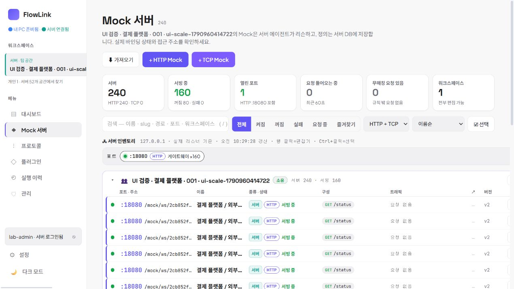
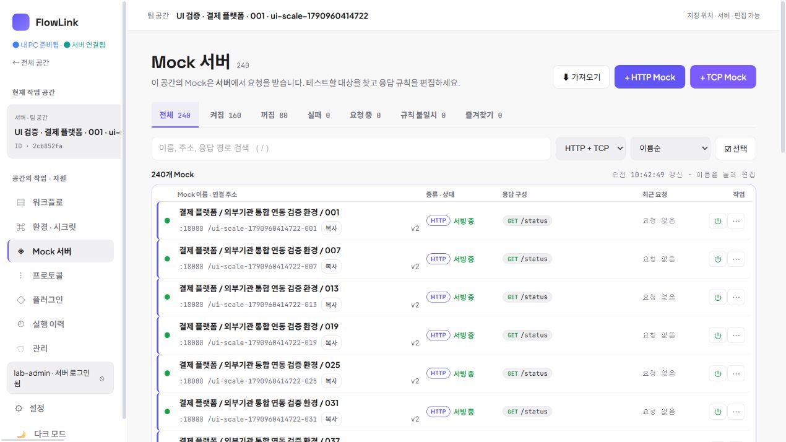
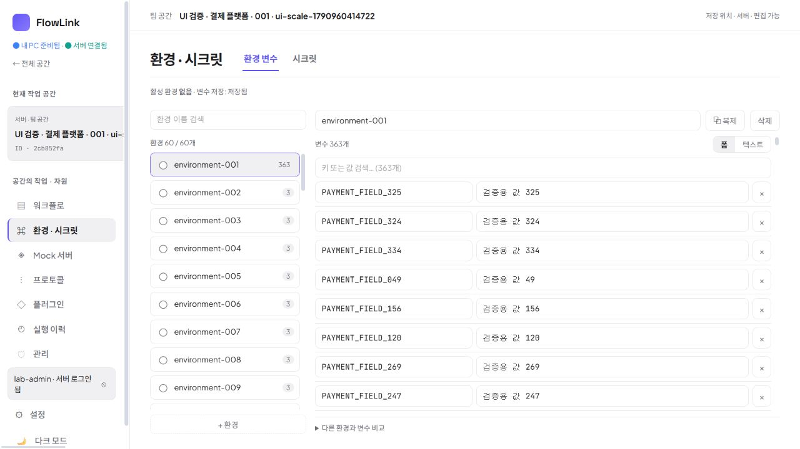
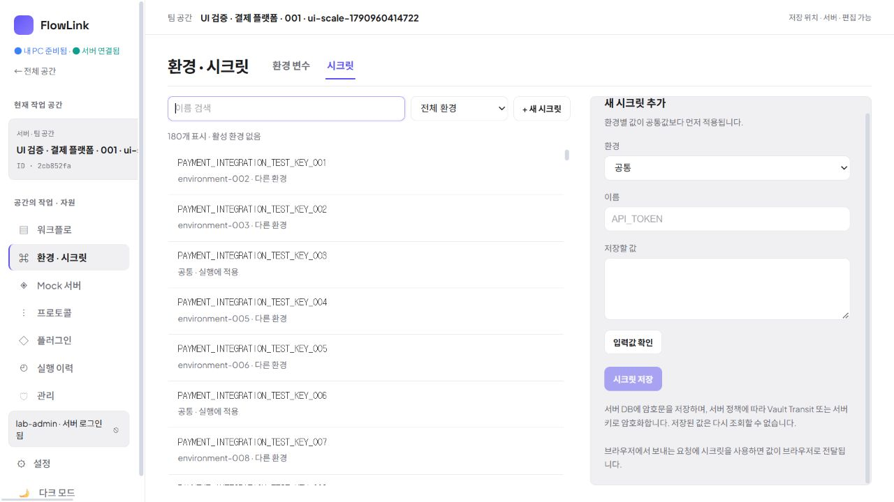
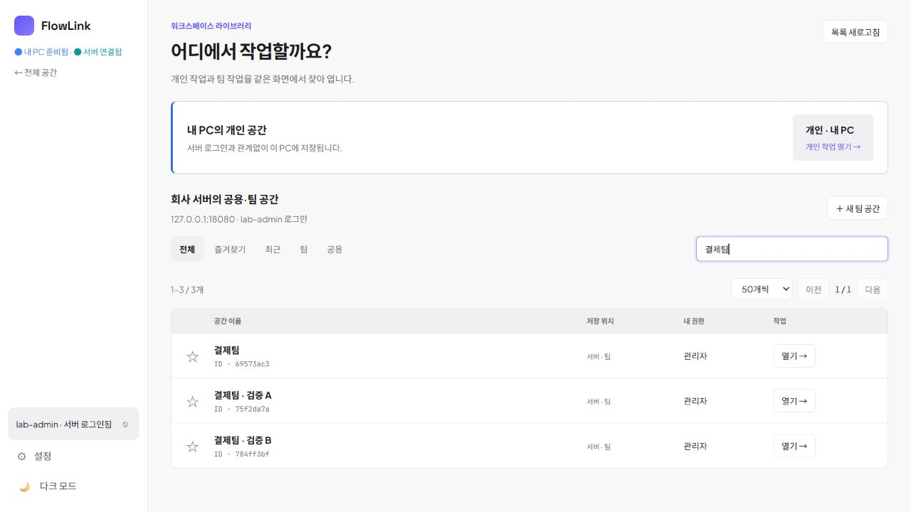
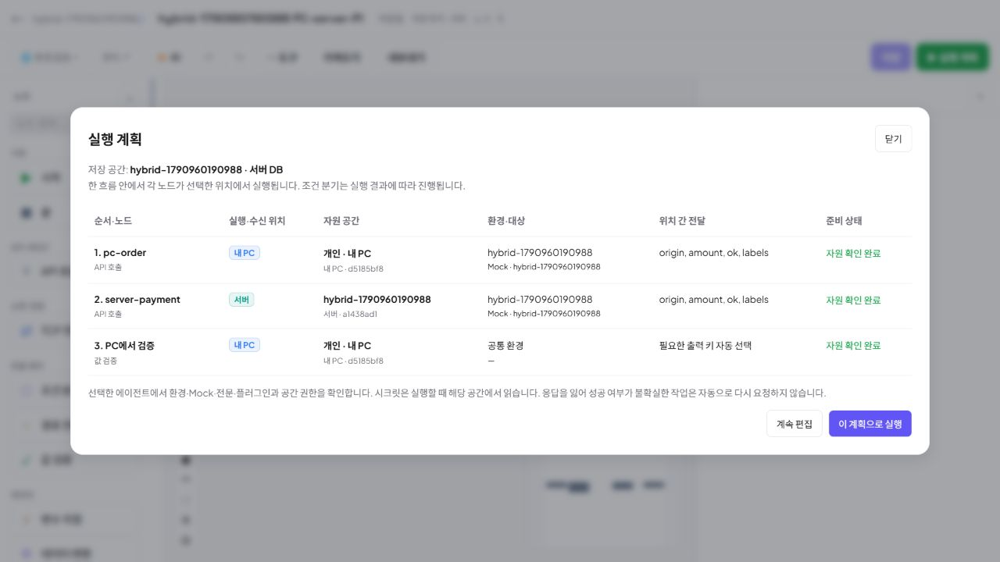
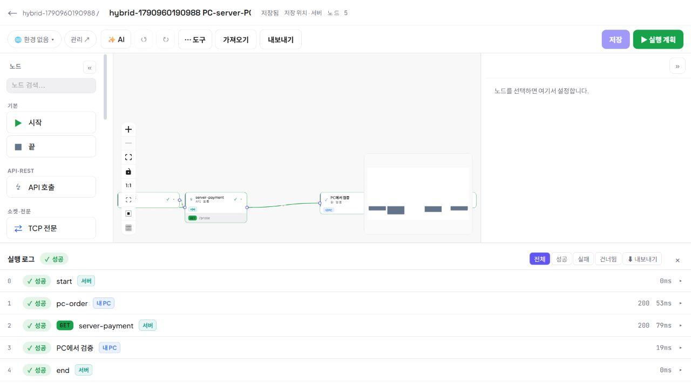
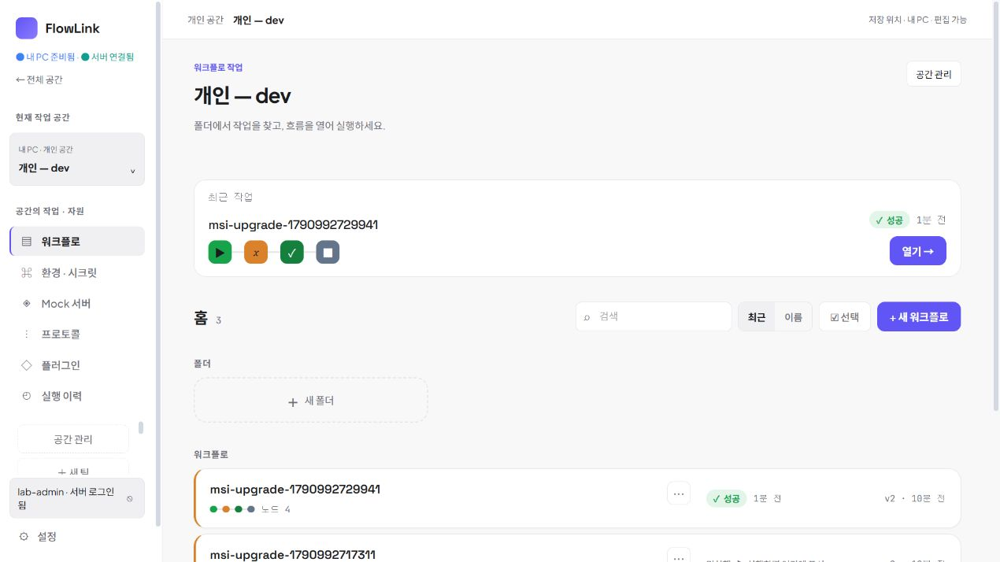

# FlowLink — 실제 사용성과 공간 경계 검증

2026-10-03 · `codex/trim-config`

## 결정 방식

실제 AI 작업자는 공간 작업대, 환경·시크릿, 제품·도입·시각 검토, Oracle·Vault·독립 QA의 네 역할을 맡았다. 제품 리뷰와 시각 리뷰는 같은 작업자가 수행했으며 별도 인원으로 세지 않는다. 작성자가 아닌 작업자가 구현을 교차 검토하고, 주 작업자가 실제 브라우저에서 확인했다. 제품의 실행기는 PC 하나와 서버 하나다.

[논의와 채택 근거](reviews/2026-10-03-product-design-review.md), [목록·권한 교차 검토](reviews/resource-workspace-cross-review-2026-10-03.md), [실행 경계 독립 QA](reviews/2026-10-03-execution-scope-independent-qa.md).

## 화면에서 바뀐 작업

| 이전 문제 | 적용한 변경 | 실제 확인 |
|---|---|---|
| 많은 팀을 작은 선택 메뉴에서 찾음 | 전체 공간 목록 + 즐겨찾기·최근 빠른 전환 | 520개 목록에서 검색, 유사 이름 세 팀의 ID 구분, 즐겨찾기 유지, Escape 포커스 복귀 |
| Mock 통계 카드와 긴 주소가 이름보다 두드러짐 | 이름 중심 목록, 상태 필터, 주소 복사, 연결 정보 접기 | 240개 목록의 전체 이름·상태·행별 작업 표시, 전체 도달 URL 복사 |
| 환경 설명이 중복되어 변수 두 줄만 보임 | 독립 자원 화면, 환경 목록/변수 편집 분리, 비교 접기 | 1280×720에서 변수 8줄·환경 9줄; 1024×768에서도 페이지 가로 넘침 없음 |
| 변수 일괄 입력이 조용히 덮어씀 | 중복 키·행 오류 표시, 명시적 적용, 저장 상태·재시도 | 363개 중 특정 변수 검색·수정 후 재진입 보존, 중복 2행 오류로 적용 차단, 미적용 초안 이동 확인 |
| 시크릿 변경 대상이 불명확함 | 목록에서 선택하고 이름·환경 고정 후 값 교체 | 180개 중 한 항목 검색·교체, 원문 입력 비움, 목록 180개 유지 |
| 실행 위치와 자원 공간이 혼동됨 | 실행 계획에서 위치·공간·환경·Mock·준비 상태 함께 표시 | UI 사전 점검 후 PC → 서버 → PC 실행 성공 |

팀 이름의 완전한 중복은 실제 생성 API가 400으로 거부한다. 따라서 임의 DB 삽입 없이 `결제팀`, `결제팀 · 검증 A`, `결제팀 · 검증 B`로 구분을 검증했다. 520개 공간은 격리 테스트 서버의 합성 데이터이며 기존 52개를 유지했다. 개인 설치 저장소에 이 대량 데이터를 넣지 않았다.

## 실제 화면

같은 화면 크기의 Mock 변경 전후:

중복 설명을 줄인 최종 자원 화면:

## 교차 검토로 수정한 실행·저장 문제

- 환경 최초 로드가 끝나기 전 편집을 막아 늦은 GET이 초안을 지우지 않게 했다.
- 환경 변경 A의 저장 중 B가 들어오면 B까지 저장한 뒤 이동·실행 준비를 완료한다. 실패 시 초안을 유지하고 재시도할 수 있다.
- 환경 로드·저장 실패 시 전체 실행·단일 노드·변환/전문 미리보기를 차단한다.
- 공간·노드를 바꾼 뒤 도착한 저장 성공이 새 화면의 미저장 상태를 지우거나 옛 실행을 시작하지 않게 했다. 실행할 그래프는 저장 버전으로 고정한다.
- 꺼진 Mock도 글자·작업 버튼을 흐리게 하지 않는다. 팀 이동은 목적지 선택 후 별도 버튼으로 실행한다. 전역 권한과 공간 권한을 함께 적용한다.
- 서버 로그인·계정·주소가 바뀌어도 개인 API 객체와 환경 저장소는 유지한다. 저장 실패한 개인 초안이 새 저장소로 바뀌어 사라지는 문제를 수정했고, 실제 memo/WeakMap 회귀와 수정 전 실패 대조 검사를 수행했다.

브라우저에서 서버 API 요청만 차단한 장애 상황도 확인했다. 공간 목록은 연결 오류를 알리고 개인 공간 버튼은 계속 사용할 수 있었으며 개인 워크플로 화면에 정상 진입했다. 검사 뒤 요청 차단을 해제했다. 실제 서버 프로세스 장애와 같은 검사라고 표현하지 않는다.

최종 0.3.2에서 개인 환경 PUT을 브라우저에서 차단해 저장 실패 초안을 만들었다. 실제 PC 앱의 서버 세션을 로그아웃하고 모의 로그인으로 다시 연결하는 동안 개인 입력값과 저장 실패 상태가 유지되는지 검사했다. 단순 소스 검토에 더해 로그인 경계를 실제 UI에서 다룬 검사다.

실제 TypeScript 함수·컴포넌트 콜백을 사용하는 지연 응답 회귀 스크립트가 `frontend/scripts/`와 `docs/reviews/*regression.cjs`에 있다. 이 검사는 브라우저 검사를 대신하지 않는다. 프론트 빌드·lint는 통과했으며 Fast Refresh 경고와 큰 번들 안내는 남아 있다.

## 인프라 검증

최종 MSI 0.3.2를 실제 Windows 설치에 업그레이드한 뒤 기존 개인 H2 데이터·키·서버 세션 보존 검사 11개가 통과했다. 설치 앱의 브라우저 화면에서도 서버 로그인 상태와 개인 공간의 기존 워크플로가 함께 표시되는 것을 확인했다. HTTP 다운로드 파일의 크기와 SHA256은 설치에 사용한 MSI와 일치한다. 상세는 [MSI 업그레이드 검증](reviews/2026-10-03-msi-0.3.2-upgrade-result.md)에 기록했다.

실제 Docker Oracle 26ai 23.26.3 및 Vault Transit/AppRole에서 28개 API·런타임 검사, 신규/업그레이드 스키마 비교, JDBC 업데이트 후 백엔드 전체 306개 테스트가 통과했다. 배포 버전 변경 뒤 desktop/distribution 대상 9개도 통과했다. 상세 버전·명령·경계는 [Oracle·Vault 검증](ORACLE_VAULT_VALIDATION.md)에 기록했다.

GitHub 로그인은 요청대로 모킹했다. MCP 프로토콜·도구 호출·IDE 등록은 검사하지 않았다. Vault는 Transit 암호화이며 KVv2 외부 시크릿 참조 기능은 구현했다고 주장하지 않는다. 검증용 dev Vault의 자체 재시작 내구성·운영 HA는 이 검증에 포함되지 않는다.
