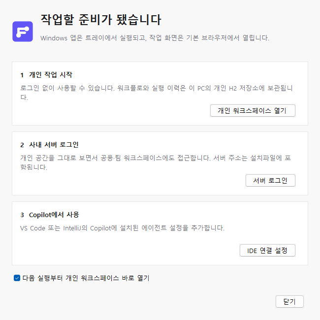
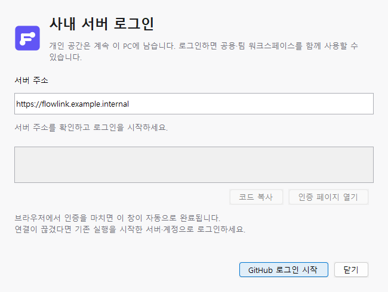

# Windows 설치와 에이전트 시작 안내

> 현재 설치 구현은 `backend/flow-desktop/installer/`가 소유한다. 아래 0.3.3의 설치·Node·로컬 MCP·IDE 등록 설명과 검증은 이전 릴리스 기록이다. 현재 네 모듈 구조와 중앙 Kotlin MCP는 [역할별 빌드 안내](../backend/README.md)를 따른다.

FlowLink 0.3.3은 Windows 사용자 계정에 설치하는 네이티브 앱이다. Java와 Node 실행환경을 설치파일에 포함한다. PC에 Docker를 설치하거나 Docker 컨테이너를 시작하지 않는다. 개인 데이터와 키는 앱 설치 폴더와 분리된 `%LOCALAPPDATA%\FlowLink`에 보관한다.

0.3.3은 실제 0.3.2 설치에서 업그레이드하고 기존 개인 자료·키·계정 보존과 새 화면 진입을 확인했다. 새 MSI의 버전·업그레이드 코드·한글 언어·설치 완료 후 실행 조건도 다시 검사했다. 아래 0.3.2의 UI 렌더 기록은 변경되지 않은 설치/트레이 UI의 이전 증거이며 실제 마법사 클릭 검증으로 확대하지 않는다. 이번 산출물과 실제 설치 결과는 [0.3.3 릴리스 결과](reviews/2026-10-03-release-0.3.3.md)에 기록했다.

## 설치 → 첫 작업

1. 사내 서버에서 `FlowLink-0.3.3.msi`를 다운로드한다. 배포 서버 주소가 패키지의 `app/server.json`에 들어간다.
2. 한글 설치 마법사에서 설치 경로와 바탕 화면·시작 메뉴 바로가기를 선택한다.
3. 완료 화면의 **FlowLink 실행 · 시작 안내 열기**는 기본 선택 상태다. 해제하면 설치만 마친다. 무인 설치(`/qn`)에는 완료 화면 이벤트가 없으므로 앱을 자동 실행하지 않는다.
4. 최초 실행은 아래 시작 안내를 연다. **개인 워크스페이스 열기**를 누르면 기본 브라우저가 열린다. 로그인 없이 개인 작업을 시작할 수 있다.
5. **다음 실행부터 개인 워크스페이스 바로 열기**를 유지하면 이후 시작은 브라우저로 바로 들어간다. 시작 안내는 트레이 메뉴에서 다시 열 수 있다.
6. 이미 실행 중일 때 바로가기를 다시 누르면 기존 에이전트의 일회용 접속 URL로 화면을 연다. 두 번째 개인 DB 프로세스를 만들지 않는다.



## 트레이

웹 UI와 같은 `#6155f5` 브랜드 색상과 두 실행 지점을 연결한 F 모양을 사용한다. 설치 아이콘은 16/24/32/48/64/128/256 픽셀 이미지를 포함한다. 트레이와 각 대화상자도 같은 도형을 사용한다.


트레이 첫 두 줄은 **내 PC · 실행 중**과 **서버 · 계정 로그인됨 / 로그인 필요**이다. 초록 배지는 서버 로그인 세션이 있을 때, 황색 배지는 로그인이 필요할 때 표시한다. 이 표시는 네트워크 지연을 측정한 서버 가동률 표시가 아니라 앱이 보관한 로그인 상태이며, 2초마다 갱신한다.

메뉴에서 개인 화면과 서버 화면을 각각 열고, 서버 로그인·로그아웃, IDE 연결 설정, 시작 안내, 저장 위치·로그 폴더를 이용할 수 있다. 로그아웃해도 개인 워크스페이스는 유지된다. 브라우저 종료와 에이전트 종료를 구분하며, 실제 앱 종료 시 진행 중 외부 요청의 처리 가능성과 결과 불명 작업의 자동 재호출 금지를 안내한다. 앱의 모든 Swing 창을 함께 닫아 JVM 잔류를 방지한다. 트레이가 꺼진 실행에서는 종료 시 AWT를 초기화하지 않는다.

## 서버 로그인

서버 주소는 설치 정보에서 채운다. 한 창에서 주소 확인, 로그인 시작, 인증 코드 복사, 인증 페이지 다시 열기, 실패 후 재시도를 수행한다. 로그인 중에는 주소와 시작 버튼을 잠가 요청이 겹치지 않게 한다. 인증 완료 시 서버 워크스페이스를 기본 브라우저로 연다.

네이티브 창은 중복 생성하지 않는다. 로그인 만료·네트워크 오류는 입력창 바로 아래에 표시한다. 개발용 모킹 로그인은 실제 GitHub 인증과 구별되는 문구를 표시한다. 재연결은 기존 실행을 시작한 서버·계정으로 안내한다.



## IDE 연결 편의 기능

- 개인 `flowlink-local`과 공용·팀 `flowlink-server`를 체크박스로 선택한다. 서버 로그인 전에도 설정을 복사할 수 있으며 실제 사용 전에 앱 로그인이 필요하다는 안내가 나온다.
- 설치에 포함된 Node, MCP 진입 파일, 장치 설정 파일의 절대 경로를 JSON에 채운다. 서버 JWT나 개인 접근 토큰은 복사할 설정에 넣지 않는다.
- VS Code는 공식 `--add-mcp` CLI로 사용자 프로필에 선택한 항목을 추가한다. 설치된 공식 CLI 래퍼의 경로를 확인하고, 등록 대기는 30초로 제한한다. 실패하면 JSON 복사로 안내한다. 같은 이름의 FlowLink 항목은 해당 CLI의 등록 동작을 따른다.
- IntelliJ/JetBrains는 GitHub Copilot의 Agent → 도구 설정 → Add MCP Tools에서 `mcp.json`의 `servers`에 합치는 절차를 제공한다. 기존 다른 서버 설정을 통째로 덮어쓰지 않도록 안내한다.
- 탭별 공식 문서 링크와 복사 완료 메시지가 있다. 앱 로그인과 IDE 도구 승인은 서로 다른 단계이며, 도구 승인은 IDE에서 사용자가 결정한다.

**이번 작업에서는 MCP 연결·도구 호출·MCP 실행 테스트를 하지 않았다.** 구성 화면과 설정 생성 코드만 수정했다. IDE 등록 버튼도 검증 과정에서 실행하지 않았다.

## 패키징 구현

`scripts/package-desktop.ps1`은 호환 진입점이며 실제 구현과 설치 자료는 `backend/flow-desktop/installer/`에 있다. `New-DesktopResources.ps1`은 ICO/BMP를 생성하고 설치된 JDK 21의 `main.wxs`를 추출해 `FlowLinkSetup.wxi`의 브랜드·완료 화면 동작만 삽입한다. 구성요소 ID와 업그레이드 규칙은 JDK 템플릿을 재사용한다. 생성된 자료는 별도 staging의 `resources`에 두고 `--resource-dir`로 전달하며 앱 payload에는 포함하지 않는다.

한글 표준 설치 문구는 빌드 머신의 WiX 3 `WixUIExtension.dll`에 포함된 한국어 번역을 재사용한다. FlowLink 안내만 덧붙이고 ProductLanguage는 1042, 코드 페이지는 949로 지정한다. 설치 마법사 표시를 위해 `--win-dir-chooser`와 `--win-shortcut-prompt`를 사용한다. 새로운 설치 프레임워크나 PC용 Docker 의존성은 없다.

완료 버튼의 custom action은 현재 사용자 권한으로 `[INSTALLDIR]FlowLink.exe`를 비동기 실행한다. 실행 조건은 `WIXUI_EXITDIALOGOPTIONALCHECKBOX = 1 AND NOT Installed`이며 UI 완료 이벤트에서만 실행한다. 복구·제거와 무인 설치는 자동 실행 대상이 아니다.

업그레이드 UUID는 기존 `b06c875d-2e09-4b64-9e3d-2f52e871d069`를 유지한다. 기본 `UpgradeVersion`에는 Language 필터를 추가하지 않는다. 따라서 0.2.0의 제품 언어 1033을 새 0.3.2의 언어 1042로 바꾸더라도 검색 대상을 새 언어로 제한하지 않는다. 다운그레이드는 차단한다. 기존 개인 DB와 키는 설치 프로그램의 소유 파일에 넣지 않는다.

설치 앱의 실행 경계도 런처 인자와 분리했다. jpackage는 사용자가 외부 인자를 하나라도 지정하면 기본 `ArgOptions`를 대체하므로, `flowlink.bundle.dir`이 있는 실행은 Java 진입점에서 항상 `local,desktop` 프로파일로 정규화한다. 프로파일 추가 옵션도 비우고 개인 DB·루프백·인증 검증을 거친다. `--flowlink.desktop.open-browser=false`만 전달해도 개인 프로파일과 기본 포트가 사라지지 않는다. 명시한 `--server.port`와 `--flowlink.desktop.data-dir`은 보존하며, 포트를 생략하면 패키지의 기본 포트(기본 18180)를 사용한다. 번들 속성이 없는 서버 JAR의 인자 처리는 바꾸지 않는다. 이 경계는 순수 인자 회귀 테스트로 검증했다. [jpackage 기본 인자 동작](https://docs.oracle.com/en/java/javase/24/jpackage/support-application-features.html)

```powershell
powershell -ExecutionPolicy Bypass -File scripts\package-desktop.ps1 `
  -Type msi -SkipBuild `
  -JdkPath C:\path\to\jdk-21 `
  -WixPath C:\path\to\wix3 `
  -ServerUrl https://flowlink.company.internal
```

## 검증 기록과 범위

| 항목 | 이 변경에서 확인한 범위 |
|---|---|
| Kotlin | `compileKotlin` 성공. 주 작업의 최종 desktop 테스트·bootJar 성공 |
| 리소스 스크립트 | Windows PowerShell 5.1과 PowerShell 7에서 구문 파싱·실제 리소스 생성 성공. 한글 스크립트는 UTF-8 BOM 유지 |
| 설치 자료 | 7해상도 ICO, BMP, `main.wxs`·localization XML 파싱, 한국어 573개 문자열 생성 확인 |
| 네이티브 UI | 실제 welcome/login 컴포넌트를 창 표시 없이 PNG로 렌더하고 문구 잘림 수정 |
| 설치 이미지 | 이 문서의 `dialog-preview.png`는 설치 배경 리소스이며 실제 MSI 창의 캡처가 아님 |
| 실제 MSI | 0.3.2 MSI 빌드 성공. WindowsInstaller COM 읽기 전용 검사로 아래 테이블 확인. 실제 업그레이드 설치는 주 작업에서 수행 |
| MCP | 실제 연결·호출·등록 버튼 실행·MCP 테스트 미실행 |

실제 `FlowLink-0.3.2.msi` 테이블 검사 결과:

- Property: ProductVersion `0.3.2`, ProductLanguage `1042`, 기존 UpgradeCode 유지, 실행 체크박스 기본 `1`.
- Upgrade: 업그레이드·다운그레이드 두 행 모두 Language 필터가 비어 있음.
- CustomAction: FlowLinkLaunch는 Type `226`, Source `INSTALLDIR`, Target `"[INSTALLDIR]FlowLink.exe"`.
- ControlEvent: ExitDialog Finish의 실행 동작은 체크박스 조건과 `NOT Installed`를 가지며 순서 `1`. 설치 창 종료 동작은 순서 `999`.
- Control: 시작·완료·바로가기 선택 화면의 한글 문구와 체크박스 연결 확인.
- Icon: `JpARPPRODUCTICON` 존재, ARPPRODUCTICON 속성의 참조 일치.

이 검사에서는 MSI를 실행하거나 PC의 설치 정보를 변경하지 않았다. 실제 업그레이드·무인 설치 자동 실행 부재·기존 H2와 키 보존은 주 작업의 설치 검증 결과를 따른다. 설치 마법사와 트레이의 실제 클릭 검증은 네이티브 UI 자동화가 가능한 Windows 환경에서 별도로 확인할 수 있다. 현재 검수 이미지는 동일 Swing 컴포넌트의 비동작 렌더 결과다.

구현 근거: [Oracle jpackage 리소스 재정의](https://docs.oracle.com/en/java/javase/21/jpackage/override-jpackage-resources.html), [WiX 완료 화면 실행](https://docs.firegiant.com/wix3/howtos/ui_and_localization/run_program_after_install/), [VS Code MCP 설정](https://code.visualstudio.com/docs/agent-customization/mcp-servers), [GitHub Copilot IDE별 MCP 설정](https://docs.github.com/en/copilot/how-tos/provide-context/use-mcp-in-your-ide/extend-copilot-chat-with-mcp?tool=jetbrains).
