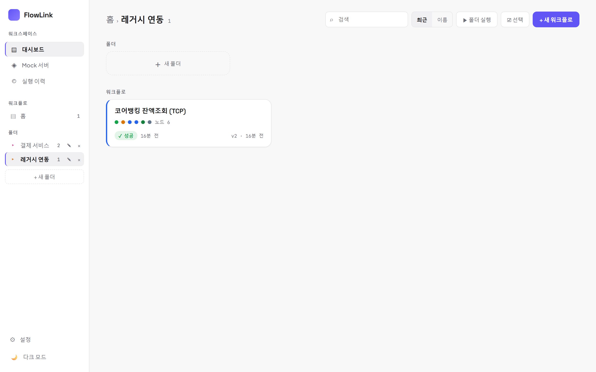
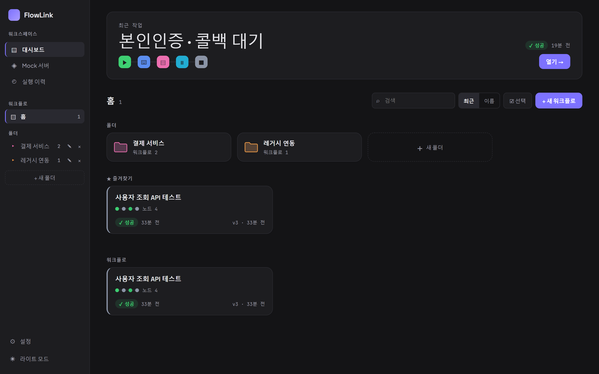

# 01. 시작하기 — 접속과 화면 구성

[← 목차](README.md)

## 접속

브라우저에서 `http://localhost:18080` (또는 사내 배포 주소). 별도 로그인이 없는 dev 모드가 기본이며,
GitHub/OIDC 인증 모드로 배포된 인스턴스라면 안내 화면이 뜹니다.

## 전체 화면 구성

| 화면 | 들어가는 곳 | 하는 일 |
|---|---|---|
| **대시보드** | 사이드바 첫 항목 | 워크플로 목록·검색·폴더·즐겨찾기·일괄 실행 |
| **에디터** | 워크플로 카드 클릭 | 캔버스에서 편집·실행 ([02. 에디터](02-에디터.md)) |
| **Mock 서버** | 사이드바 | 가짜 대상 시스템 정의·서빙 ([10장](10-Mock-서버.md)) |
| **실행 이력** | 사이드바 | 과거 실행 조회·재실행·비교 ([08장](08-실행이력-스위트.md)) |
| **⚙ 설정** | 사이드바 하단 | 콜백 수신 주소·실패 알림 웹훅 ([07장](07-트리거-자동화.md)) |
| **다크 모드** | 사이드바 하단 | 라이트/다크 테마 토글 |

## 대시보드

### 최근 작업 카드 (상단 히어로)
가장 최근에 만진 워크플로가 크게 표시됩니다 — 노드 구성 미리보기(색 아이콘), 최근 실행 상태, **열기 →** 버튼.

### 워크플로 카드
- **노드 수 + 타입 도트**: 어떤 노드들로 구성됐는지 색으로 미리 보여줍니다.
- **상태 배지**: 가장 최근 실행 결과(✓ 성공 / ✕ 실패 / 실행 전).
- **버전(v3)** 과 마지막 수정 시각.
- 카드에서 **우클릭(또는 메뉴)** 으로 ★ 즐겨찾기, 폴더 이동, 삭제 등을 할 수 있습니다.

### 폴더
- 사이드바와 본문 양쪽에서 관리합니다. **+ 새 폴더**, 이름 옆 ✎(이름변경) · ×(삭제).
- 폴더 카드를 클릭하면 폴더 안으로 들어가고, 상단 경로(홈 › 폴더명)로 돌아 나옵니다.
- 폴더는 **중첩**(폴더 안 폴더)이 가능합니다.
- 폴더 화면에는 **▶ 폴더 실행** 버튼이 생깁니다 — 안의 워크플로를 한 번에 실행하는 스위트 기능([08장](08-실행이력-스위트.md)).

### 즐겨찾기 (★)
자주 쓰는 워크플로를 핀하면 홈 상단 **★ 즐겨찾기** 섹션에 고정됩니다. (브라우저별 개인 설정)

### 검색·정렬·선택
- **검색**: 이름뿐 아니라 **노드 내용**(URL·조건식 등)도 함께 찾습니다.
- **정렬**: 최근 수정순 / 이름순.
- **선택**: 선택 모드를 켜면 여러 워크플로를 체크해 **▶ 선택 실행**(스위트)할 수 있습니다.

### 새 워크플로
**+ 새 워크플로** 를 누르면 즉시 생성되고 에디터로 이동합니다. 현재 폴더 안에서 누르면 그 폴더 소속으로 만들어집니다.

## 다크 모드

사이드바 하단에서 전환합니다. 설정은 브라우저에 저장됩니다.

---

다음: [02. 에디터](02-에디터.md)
