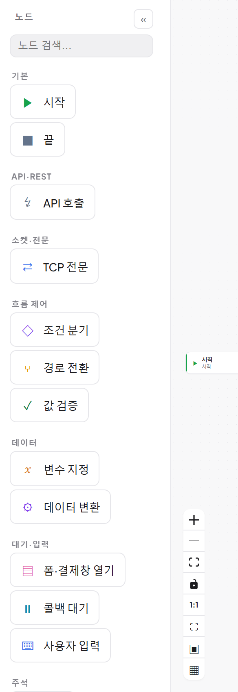
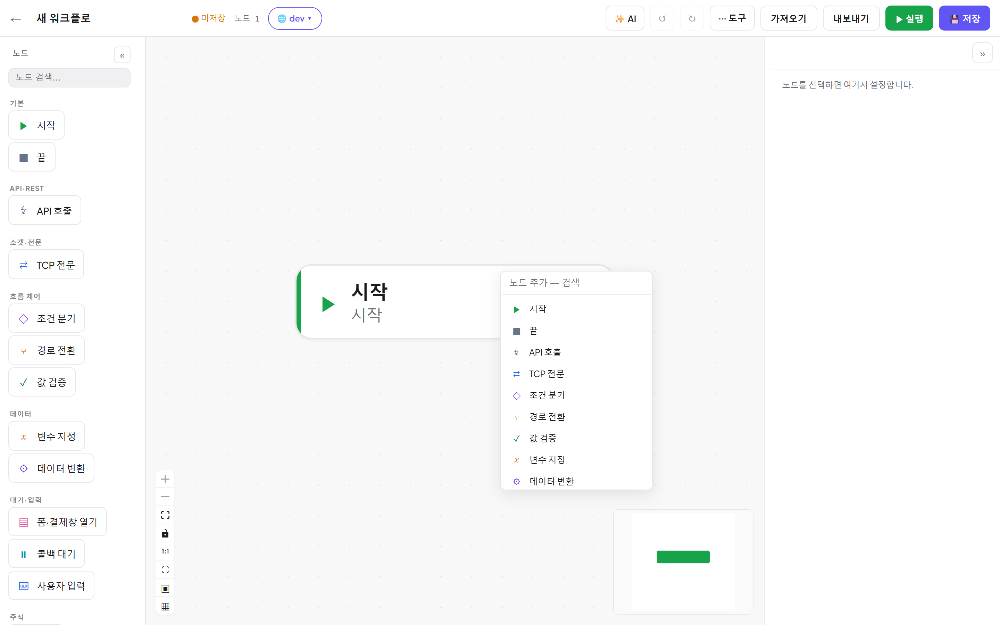
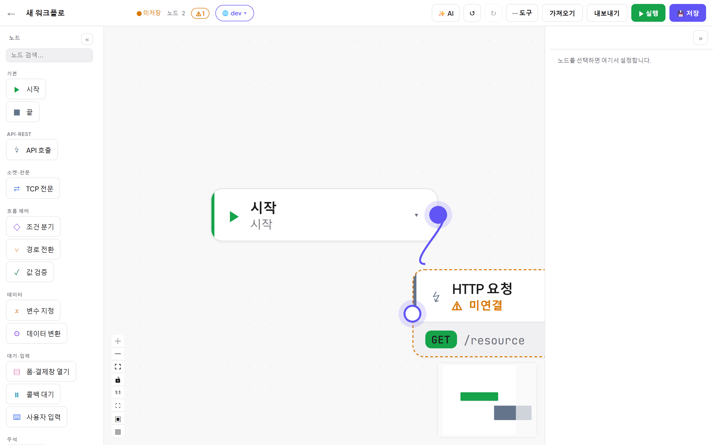
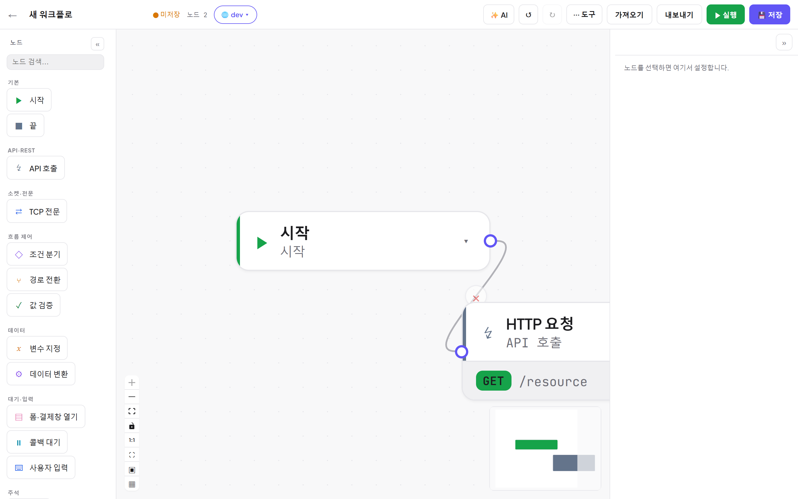
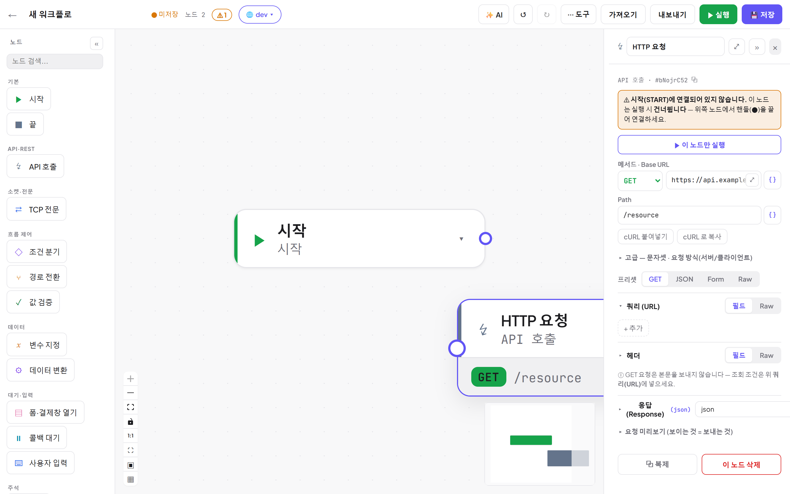
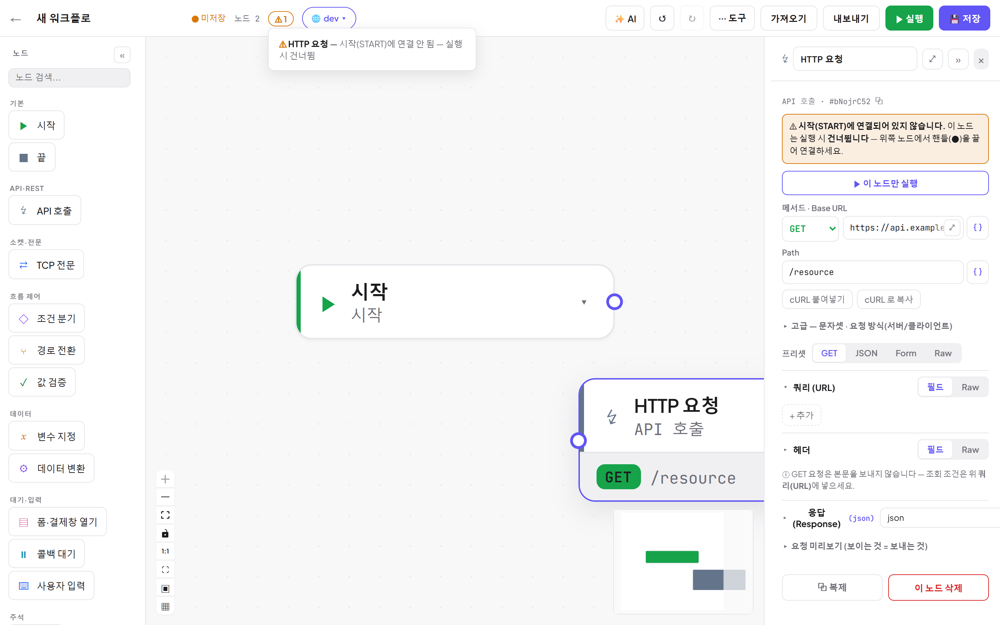
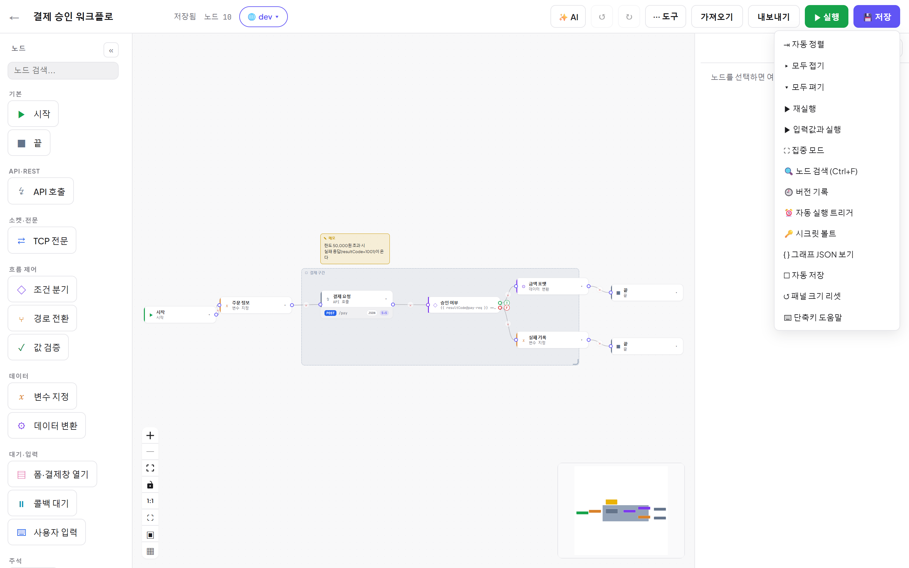
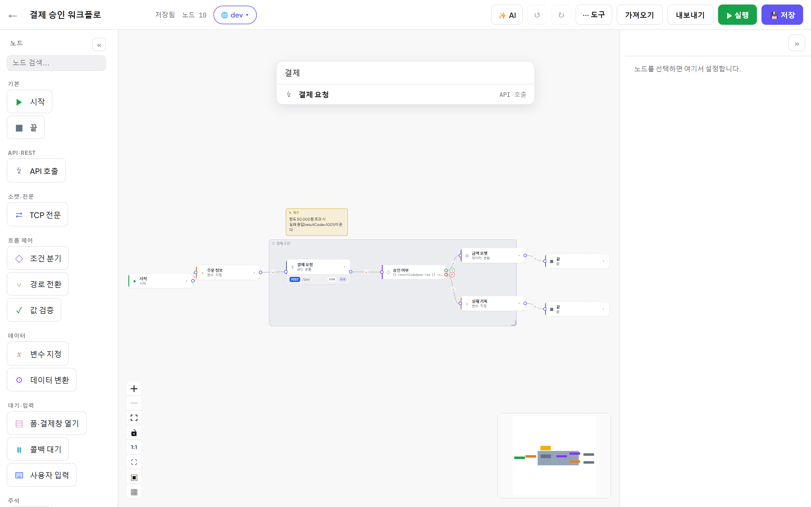
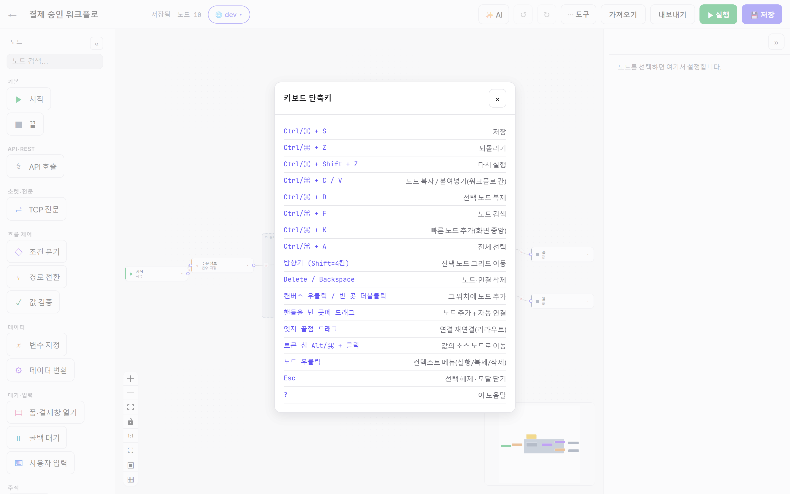

# 02. 에디터 — 캔버스 다루기

[← 목차](README.md)

## 레이아웃

| 영역 | 설명 |
|---|---|
| **탑바** | ← 목록, 워크플로 이름(클릭해 편집), 저장 상태·노드 수, ⚠ 문제 배지, 🌐 환경, ✨ AI, ↺/↻, ⋯ 도구, 가져오기/내보내기, ▶ 실행, 💾 저장 |
| **팔레트(좌)** | 노드 목록 — 검색창 + 그룹(기본/API·REST/소켓·전문/흐름 제어/데이터/대기·입력/주석) |
| **캔버스(중)** | React Flow 캔버스 — 줌/이동 컨트롤, 미니맵, 그리드 |
| **속성 패널(우)** | 선택한 노드의 설정 ([03. 노드 레퍼런스](03-노드-레퍼런스.md)) |
| **실행 로그(하)** | 실행하면 열림 ([05. 실행과 디버깅](05-실행-디버깅.md)) |

- 팔레트/속성 패널은 «/» 버튼으로 **접을 수** 있고, 경계선을 **드래그해 크기 조절**할 수 있습니다(브라우저에 기억됨).
- 팔레트 클로즈업:

## 노드 추가

| 방법 | 동작 |
|---|---|
| 팔레트 **드래그** | 원하는 위치에 배치 |
| 팔레트 **클릭/Enter** | 캔버스 중앙에 추가 |
| 캔버스 **더블클릭 / 우클릭** | 그 위치에 검색 메뉴 |
| **`Ctrl+K`** | 화면 중앙에 검색 메뉴 |
| **핸들을 빈 곳에 드래그** | 메뉴에서 고른 노드가 그 자리에 생기고 **자동 연결** |

검색어를 입력하면 이름으로 필터링됩니다:

## 연결(엣지)

- 노드 오른쪽 **소스 핸들(●)** → 다음 노드 왼쪽 **타깃 핸들** 로 드래그. **자석 스냅**(연결 반경)이 있어 근처에만 놓으면 붙습니다.
- 연결 드래그 중에는 핸들이 커지고 후광이 표시됩니다.

- **엣지 끝점을 드래그**하면 다른 노드로 재연결(리라우트)됩니다.
- 엣지 중간의 × 를 클릭하면 삭제. `Delete` 키도 됩니다.
- **조건 분기(IF)** 노드는 오른쪽에 **T(참)/F(거짓)** 두 개의 소스 핸들이 있습니다.
- **경로 전환(스위치)** 노드는 트랙마다 소스 핸들이 있습니다.

## 편집 문제 배지 — 미연결 노드 찾기

시작(START)에서 도달할 수 없는 실행 노드가 있으면:
- 캔버스에서 해당 노드가 **주황 점선 + ⚠ 미연결** 로 표시되고(노드를 선택하는 동안에는 점선 표시가 잠시 숨습니다),
- 노드를 선택하면 속성 패널 상단에 **경고 박스**("실행 시 건너뜁니다 — 핸들을 끌어 연결하세요")가 뜨고,
- 탑바에 **⚠ N** 배지가 나타납니다. 클릭하면 문제 목록이 열립니다.

아래 첫 컷은 노드 선택 상태의 **패널 경고**, 둘째 컷은 **⚠ 배지의 문제 목록**입니다:

## 선택·이동·복사

- 클릭=선택, 드래그=이동(그리드 스냅), 빈 곳 드래그=캔버스 이동(팬), **Shift+드래그=박스 선택**, `Ctrl+A` 전체 선택.
- `Ctrl+C / Ctrl+V` 복사/붙여넣기 — **다른 워크플로에 붙여넣기도 됩니다.**
- `Ctrl+D` 선택 노드 복제. 방향키로 그리드 단위 이동(Shift=4칸).
- **노드 우클릭** → 컨텍스트 메뉴(이 노드만 실행/복제/삭제 등).
- 노드 헤더의 **▾** 로 노드를 **접기**(헤더만 표시) — 큰 플로우 정리용.

## ⋯ 도구 메뉴

| 항목 | 설명 |
|---|---|
| ⇥ 자동 정렬 | 그래프를 위상 순서대로 재배치 |
| ▸ 모두 접기 / ▾ 모두 펴기 | 노드 헤더만/전체 표시 |
| ▶ 재실행 · ▶ 입력값과 실행 | [05장](05-실행-디버깅.md) / [06장](06-환경-시크릿-입력.md) |
| ⛶ 집중 모드 | 패널을 숨기고 캔버스만 |
| 🔍 노드 검색 (Ctrl+F) | 이름·타입으로 노드 찾아 점프 |
| 🕘 버전 기록 | [09장](09-버전-협업.md) |
| ⏰ 자동 실행 트리거 | [07장](07-트리거-자동화.md) |
| 🔑 시크릿 볼트 | [06장](06-환경-시크릿-입력.md) |
| { } 그래프 JSON 보기 | 현재 그래프의 원본 JSON |
| ☑ 자동 저장 | 켜면 변경이 잠시 멈출 때 자동 저장 |
| ↺ 패널 크기 리셋 · ⌨ 단축키 도움말 | — |

노드 검색(Ctrl+F):

## 단축키

`?` 또는 도구 메뉴 → ⌨ 단축키 도움말.

| 키 | 동작 |
|---|---|
| `Ctrl+S` | 저장 |
| `Ctrl+Z` / `Ctrl+Shift+Z` | 되돌리기 / 다시 실행 |
| `Ctrl+C / V` | 노드 복사/붙여넣기 (워크플로 간 가능) |
| `Ctrl+D` | 선택 노드 복제 |
| `Ctrl+F` | 노드 검색 |
| `Ctrl+K` | 빠른 노드 추가 (화면 중앙) |
| `Ctrl+A` | 전체 선택 |
| 방향키 (`Shift`=4칸) | 선택 노드 그리드 이동 |
| `Delete` / `Backspace` | 노드·연결 삭제 |
| 캔버스 우클릭 / 빈 곳 더블클릭 | 그 위치에 노드 추가 |
| 핸들을 빈 곳에 드래그 | 노드 추가 + 자동 연결 |
| 엣지 끝점 드래그 | 연결 재연결(리라우트) |
| 토큰 칩 `Alt+클릭` | 값의 소스 노드로 이동 |
| 노드 우클릭 | 컨텍스트 메뉴 |
| `Esc` | 선택 해제 · 모달 닫기 |

> 한글 입력 모드에서도 단축키는 물리 키 기준으로 동작합니다. 입력창에 포커스가 있을 때
> 복사/붙여넣기/되돌리기 등 편집 단축키는 브라우저 기본 동작이 우선하지만, `Ctrl+S`(저장)와 `Ctrl+K`(노드 추가)는
> 입력창 안에서도 항상 동작합니다.

---

다음: [03. 노드 레퍼런스](03-노드-레퍼런스.md)
