# 03. 노드 레퍼런스 — 14종 전부

[← 목차](README.md)

노드를 클릭하면 오른쪽 **속성 패널**에서 설정합니다. 패널 공통 요소:

- 상단: 노드 이름(편집 가능) · ⤢ 크게 보기 · » 접기 · × 닫기
- **타입 · #노드ID** — 이 ID 가 토큰 바인딩(`{{ 키@노드ID }}`)에 쓰입니다. ⧉ 로 복사.
- **← 이전 / 다음 →** 칩: 연결된 상·하위 노드로 바로 이동
- **▶ 이 노드만 실행**: 그래프 전체를 돌리지 않고 이 노드만 즉석 실행(아래 참고)
- 하단: **복제 / 이 노드 삭제**

| 그룹 | 노드 |
|---|---|
| 기본 | [시작](#시작--끝) · [끝](#시작--끝) |
| API·REST | [API 호출 (HTTP)](#api-호출-http) |
| 소켓·전문 | [TCP 전문](#tcp-전문) |
| 흐름 제어 | [조건 분기 (IF)](#조건-분기-if) · [경로 전환 (스위치)](#경로-전환-스위치) · [값 검증 (ASSERT)](#값-검증-assert) |
| 데이터 | [변수 지정 (SET)](#변수-지정-set) · [데이터 변환 (TRANSFORM)](#데이터-변환-transform) |
| 대기·입력 | [폼·결제창 열기 (FORM)](#폼결제창-열기-form) · [콜백 대기 (WAIT)](#콜백-대기-wait) · [사용자 입력 (INPUT)](#사용자-입력-input) |
| 주석 | [메모](#메모--영역-박스) · [영역 박스](#메모--영역-박스) |

---

## 시작 / 끝

- **시작**: 실행 진입점. 워크플로마다 하나. 시작에서 엣지로 도달 가능한 노드만 실행됩니다.
- **끝**: 종료점(여러 개 가능 — 분기 별로 하나씩 두면 읽기 좋습니다).

## API 호출 (HTTP)

REST API 를 호출하는 핵심 노드입니다.

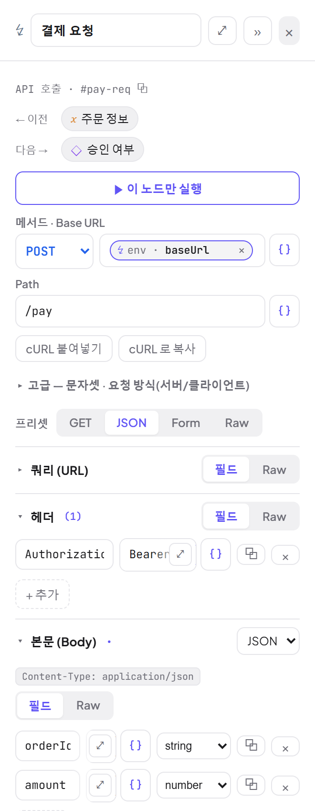

| 항목 | 설명 |
|---|---|
| **메서드 · Base URL · Path** | URL 은 Base+Path. 어느 쪽이든 `{{ }}` 토큰/바인딩 칩을 넣을 수 있습니다 (예: Base URL 에 `env·baseUrl` 칩). |
| **cURL 붙여넣기 / cURL 로 복사** | curl 명령 ⇄ 노드 설정 상호 변환 |
| **프리셋** | GET / JSON / Form / Raw — 메서드·본문 타입 일괄 세팅 |
| **쿼리 (URL)** | 키-값 쿼리스트링. `[필드 ↔ Raw]` 토글로 `a=1&b=2` 원문 편집 가능 |
| **헤더** | 키-값. Raw 모드는 `Key: Value` 줄바꿈 형식(curl 붙여넣기 형태) |
| **본문 (Body)** | 타입: JSON / Form(urlencoded) / XML / Raw. 구조형(JSON·Form)은 `[필드 ↔ Raw]` 상호 변환 |
| **응답 (Response)** | 응답 파싱 방식: json · xml · urlencoded/form · query · text · binary |
| **예상 응답 필드** | 하위 노드가 바인딩할 키 선언(피커에 칩으로 노출) |
| **요청 미리보기** | "보이는 것 = 보내는 것" — 실제 전송될 요청 확인 |

**고급 — 문자셋 · 요청 방식** (섹션을 펼치면):

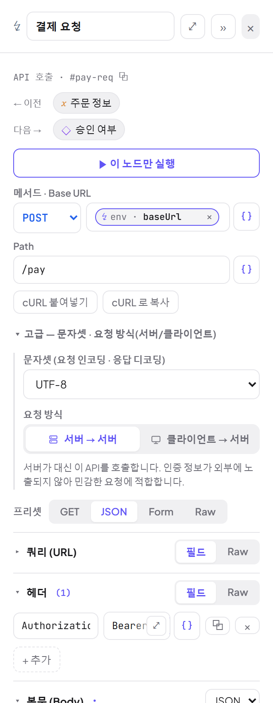

- **문자셋**: UTF-8(기본) / EUC-KR / MS949 / US-ASCII — 레거시 내부망 인코딩용. 요청 인코딩과 응답 디코딩에 함께 적용됩니다.
- **요청 방식**:
  - **서버 → 서버**(기본): 백엔드가 대신 호출. 인증 정보가 브라우저로 노출되지 않아 민감한 요청에 적합.
  - **클라이언트 → 서버**: 브라우저가 직접 호출(사내망에서 브라우저만 닿는 대상 등). 비UTF-8 문자셋은 완전히 적용되지 않으니 서버 모드 권장.

**본문 [필드 ↔ Raw] 전환** — 토글하면 내용이 실제로 변환됩니다(필드 `name|kim` ⇄ Raw `{"name":"kim"}`):

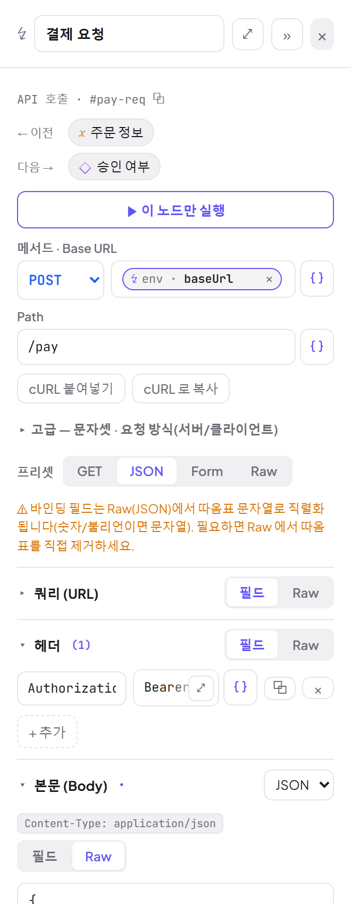

**JSON 필드 타입** — 각 필드 값 옆 select(string/number/boolean/json/array)로 따옴표 여부를 제어합니다.
`amount` 를 `number` 로 두면 `{"amount":30000}` 처럼 숫자로 전송됩니다.

**응답 타입과 예상 응답 필드**:

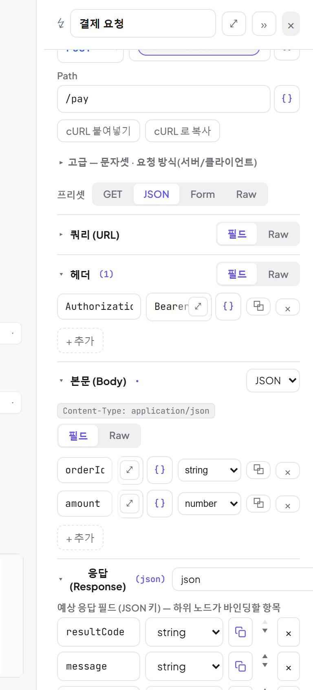

- **키형**(json/xml/urlencoded/query): 응답이 키-값으로 파싱되어 선언한 키로 바인딩합니다.
- **통짜형**(text/binary): 본문 전체가 `body` 단일 값 — `{{ body@노드 }}` 로 사용.
- 어떤 타입이든 파싱에 실패하면 원문이 `body` 키로 보존됩니다.
- HTTP 상태코드는 `{{ httpStatus@노드 }}` 로 항상 바인딩 가능합니다.

## TCP 전문

고정길이(길이 프리픽스) 금융 전문을 소켓으로 주고받습니다 — 레거시 코어뱅킹 연동용.

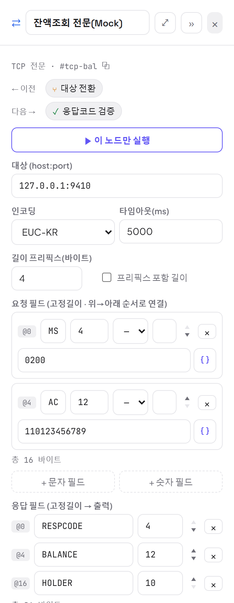

| 항목 | 설명 |
|---|---|
| **대상 (host:port)** · 타임아웃 | 예: `127.0.0.1:9410` |
| **인코딩** | EUC-KR 등 — 전문 바이트 인코딩 |
| **길이 프리픽스(바이트)** | 전문 앞의 길이 필드 크기. "프리픽스 포함 길이" 체크 시 자기 자신 포함 |
| **요청 필드** | 고정길이 필드를 위→아래 순서로 연결. 각 필드: 이름·길이·값(토큰/바인딩 가능)·패딩 방향/문자. 왼쪽 `@오프셋` 배지로 위치 확인, 하단에 **총 N 바이트** |
| **응답 필드** | 고정길이 → **필드 이름이 그대로 출력 키**가 되어 하위 노드가 바인딩 |

**전문 미리보기** — 전송 없이 바이트 단위로 조립 결과를 확인합니다(총 바이트/프리픽스/필드별 오프셋·패딩·절단):

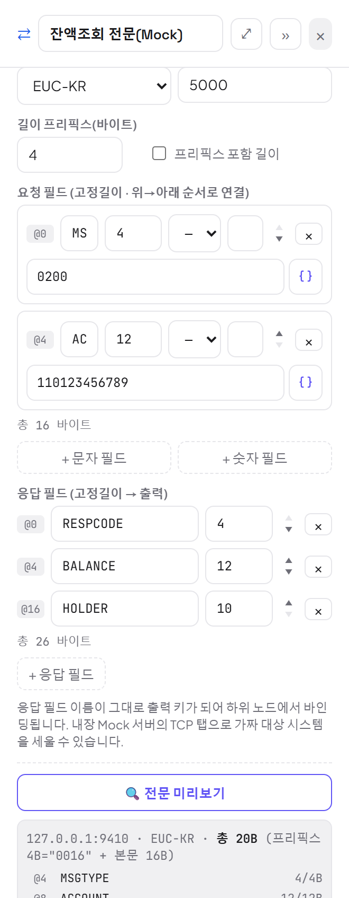

> 💡 상대 시스템이 없으면 **Mock 서버의 TCP 탭**으로 가짜 코어뱅킹을 세울 수 있습니다 ([10장](10-Mock-서버.md)).

## 조건 분기 (IF)

조건식이 **참이면 T 핸들, 거짓이면 F 핸들**로 진행합니다.

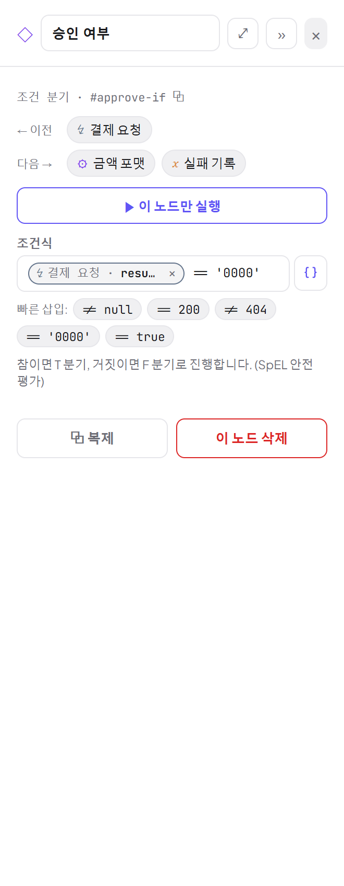

- 조건식: SpEL(안전 평가 — 비교/산술만, 메서드 호출 불가). 토큰/칩 사용 가능.
  예: `{{ resultCode@pay-req }} == '0000'`, `{{ httpStatus@조회 }} == 200`
- **빠른 삽입** 버튼: `≠ null` `== 200` `≠ 404` `== '0000'` `== true`

## 경로 전환 (스위치)

조건 평가 없이 **사용자가 젖혀둔 트랙 하나로만** 흐르는 수동 라우팅(2~6갈래). 열차 선로 전환기 모델입니다.

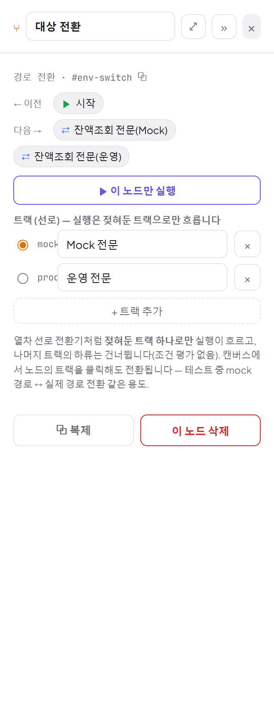

- 트랙마다 라디오로 활성 트랙을 선택. **캔버스에서 노드의 트랙을 클릭해도 전환**됩니다.
- 비활성 트랙의 하류는 실행 시 건너뜁니다.
- 대표 용도: **Mock 경로 ↔ 실제 경로** 전환, A/B 대상 전환.

## 값 검증 (ASSERT)

조건이 **거짓이면 이 노드가 실패**하고 실행이 FAILED 로 끝납니다 — 테스트 판정용.

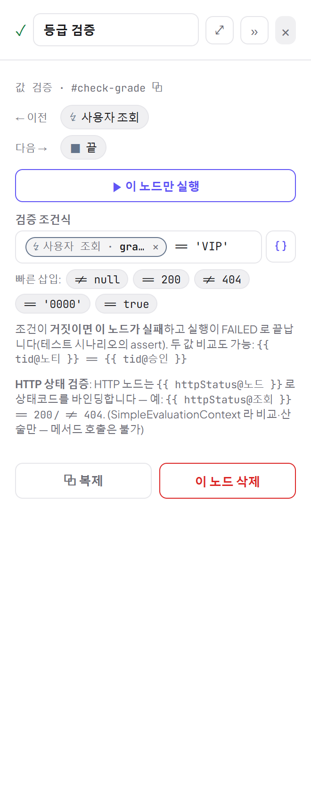

- IF 와 같은 조건식 문법 + 빠른 삽입 버튼.
- 두 값 비교도 가능: `{{ tid@노티 }} == {{ tid@승인 }}`
- HTTP 상태 검증: `{{ httpStatus@조회 }} == 200` / `≠ 404`

## 변수 지정 (SET)

리터럴·토큰 값을 변수로 만들어 하위 노드에서 바인딩하게 합니다.

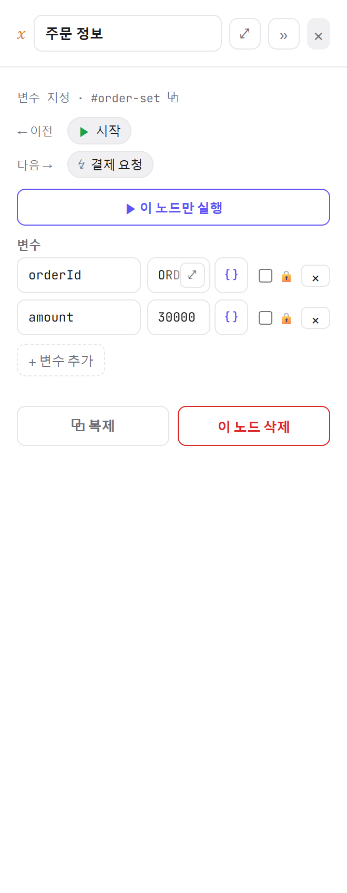

- 행마다 키/값 + `{ }` 데이터 삽입. 🔒 체크하면 **시크릿 취급**되어 UI/로그에서 마스킹됩니다.
  단, 마스킹은 표시용일 뿐 **값 자체는 그래프에 저장**됩니다(내보내기 JSON 에도 포함) — 진짜 민감값은
  [시크릿 볼트](06-환경-시크릿-입력.md#시크릿-볼트)의 `{{ 이름@secret }}` 참조를 쓰세요.
- 값이 정확히 토큰 하나면 숫자/불리언/객체 **원형이 보존**됩니다.

## 데이터 변환 (TRANSFORM)

등록된 변환 함수를 적용합니다 — 문자열(분리/치환/정규식/패딩), 숫자(계산/반올림/천단위), 인코딩(Base64/URL/Hex),
해시·서명(SHA-256/MD5/HMAC/AES), JSON 추출, 현재 시각 등 내장 20여 종 + JAR 플러그인.

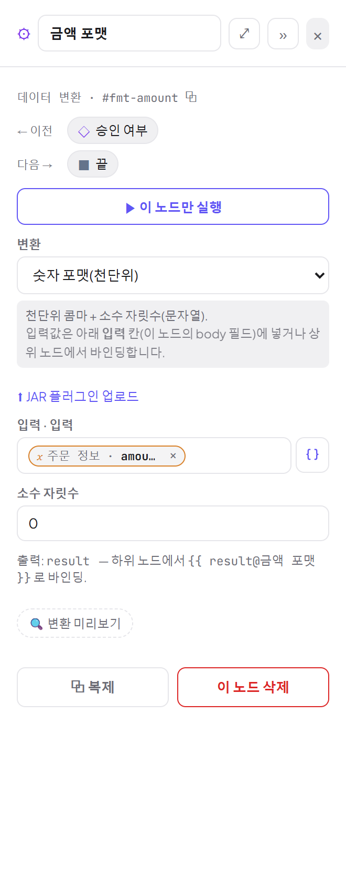

- **변환** 드롭다운으로 선택 — 설명과 예시가 함께 표시됩니다.
- **입력**: `입력` 칸에 값/바인딩. 변환별 파라미터(구분자·자릿수·키 등)가 아래에 나타납니다.
- **출력**: `result` — 하위에서 `{{ result@노드 }}` 로 바인딩.
- **변환 미리보기**로 즉석 확인. **JAR 플러그인 업로드**로 사내 변환을 추가할 수 있습니다.

## 폼·결제창 열기 (FORM)

결제/본인인증창 패턴 — 지정 URL 로 **숨김 폼을 자동 제출**한 창을 열고, **기다리지 않고 즉시 다음 노드로** 진행합니다.
사람의 인증/입력 결과는 다음의 **콜백 대기** 노드가 받습니다.

| 항목 | 설명 |
|---|---|
| **열기 URL / 메서드** | 팝업·iframe 으로 열어 form 을 제출할 주소 (토큰 가능) |
| **표시 방식** | **팝업 창** 또는 **iframe 모달**. iframe 은 팝업 차단이 없고 같은 페이지에 뜹니다(× 나 바깥 클릭으로 닫음). 팝업 모드는 차단되면 실패합니다. |
| **콜백 URL 필드 추가** | 뒤에 연결된 콜백 대기 노드의 **수신 URL** 을 게이트웨이가 요구하는 필드(returnUrl 등)에 꽂아주는 버튼 |
| **Hidden 필드** | 폼 데이터 — 값마다 바인딩 가능, `[필드 ↔ Raw]` 지원 |

실행 중 iframe 모달로 열린 모습(내장 Mock 의 HTML 응답):

> 🔬 결제창/본인인증 패턴 전체(수신 URL 꽂기, 콜백 파싱, 테스트 방법)는 [15. 폼·콜백 연동 심층](15-폼-콜백-연동.md)에서 다룹니다.

## 콜백 대기 (WAIT)

외부 시스템의 콜백(리다이렉트/웹훅 노티)을 **백엔드가 직접 받아** 자동 재개합니다. 브라우저를 닫아도 완결됩니다.

| 항목 | 설명 |
|---|---|
| **타임아웃(초)** | 시간 안에 콜백이 없으면 노드 실패 → 실행 중단 |
| **콜백에 줄 응답** | 콜백을 보낸 쪽이 받을 응답 — 문자열/HTML/JSON + 프리셋(OK(노티) · 창 닫기 HTML · JSON 승인) |
| **수신 URL** | `{서버}/relay/{실행ID}/cb/{노드ID}` — 실행 시작 시 실행ID 가 정해져 확정됩니다. 앞 노드(폼의 returnUrl 등)에서 { } 피커의 **수신 URL** 항목으로 꽂는 것이 표준 패턴 |
| **응답 규격(출력)** | 콜백 본문 키 선언 — 바인딩 피커 칩용(선언 안 한 키도 실제 수신되면 `{{ 키@노드 }}` 로 바인딩 가능) |

실행이 이 노드에 도달하면 로그에 **카운트다운 + 수신 URL + 테스트 콜백**이 표시됩니다:

- **테스트 콜백 · 보내기**: 외부 시스템 없이 샘플 콜백을 쏴서 진행시켜 봅니다.
- 콜백이 도착하면 파라미터/본문이 이 노드의 출력이 되어 다음 노드로 흐릅니다:

> ⚙ 설정의 **콜백 수신 주소**가 외부에서 도달 가능해야 실제 게이트웨이 콜백을 받을 수 있습니다 ([07장](07-트리거-자동화.md)).
> 콜백 매칭·본문 파싱 규칙·타임아웃/재시작 동작은 [15. 폼·콜백 연동 심층](15-폼-콜백-연동.md) 참고.

## 사용자 입력 (INPUT)

실행 중 **브라우저 모달**로 값을 입력받아 다음 노드에 전달합니다 (OTP·승인 코멘트 등).

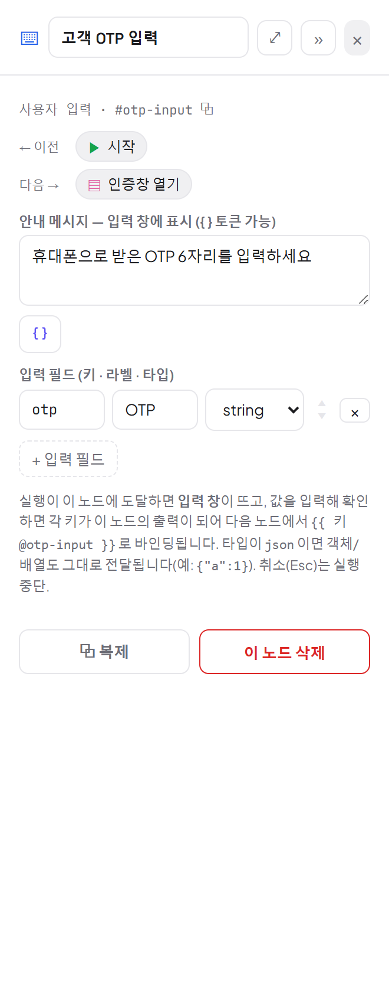

- **안내 메시지**(토큰 가능)와 **입력 필드**(키·라벨·타입 string/number/boolean/json) 정의.
- 실행이 도달하면 모달이 뜨고, 확인(Enter)하면 각 키가 출력이 됩니다. 취소(Esc)는 실행 중단.

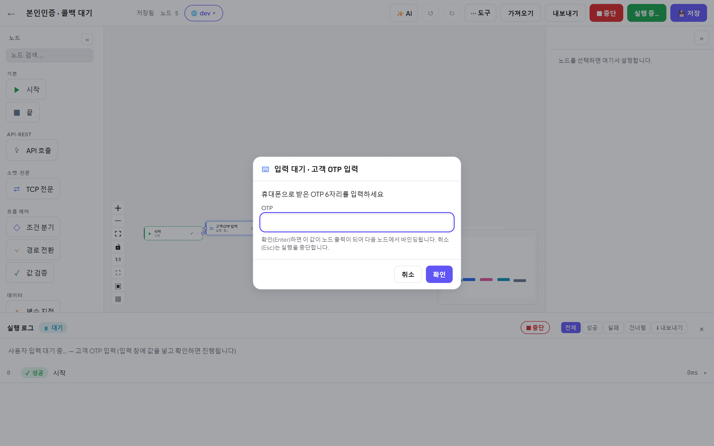

## 메모 / 영역 박스

실행과 무관한 캔버스 주석입니다 — 실행 시 건너뜁니다.

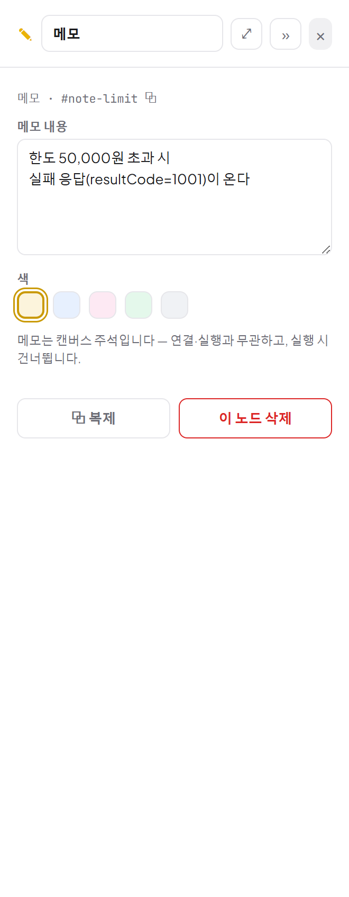

- **메모**: 스티키 노트(본문 + 색 5종).
- **영역 박스**: 노드들 뒤에 깔리는 표시용 사각형(제목 + 색) — 구간 표시용. 제목바를 드래그해 옮기고,
  우하단 모서리(또는 패널의 크기 입력)로 크기를 조절합니다.

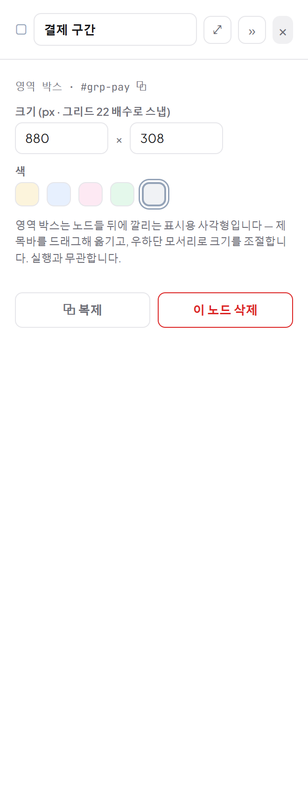

## ▶ 이 노드만 실행 (단일 노드 실행)

http/set/if/switch/assert/transform/tcp 노드는 그래프 전체를 돌리지 않고 **한 노드만 즉석 실행**해 볼 수 있습니다.
결과(응답/출력)가 패널 안에 바로 표시됩니다. 실행 이력에는 남지 않으며, 상위 노드 출력 바인딩은 비어(null) 있습니다
(환경 변수 `{{ 키@env }}` 와 시크릿 `{{ 이름@secret }}` 은 주입됩니다).

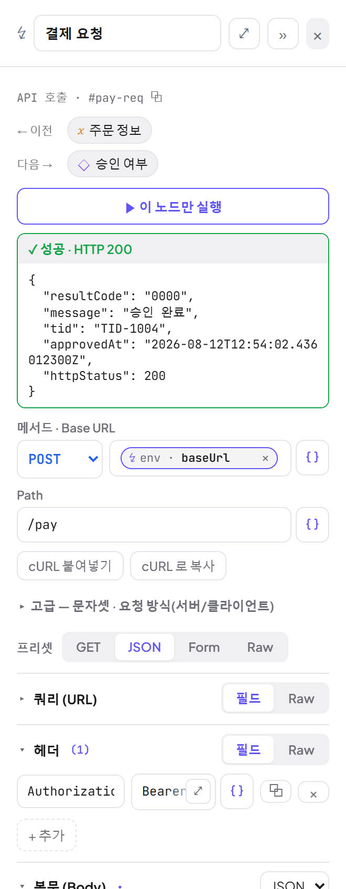

---

다음: [04. 토큰 바인딩](04-토큰-바인딩.md)
