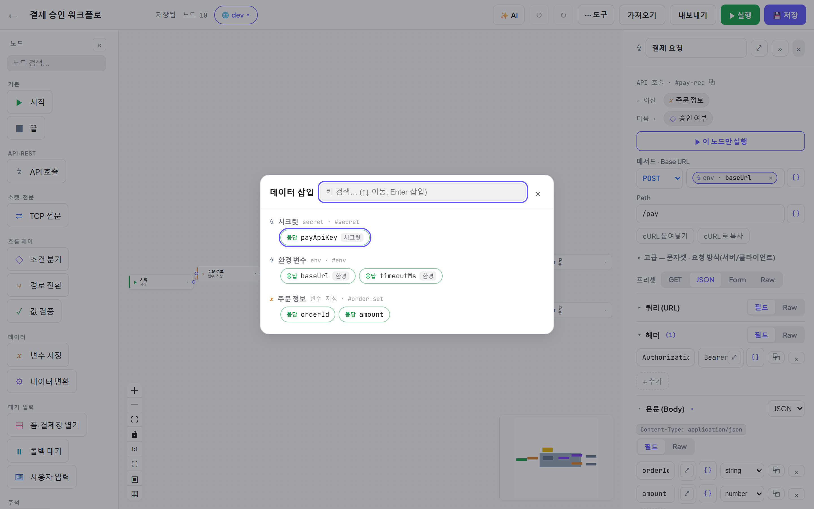

# 04. 토큰 바인딩 — 노드 사이에 값 넘기기

[← 목차](README.md)

앞 노드의 출력·환경 변수·시크릿을 입력창 어디서나 `{{ }}` 토큰으로 꽂아 씁니다.

## 문법

| 문법 | 의미 | 예 |
|---|---|---|
| `{{ 키 }}` | **가장 가까운 상위 노드**의 그 키 (nearest upstream) | `{{ resultCode }}` |
| `{{ 키@노드ID }}` | **명시한 노드**의 그 키 | `{{ tid@pay-req }}` |
| `{{ 키@req:노드ID }}` | 그 노드의 **요청값** 스코프 (보냈던 값) | `{{ amount@req:pay-req }}` |
| `{{ 키@env }}` | **활성 환경**의 변수 ([06장](06-환경-시크릿-입력.md)) | `{{ baseUrl@env }}` |
| `{{ 키@input }}` | **실행 입력** 파라미터 ([06장](06-환경-시크릿-입력.md)) | `{{ orderId@input }}` |
| `{{ 이름@secret }}` | **시크릿 볼트** 값 — 로그에선 마스킹 | `{{ payApiKey@secret }}` |
| `{{ httpStatus@노드ID }}` | HTTP 노드의 상태코드 | `{{ httpStatus@조회 }} == 200` |

- 노드ID 는 속성 패널 상단의 `#아이디` 입니다(⧉ 복사 버튼).
- URL 은 **한 필드에 통째로** 조합해도 됩니다: `https://api.example.com/{{ orderId@조회 }}/detail`
- 값이 **정확히 토큰 하나**면 숫자/불리언/객체 **원형이 보존**됩니다(문자열로 안 바뀜).

## 데이터 삽입 피커 — 직접 안 쳐도 됩니다

입력창 옆 **`{ }` 버튼**을 누르면 지금 위치에서 참조 가능한 값이 모두 나옵니다:

- **시크릿** / **환경 변수** / **상위 노드들의 출력**(선언된 예상 응답 필드·변수 등) 이 그룹별로 표시됩니다.
- 검색(↑↓ 이동, Enter 삽입)으로 빠르게 고릅니다.
- 고르면 입력창에 **칩(알약)** 으로 삽입됩니다 — 내부적으로는 `{{ 키@노드 }}` 토큰과 동일합니다.

### 칩 다루기

- 칩의 × 로 제거, 텍스트와 섞어 쓸 수 있습니다 (`Bearer {{ payApiKey@secret }}` 처럼).
- **`Alt+클릭`** 하면 그 값의 **소스 노드로 점프**합니다.
- 조건식/Raw 텍스트 안에서는 칩 대신 토큰 문자열을 직접 써도 됩니다 — 문법은 동일합니다.

## 어떤 키를 바인딩할 수 있나요?

| 소스 노드 | 제공되는 키 |
|---|---|
| HTTP (키형 응답: json/xml/urlencoded/query) | **예상 응답 필드**로 선언한 키 + `httpStatus` (+ 선언 안 해도 실제 응답에 있으면 `{{ 키@노드 }}` 수동 참조 가능) |
| HTTP (통짜형: text/binary) | `body` + `httpStatus` |
| SET | 정의한 변수 키 |
| TRANSFORM | `result` |
| TCP | 응답 필드 이름들 |
| INPUT | 입력 필드 키들 |
| WAIT | 콜백 본문/파라미터 키들 (선언은 피커 노출용 — 실제 수신 키는 전부 사용 가능) + 고정 키 `url`(수신 URL — wait 앞 노드를 포함해 그래프 어느 노드에서나 바인딩 가능) · `body`(콜백 원문) |

> ⚠ **바인딩이 비어 나오면**: 상위 노드의 응답 타입(키형/통짜형)과 키 선언을 확인하세요.
> 통짜형은 본문 키 없이 `{{ body@노드 }}` 와 `{{ httpStatus@노드 }}` 만 제공됩니다. [13. FAQ](13-FAQ-문제해결.md) 참고.

---

다음: [05. 실행과 디버깅](05-실행-디버깅.md)
