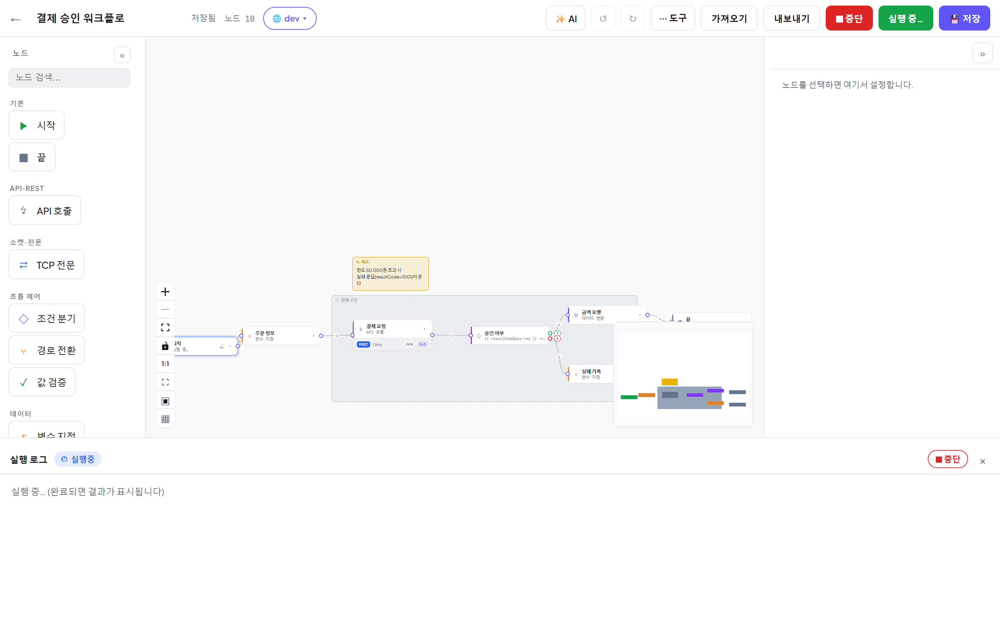
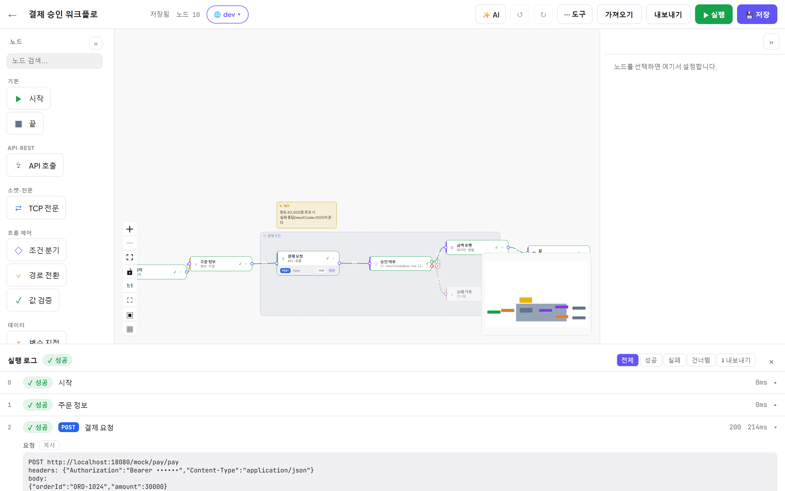
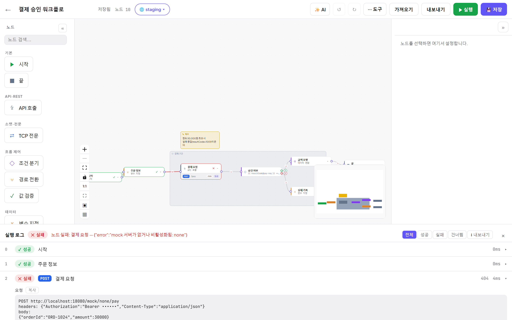

# 05. 실행과 디버깅

[← 목차](README.md)

## 실행하기

| 방법 | 설명 |
|---|---|
| 탑바 **▶ 실행** | 활성 환경 변수와 함께 즉시 실행 |
| 도구 ⋯ → **▶ 입력값과 실행** | 키/값 입력을 붙여 실행 — `{{ 키@input }}` 로 참조 ([06장](06-환경-시크릿-입력.md)) |
| 도구 ⋯ → **▶ 재실행** | 같은 조건으로 한 번 더 |
| **⏹ 중단** | 실행이 **대기 지점**(사용자 입력·폼·클라이언트 호출·콜백 대기)에 있으면 즉시 취소(CANCELLED)됩니다. 노드가 서버에서 실행 중인 순간에 누르면 화면 추적만 멈추고 백엔드 실행은 이어져, 이력에는 실제 결과(성공/실패)로 남습니다. |

실행은 반드시 **시작(START) 노드에서** 출발해 엣지를 따라 흐릅니다. 연결 안 된 노드는 **건너뜀(SKIPPED)** 처리됩니다.

## 진행 애니메이션

실행 중에는 현재 노드에 스피너가 돌고 탑바가 `실행 중…`/⏹ 중단으로 바뀝니다.

완료 후 캔버스: **지나간 엣지 = 초록**, 실패 = 빨강, 건너뜀 = 반투명 + `건너뜀` 라벨, 노드엔 ✓/✕ 배지.

## 실행 로그 (하단 패널)

- 노드별 행: 순번 · 상태 배지(✓ 성공 / ✕ 실패 / 건너뜀) · 메서드 · HTTP 상태 · 소요 시간.
- **필터**: 전체 / 성공 / 실패 / 건너뜀. **⬇ 내보내기**: 전체 로그 .txt 저장.
- 행을 클릭하면 **요청/응답 전문과 출력**이 펼쳐집니다(복사 버튼 포함):

> 🔒 시크릿(`{{ @secret }}`)이 들어간 값은 로그에서 `••••••` 로 **마스킹**됩니다.

## 실패 디버깅

실패하면 로그 헤더에 원인이 요약되고 **첫 실패 노드가 자동으로 펼쳐집니다**. 캔버스에서도 해당 노드가 빨갛게 표시됩니다.

체크 순서:
1. 로그 헤더의 요약(예: `노드 실패: 결제 요청 — {"error": ...}`)
2. 펼쳐진 요청 전문 — **실제로 보낸 URL/헤더/본문**이 의도와 같은지 (환경 변수가 잘못 꽂힌 경우가 흔합니다)
3. 응답 전문 — 상대가 뭐라고 답했는지
4. 그래도 애매하면 노드의 **▶ 이 노드만 실행** 으로 격리 테스트 ([03장](03-노드-레퍼런스.md#-이-노드만-실행-단일-노드-실행))

## 대기 노드가 있는 실행

실행이 다음 노드에 도달하면 잠시 멈추고 사람이/외부 시스템이 개입합니다:

### 사용자 입력 (INPUT)
모달이 뜨고, 확인하면 입력값이 노드 출력이 되어 계속 진행합니다. 취소(Esc)는 실행 중단.

### 폼·결제창 (FORM)
팝업 창 또는 페이지 내 iframe 모달로 대상 페이지가 열립니다. 폼은 자동 제출되며 실행은 **기다리지 않고** 다음 노드로 갑니다.

### 콜백 대기 (WAIT)
로그에 **카운트다운 + 수신 URL** 이 표시되고, 백엔드가 콜백을 받으면 자동 재개됩니다. **탭을 닫아도 서버가 완결합니다.**

- 외부 시스템이 아직 없으면 **🧪 테스트 콜백 → 보내기** 로 샘플 콜백을 쏴 진행시킬 수 있습니다.
- 타임아웃이 지나면 노드 실패로 끝납니다. 수신 URL 은 `복사`/`cURL 예시 복사`로 외부에 전달하세요.

---

다음: [06. 환경·시크릿·실행 입력](06-환경-시크릿-입력.md)
