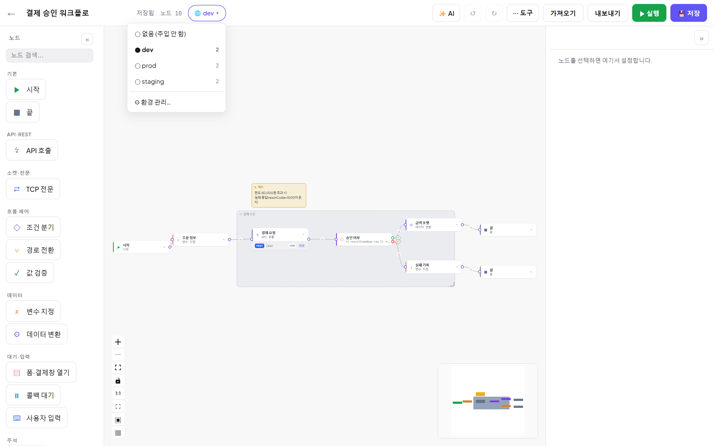
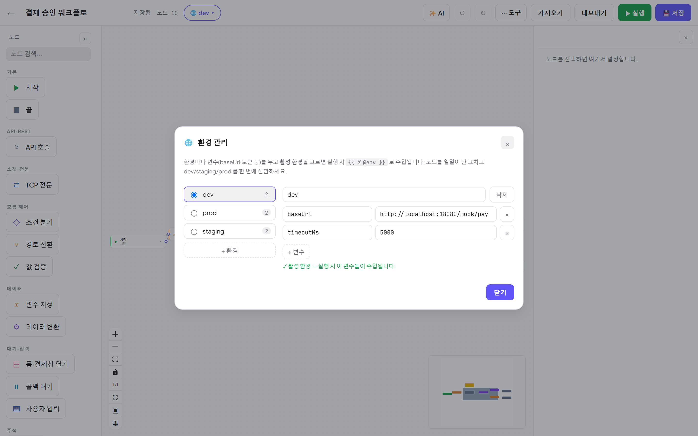
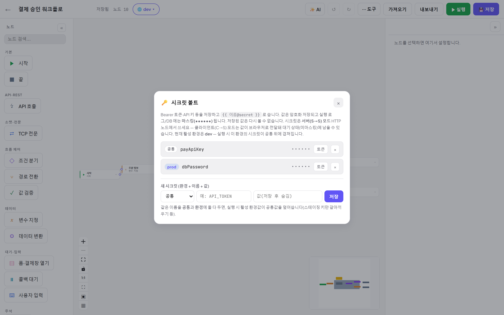
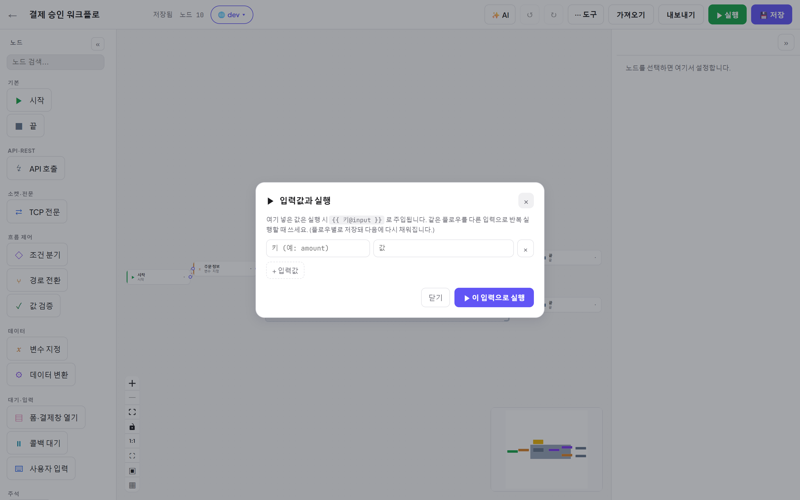

# 06. 환경 · 시크릿 · 실행 입력

[← 목차](README.md)

baseUrl·토큰 같은 값을 노드마다 하드코딩하지 말고 세 가지 저장소로 빼세요.

| 저장소 | 토큰 | 저장 위치 | 용도 |
|---|---|---|---|
| **환경 (Environment)** | `{{ 키@env }}` | 브라우저(개인) | dev/staging/prod 별 주소·설정 |
| **시크릿 볼트** | `{{ 이름@secret }}` | 서버(암호화) | Bearer 토큰·API 키 등 민감값 |
| **실행 입력** | `{{ 키@input }}` | 브라우저(개인, 플로우별) | 실행할 때마다 바꾸는 파라미터 |

## 환경 — dev/staging/prod 전환

에디터 탑바의 **🌐 환경 스위처**로 활성 환경을 고릅니다:

**⚙ 환경 관리…** 에서 환경과 변수를 편집합니다:

1. **+ 환경** 으로 `dev`, `staging`, `prod` 등을 만들고
2. 각 환경에 **+ 변수** (예: `baseUrl = https://dev.api…`)
3. 라디오로 **활성 환경** 선택 → 실행 시 그 환경의 변수가 주입됩니다.

노드에서는 `{{ baseUrl@env }}` 로 참조 — 환경만 바꾸면 전 노드의 대상이 한 번에 바뀝니다.

> ⚠ 환경은 **브라우저(개인)에 저장**됩니다 — 팀 공유가 아닙니다. 민감값·팀 공유 값은 시크릿 볼트를 쓰세요.

## 시크릿 볼트

도구 ⋯ → **🔑 시크릿 볼트**.

- **쓰기 전용**: 값은 암호화 저장되고 **다시 볼 수 없습니다**(이름만 목록 표시).
- 사용: `{{ 이름@secret }}` — 예: 헤더에 `Bearer {{ payApiKey@secret }}`.
- 실행 로그/DB 에서 **마스킹(`••••••`)** — URL 인코딩·JSON 이스케이프 변형까지 가려집니다.
- **환경 스코프**: 시크릿마다 `공통` 또는 특정 환경(prod 등)을 지정할 수 있습니다.
  같은 이름이 공통과 환경 양쪽에 있으면 **활성 환경 값이 공통을 덮습니다**(스테이징 키만 갈아끼우기).
- **서버(S→S) 모드 HTTP 노드에서 쓰세요** — 클라이언트(C→S) 모드는 값이 브라우저로 전달되어 남을 수 있습니다.

## 실행 입력 — 같은 워크플로, 다른 입력

도구 ⋯ → **▶ 입력값과 실행**.

- 키/값을 넣고 **이 입력으로 실행** — 노드에서 `{{ 키@input }}` 로 참조합니다.
- 입력값은 **플로우별로 저장**되어 다음에 다시 채워집니다(환경과 마찬가지로 브라우저 개인 저장 — 팀 공유 아님).
  회귀 테스트를 입력만 바꿔 반복할 때 유용합니다.
- 웹훅 트리거로 실행하면 **웹훅 본문(JSON)** 이 같은 방식(`{{ 키@input }}`)으로 주입됩니다 ([07장](07-트리거-자동화.md)).

---

다음: [07. 트리거 자동화](07-트리거-자동화.md)
