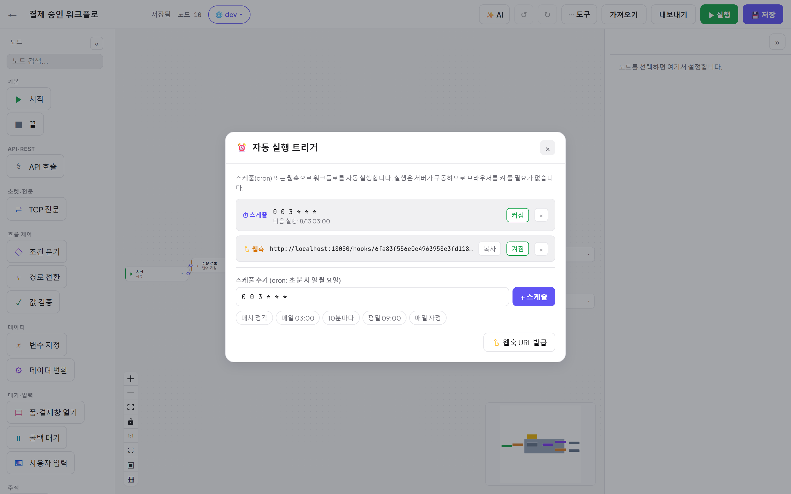
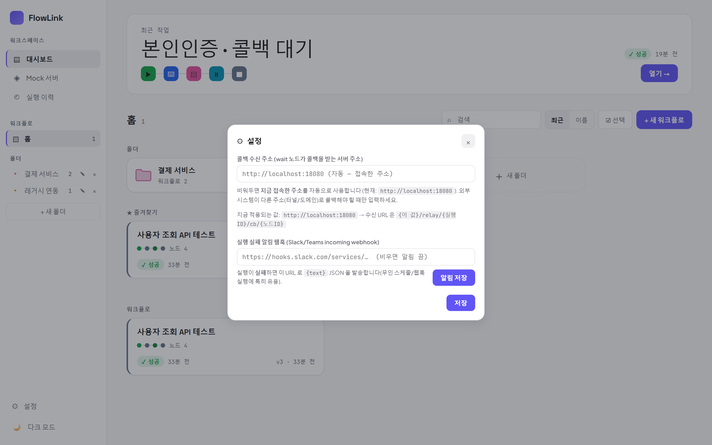

# 07. 트리거 자동화 — 스케줄 · 웹훅 · 알림

[← 목차](README.md)

실행은 **서버가 구동**합니다 — 트리거를 걸어두면 브라우저를 꺼 놔도 돌아갑니다.

## 자동 실행 트리거

도구 ⋯ → **⏰ 자동 실행 트리거**.

### 스케줄 (cron)

- 형식: **6필드** `초 분 시 일 월 요일` — 예: `0 0 3 * * *` = 매일 03:00.
- 프리셋 버튼: 매시 정각 · 매일 03:00 · 10분마다 · 평일 09:00 · 매일 자정.
- 등록하면 **다음 실행 시각**이 표시됩니다. 트리거별 **켜짐/꺼짐** 토글, × 삭제.

### 웹훅

- **웹훅 URL 발급** → `{서버}/hooks/{토큰}` 이 생성됩니다. **복사**해서 외부 시스템에 등록하세요.
- 외부 시스템이 그 URL 로 `POST` 하면 실행됩니다. **본문(JSON)은 실행 입력으로 주입** — 노드에서 `{{ 키@input }}` 로 참조.

> ⚠ 스케줄/웹훅 실행은 브라우저 접속이 없는 실행입니다. 워크플로에 **콜백 대기** 노드가 있다면
> ⚙ 설정의 **콜백 수신 주소**가 외부에서 도달 가능한 값으로 잡혀 있어야 합니다(아래).
> 사용자 입력(INPUT)·폼(FORM) 노드처럼 **브라우저가 필요한 노드**는 무인 실행과 어울리지 않습니다.

## ⚙ 설정 — 콜백 수신 주소 · 실패 알림

사이드바 하단 **설정**.

### 콜백 수신 주소
콜백 대기(WAIT) 노드가 콜백을 받는 서버 주소입니다.
- 비워두면 **지금 접속한 주소를 자동 사용**합니다(예: `http://localhost:18080`).
- 외부 게이트웨이가 콜백해야 하면 **터널/도메인 주소를 입력**하세요.
  수신 URL 형식: `{이 값}/relay/{실행ID}/cb/{노드ID}`.

### 실행 실패 알림 웹훅
Slack/Teams **incoming webhook URL** 을 넣으면 실행이 **실패할 때** `{text}` JSON 이 발송됩니다.
무인 스케줄/웹훅 실행의 실패를 놓치지 않는 용도. 비우면 알림 끔.

---

다음: [08. 실행 이력과 스위트](08-실행이력-스위트.md)
