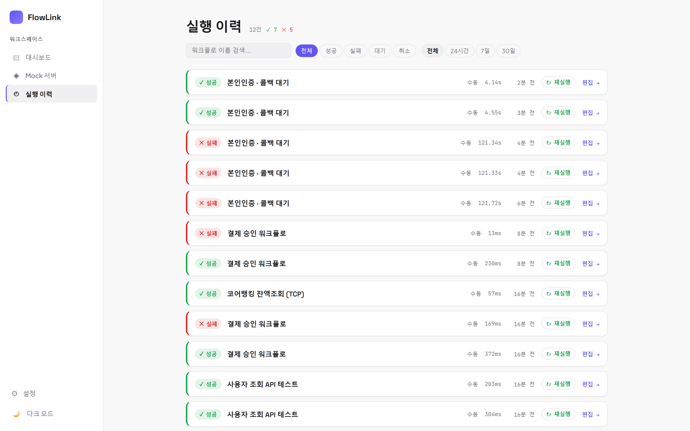
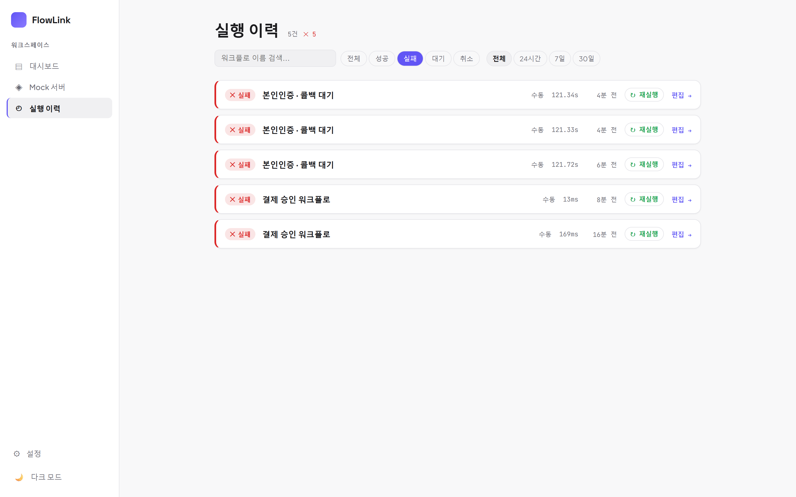
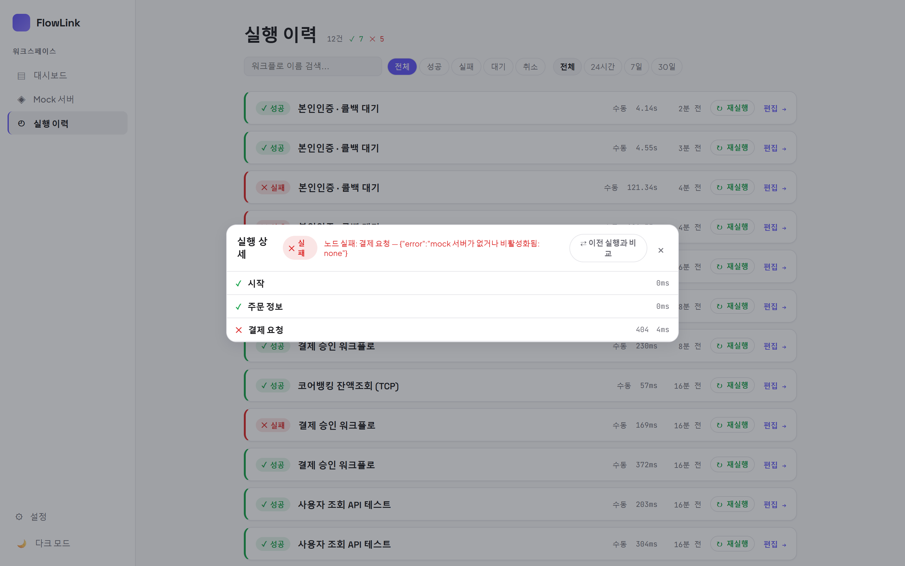
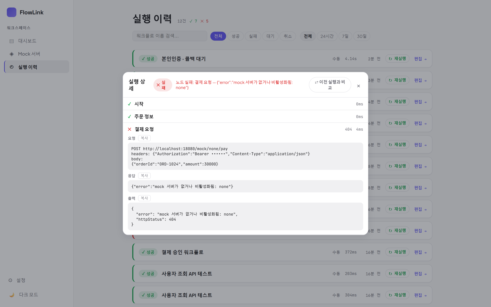
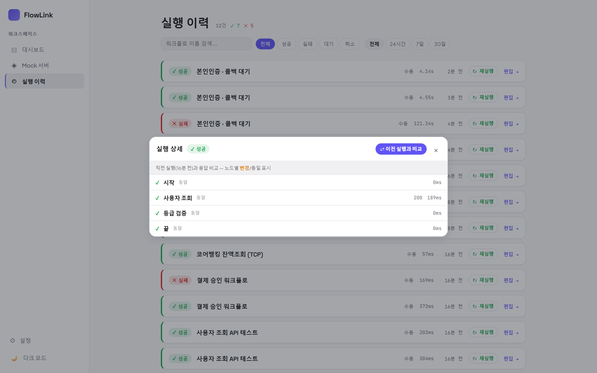
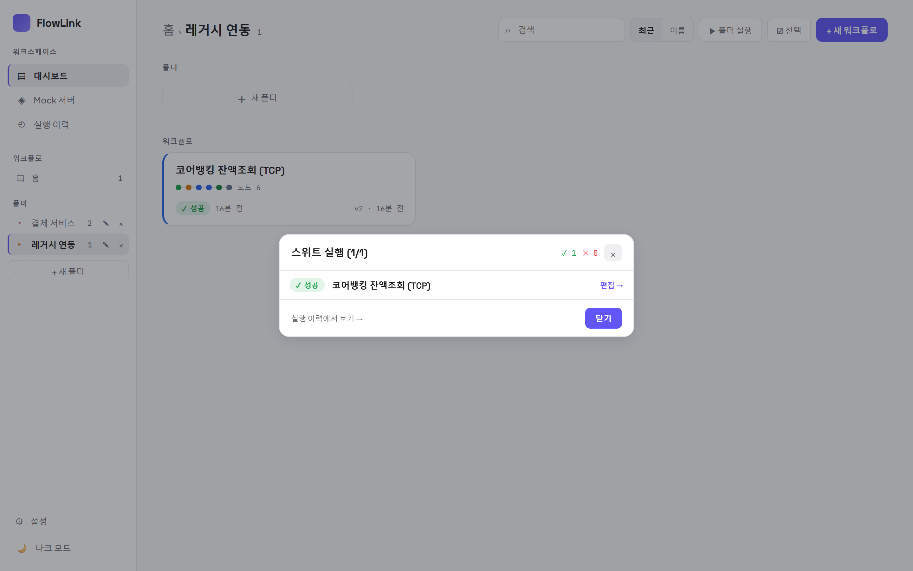

# 08. 실행 이력 · 재실행 · 스위트

[← 목차](README.md)

## 실행 이력 화면

사이드바 → **실행 이력**. 모든 워크플로의 실행 기록이 최신순으로 쌓입니다(상단에 총 건수와 ✓/✕ 카운트).

- **필터**: 상태(전체/성공/실패/대기/취소) + 기간(전체/24시간/7일/30일) + 워크플로 이름 검색.
- 행 정보: 상태 배지 · 워크플로 이름 · 트리거(수동/예약/웹훅) · 소요 시간 · 언제.
- **↻ 재실행**: 그 실행과 같은 버전·입력으로 다시 실행. **편집 →**: 해당 워크플로 에디터로 이동.

## 실행 상세 — 노드별 재열람

행을 클릭하면 에디터를 열지 않고도 노드별 상태/요청/응답을 다시 볼 수 있습니다.

- 실패 실행은 헤더에 원인 요약이 표시됩니다.
- 노드 행을 클릭하면 요청/응답 전문이 펼쳐집니다:

## ⇄ 이전 실행과 비교 — 회귀 확인

상세에서 **⇄ 이전 실행과 비교**를 켜면 같은 워크플로의 **직전 실행**과 노드별 응답을 비교해
**변경 / 동일 / 신규** 로 표시합니다. 배포 전후 응답이 달라졌는지 확인할 때 좋습니다.

## 스위트 — 여러 워크플로 일괄 실행

대시보드에서:
- 폴더 안에서 **▶ 폴더 실행** — 폴더의 모든 워크플로 실행.
- 또는 **선택 모드**에서 체크 후 **▶ 선택 실행 (N)**.

진행/결과 매트릭스가 떠서 성공/실패를 한눈에 봅니다. **실행 이력에서 보기 →** 로 상세로 이동합니다.

> 💡 회귀 테스트 묶음을 폴더로 관리하면 "폴더 실행 → 매트릭스 확인" 이 그대로 스모크 테스트가 됩니다.
> 검증은 각 워크플로 안의 **값 검증(ASSERT)** 노드가 담당합니다 ([03장](03-노드-레퍼런스.md#값-검증-assert)).

---

다음: [09. 버전 관리와 협업](09-버전-협업.md)
