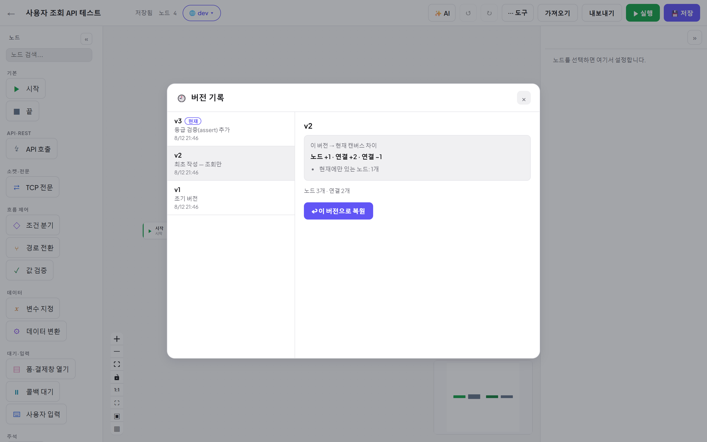

# 09. 버전 관리와 협업

[← 목차](README.md)

## 버전 기록

**저장할 때마다 버전 스냅샷**이 자동으로 쌓입니다. 도구 ⋯ → **🕘 버전 기록**.

- 왼쪽 목록: v1, v2, … + 저장 메모 + 시각. **현재** 배지가 지금 캔버스 기준 버전입니다.
- 버전을 클릭하면 **현재 캔버스와의 차이**가 요약됩니다: `노드 +1 · 연결 +2 · 연결 −1`, 현재에만/그 버전에만 있는 노드.
- **↩ 이 버전으로 복원**: 그 버전 내용으로 캔버스를 되돌립니다.
  이력은 **불변**이라 복원도 새 버전으로 쌓입니다 — 언제든 다시 앞으로 갈 수 있습니다.

> 💡 저장(Ctrl+S) 시점이 곧 버전이므로, 의미 있는 변경 후에 저장하는 습관이 이력을 읽기 좋게 만듭니다.

## 실시간 협업

같은 워크플로를 여러 명이 열면:

- 탑바에 **동시 접속자 아바타**가 표시되고,
- 상대의 **커서와 이름표**, **편집 중 배지**가 캔버스에 보이며,
- 편집 내용이 실시간 반영되고, 누가 저장하면 **저장 알림**이 뜹니다.

이름표는 로그인 사용자는 계정 이름으로, 게스트/dev 모드는 브라우저별 닉네임으로 표시됩니다.

### 동시 편집 충돌

동기화는 last-write-wins(마지막 저장 승리) 방식입니다 — 정확히 같은 부분을 동시에 고치면 마지막 저장이 남습니다.
서로 다른 시점의 버전 위에 저장하려 하면 **충돌 안내(409)** 가 떠서 새로고침/덮어쓰기를 선택할 수 있습니다.
자주 부딪히면 워크플로를 나누거나 역할을 나눠 편집하세요. 잃어버린 내용은 **버전 기록**에서 복원할 수 있습니다.

---

다음: [10. Mock 서버](10-Mock-서버.md)
