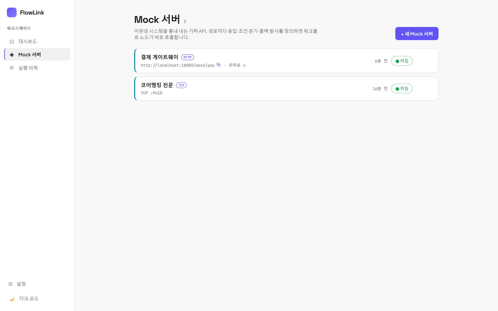
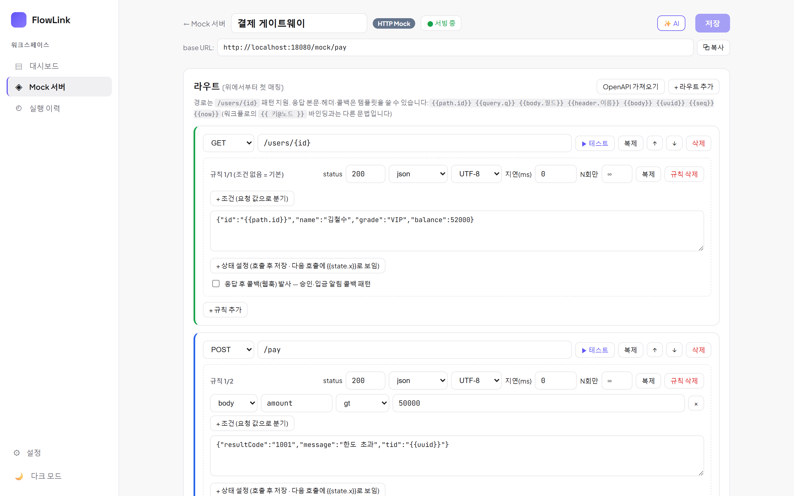
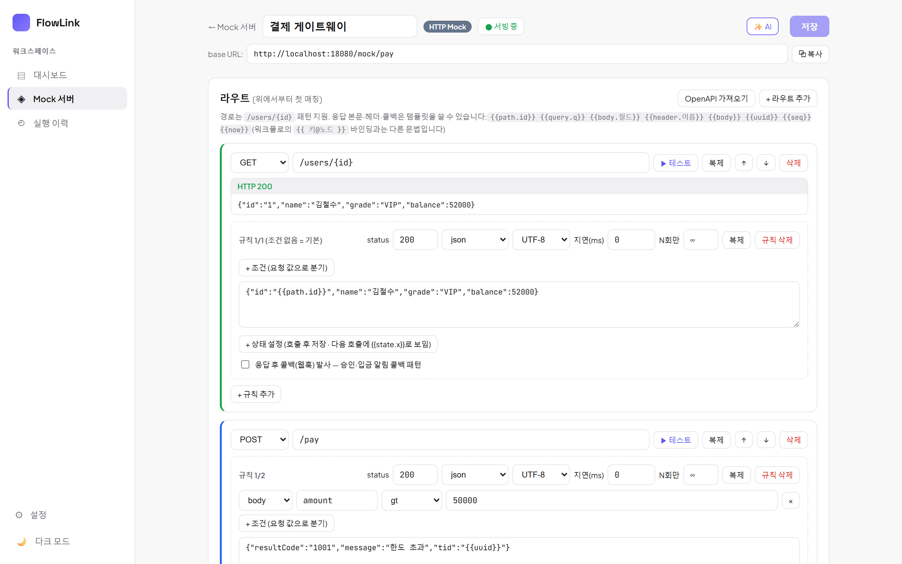
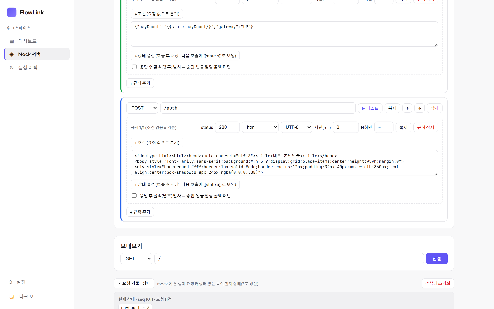
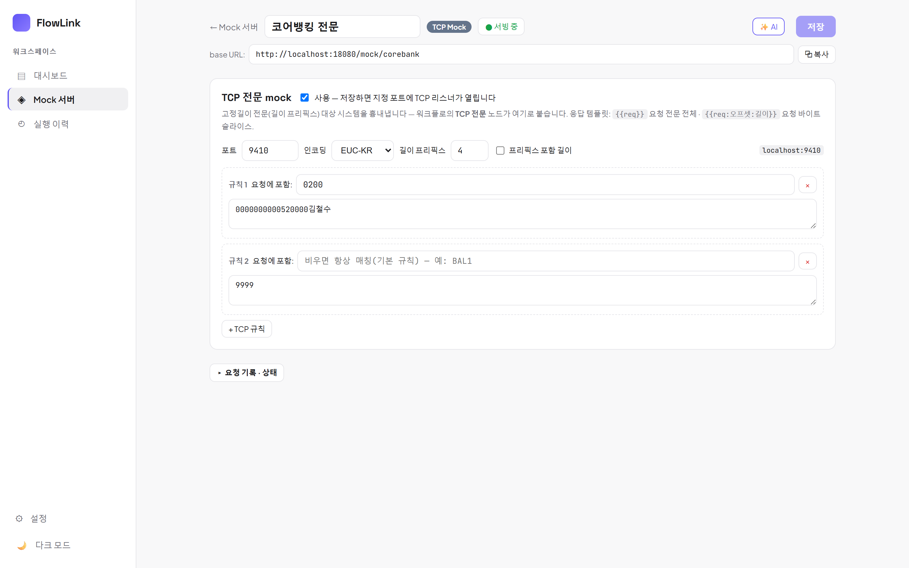

# 10. Mock 서버 — 가짜 대상 시스템 세우기

[← 목차](README.md)

붙을 상대 시스템이 미완성이거나 외부라 못 부를 때, **내장 Mock 서버**로 흉내 내고 워크플로를 먼저 완성합니다.
저장 즉시 `http://{서버}/mock/{slug}/…` 로 서빙됩니다.

## 목록·생성

사이드바 → **Mock 서버** → **+ 새 Mock 서버** (이름 + slug + 유형 HTTP/TCP).

카드에서 **켜짐/꺼짐** 토글 — 끄면 서빙이 중단되어, 그 mock 을 호출하면 404("mock 서버가 없거나 비활성화됨") JSON 에러가 옵니다.

## HTTP Mock 에디터

- 상단: 이름, **base URL**(복사 버튼) — 워크플로 HTTP 노드의 Base URL 에 이 값을 넣으면 됩니다.
- **라우트**: `메서드 + 경로` 별 정의. 경로는 `/users/{id}` 패턴을 지원합니다. **위에서부터 첫 매칭**.
- 라우트마다 **규칙(rule)** 여러 개 — 위에서부터 조건이 맞는 첫 규칙이 응답합니다(조건 없음 = 기본).

### 규칙 설정

| 항목 | 설명 |
|---|---|
| status / 타입 / charset | `200`, json/text/html/xml/urlencoded, UTF-8·EUC-KR·MS949 |
| **지연(ms)** | 응답 지연 시뮬레이션 |
| **N회만** | 이 규칙을 처음 N회 매칭까지만(이후 다음 규칙으로) — 1차 pending → 2차 approved 시나리오 |
| **+ 조건 (요청 값으로 분기)** | `source(body/query/header/path/state) + 키 + 연산자(eq/ne/gt/contains/regex …) + 값`, AND 결합 |
| **응답 본문 템플릿** | `{{path.id}} {{query.q}} {{body.필드}} {{header.이름}} {{state.키}} {{uuid}} {{seq}} {{now}}` — 워크플로의 `{{ 키@노드 }}` 바인딩과는 **다른 문법**입니다 |
| **+ 상태 설정 (setState)** | 호출 후 서버 상태 저장(대입/증가/감소) → 다음 호출의 조건(`source=state`)/템플릿(`{{state.키}}`)에서 사용 — **상태 있는 목** |
| **응답 후 콜백(웹훅) 발사** | 응답 후 지정 URL 로 웹훅 발사 — 승인/입금 노티 패턴. 워크플로의 **콜백 대기** 노드 수신 URL 과 조합 |

### 원클릭 테스트

라우트 옆 **▶ 테스트** — 경로 파라미터는 예시값으로 채워 실제 호출하고 응답을 바로 보여줍니다.
(미저장 편집이 있으면 먼저 저장됩니다.)

### 보내보기 · 요청 기록 · 상태

에디터 하단에서:
- **보내보기**: 임의 메서드/경로로 즉석 요청 전송.
- **요청 기록 · 상태**: mock 에 온 **실제 요청 로그**(3초 갱신)와 상태 있는 목의 **현재 상태**(state·seq·요청 수)를 확인.
  **↺ 상태 초기화**로 state/seq/기록을 리셋합니다.

### OpenAPI 가져오기

**OpenAPI 가져오기** 버튼으로 스펙에서 라우트를 자동 생성할 수 있습니다.

## TCP 전문 Mock

TCP 유형 mock 은 지정 포트에 **고정길이 전문(길이 프리픽스) 리스너**를 엽니다 — 가짜 코어뱅킹.

- 포트 / 인코딩(기본 EUC-KR) / 길이 프리픽스(포함 여부).
- 규칙: **요청 전문에 포함된 문자열**로 매칭(비면 기본 규칙) → 응답 전문 반환.
- 응답 템플릿: `{{req}}` 요청 전문 전체, `{{req:오프셋:길이}}` 요청 바이트 슬라이스.
- 워크플로의 **TCP 전문 노드**([03장](03-노드-레퍼런스.md#tcp-전문))의 대상을 `127.0.0.1:{포트}` 로 잡으면 끝.

> ⚠ mock 의 상태·seq 는 인메모리라 서버 재시작 시 리셋됩니다. setState 는 회차/플래그 수준 시나리오용입니다.

## Mock 도 AI 로

Mock 에디터의 **✨ AI** 버튼 — 자연어로 라우트/규칙을 만들어 달라고 할 수 있습니다 ([12장](12-AI-어시스턴트.md)).

---

다음: [11. 가져오기 / 내보내기](11-가져오기-내보내기.md)
