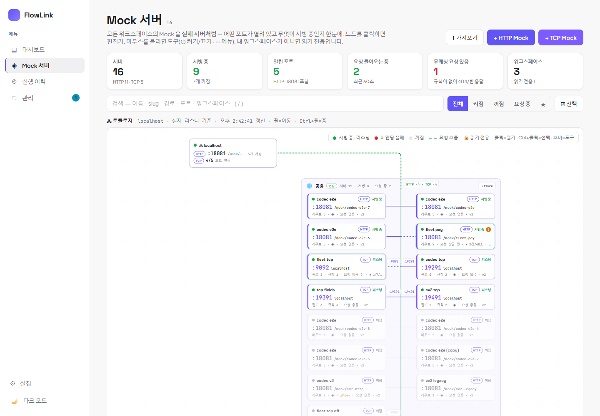
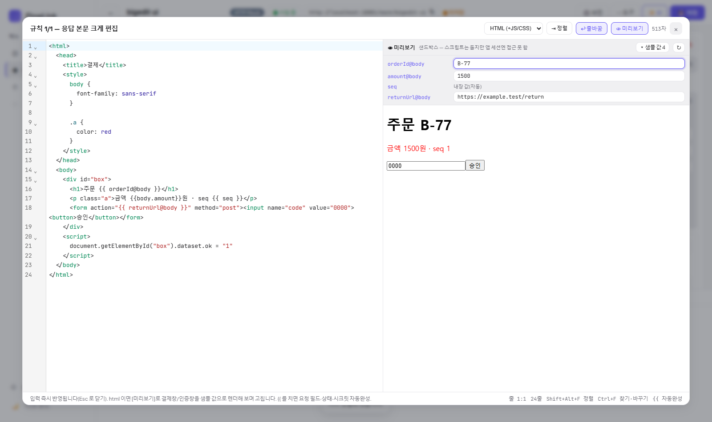

# 10. Mock 서버 — 가짜 대상 시스템 세우기

[← 목차](README.md)

붙을 상대 시스템이 미완성이거나 외부라 못 부를 때, **내장 Mock 서버**로 흉내 내고 워크플로를 먼저 완성합니다.
**HTTP Mock** 은 저장 즉시 `http://{서버}/mock/{slug}/…` 로 서빙되고, **TCP Mock** 은 지정 포트에 고정길이 전문 리스너를 엽니다.
둘은 **따로 관리**합니다 — 목록의 탭도, 편집기도 섞이지 않습니다.

## 서버 현황 — Mock 화면은 토폴로지 하나

사이드바 → **Mock 서버**. 목록/카드 없이 **모든 워크스페이스의 Mock 을 실제 서버처럼** 캔버스에 보여 주는 화면 하나입니다(5초마다 갱신).

- **상단**: 이름·개수, **⬇ 가져오기**(내보낸 JSON 붙여넣기), **+ HTTP Mock / + TCP Mock** — 만들기 행에 **대상 워크스페이스** 선택(마지막 선택을 기억), slug 실시간 검사(`✓ 사용 가능 / ✕ 사용 중`). 만들면 편집기로 이동합니다.
- **현황 스트립**(클릭=필터): 서버(HTTP/TCP 수) · 서빙 중 · 열린 포트(바인딩 실패가 있으면 빨갛게) · 요청 들어오는 중(최근 60초) · 무매칭 요청 있음 · 워크스페이스(읽기 전용 수).
- **툴바**: 검색(`/` 또는 Ctrl+F — 이름·slug·경로·포트·워크스페이스), 필터(전체/켜짐/꺼짐/요청 중/★ 즐겨찾기), **☑ 선택**(일괄 켜기·끄기·워크스페이스 이동·삭제 — "모두 선택"은 검색에 걸린 것 중 편집 가능한 것만, Ctrl+클릭으로도 선택). 검색/필터에 안 맞는 노드는 흐려지고 `N/M 일치`가 표시됩니다.
- **🖧 토폴로지**: 왼쪽 **허브**(호스트 · `HTTP :앱포트 /mock/…` 서빙 수 · TCP 포트 열림 수) → 워크스페이스 **존**(내 소속 먼저, 남의 것은 점선 + 🔒, 헤더에 롤(소유/편집/읽기 전용/접근 없음/관리자)·서버/서빙 수·**+ Mock**) 마다 가운데 세로 **스파인**으로 업링크(`HTTP ×N · TCP ×M`) → 서버 노드로 가로 탭(TCP 는 선에 `:포트` 라벨). 선은 스파인과 거터만 타서 서버를 가로지르지 않습니다.
  - **서버 노드**: 상태 LED(초록=서빙 중/리스닝 · 빨강=바인딩 실패 · 회색=꺼짐) · 이름 · `HTTP`/`TCP` · **포트가 제일 크게**(TCP `:9091`, HTTP `:앱포트` + `/mock/slug`) · 라우트/규칙 수 · 마지막 요청 · `↗N`(이 Mock 을 쓰는 워크플로 수) · `vN`. `?`=무매칭 요청 있음, `!`=바인딩 실패, 🔒=읽기 전용. 요청이 들어오면 **LED 펄스 + 글로우 + 선이 흐르고**, 꺼지면 점선·흐림.
  - **호버**: 상세 카드(주소·라우트 목록·마지막 요청·사용 워크플로) + 도구 **⏻**(켜기/끄기) **⋯**(★ 즐겨찾기 · base URL 복사 · 켜기/끄기 · 이름 바꾸기 · 복제 · 내보내기 · ↗ 워크플로 목록(클릭하면 그 워크플로로) · 워크스페이스로 이동 · 삭제 · 선택). **클릭=편집기**(접근 권한 없는 서버는 열리지 않음), Ctrl/Shift+클릭=선택.
  - 휠=이동, Ctrl+휠=줌, 우하단 미니맵, 좌하단 ⛶ 맞춤. 노드 위치는 자동 배치(드래그 저장 없음).
- **🔌 포트 맵**: *지금 실제로 열려 있는 소켓* 기준 칩 — `:앱포트 HTTP 게이트웨이 · N개 서빙` + TCP Mock 마다 `:포트`(● 리스닝 / ○ 꺼짐 점선 / ✕ 바인딩 실패 — 켜져 있는데 포트를 못 연 경우, 예: 재기동 때 다른 프로세스가 선점). 칩 클릭=편집기.
- **읽기 전용**: 내 워크스페이스가 아니면(VIEWER 포함) ⏻·편집 메뉴가 없고 🔒 — 열람만. **접근 권한이 없는 워크스페이스**의 서버는 이름·종류·켜짐·포트·살아있음만 보이고(서빙 주소와 TCP 포트는 전역 자원이라 누가 어떤 포트를 쓰는지는 알 수 있어야 하므로) 라우트·환경 같은 정의는 비공개이며 열리지도 않습니다. 관리자는 편집할 수 있지만 소속이 아닌 팀은 "관리자" 배지로 남의 존에 나옵니다.

끄면 서빙이 중단되어, 그 mock 을 호출하면 404("mock 서버가 없거나 비활성화됨") JSON 에러가 옵니다(TCP 는 리스너가 닫힘).

## HTTP 편집기 — 라우트 = 노드, 상세 = 속성 패널

**좌측 목록 | 우측 상세 | 하단 트래픽** 구조입니다.

- **헤더**: 이름 인라인 편집, 서빙 토글, base URL 복사, **미저장 표시**, `vN · 수정 시각`, **🕘 버전**, **⋯ 도구**(복제·정의 JSON 보기·내보내기/가져오기·상태 초기화·자동 저장·설정·단축키), ✨ AI, 💾 저장(**Ctrl+S**). 저장 안 하고 나가면 확인을 묻습니다.
- **좌측 목록**: 라우트마다 메서드 칩·경로·**요청 히트 수**(◈=라우트 코덱). 클릭해 선택, **드래그로 순서 변경**(위→아래 첫 매칭), 6개↑면 검색. 아래에 **본문·헤더 코덱**(단계 수 배지)·**설정**·**개요**.
- **우측 상세**: 선택한 라우트의 `메서드 + 경로`, ▶ 테스트, **◈ 코덱 요약 한 줄**(이 라우트에 실제 적용되는 코덱 — 서버 코덱 / 이 라우트만 코덱, 요청 전 N단계 · 응답 후 M단계), 예상 요청, 규칙들. 라우트마다 **규칙(rule)** 여러 개 — 위에서부터 조건이 맞는 첫 규칙이 응답합니다(조건 없음 = 기본).
- **하단 트래픽 패널**: 실제 온 요청이 3초마다 갱신되며 **무매칭 요청은 빨간 표시** → [규칙 초안]으로 바로 라우트/규칙을 만듭니다. [선택한 라우트만] 필터, 상태(state) 요약, [보내보기] 탭(선택한 라우트의 경로가 미리 채워짐).
- **설정**: 서빙 주소·**🔑 시크릿 환경**·OpenAPI 에서 라우트 생성·내보내기/가져오기·버전 기록·위험 구역(상태 초기화·삭제).

경로는 `/users/{id}` 패턴을 지원합니다. **위에서부터 첫 매칭**.

> **레거시(HTTP+TCP 혼합) Mock**: 예전 형식으로 한 Mock 에 라우트와 TCP 전문이 함께 있으면 HTTP 편집기 상단에 안내가 뜹니다. **[TCP Mock 으로 분리]** 를 누르면 TCP 부분(포트·레이아웃·규칙·코덱)이 새 TCP Mock(`{slug}-tcp`)으로 옮겨지고 이 Mock 은 HTTP 만 남습니다. 분리 전까지 TCP 리스너는 그대로 동작합니다.

### 버전 기록 · 복원

저장할 때마다 정의(spec) 스냅샷이 쌓입니다(같은 내용 재저장은 제외, mock 당 최근 50개 유지). **🕘 버전** → 목록에서 골라 **현재 편집 중 정의와의 차이**(라우트 추가/삭제/변경·TCP·코덱·시크릿 환경)를 보고 **↩ 이 버전으로 복원**(새 버전으로 쌓이고 서빙 즉시 반영). **📌 보존**은 자동 정리에서 영구 제외 — 커밋 바에 메시지를 적어 저장하면 보존 버전이 됩니다.

### 규칙 설정

| 항목 | 설명 |
|---|---|
| status / 타입 / charset | `200`, json/text/html/xml/urlencoded, UTF-8·EUC-KR·MS949 |
| **지연(ms)** | 응답 지연 시뮬레이션 |
| **N회만** | 이 규칙을 처음 N회 매칭까지만(이후 다음 규칙으로) — 1차 pending → 2차 approved 시나리오 |
| **+ 조건 (요청 값으로 분기)** | `source(body/query/header/path/state) + 키 + 연산자(eq/ne/gt/contains/regex …) + 값`, AND 결합 |
| **응답 본문 템플릿** | `{{path.id}} {{query.q}} {{body.필드}} {{header.이름}} {{state.키}} {{uuid}} {{seq}} {{now}}` — 워크플로의 `{{ 키@노드 }}` 바인딩과는 **다른 문법**입니다 |
| **응답 필드 ◈** | 본문이 JSON 이면 키가 칩으로 뽑혀 나오고, 칩의 **◈** 로 그 필드에 응답 후 코덱(암호화·인코딩)을 겁니다 |
| **+ 상태 설정 (setState)** | 호출 후 서버 상태 저장(대입/증가/감소) → 다음 호출의 조건(`source=state`)/템플릿(`{{state.키}}`)에서 사용 — **상태 있는 목** |
| **응답 후 콜백(웹훅) 발사** | 응답 후 지정 URL 로 웹훅 발사 — 승인/입금 노티 패턴. 워크플로의 **콜백 대기** 노드 수신 URL 과 조합 |

### 큰 편집기 — 정렬 · 미리보기 · 자동완성

응답 본문(HTML/JSON)·콜백 본문의 **⤢** 를 누르면 거의 전체화면 편집기가 열립니다(대기 노드 콜백 응답·HTTP raw 바디도 같은 편집기).

- **⇥ 정렬**(`Shift+Alt+F`): HTML(안의 CSS/JS 포함)·XML 은 js-beautify, JSON 은 2칸 들여쓰기. `{{ orderId@body }}` 같은 **템플릿 토큰은 보호**되어 깨지지 않고, JSON 의 따옴표 없는 토큰(`"amount": {{ amount@body }}`)도 그대로 둡니다. 문법이 깨져 정렬할 수 없으면 원문을 유지하고 알려 줍니다.
- **👁 미리보기**: HTML 은 옆 pane 의 **샌드박스 iframe** 에 실시간 렌더(스크립트는 돌지만 앱 세션·쿠키엔 접근 못 함), JSON 은 트리. 템플릿 토큰은 **샘플 값**으로 치환 — 라우트의 **예상 요청 예시값**이 자동으로 들어가고(`orderId@body` = 예시값, 경로 파라미터 = `1`, `{{ seq }}`·`{{ uuid }}`·`{{ now }}` 는 내장 값), 값이 없는 토큰은 `«키»` 로 표시됩니다. 미리보기 위 **샘플 값** 칸에서 바꿔 가며 볼 수 있습니다. 결제창·인증창 HTML 을 실제 모양으로 보면서 고치는 용도.
- **`{{` 자동완성**: `{{` 를 치면 예상 요청 필드·경로 파라미터·상태·시크릿(워크플로 편집기에서는 상위 노드 출력) 토큰이 목록으로 뜹니다. HTML 태그 자동 닫기, 찾기/바꾸기(`Ctrl+F`), 줄바꿈 토글, 하단 상태바(줄:열·선택 글자 수·줄 수).
- **키는 편집기 안에서만**: `Tab`/`Shift+Tab` 은 들여쓰기·내어쓰기(포커스가 밖으로 나가지 않음 — 나가려면 `Esc` 뒤 `Tab`), `Ctrl+Z`/`Ctrl+Y` 는 이 편집기의 되돌리기/다시 실행(워크플로 캔버스 undo·노드 삭제·방향키 이동·`Ctrl+K` 빠른 추가는 편집기 안에서 눌러도 동작하지 않음). 텍스트 모드도 같은 편집기라 동일합니다.
- `Esc` 는 자동완성·찾기 패널이 열려 있으면 그것부터 닫고, 아니면 편집기를 닫습니다(내용은 이미 반영돼 있음 — 저장은 상단 💾).

### 원클릭 테스트

라우트 옆 **▶ 테스트** — 경로 파라미터는 예시값으로 채워 실제 호출하고 응답을 바로 보여줍니다.
(미저장 편집이 있으면 먼저 저장됩니다.)

### 보내보기 · 요청 기록 · 상태

에디터 하단에서:
- **보내보기**: 임의 메서드/경로로 즉석 요청 전송.
- **요청 기록 · 상태**: mock 에 온 **실제 요청 로그**(3초 갱신)와 상태 있는 목의 **현재 상태**(state·seq·요청 수)를 확인.
  **↺ 상태 초기화**로 state/seq/기록을 리셋합니다.

### OpenAPI 가져오기

설정 pane 의 **라우트 자동 생성**에 OpenAPI/Swagger JSON 을 붙여넣으면 라우트가 생성됩니다.

## TCP 편집기 — 규칙 = 노드

TCP Mock 은 지정 포트에 **고정길이 전문(길이 프리픽스) 리스너**를 엽니다 — 가짜 코어뱅킹. 편집기는 HTTP 와 같은 좌·우·하단 구조지만 항목이 다릅니다.

- **좌측 목록**: **연결**(`:포트 · 인코딩`) · **요청 레이아웃**(`N필드 · 총 바이트`) · **규칙 목록**(`#1` 조건 요약 · 응답 필드 수/바이트 · 히트 수, 드래그로 순서) · **전문 코덱**(단계 수) · **설정**. "사용" 체크박스는 없습니다 — TCP Mock 은 켜져 있으면 곧 리스너입니다(헤더의 ● 리스너 열림/○ 꺼짐 토글).
- **연결**: 포트 / 인코딩(기본 EUC-KR) / 길이 프리픽스(자리수·포함 여부). 복제본은 포트 충돌을 막으려 리스너를 꺼서 만들어지며 여기 안내에서 [리스너 켜기].
- **요청 레이아웃**: 들어온 전문을 앞에서부터 **바이트 길이**대로 잘라 필드명을 붙입니다(오프셋 자동 표시). 이 이름으로 규칙 조건과 `{{ 필드@req }}` 토큰을 씁니다. 필드마다 **◈** — 그 필드가 암호화/인코딩돼 오면 **요청 전 풀기** 코덱을 겁니다.
- **규칙 상세**: `요청에 포함`(contains) AND **필드 조건**(`전문코드 eq 0200` 등 — eq/ne/contains/startswith/endswith/regex/exists)이 모두 맞는 첫 규칙. 둘 다 비면 기본 규칙.
  **응답 전문 = [필드 | 텍스트]**:
  - **필드**(권장): 항목마다 `이름 · 바이트 길이 · 값 · 패딩 방향/문자 · 인코딩 · ◈` — 백엔드가 **바이트 단위로 조립**(초과 절단·부족 패딩, EUC-KR 한글 2바이트 정확). `+ 문자 필드`(우측 공백)·`+ 숫자 필드`(좌측 0) 프리셋, 값 칸의 `{ }` 로 요청 필드·시크릿 토큰 삽입. 필드의 **◈** 는 **응답 후 감싸기** 코덱(패딩 전에 적용).
  - **텍스트**: 한 줄 템플릿(길이를 직접 맞춰야 함 — 기존 방식).
- 값 템플릿: `{{req.필드명}}`(=`{{ 필드명@req }}`) 요청 필드 · `{{req}}` 전체 · `{{req:오프셋:길이}}` 바이트 슬라이스 · `{{ 이름@secret }}` 시크릿 · `{{seq}}` `{{now}}` `{{uuid}}`.
- **하단 트래픽 패널** = **[전문 기록 | 🔍 전문 미리보기]**.
  - **전문 기록**: 실제로 들어온 전문(디코딩 텍스트, 바이트 수 → 응답 바이트 수, 매칭 규칙/무매칭, 코덱 적용 후). 행의 **[🔍 이 전문으로 미리보기]** 가 그 전문을 샘플로 넘깁니다.
  - **전문 미리보기**: 샘플 요청을 넣으면 저장·소켓 없이 **요청 분해(필드별 값)·매칭 규칙(클릭하면 열림)·응답 hex/텍스트·필드별 @오프셋·N/M바이트·✂절단·패딩** 을 보여줍니다(미저장 편집·코덱 반영). 한글 길이가 맞는지 여기서 확인하세요.
- 워크플로의 **TCP 전문 노드**([03장](03-노드-레퍼런스.md#tcp-전문))의 대상을 `127.0.0.1:{포트}` 로 잡으면 끝(헤더의 `host:port ⧉` 복사). 새 TCP Mock 은 빈 포트를 골라 레이아웃(전문코드4·계좌10)+필드 응답 예시로 시작합니다.

> ⚠ mock 의 상태·seq·전문 기록은 인메모리라 서버 재시작 시 리셋됩니다. setState 는 회차/플래그 수준 시나리오용입니다.

## 템플릿 문법 · 시크릿 · 데이터 삽입 칩

값 칸(응답 본문·헤더·setState·콜백·코덱 입력값)에서 두 문법을 모두 씁니다.

| 칩 문법(피커) | 기존 문법 | 뜻 |
|---|---|---|
| `{{ orderId@body }}` | `{{body.orderId}}` | 요청 본문 필드 — **점 경로** `{{ user.addr.city@body }}`, `{{ items[0].id@body }}` 로 JSON 안쪽도 |
| `{{ q@query }}` `{{ id@path }}` `{{ x-token@header }}` `{{ status@state }}` | `{{query.q}}` … | 쿼리·경로 파라미터·요청 헤더·서버 상태 |
| `{{ 계좌번호@req }}` | `{{req.계좌번호}}` | TCP 요청 레이아웃 필드 |
| **`{{ apiKey@secret }}`** | — | **시크릿 볼트** 값(공통 + Vault + 이 Mock 의 **시크릿 환경** 오버레이). 응답 헤더 `Bearer {{ apiKey@secret }}`, 코덱의 키/IV 등 |
| `{{ body }}` `{{ uuid }}` `{{ seq }}` `{{ now }}` | 동일 | 본문 전체·랜덤·카운터·현재시각(ISO UTC) |
| **`{{ now:yyyyMMddHHmmss }}`** `{{ today }}` `{{ time }}` | — | **현재 일시** — `now:패턴`은 Java DateTimeFormatter 패턴(`yyyy-MM-dd HH:mm:ss`, `a h시` …), `today`=`yyyyMMdd`, `time`=`HHmmss`. 기본 **KST**, 타임존은 `{{ now:yyyyMMdd@UTC }}` `{{ today@UTC }}` 처럼 `@`. 전송일시·거래일자 같은 전문 필드에 그대로 |

- **시크릿 환경**(설정 pane 🔑): 이 Mock 이 `@secret` 을 풀 때 공통 시크릿에 어느 환경(dev/staging/prod)의 시크릿을 덮어쓸지. 서빙은 서버에서 도니 브라우저의 활성 환경과 무관합니다. 환경 변수(`@env`)는 Mock 에 없습니다.
- **데이터 삽입 `{ }`**: 한 줄 값(헤더·상태·콜백 URL·코덱 값)은 칩 입력, 여러 줄(응답 본문·콜백 본문)은 `{ }` 버튼으로 캐럿 위치에 삽입. 피커 소스 = **예상 요청**(경로·쿼리·헤더·본문) / TCP 요청 필드 · 서버 상태 · 시크릿 볼트.
- **예상 요청**(라우트 상세 ▸ 예상 요청): 어떤 요청이 올지 미리 적어 두는 곳 — 피커 소스·조건 키 후보·▶ 테스트 샘플·**◈ 코덱 대상**에 쓰입니다. 직접 적어도 되고, 실제 요청이 오면 **요청 기록 → [예상 필드로]** 가 본문 키·쿼리·헤더(+예시값)를 자동으로 채웁니다.
- 시크릿 값은 **요청 기록**과 로그에서 `••••••` 로 마스킹되지만, 응답 본문에 넣으면 그대로 나갑니다(그게 의도이므로).

## 코덱 — 필드에서 시작하는 요청 전 · 응답 후 플러그인

상대 시스템이 전문을 **암호화·인코딩·서명**해서 주고받는다면, 라우트/규칙은 평문으로 정의하고 **코덱**으로 감싸세요.
변환 플러그인(워크플로 TRANSFORM 노드와 같은 내장 변환 + 업로드 JAR)을 단계로 쌓습니다.

| 시점 | 설명 |
|---|---|
| **⬇ 요청 전 (풀기)** | 요청/전문이 들어오면 **조건 매칭·템플릿 전에** 적용. `{{ x@body }}`·조건은 **디코딩된 값** 기준 |
| **⬆ 응답 후 (감싸기)** | 규칙의 본문/필드를 **다 렌더한 뒤 나가기 전에** 적용(문자셋 인코딩·TCP 패딩 직전). 콜백 본문에는 적용되지 않음 |

**필드 하나에 걸 때 — 필드 옆 ◈ (가장 빠른 길)**
암호화된 필드가 있는 자리에서 바로 겁니다. 코덱 화면까지 안 가도 됩니다.
- HTTP: **예상 요청 본문 필드**의 ◈(요청 전 풀기 / 응답 후 감싸기 선택) · 규칙 **응답 필드 칩**의 ◈(응답 후 감싸기).
- TCP: **요청 레이아웃 필드**의 ◈(요청 전) · 규칙 **응답 필드**의 ◈(응답 후).
- 팝오버에서 **[⬇ 요청 전 풀기 | ⬆ 응답 후 감싸기] → 플러그인(검색) → 값(키·IV 는 `{{ aesKey@secret }}` 칩)** 을 정하면 단계가 만들어지고, 필드 옆에 **`◈ ⬇ AES 복호화`** 같은 배지가 붙습니다(클릭 = 수정 / 이 필드에서 제거). 여러 필드에 같은 단계를 걸면 코덱 화면에서 한 단계로 합쳐 보입니다.
- 단계는 **이 라우트에 실제 적용되는 코덱**에 쌓입니다 — 보통은 서버 코덱, [이 라우트만 코덱]이 켜져 있으면 그 라우트 코덱. 라우트 상세 상단의 **◈ 코덱 요약** 한 줄이 어디에 몇 단계인지 알려 줍니다.

**전체·헤더·여러 필드 — 코덱 화면(본문·헤더 코덱 / 전문 코덱)**
- 단계 카드는 **한 줄 한국어 요약**으로 접혀 있습니다: `응답 후 · user.name, pin 필드 → Base64 인코딩 (key: 🔑 aesKey)`. 펼치면 플러그인·범위·입력 포트·파라미터를 고칩니다. 설정이 빈 단계는 빨간 테두리.
- **+ 단계** 는 위저드: **① 언제**(요청 전 / 응답 후) → **② 무엇을**(본문 전체 / **특정 필드만** — 예상 요청 키·응답 JSON 키·TCP 필드가 체크박스로 / 헤더) → **③ 플러그인**(검색) → **④ 값**(입력 포트·파라미터).
- **헤더** 대상: 요청 전은 그 헤더 값을 변환, 응답 후는 **본문을 입력으로 결과를 그 헤더에 기록**(HMAC 서명 `X-Signature` 패턴).
- **입력 포트**: 플러그인이 입력이 여럿이면(AES 의 평문·키·IV 등) 포트마다 **필드 값/전문** 하나와 **값**(리터럴 또는 칩)을 지정합니다. 파라미터(모드·인코딩·HMAC 키 등)도 칩을 받습니다.
- 같은 범위의 단계는 위에서부터 **체인**(예: 전체 Base64 디코딩 → 필드 AES 복호화). 출력 포트가 여럿이면 어느 것을 쓸지 선택.
- **이 라우트만 코덱**: 라우트 상세의 코덱 요약 줄 체크 — 그 라우트는 서버 코덱 대신 라우트 단계만(통째로 대체). 비워 두면 그 라우트는 코덱 없음.
- **🧪 코덱 시험해보기**(HTTP): 샘플 전문(+헤더)을 넣으면 **저장 없이** 서버가 실제 시크릿으로 단계를 돌려 단계별 입력/출력을 보여줍니다(결과의 시크릿 값은 마스킹). TCP 는 트래픽 패널의 **전문 미리보기**가 코덱까지 반영(디코딩 전문·단계 기록 표시).
- 코덱이 실패하면(플러그인 없음·예외·필드 대상인데 JSON/urlencoded 가 아님) HTTP 는 **500 JSON**, TCP 는 연결 종료 + 서버 로그.
- **요청 기록**에 원문 `body:` 와 나란히 **코덱 적용 후:** 전문이 보이고, [재전송]으로 같은 요청을 다시 보내 코덱 수정 결과를 바로 확인할 수 있습니다.
- 사내 전문 규격(암복호화·MAC 서명 등)은 [플러그인 JAR](../../backend/plugin-sample/README.md)로 만들어 올리면 워크플로 TRANSFORM 노드와 Mock 코덱 양쪽에서 같은 플러그인을 씁니다.

## 요청 기록으로 만들기 (Mock 은 "받는 쪽")

에디터 하단 **요청 기록**의 각 항목에서:
- **예상 필드로** — 그 요청의 본문 키·쿼리·헤더를 라우트의 예상 요청에 반영(예시값 포함).
- **규칙 초안** — 맞는 라우트가 없으면 라우트+기본 규칙을 만들고, 있으면 그 요청 값 `eq` 조건이 달린 규칙을 맨 위에 추가.
- **재전송** — 같은 요청을 다시 보냄(코덱/규칙 수정 뒤 확인).
- TCP 는 **[🔍 이 전문으로 미리보기]** — 들어온 전문을 샘플로 미리보기 탭에 넘겨 규칙 수정 결과를 확인.
규칙 카드의 **▶ 규칙 테스트**는 그 규칙의 `eq` 조건값 + 예상 요청 예시로 요청을 만들어 보내고, **이 규칙이 실제로 매칭됐는지** 함께 보여줍니다. 라우트 상세에는 조건 수·콜백·상태·N회 배지가 붙어 긴 목록을 훑기 쉽습니다.

## 내보내기 / 가져오기 (텍스트 복사·붙여넣기)

Mock 한 개를 JSON 텍스트로 옮깁니다 — 다른 워크스페이스, 다른 서버, 동료에게 붙여넣기.

- **내보내기**: 에디터 ⋯ 도구 **⬆ 내보내기**(또는 목록 카드의 ⬆ 내보내기) → 전체 복사 / 파일 다운로드. 포맷 `{"kind":"flowlink-mock","version":1,"name","slug","type","spec"}` — 라우트·규칙·TCP·코덱 전부 포함.
- **가져오기(새로 만들기)**: 목록 상단 **⬇ 가져오기** → 붙여넣기 → 이름/slug 확인(slug 는 전역 유일이라 실시간 검사, 겹치면 `-2` 자동 제안) → 현재 워크스페이스에 새 Mock 생성(유형은 JSON 의 `type`).
- **가져오기(덮어쓰기)**: 에디터의 **⬇ 가져오기** — 붙여넣은 정의로 **현재 Mock 의 라우트·TCP·코덱을 교체**(이름/slug 유지). 저장 전엔 미저장 편집이라 되돌릴 수 있습니다.
- TCP 리스너는 **꺼진 상태로** 가져옵니다(포트는 서버 전역 자원) — 연결 pane 에서 포트 확인 후 [리스너 켜기]. 워크스페이스 통째 이동은 [16장](16-워크스페이스-권한.md).

## Mock 도 AI 로

HTTP Mock 에디터의 **✨ AI** 버튼 — 자연어로 라우트/규칙을 만들어 달라고 할 수 있습니다 ([12장](12-AI-어시스턴트.md)).

---

다음: [11. 가져오기 / 내보내기](11-가져오기-내보내기.md)
