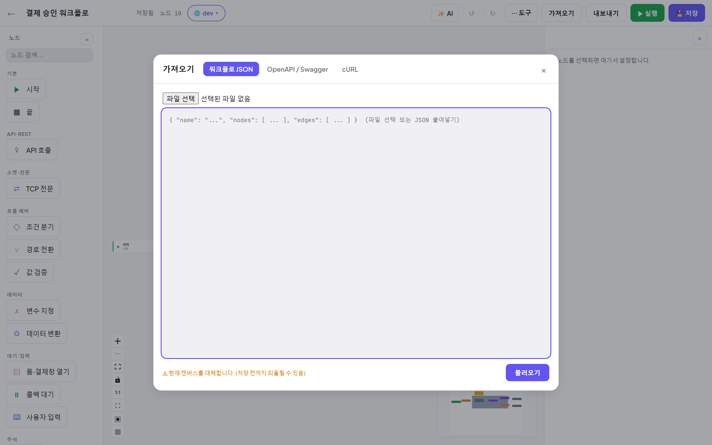
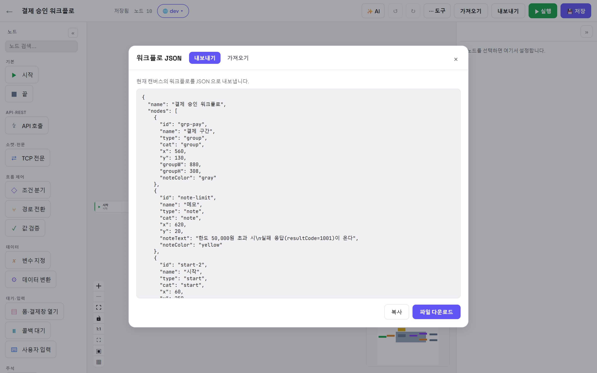

# 11. 가져오기 / 내보내기

[← 목차](README.md)

## 가져오기 — 세 가지 소스

에디터 탑바 **가져오기** 버튼. 탭이 세 개입니다:

### ① 워크플로 JSON
- 파일 선택 또는 JSON 붙여넣기 → **불러오기**.
- **현재 캔버스를 교체**합니다(저장 전까지는 Ctrl+Z / 재로딩으로 되돌릴 수 있음).
- 노드 id 중복·깨진 연결은 가져올 때 검증/정리됩니다.

### ② OpenAPI / Swagger
- 스펙(URL/파일/붙여넣기)에서 **오퍼레이션을 골라** 가져옵니다.
- 캔버스에 바로 흩뿌리지 않고 **왼쪽 팔레트에 그룹**으로 담깁니다 — 필요할 때 드래그/클릭으로 꺼내 쓰는 재사용 템플릿.
- 요청 바디 필드·타입, 응답 키(예상 응답 필드)까지 스펙에서 자동으로 채워집니다.

### ③ cURL
- `curl …` 명령을 붙여넣으면 **HTTP 노드 하나**가 생성됩니다(메서드·URL·헤더·본문 반영).
- 반대로 HTTP 노드 속성 패널의 **cURL 로 복사** / **cURL 붙여넣기**도 있습니다.

## 내보내기

에디터 탑바 **내보내기** — 현재 그래프 JSON 을 **복사** 또는 **파일 다운로드**.

- 다른 인스턴스/동료에게 전달 → 상대는 *가져오기 → 워크플로 JSON* 으로 받으면 됩니다.
- 내보낸 JSON 에는 노드·연결이 담깁니다. **시크릿 볼트** 값(`{{ 이름@secret }}`)은 이름 참조만 내보내져 안전하지만,
  **변수 지정(SET) 노드에서 🔒 로 마스킹한 변수의 리터럴 값은 노드에 저장되어 JSON 에 평문으로 포함**됩니다 —
  공유 전에 그 값을 비우거나 시크릿 볼트 참조로 바꾸세요.

---

다음: [12. AI 어시스턴트](12-AI-어시스턴트.md)
