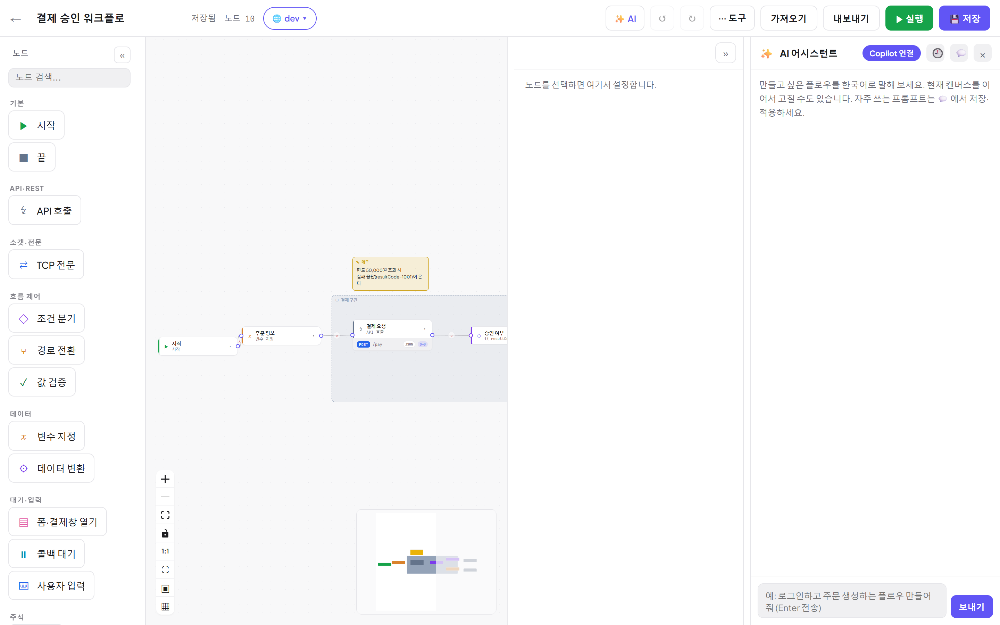

# 12. AI 어시스턴트 — 자연어로 플로우 만들기

[← 목차](README.md)

에디터 탑바 **✨ AI** 를 누르면 오른쪽에 어시스턴트 패널이 열립니다.

## 무엇을 해주나요

- **자연어 → 플로우 생성**: "로그인하고 주문 생성하는 플로우 만들어 줘" 처럼 말하면 노드·연결을 만들어 캔버스에 제안합니다.
- **현재 캔버스 수정**: 열려 있는 워크플로를 이어서 고쳐 달라고 할 수 있습니다.
- **Mock 어시스턴트**: Mock 서버 에디터의 ✨ AI — 자연어로 라우트/규칙(spec)을 생성·수정합니다.

## 연결(모델)

- 우상단 **Copilot 연결** 버튼으로 GitHub Copilot 계정을 디바이스 코드 방식으로 연결합니다
  (연결 후 모델 선택·쿼터 확인 가능).
- 연결하지 않으면 데모(스텁) 응답으로 동작하는 인스턴스도 있습니다 — 관리자 설정에 따릅니다.

## 세션과 프롬프트 라이브러리

- 🕘 아이콘: **대화 세션**이 저장되어 이어서 할 수 있습니다.
- 💬 아이콘: **프롬프트 라이브러리** — 자주 쓰는 프롬프트를 저장해 클릭으로 적용합니다.
  팀 공통 지침은 admin 권한으로 등록하며 모든 대화에 자동 주입됩니다(비admin 은 읽기전용).

> 💡 AI 가 만든 플로우도 결국 일반 노드입니다 — 생성 후 [03. 노드 레퍼런스](03-노드-레퍼런스.md)대로 검토·수정하고
> 실행해 확인하세요.

---

다음: [13. FAQ · 문제 해결](13-FAQ-문제해결.md)
