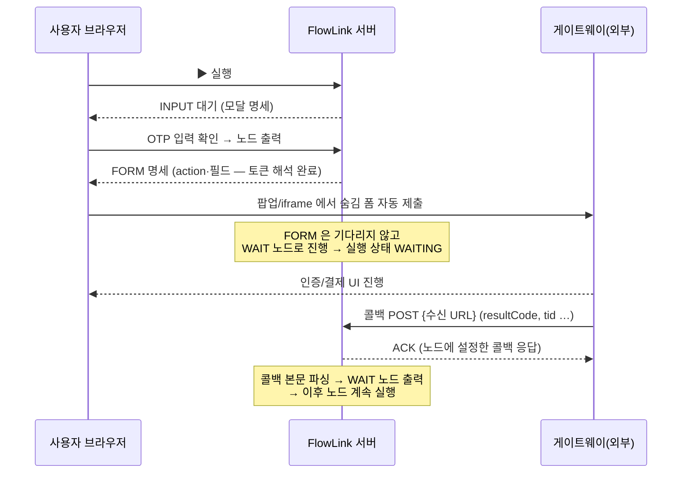
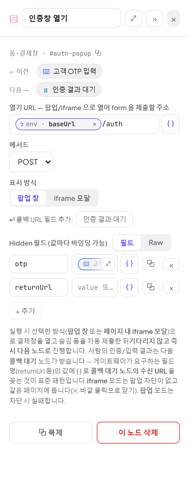
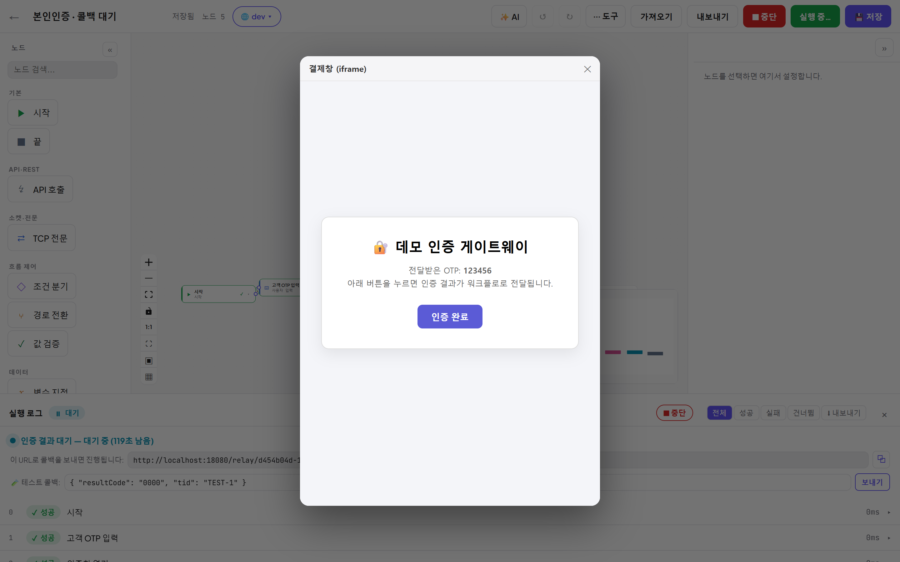
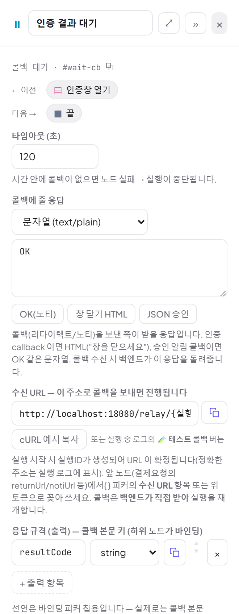
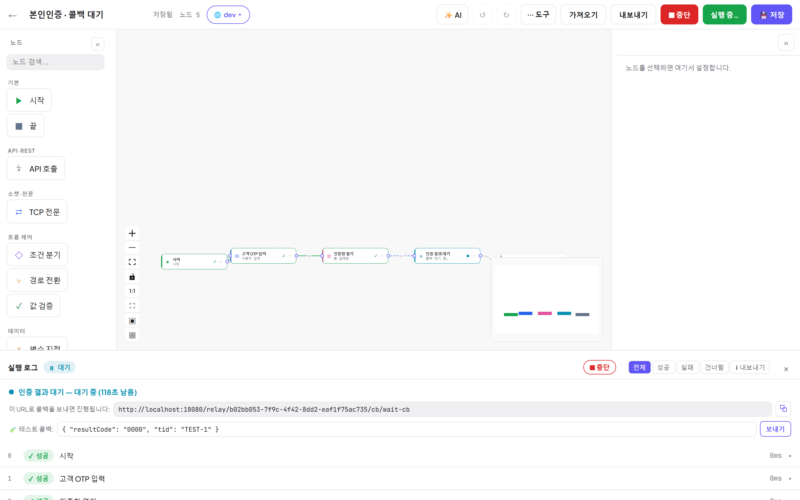
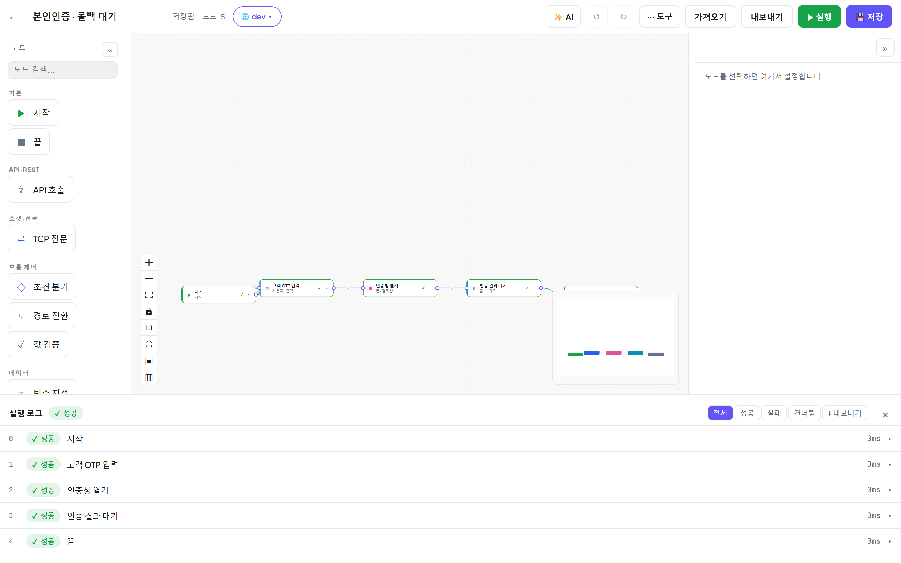

# 15. 폼·콜백 연동 심층 — 결제창/본인인증 패턴

[← 목차](README.md)

결제·본인인증처럼 **사람이 창에서 뭔가를 하고, 그 결과를 외부 시스템이 콜백으로 돌려주는** 흐름을
FlowLink 에서 어떻게 조립하는지 끝까지 파봅니다. 세 노드가 한 세트입니다:

| 노드 | 역할 | 기다리나? |
|---|---|---|
| **사용자 입력 (INPUT)** | 실행 중 브라우저 모달로 값 받기 (OTP 등) | 확인/취소까지 |
| **폼·결제창 열기 (FORM)** | 대상 URL 로 숨김 폼을 자동 제출한 창(팝업/iframe)을 열기 | **안 기다림** — 열자마자 다음 노드로 |
| **콜백 대기 (WAIT)** | 외부 시스템의 콜백을 **백엔드가 직접** 받아 재개 | 콜백 또는 타임아웃까지 |

핵심 설계: **창을 여는 일(FORM)과 결과를 받는 일(WAIT)이 분리**되어 있습니다. 게이트웨이가 사용자를
어디로 보내든, 결과는 브라우저가 아니라 **서버의 수신 URL** 로 돌아옵니다 — 그래서 탭을 닫아도 완결됩니다.

## 전체 흐름 한눈에

## 수신 URL — 이 주소로 오면 진행됩니다

- 형식: `{콜백 수신 주소}/relay/{실행ID}/cb/{노드ID}` — **실행을 시작할 때 실행ID 가 정해지며 확정**됩니다.
- `{콜백 수신 주소}` 는 ⚙ 설정에서 관리합니다. 비워두면 접속한 주소를 자동 사용, 외부 게이트웨이가
  불러야 하면 터널/도메인 주소를 입력하세요 ([07장](07-트리거-자동화.md#-설정--콜백-수신-주소--실패-알림)).
- 인증 없이 열려 있는 엔드포인트입니다(실행ID 가 추측 불가한 UUID 라는 점이 방어선). **GET/POST 등
  모든 메서드**를 받고 CORS 도 열려 있어 게이트웨이 리다이렉트·서버 노티 어느 쪽도 받을 수 있습니다.

### 수신 URL 을 폼에 꽂는 법 (returnUrl 패턴)

게이트웨이는 대개 "처리 끝나면 어디로 돌려보낼지"를 폼 필드(returnUrl, ret_url, ReturnURL …)로 받습니다.
FlowLink 에서는 wait 노드의 수신 URL 이 `{{ url@wait노드id }}` 토큰으로 **그래프 어느 노드에서나** 바인딩됩니다
(실행 시작 시 확정되므로 wait 보다 앞의 노드에서도 사용 가능).

- 제일 쉬운 길: 폼 노드 속성의 💎 **"↩ 콜백 URL 필드 추가"** 버튼 — 그래프에 있는 wait 노드별 버튼이 떠 있고,
  누르면 `returnUrl = {{ url@waitId }}` Hidden 필드가 자동으로 추가됩니다(Raw 모드면 rawBody 끝에 append).
  필드명이 다르면(예: `ret_url`) 키만 바꿔 쓰면 됩니다.
- 수동으로는: 필드 값에서 `{ }` 피커 → **"(수신 URL)"** 항목 선택.

## FORM 노드 — 창 열기의 디테일

- 실행이 FORM 에 도달하면 서버가 **action URL 과 필드 값의 토큰을 모두 해석**한 명세를 내려주고,
  브라우저가 그 명세로 숨김 폼을 만들어 **자동 제출**합니다. 사람이 볼 것은 게이트웨이가 그리는 페이지입니다.
- **표시 방식**
  - **팝업 창**: 별도 창. 브라우저가 팝업을 차단하면 **노드 실패**("팝업 차단됨 — 브라우저의 팝업 허용이 필요합니다")로 끝납니다.
  - **iframe 모달**: 같은 페이지 위 모달이라 차단이 없습니다. × 나 바깥 클릭으로 닫습니다. 데모/사내망에 권장.
- 제출 직후 FORM 노드는 성공 처리되고("기다리지 않고 다음 노드로 진행") 실행은 WAIT 로 넘어갑니다.
  창을 사용자가 언제 닫는지는 실행 진행과 무관합니다.
- 폼으로 **보낸 값**들은 요청 스코프로 기록되어 뒤에서 `{{ 키@req:폼노드 }}` 로 참조할 수 있습니다.

실행 중 iframe 모달로 열린 모습(아래는 내장 Mock 이 그린 데모 인증 페이지):

## WAIT 노드 — 콜백 수신의 디테일

### 대기 중에 보이는 것

실행 로그에 카운트다운·수신 URL(클릭 전체선택 + 복사)·🧪 테스트 콜백이 표시됩니다:

### 콜백이 도착하면

1. **매칭·멱등**: 그 실행의 그 노드가 대기 중일 때만 재개합니다. 이미 완료/타임아웃된 뒤에 온 늦은 콜백,
   중복 콜백은 상태를 건드리지 않고 **항상 평문 `OK`** 만 돌려받습니다(멱등).
2. **ACK 응답**: 대기 중이던 실행을 **재개시킨 콜백**은 노드에 설정한 **"콜백에 줄 응답"** 을 받습니다 — 문자열/HTML/JSON,
   프리셋 3종(`OK(노티)` = 평문 OK · `창 닫기 HTML` = window.close() 포함 완료 페이지 · `JSON 승인`).
   브라우저 리다이렉트형이면 "창을 닫으세요" HTML 을, 서버 노티형이면 OK/JSON 을 주면 됩니다.
3. **본문 → 출력 자동 파싱**:
   - GET 콜백이면 **쿼리스트링**을, POST 면 **본문**을 사용합니다(폼 전송이면 urlencoded 복원 처리).
   - `{`/`[`/`"` 로 시작하면 JSON 으로 파싱 — 객체면 **키가 그대로 노드 출력**, 스칼라면 `body` 키.
   - `a=1&b=2` 형태면 urlencoded 로 파싱해 키-값 출력(중복 키는 리스트).
   - 둘 다 아니면 원문이 `body` 키로 보존됩니다.
   - 고정 출력 `url`(수신 URL)도 함께 남습니다.
4. **선언은 픽커용**: 응답 규격(출력)에 선언한 키는 바인딩 피커 칩을 만들 뿐, **실제 수신된 모든 키**를
   `{{ 키@wait노드 }}` 로 쓸 수 있습니다 (resultCode, tid, authToken … 게이트웨이가 주는 그대로).

완료되면 콜백 값이 다음 노드로 흘러갑니다:

### 타임아웃·중단·재시작

- **타임아웃(초)**: 기본 120초(0 이하로 두면 120으로 처리). 시간 안에 콜백이 없으면 **노드 실패 → 실행 FAILED**.
- ⏹ 중단하면 대기가 즉시 해제되고 CANCELLED 로 끝납니다.
- **서버가 재시작돼도** 대기 스냅샷이 DB 에 보존되어 기동 시 다시 무장됩니다 — 재시작 후 도착한 콜백/타임아웃도
  정상 처리됩니다(스냅샷 없이 진행 중이던 실행만 FAILED 로 정리됨).
- 무인(스케줄/웹훅) 실행에서도 WAIT 는 동작합니다 — 브라우저가 필요 없기 때문입니다. INPUT/FORM 은 브라우저가
  필요하므로 무인 실행과 어울리지 않습니다.

## 외부 시스템 없이 끝까지 테스트하기 (3가지 레벨)

| 레벨 | 방법 | 언제 |
|---|---|---|
| ① 손으로 재개 | 대기 배너의 **🧪 테스트 콜백** — 샘플 본문(`{"resultCode":"0000","tid":"TEST-1"}`)이 미리 채워져 있고 [보내기]로 즉시 진행 | 콜백 이후 분기/바인딩을 빠르게 확인 |
| ② curl 로 재개 | wait 노드 속성의 **cURL 예시 복사** 또는 실행 로그의 수신 URL 로 직접 `curl -X POST -d 'resultCode=0000' {수신URL}` | 게이트웨이 입장에서 형식 검증 |
| ③ Mock 게이트웨이 | Mock 라우트의 **"응답 후 콜백(웹훅) 발사"** 에 수신 URL 을 걸면, 결제요청 API 응답 후 지연을 두고 Mock 이 콜백을 쏩니다 ([10장](10-Mock-서버.md)) | 승인 노티 패턴 전체 흐름 리허설 |

## 실전 레시피 — 본인인증 데모 (이 가이드의 예제 플로우)

`시작 → 고객 OTP 입력(INPUT) → 인증창 열기(FORM, iframe) → 인증 결과 대기(WAIT) → 끝`

1. INPUT: 필드 `otp` — 실행하면 모달이 뜹니다 ([05장](05-실행-디버깅.md#사용자-입력-input)).
2. FORM: 열기 URL `{{ baseUrl@env }}/auth`, Hidden 필드 `otp = {{ otp@otp-input }}`,
   `returnUrl` 은 "콜백 URL 필드 추가" 버튼으로 `{{ url@wait-cb }}` 를 꽂습니다.
3. WAIT: 타임아웃 120초, 콜백 응답은 `창 닫기 HTML` 프리셋, 출력 선언 `resultCode`.
4. 다음 노드에서 `{{ resultCode@wait-cb }} == '0000'` 검증(ASSERT) 또는 분기(IF).

> 게이트웨이가 진짜 외부(인터넷)라면: ⚙ 설정의 콜백 수신 주소를 터널 주소로 바꾸는 것 잊지 마세요.
> 서명/위변조 검증 같은 실 결제망 하드닝은 아직 데모 범위 밖입니다 ([13장](13-FAQ-문제해결.md#알아두면-좋은-한계)).

## 자주 하는 실수

| 증상 | 원인 |
|---|---|
| WAIT 가 타임아웃까지 침묵 | 게이트웨이에 returnUrl 을 안 실었거나, 콜백 수신 주소가 외부에서 도달 불가(로컬 주소). |
| 팝업이 안 뜨고 실행 실패 | 팝업 차단 — 표시 방식을 iframe 모달로 바꾸거나 팝업 허용. |
| 콜백은 왔는데 값이 비어 있음 | 콜백이 GET 이면 값은 쿼리스트링에 실려야 합니다. POST JSON 이면 Content-Type 과 본문 형식 확인. |
| `{{ resultCode@wait }}` 가 안 잡힘 | 노드 id 확인(`#…` 복사 버튼). 선언 안 한 키도 실제 수신됐다면 토큰으로 직접 참조 가능합니다. |
| 두 번째 콜백이 무시됨 | 정상입니다 — 재개는 1회, 이후 콜백은 멱등 ACK(평문 `OK`)만 받습니다. |

---

[← 목차로](README.md)
