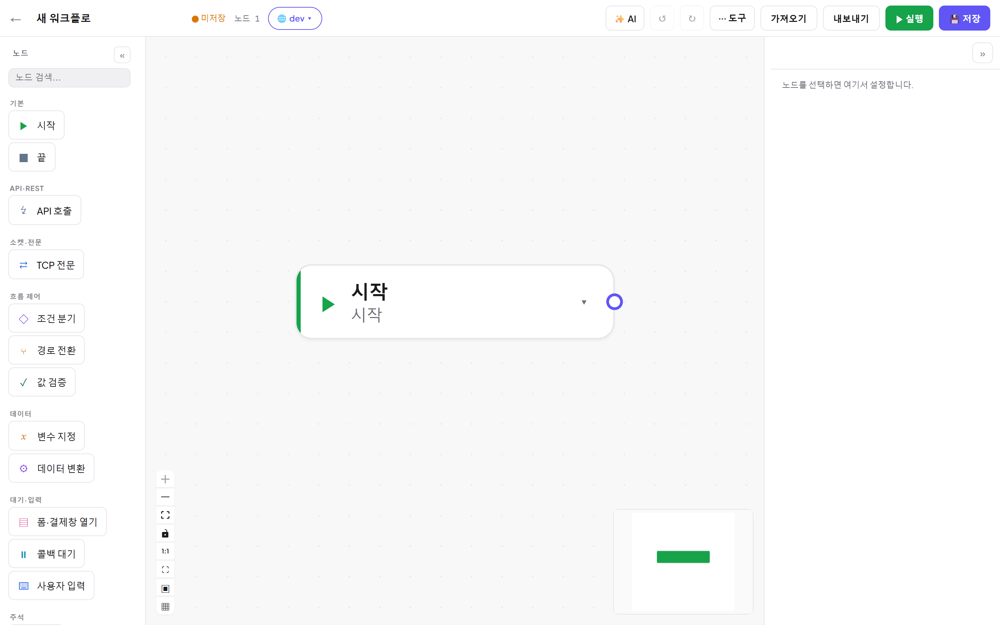

# FlowLink 심플가이드 — 10분 만에 첫 워크플로

처음 쓰는 분을 위한 최단 코스입니다. **워크플로를 만들고 → API 를 연결하고 → 실행해서 결과를 확인**합니다.
더 자세한 내용은 [심화가이드 목차](README.md)에서 챕터별로 볼 수 있습니다.

---

## 0. 접속

브라우저에서 `http://localhost:18080` 에 접속합니다(사내 배포 주소가 따로 있으면 그 주소).
처음 화면이 **대시보드**입니다 — 워크플로 목록·폴더·최근 작업이 보입니다.

- 왼쪽 사이드바: **대시보드 · Mock 서버 · 실행 이력**, 아래에 폴더와 ⚙ 설정, 다크 모드.
- 카드 하나가 워크플로 하나입니다. 카드의 배지(✓ 성공 등)는 **가장 최근 실행 결과**입니다.

## 1. 새 워크플로 만들기

우상단 **`+ 새 워크플로`** 를 누르면 에디터가 열립니다. 캔버스에는 **시작** 노드 하나만 있습니다.

에디터 구성: 왼쪽 **노드 팔레트**, 가운데 **캔버스**, 오른쪽 **속성 패널**(노드를 선택하면 내용이 나타남),
실행하면 하단에 **실행 로그**가 열립니다.

## 2. 노드 추가 — 세 가지 방법 중 아무거나

1. 팔레트에서 노드를 캔버스로 **드래그**
2. 캔버스 빈 곳 **더블클릭** 또는 **우클릭**
3. **`Ctrl+K`** — 검색해서 추가 (제일 빠릅니다)

`Ctrl+K` 를 누르고 `api` 를 입력하면 **API 호출** 노드가 검색됩니다. Enter 또는 클릭으로 추가하세요.

## 3. 노드 연결

노드 오른쪽의 **동그란 핸들(●)** 을 잡고 다음 노드의 왼쪽 핸들까지 드래그하면 연결됩니다.
가까이 가면 **자석처럼 달라붙으니** 정확히 조준하지 않아도 됩니다.

> 💡 핸들을 **빈 곳에 놓으면** 그 자리에서 노드 추가 메뉴가 열리고, 새 노드가 **자동으로 연결**됩니다.

연결되면 이렇게 됩니다:

> ⚠ **시작에 연결 안 된 노드는 실행 시 건너뜁니다.** 미연결 노드는 캔버스에서 주황 점선 + `⚠ 미연결` 로 표시되고
> (선택 중에는 속성 패널의 경고 박스로 대신 보입니다), 상단에 ⚠ 배지가 뜹니다.
> 배지를 클릭하면 어떤 노드가 문제인지 알려줍니다.
>
> 

## 4. HTTP 노드 설정

추가한 **API 호출** 노드를 클릭하면 오른쪽 속성 패널이 열립니다.

최소로 채울 것:

| 항목 | 예 |
|---|---|
| 메서드 | `GET` |
| Base URL | `http://localhost:18080/mock/pay` *(내장 Mock — 아래 참고)* |
| Path | `/users/1001` |
| 응답 (Response) | `json` (기본값) |
| 예상 응답 필드 | `name`, `grade` 등 — 다음 노드가 바인딩할 키 |

- **프리셋** 버튼(GET/JSON/Form/Raw)을 누르면 메서드·본문 형식이 한 번에 세팅됩니다.
- `cURL 붙여넣기` 로 기존 curl 명령을 그대로 노드로 만들 수도 있습니다.

> 💡 **붙을 서버가 아직 없다면?** 왼쪽 사이드바 **Mock 서버**에서 가짜 API 를 몇 분 만에 만들 수 있습니다.
> 라우트(`GET /users/{id}`)와 응답 JSON 만 정의하면 `http://localhost:18080/mock/{slug}/...` 으로 바로 서빙됩니다.
> 자세한 방법: [10. Mock 서버](10-Mock-서버.md)

## 5. 실행

우상단 **`▶ 실행`**. 하단에 실행 로그가 열리고 노드별 결과가 표시됩니다.
캔버스에서는 지나간 연결이 **초록색**으로, 실패는 **빨간색**으로, 건너뛴 노드는 반투명으로 표시됩니다.

- 로그의 행을 클릭하면 **요청/응답 전문**이 펼쳐집니다.
- 실패하면 **첫 실패 노드가 자동으로 펼쳐져** 원인을 바로 볼 수 있습니다.

## 6. 저장

**`💾 저장`** 또는 `Ctrl+S`. 저장할 때마다 **버전 스냅샷**이 쌓여서 언제든 예전 버전과 비교하고 되돌릴 수 있습니다
([09. 버전 관리](09-버전-협업.md)).

---

## 다음 단계

| 하고 싶은 것 | 보기 |
|---|---|
| 응답 값을 다음 노드에서 쓰기 (`{{ }}`) | [04. 토큰 바인딩](04-토큰-바인딩.md) |
| 조건 분기 / 값 검증 / 변수 | [03. 노드 레퍼런스](03-노드-레퍼런스.md) |
| dev/운영 주소를 한 번에 전환 | [06. 환경·시크릿](06-환경-시크릿-입력.md) |
| 밤마다 자동 실행 | [07. 트리거 자동화](07-트리거-자동화.md) |
| 가짜 서버(Mock) 만들기 | [10. Mock 서버](10-Mock-서버.md) |
| 결제창·OTP 같은 사람 개입 흐름 | [03. 노드 레퍼런스](03-노드-레퍼런스.md) 의 폼·콜백·입력 노드 |
