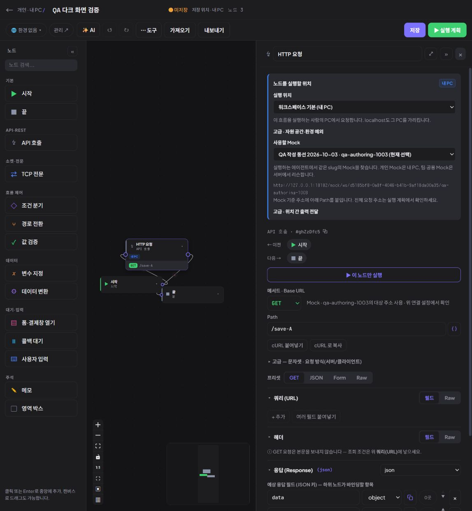
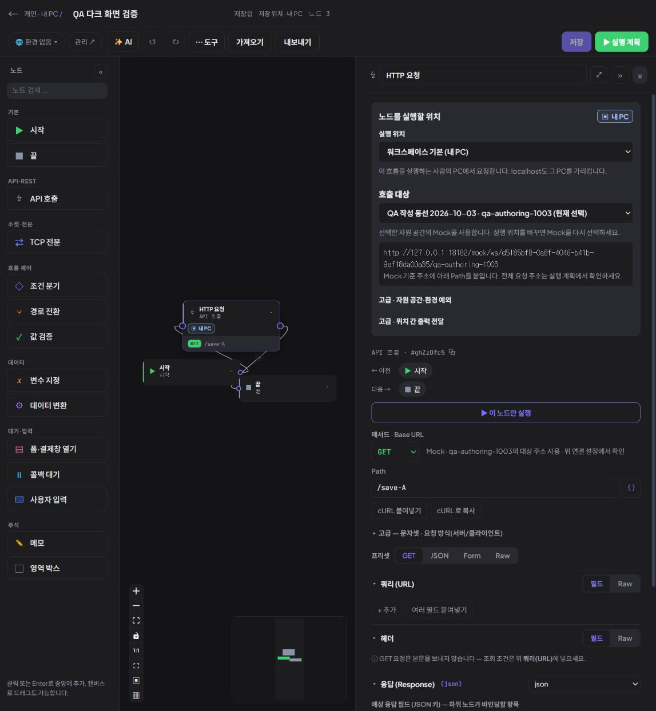
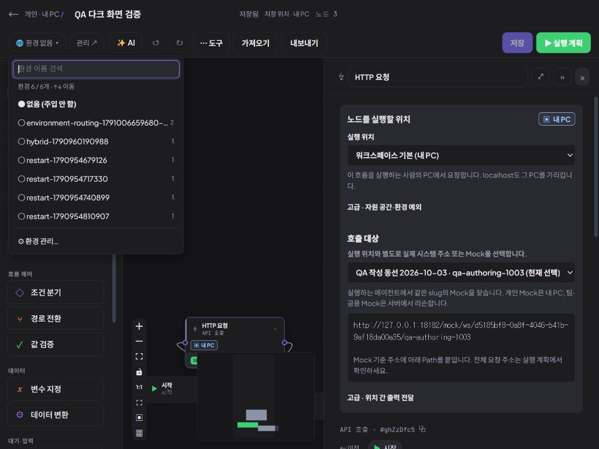
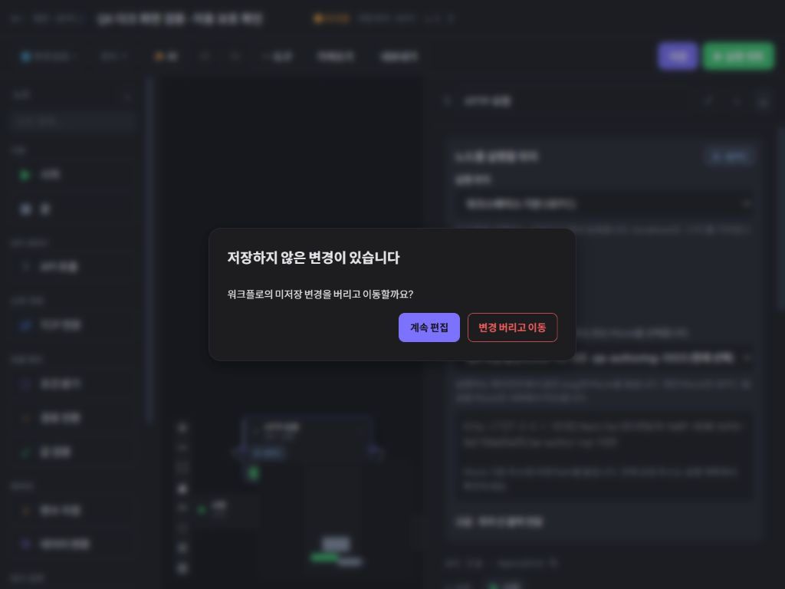
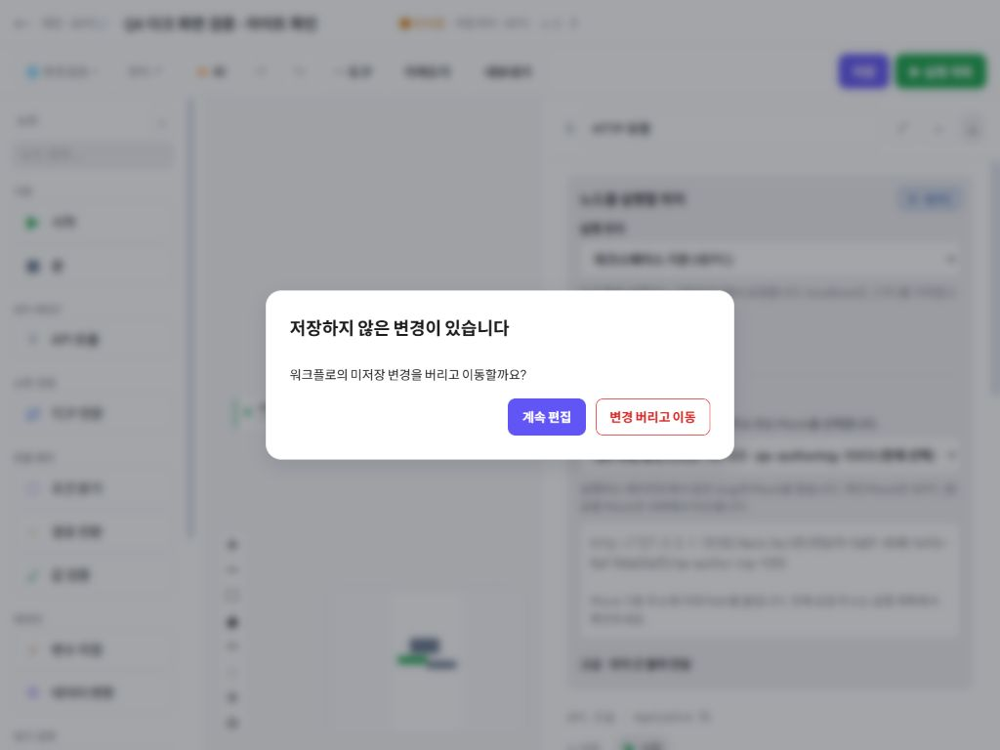
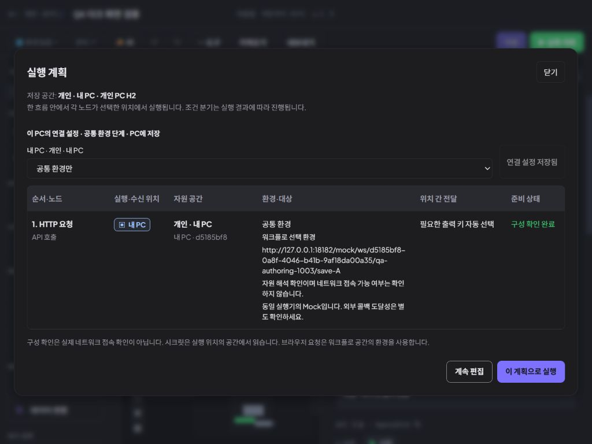
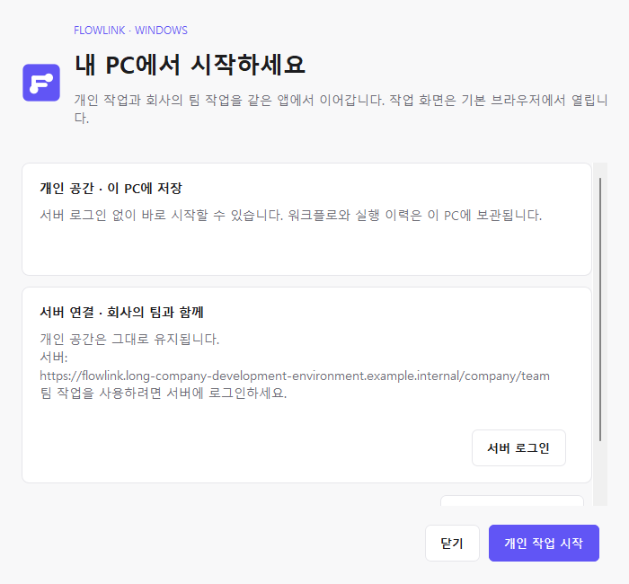
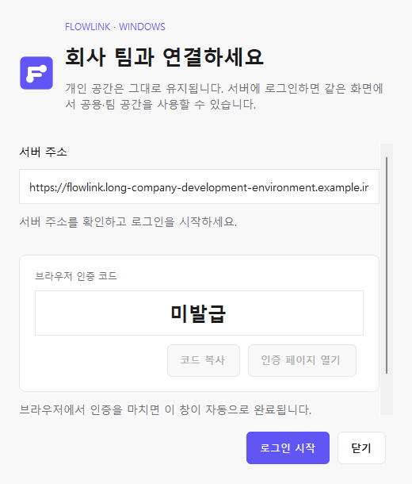

# 에이전트 구조 정리와 웹·Windows UI 개선 검증

## 범위와 결정

사용자 추가 요구를 반영해 중앙 MCP 서버만 배치하는 방향과 운영 Oracle·Vault 실제 서버 연결을 목표 아키텍처에 명시했다. Docker Oracle·Vault는 테스트 배치다. 실행 에이전트는 호출 클라이언트와 Mock·콜백 리스너를 맡고, 실행 위치와 호출 대상은 사용자가 선택한다. 에이전트 계약·연결·혼합 실행을 팀 수 확대 UI보다 우선하며 전체 UI 개선은 병행한다.

`continuous_product_discovery`와 `product_adoption_review`가 중앙 MCP·PC 인증 채널·개인 데이터 경유·단발 호출/그래프 실행 차이를 교차 검토했다. 기존 MCP의 직접 HTTP 호출 경로가 목표와 다름을 소스에서 확인해 이관 대상으로 기록했다. **중앙 MCP 라우팅·새 배포 구조를 이번에 구현하거나 검증한 것은 아니다.**

웹 담당 `product_adoption_review`와 Windows 담당 `resource_experience`는 개인 작업/서버 연결을 배타적인 모드로 표현하지 않는 것, 기존 보라 강조색·중립 표면·한국어 상태를 공유하는 것에 합의했다.

## 실제 수정과 검증

### 웹

- `AgentSettings`: 실행 위치와 호출 대상을 구분하고 고급 환경·출력 설정을 뒤로 배치했다. 주소 글자 크기·대비를 높이고 구현 용어인 slug 설명을 사용자 동작에 맞게 정리했다. 핸들러와 자원 선택 계약은 보존했다.
- `ExecutionPlanDialog`: 표 머리글 고정·스크롤, 13px 본문과 명시적인 실행 버튼 스타일을 적용했다.
- 이전에 수정 후 미배포였던 `ActionButton`, `UnsavedNavigation`, `EnvSwitcher/useAnchoredPopover`, 테마의 `color-scheme` 변경도 이번 검증 빌드에 포함했다.
- 첫 화면 비교에서 실행 설정이 과하게 높아지는 문제를 root가 지적했다. 웹 담당이 중복 문장·공백을 줄이고 고급 설정 순서를 조정했다. 최종 설정 영역은 기본 검증 창에서 높이 약 409px다.

실제 CUA 브라우저는 18182의 기존 QA 워크플로만 사용했다. 새로운 Mock·계정·팀 자료를 생성하지 않았다. 미저장 보호 검증에서 QA 이름을 임시 편집했으며 마지막에 원래 이름으로 저장했다. 실제 사용자 자료와 권한은 변경하지 않았다.

| 검증 | 결과 |
|---|---|
| 기본 1147×1244 / 작은 창 1024×768 환경 팝업 | x=14, 폭 300px로 화면 내부. 검색창 초기 포커스와 Esc 후 트리거 복귀 확인 |
| 다크 미저장 변경 대화상자 | 두 버튼 판독 가능. 기본 포커스와 Shift+Tab 순환, 계속 편집 시 내용 유지 확인 |
| 버튼 글자 대비 | 다크 기본 5.01:1 / 위험 5.11:1, 라이트 기본 5.09:1 / 위험 4.83:1. 실제 computed style의 글자·배경으로 계산 |
| 1024×768 실행 계획 | 카드 x=24..1000, 하단 y≈684. 표·닫기·실행 버튼이 화면 내부. 실제 실행은 하지 않음 |
| 최종 최신 파일 | 브라우저에서 `/assets/index-CxLJjbIE.js` 로드 확인 |
| 최종 화면 | 실행 위치 → 호출 대상·주소 → 고급 설정 순서 확인. 저장 상태·Mock 선택 보존 |

임시 viewport override는 해제했고 원래 다크 테마로 복원했다. 검증 탭에는 최종 QA 편집 화면을 남겼다.

### Windows 앱

`DesktopBrand`와 `DesktopTray`의 시작·로그인·상태·IDE 안내 화면을 같은 공통 버튼·입력·카드로 재구성했다. 개인 작업 시작은 고정 하단의 주 행동으로 두고, 서버 로그인은 개인 공간을 유지한 채 팀 기능을 연결하는 행동으로 표시했다. 로컬 MCP 등록·설정 복사 화면은 중앙 서버 안내로 대체하되 기존 IDE 설정 파일을 변경하지 않았다.

실제 Swing 컴포넌트의 4개 화면을 700px·520px에서 상단/하단으로 렌더했다. 최초 버튼 잘림과 긴 인증 안내의 가로 잘림을 수정했고 경계 검사가 통과했다. 테스트 harness가 이전 폭의 스크롤 위치를 이어받던 문제도 교정해 상단 사진을 다시 확인했다. 상세는 [Windows 검증 기록](native-ui-2026-10-03.md)을 참조한다.

**Windows 이미지는 실제 컴포넌트의 격리 렌더다. 설치된 앱의 트레이 클릭·실제 로그인·키보드 조작 검증은 아니다.**

## 빌드·반영 범위

- frontend `npm run build` 성공. `npm run lint` 오류 없음. 기존 Fast Refresh 경고와 번들 크기 경고는 남아 있다.
- Kotlin 컴파일 및 `bootJar` 성공.
- 18182 검증 앱만 갱신했다. 설치된 18180, 서버 18080, Oracle·Vault, 배포 MSI는 이번 작업에서 변경하지 않았다.
- MCP 프로토콜 호출·도구 실행·IDE 등록 테스트는 수행하지 않았다.
- 전체 제품 UI와 새 아키텍처가 완성되었다는 판정이 아니다. 이번에 확인한 화면과 경계를 기록한다.

## 화면 증거

수정 전후 핵심 작성 화면:

