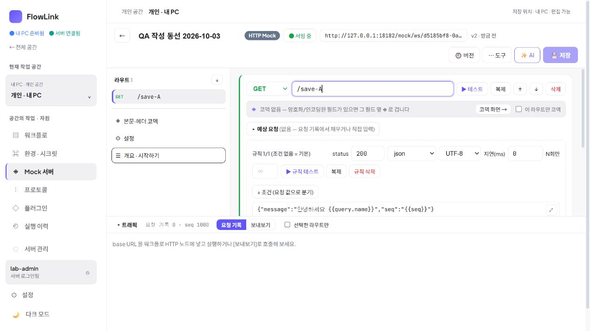
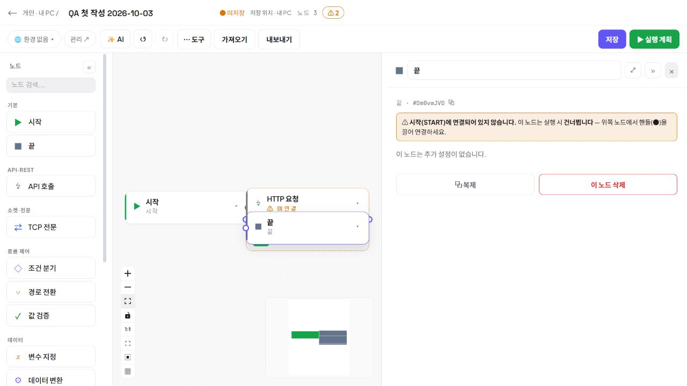
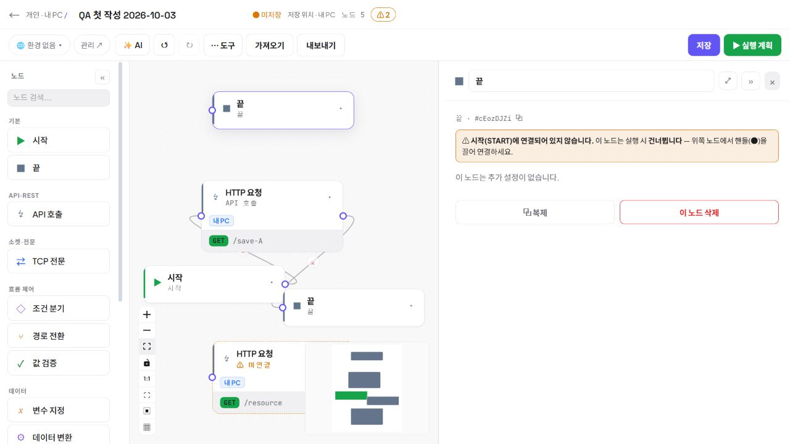
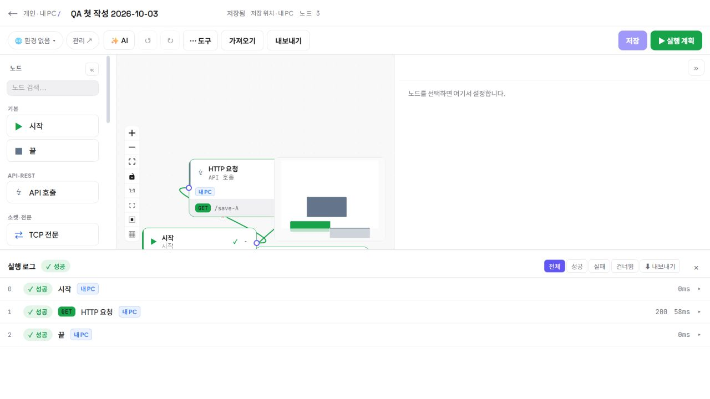

# 작성·저장·이동·재사용 통합 검증

2026-10-03. 이 기록은 작은 목록 수정만으로 제품 전체 작업을 종료한 판단을 바로잡기 위해 수행한 후속 구현과 실제 검증이다. 사내 운영 전체가 완성되었다는 선언이 아니다. 설치 검증은 [0.3.3 릴리스 기록](2026-10-03-release-0.3.3.md)과 함께 본다.

## 먼저 합의한 작업

주 담당은 실제 브라우저, 제품 담당은 작업의 의미와 반례, 자원 담당은 작성 상태와 노드 추가, 배포 담당은 설치 산출물과 자료 보존을 맡았다. 변경 전에 다음 반론을 교환했다.

- 저장된 이력 보존은 미저장 초안 보존과 다르다. 안전하다는 문구보다 버리는 대상과 실제 결과를 표시한다.
- 단순히 저장 완료 시 dirty를 지우면 응답 대기 중의 추가 편집을 잃는다. 요청 시작 시점과 현재 초안을 비교한다.
- 링크 클릭만 가로채면 브라우저 뒤로와 프로그램 이동이 빠진다. 기존 경로를 유지하면서 router의 공통 이동 차단을 사용한다.
- 워크플로 이름은 graph.name으로 이미 저장된다. 별도 이름 저장 API 추가안은 채택하지 않았다.
- 노드 겹침은 전체 그래프 자동 재배치나 자동 연결로 해결하지 않는다. 새 노드만 가까운 빈 자리에 추가한다.
- UI만 새로 배포하고 MSI가 이전 버전인 상태는 릴리스 일치가 아니다. 동결 JAR를 서버·검증 앱·MSI에 함께 넣는다.

## 실제 재현과 수정

### 저장 응답이 최신 편집을 덮음

격리 개인 Mock을 UI에서 생성했다. 경로 `/save-A` 저장 응답만 CDP로 지연하고 `/save-B-newer`로 추가 편집한 뒤 응답을 재개하자 화면이 A로 바뀌었다. 응답은 200이었다. 네트워크 장애를 제품 결함으로 오인한 사례가 아니다.

- 수정: Mock·플러그인·전문 규격 저장은 시작 시점 스냅샷을 전송한다. 완료 당시 추가 편집이 있으면 그 내용과 미저장 표시를 유지한다. 같은 Mock의 자동 재조회도 초안을 덮지 않는다.
- 버전 보존 저장·명시적인 이전 버전 적용도 요청 시작 시점의 스냅샷을 비교한다. 사용자가 선택한 이전 버전은 적용하되, 응답을 기다리는 동안 새로 편집한 내용은 유지한다.
- 실제 재검증: `/fixed-save-A` 저장 응답 200을 보류하고 B로 편집, 저장 중 메뉴 이동은 차단됨, 응답 재개 후 B와 미저장·추가 저장 안내가 남음.
- CDP는 해당 Mock의 `/spec` XHR 응답에만 적용했고, 검증 직후 `Fetch.enable({patterns:[]})`로 해제했다. 티켓·인증 값은 기록하지 않았다.

### 메뉴·뒤로·공간 이동에서 초안 유실

수정 전 Mock 경로를 `/draft-not-saved`로 입력한 뒤 워크플로 메뉴를 누르면 확인 없이 이동했다. 뒤로 돌아오면 `/hello`로 돌아가 있었다.

- 수정: 공통 이동 보호를 워크플로·Mock·플러그인·전문 규격·환경/시크릿 페이지 및 모달에 연결했다. 저장 중 이동, 저장 실패, 명시적인 초안 폐기를 구분한다.
- 공간 선택은 이동이 확정되기 전에 선택 공간·스토어를 지우지 않는다.
- 실제 검증: Mock 메뉴 이동 취소, 브라우저 뒤로 취소, 개인→공용 선택 취소 모두 같은 개인 공간의 `/back-draft`를 유지했다. 명시적으로 변경을 버리면 목적 메뉴로 이동했다.
- 환경 텍스트 입력은 뒤로 취소 후 그대로 유지되고, 시크릿 탭 전환에도 확인이 나타났다. 폐기를 선택하면 시크릿 탭으로 이동했다. 실제 환경 변수 저장 값은 수정하지 않았다.
- 시크릿 페이지와 워크플로 안의 시크릿 모달 모두 뒤로 취소 후 입력이 유지됐다. 테스트 문자열만 사용했고 서버에 저장하지 않았다.

통합 중 추가 회귀도 잡았다. 워크플로에서 폐기를 선택한 뒤 같은 워크플로에 재진입하면 전역 편집 스토어의 dirty 때문에 첫 로드까지 차단됐다. 마운트 안에서 이미 불러온 그래프의 자동 재조회만 보호하도록 수정했다. 최종 번들에서 이름을 바꾸고 폐기→재진입했을 때 저장된 이름·노드 3개·저장됨 상태로 돌아오는 것을 확인했다.

### 클릭으로 추가한 노드가 겹침

새 워크플로에서 API 호출·끝을 연속 클릭하면 같은 위치 근처에 생겨 HTTP 카드와 연결점이 가려졌다. Fit View를 눌러도 겹침 자체는 남았다.

- 수정: 실제 캔버스의 보이는 영역과 기존 노드 크기로 가까운 빈 위치를 찾는다. 공간이 부족할 때만 새 노드가 보이도록 시점을 이동한다. 기존 노드·연결·사용자가 드래그한 위치는 변경하지 않는다.
- 실제 검증: 최종 구현에서 같은 작업을 반복한 뒤 DOM의 노드 경계로 새 노드 겹침 0, 기존 노드 transform 불변을 확인했다. 테스트로 추가한 미연결 노드는 저장하지 않고 폐기했다.

## 사용자 작업을 끝까지 수행한 결과

실제 CUA 브라우저에서 개인 공간에 새 Mock 하나와 워크플로 하나를 만들었다.

1. HTTP Mock 이름·slug 입력, 기본 GET 경로 편집과 저장.
2. 새 워크플로 이름 입력, API 호출 노드 추가, 방금 만든 Mock 선택, Path 설정.
3. 시작→HTTP→끝 연결, 저장.
4. 실행 계획에서 내 PC·개인 H2·전체 Mock 주소 확인, 실행. HTTP 200 및 전체 성공.
5. 화면에서 JSON 내보내기를 읽고 가져오기로 같은 정의 적용. 중복 추가 없이 3개 노드 유지, 저장 후 목록에서 이름·v3 확인.
6. 이름을 미저장 변경한 상태에서 버전 기록의 v2를 명시적으로 선택. 변경 교체 안내를 확인하고 적용하여 v4로 저장, 기존 이름과 3개 노드로 돌아옴.
7. 최종 번들에서 다시 실행: 시작·HTTP 200·끝 모두 성공.

검증 자료: 개인 공간 `d5185bf8-0a8f-4046-b41b-9af18da00a35`, Mock `94dd1c0a-34ee-4130-ab2d-0ad9cab6a4c8` (`qa-authoring-1003`), 워크플로 `90233fab-3015-461d-9fba-3afe496df71b`. 실제 사용자 자료를 변경하거나 삭제하지 않았다.

## 코드·산출물 확인

- `test-authoring-save.cjs`: 실제 소스의 저장 콜백을 지연 요청으로 실행. A/B 편집, 다른 편집기 식별자, Mock 명시 버전 적용, 워크플로 버전 요청 스냅샷, 폐기 재진입과 같은 화면의 재조회 보호 PASS.
- `test-unsaved-navigation.cjs`: 실제 공통 provider/hook 기반 하네스, dirty·저장 중·저장 실패·취소·허용된 저장 후 이동·정리 PASS. 이 하네스만으로 브라우저 동작을 검증했다고 표현하지 않으며 위 실제 브라우저 결과를 함께 본다.
- `test-node-placement.cjs`: 연속 12개·측정 전 카드·긴 카드·가득 찬 화면·기존 위치 불변 PASS.
- 기존 목록 이동 및 실행 이력 집중 회귀 PASS. TypeScript, 변경 부분 lint, 프론트 빌드와 bootJar PASS.
- 기존 큰 JavaScript 번들 경고는 남는다. 빌드 실패는 아니다.
- 최종 번들 `index-DVV_SSSb.js`, CSS `index-DwowFxS1.css`.
- 최종 JAR SHA-256 `4D92D0B75EF2D1A40551FC153C03C1A5B40995E5CBA632BC2B5C0C2CD587B25D`.
- 빌드 JAR, 18182 네이티브 검증 JAR, 18080 Docker `/app/flowlink.jar` 해시 동일 확인. 최초 후보는 재진입 회귀 때문에 배포 설치에서 제외하고 다시 빌드했다.

설치 업그레이드 이후 주 담당은 18180의 새 일회용 티켓으로 실제 브라우저를 열었다. 서버 로그인 상태에서 전체 공간 → 개인 공간 → 기존 `msi-upgrade-1790992729941` 워크플로를 열어 노드 4개·저장됨·저장 위치 내 PC를 확인했다. 설치 앱의 DOM script도 `index-DVV_SSSb.js`였다. 기존 자료는 편집하지 않았다.

## 완료라고 확대해 말하지 않는 범위

이 회차에서 actual browser로 확인한 범위와 소스/집중 회귀만 확인한 범위는 구분한다. Plugin·Protocol 각 편집기의 실제 저장 응답 지연, 실패한 환경 자동 저장의 실제 네트워크 오류, 모든 브라우저/사내 프록시 조합을 전부 재현한 것은 아니다. 공통 동작의 브라우저 증거와 각 소스 콜백 회귀가 근거다.

실제 GitHub 사내 연동·운영 Oracle/Vault·서명 인증서 배포는 실험용 모의 인증 및 기존 Docker 검증과 다르다. Windows 트레이/마법사의 실제 네이티브 클릭 검증 여부는 별도 릴리스 기록에 명시한다. 사용자 요청에 따라 MCP 프로토콜·도구 호출·IDE 등록 테스트는 수행하지 않았다.
