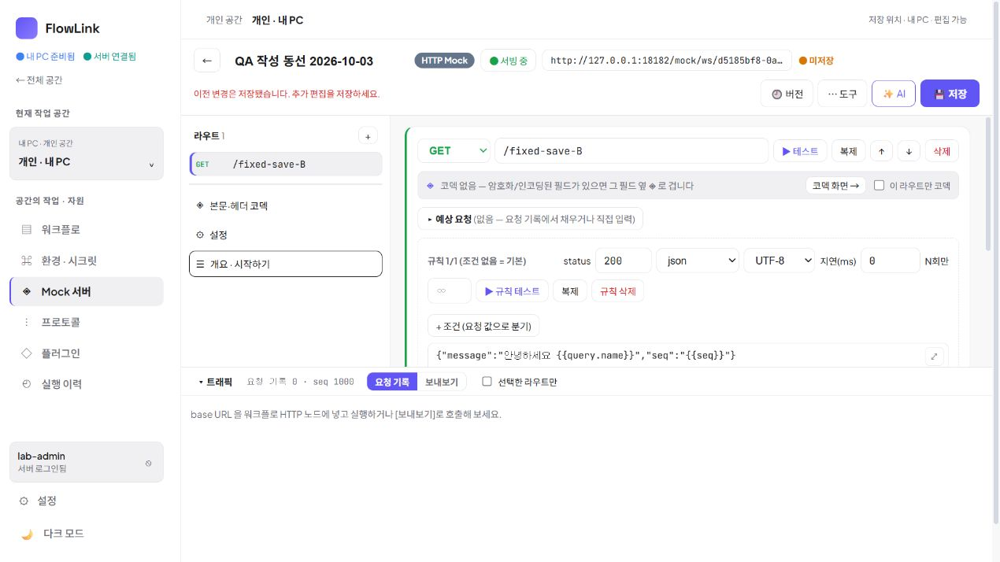
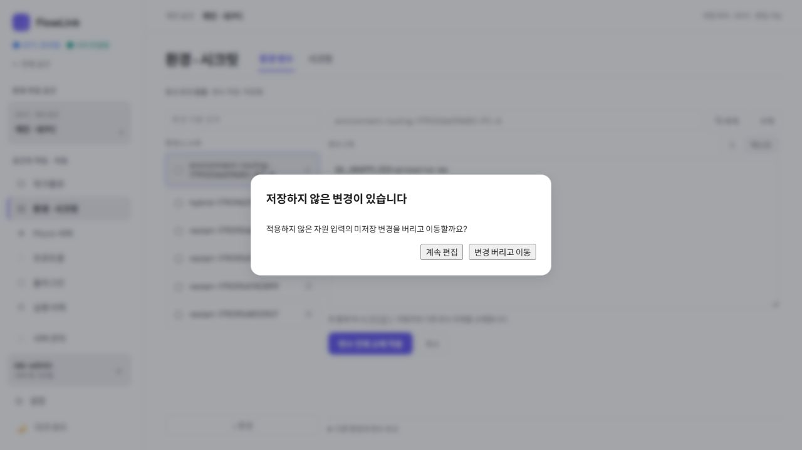
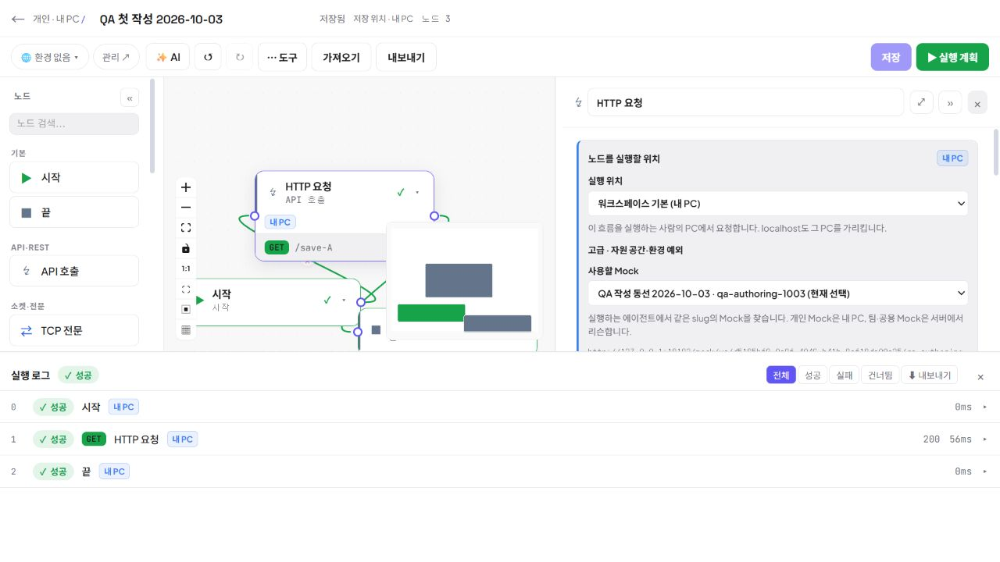

# 작성 동선 제품 교차 검토

2026-10-03. 제품 담당이 작성·공유·실행이라는 실제 작업과 이번 변경의 증거를 대조했다. 제품 전체 완성 판정이나 전사 배포 승인 문서가 아니다. 새 개발 범위는 추가하지 않는다.

## 증거의 구분

브라우저 조작과 요청 지연 재현은 주 담당자가 별도 IAB 탭에서 수행했다. 제품 담당의 CUA에는 IAB가 노출되지 않아 같은 조작을 독립 수행하지 않았다. 제품 담당은 실제 저장된 캡처 여섯 장을 직접 열어 변경 전후를 비교하고, 공통 이동 보호·저장 스냅샷·목록 복귀·배치 소스를 교차 검토했다. 실제 컴포넌트 테스트의 API·라우터 모킹은 브라우저·서버 검증을 대신하지 않는다.

## 실제 작업에 대한 판단

| 작업 | 직접 본 화면 및 주 담당 실측 | 제품 판단 |
|---|---|---|
| Mock A를 저장하는 동안 B를 계속 작성 | 이전 `mock-save-B-lost.png`는 `/save-A`로 돌아와 저장 버튼이 비활성이다. 이후 `mock-save-B-preserved.png`는 `/fixed-save-B`, 미저장 상태, 추가 편집 저장 안내와 활성 저장 버튼을 표시한다. 요청 지연·응답 재개는 주 담당 실측이다. | 저장 완료가 현재 초안을 덮던 문제를 바로잡았다. 서버에 저장된 A와 아직 저장해야 하는 B를 구분할 수 있다. |
| 작성 중 다른 화면·공간으로 이동 | `environment-draft-guard.png`에서 계속 편집과 변경 버리고 이동이 별도 선택으로 보인다. 주 담당은 Mock 뒤로/사이드바/공간 변경 취소, 환경 뒤로/탭 취소 및 명시 폐기, 시크릿 페이지·Editor 모달 뒤로 취소 후 초안 보존을 확인했다. | 이동 전에 현재 입력을 유지할지 폐기할지 선택한다. 취소 시 공간과 편집 상태를 먼저 바꾸지 않는 계약이 중요하다. 자동 저장 실패는 폐기 버튼으로 숨기지 않고 다시 저장하도록 남긴다. |
| 기본 노드를 연속 추가해 연결 | `new-nodes-overlap.png`는 HTTP와 END가 겹쳐 핸들이 가려진다. `new-nodes-separated.png`는 추가된 노드가 각각 분리되어 있다. 노드 수가 서로 다르므로 캡처만으로 동일 배치 비교나 겹침 0을 수치 증명하지 않는다. 겹침 0·기존 위치 불변은 주 담당의 별도 실측이다. | 새 노드만 빈 위치에 놓아 기본 작성 작업의 방해를 줄였다. 기존 그래프 자동 재배치나 자동 연결을 새로 도입하지 않았다. |
| 첫 흐름에서 Mock 호출 결과 읽기 | `first-flow-run.png`에 저장 상태, 선택된 Mock, HTTP 200 및 START/HTTP/END 성공 로그가 함께 보인다. 주 담당은 JSON 내보내기→가져오기→저장 v3, 명시 v2 복원→새 v4도 확인했다. | 최소 작성·저장·호출·결과 확인과 정의 재사용이 실제 동선에서 성립한다는 증거다. 캡처 하나로 신규 사용자가 도움 없이 수행했다고 결론내릴 수는 없다. |

## 결론과 검증 경계

이번 작업은 작은 화면 정리를 넘어 작성 중 입력 유실과 기본 노드 겹침이라는 작업 차단을 해결했다. 목록에서 흐름을 찾고, 정의를 작성·재사용하고, Mock을 선택해 호출 결과를 읽는 좁은 여정의 근거가 갖춰졌다. 앞선 D-01~03은 완료된 목록·이력 개선이며 이번 미완료 문제로 반복 등록하지 않는다.

- 주 담당이 수행한 실행·취소·복원 결과와 제품 담당의 캡처·소스 확인을 구분한다. 설치가 진행 중인 시점의 검토이므로 최종 MSI·설치 앱·다운로드 일치는 별도 릴리스 결과를 따라야 한다.
- 첫 작성은 검증 담당자가 기존 격리 자료로 수행했다. 사전 설명 없이 새 사내 개발자가 같은 과업을 수행하는 도입 관찰은 하지 않았다. 개인 PC 호출 성공을 이번 회차의 혼합 PC/서버 실행 재검증으로 확대하지 않는다.
- 저장 지연의 모든 자원·동시 사용자 조합, 실제 GitHub 사내 인증·프록시·인증서·배포 서버 환경을 전부 검증한 것은 아니다. 환경 자동 저장 오류와 계정/서버 경계의 소스·집중 테스트 근거를 실제 운영 보증으로 바꾸지 않는다.
- 실행 패널이 열린 캡처에서는 캔버스가 작아지고 미니맵이 일부 노드 위에 놓인다. 이번 확인에서 결과 읽기나 호출을 차단하는 근거는 없으며 새 수정 범위로 확정하지 않는다.
- MCP 프로토콜·도구 호출·IDE 등록 및 실연결 테스트는 사용자 지시에 따라 수행하지 않았다. 테스트 수가 제품 품질이나 전사 배포 준비도를 뜻하지 않는다.

최종 번들·설치 및 전체 통합 검증은 주 담당과 릴리스 담당의 기록으로 확정한다. 이 문서는 작성 여정에 대한 독립 제품 판단이다.
