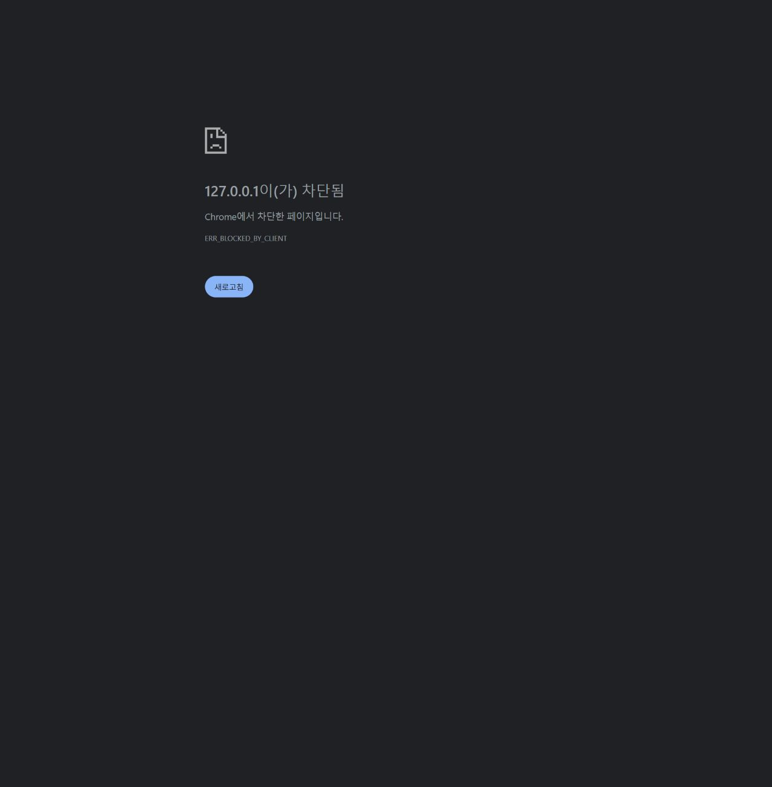

# 지속 제품 탐색 2회차 — 재사용 여정, 브라우저 제한

2026-10-03 16:09 KST heartbeat. **이번 회차 신규 실증 결함은 0개다. 제품 화면에 접근하지 못했으며, 소스 관찰을 실제 UI 검증으로 대체하지 않았다.** 기존 D-01~03은 중복 등록하지 않았다.

## 먼저 논의한 사용자 여정

독립 탐색 담당은 다음 두 후보를 제품·프론트 담당에게 제시했다.

- A: 동료가 전달한 정의를 가져와 기존 흐름과 비교·재사용할 때 적용 대상과 교체 범위를 이해한다.
- B: 처음 받은 복잡한 흐름에서 입력 출처·분기를 파악하고 작은 수정의 영향을 판단한다.

제품 담당은 A를 조건부 선택했다. 탐색 도구로 보기 쉽다는 이유보다 **이전 검증이 자신의 흐름 실행에 집중됐고 동료 정의를 받아 재사용하는 여정은 미검증**이라는 점을 선정 근거로 삼았다. 프론트 담당도 A에 동의했다.

계획한 실제 동선은 기존 격리 흐름 열기 → 현재 캔버스 내보내기 확인 → 가져오기 모달에서 JSON 붙여넣기 → 현재 캔버스 교체인지 새 흐름 생성인지, 적용 후 저장의 의미를 읽기 → 버전 선택과 실제 복원의 차이를 확인하기였다. 적용·저장·복원·실제 실행은 하지 않기로 정했다. 새 흐름부터 만들기·취소·내보내기 백업이라는 기존 대안이 충분한지도 같이 판단하기로 했다. 공유 매니페스트 부재나 이미 검증된 자원 진단을 새 결함으로 반복하지 않는다.

## 실제 시도와 제한

1. 이전 CUA 문서를 갱신하고 기존 IAB browser 2의 탭 목록을 요청했으나 `Browser is not available: 2`였다.
2. 지원 화면 목록을 조회한 결과 Chrome만 가용했고 IAB는 반환되지 않았다.
3. 사용자의 기존 탭을 건드리지 않고 `FlowLink 재사용 탐색` 전용 Chrome 탭에서 `http://127.0.0.1:18182/flows`를 열었다.
4. Chrome은 `ERR_BLOCKED_BY_CLIENT`를 반환했다. 실제 오류 화면에서도 `127.0.0.1이(가) 차단됨`과 `Chrome에서 차단한 페이지입니다.`를 읽었다. 오류 화면을 캡처했다.
5. 주 담당이 지원된 앱 도구로 IAB 열기를 요청했으나 결과는 `queued`였다고 전달했다. 이후 가용 화면을 한 번 더 확인했지만 여전히 Chrome만 표시됐다.
6. 보호 설정을 해제하거나 차단을 우회하지 않았다. 이번에 만든 오류 탭은 닫았으며 브라우저 사용권을 주 담당에게 반환했다.

이미지는 FlowLink 제품 오류가 아니라 브라우저 접근 제한의 증거다. 주 담당은 18182 health 요청에서 HTTP 401 응답을 확인했으므로 프로세스가 응답하지 않는다는 결론도 내리지 않았다. 백그라운드 자동화의 UI 제약일 가능성은 있지만 원인은 확정하지 않았다.

**실행 빌드·뷰포트:** 이번에는 제품 DOM을 읽지 못해 현재 실제 로드된 번들과 제품 뷰포트를 확인하지 못했다. 이전 기록의 `index-_HT7zFFH.js`를 이번 회차 확인값으로 재사용하지 않는다. 제품 조작 성공·실패, 새 결함, 정상 UI 검증 건수 모두 0이다.

## 소스에서만 확인한 계약과 다음 실증 질문

아래는 읽기 전용 코드 확인이며 브라우저에서 검증한 결과가 아니다. 제품 결함으로 채택하지 않는다.

| 소스 근거 | 확인한 구현 계약 | 다음 실제 화면에서 확인할 질문 |
| --- | --- | --- |
| `frontend/src/openapi/WorkflowIODialog.tsx:24`, 81 | 내보내기 JSON은 저장된 버전이 아닌 현재 `getGraph()`이며 현재 캔버스라는 설명이 있다. | 미저장 편집 포함 여부와 공유 범위를 사용자가 행동 전에 이해할 수 있는가? 오래된 문서의 palette 누락을 현재 문제로 단정하지 않는다. |
| `frontend/src/openapi/WorkflowIODialog.tsx:155` 부근 | 가져오기에 현재 캔버스 대체 및 저장 전 되돌리기 안내가 있다. | 실제 크기·배치에서 교체 경고가 보이고, 붙여넣은 정의가 새 흐름 생성이 아니라 현재 흐름에 적용된다는 의미가 충분히 드러나는가? |
| `frontend/src/openapi/ImportDialog.tsx:12` 및 탭별 본문 | 워크플로 JSON은 교체, OpenAPI·Mock은 팔레트 추가, cURL은 노드 추가다. | 같은 가져오기 UI 안의 추가와 교체가 각 행동 전에 명확히 구분되는가? 설명이 충분하면 정상으로 기록한다. |
| `frontend/src/components/VersionHistoryDialog.tsx:44` | 버전 선택은 조회·비교이고 복원은 API를 통해 새 버전을 즉시 저장한다. 보존 저장은 현재 미저장 편집도 포함한다. | 이전 정의 보기와 저장 효과가 있는 복원이 구분되는가? 실제 복원 버튼은 누르지 않고 안내를 먼저 관찰한다. |

제품 담당은 근거 없는 palette 손실이나 새 공유 형식 요구를 만들지 말라고 반론했다. 프론트 담당은 교체·추가·즉시 저장이 서로 다른 실제 계약이라는 점을 확인했다. 모두 **화면 실증 전 신규 결함 채택 보류**에 동의하는 범위로 기록했다.

## 다음 회차 인수인계

- 브라우저 지원 상태가 정상일 때 위 A 여정을 그대로 이어간다. 제품 화면에 접근하기 전에 기존 제어 제한부터 분리한다.
- 기존 D-01~03과 이전 제품 재검토 항목을 다시 새 발견으로 세지 않는다.
- 제품 소스, DB, 사용자 자료, 설치본, 서버 설정, 권한은 변경하지 않았다. MCP 테스트·IDE 등록은 수행하지 않았다.
- 토큰·티켓 발급 및 출력은 하지 않았다. 네트워크 차단·뷰포트 override·브라우저 보호 변경도 없었다.
- 자동화는 기존 `flowlink` heartbeat를 유지하며 추가로 만들지 않았다.
