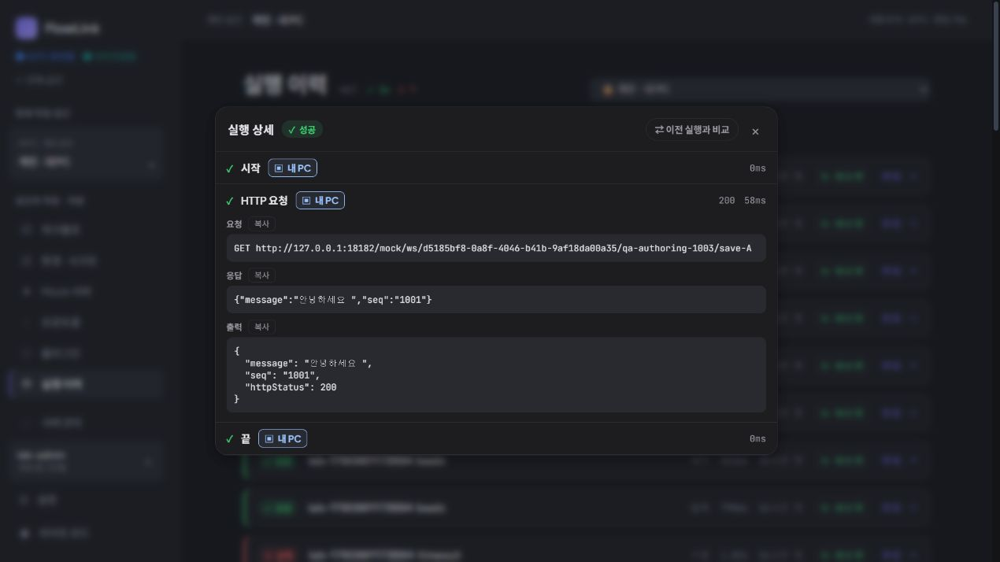
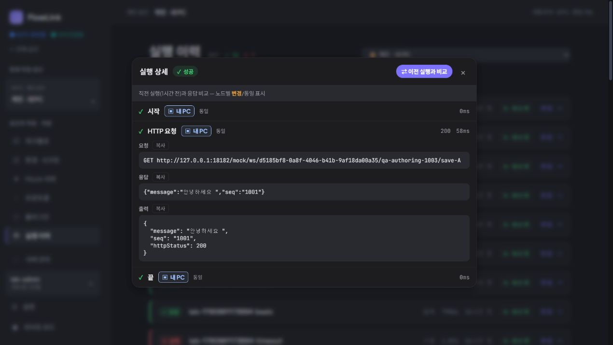
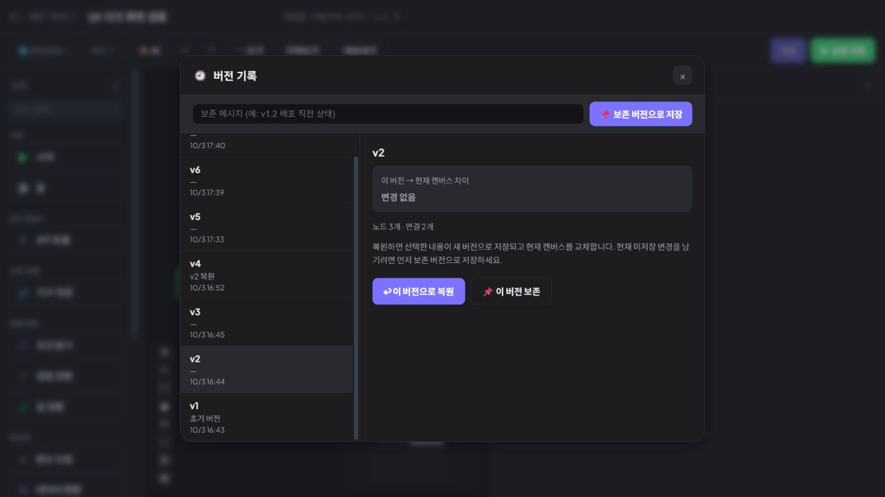

# 지속 제품 탐색 3회차 — 과거 실행의 원본 버전 식별

2026-10-03 18:19 KST heartbeat, 18:25 KST 관찰 정리. **새 개선 1건(D-04)을 채택했으며 구현은 시작하지 않았다.** 호출 결과의 오류나 오실행을 발견한 것은 아니다. 우선순위는 낮음~중간이며 에이전트 아키텍처 작업의 선행 조건이나 릴리스 차단 항목으로 삼지 않는다.

## 탐색 범위와 선정 토론

최신 아키텍처 문서, 제품 재검토 결정, authoring 검증, 앱 업데이트 기록과 탐색 1·2회차를 대조했다. 제품 담당 `product_adoption_review`와 구현 담당 `continuous_product_discovery`는 다음 후보를 검토했다.

- TCP 전문의 전송 전 미리보기: 기존 미검증 후보와 겹치고 별도 응답 순서 자료가 필요해 이번에는 제외했다.
- 과거 실행의 요청·결과를 읽고 실행 당시 정의와 현재 정의를 구분하기: 기존 실행 자료만 읽어 확인할 수 있고, D-02의 집계 및 D-03의 상세 접근성과 다른 목적이므로 선택했다.

선정 전에 두 담당이 반론을 교환했다. `편집`이 최신 정의를 여는 것은 정상이며 비교 UI의 부재 자체를 결함으로 삼지 않기로 했다. 기존 버전 기록이 충분한 대안인지 먼저 확인하고, 입력·본문이 보이지 않더라도 수집 제한 정책일 수 있으므로 노출 확대를 미리 해법으로 정하지 않았다.

CUA 브라우저는 루트만 사용했다. 기존 담당들은 브라우저 조작을 하지 않았으며 사용자 탭 대신 별도 임시 탭에서 읽었다.

## 실행 환경과 기존 자료

| 항목 | 이번 관찰값 |
| --- | --- |
| 대상 | 격리 개인 앱 `http://127.0.0.1:18182` |
| 실제 로드한 번들 | DOM script의 `/assets/index-BcjDk_Wq.js` — 이번 0.3.4 검증 배포와 일치 |
| 화면 | CUA IAB, 1280 × 720, 다크 모드, 별도 viewport override 없음 |
| 워크스페이스 | 기존 개인 공간 `d5185bf8-0a8f-4046-b41b-9af18da00a35` |
| 워크플로 | 기존 `QA 다크 화면 검증`, ID `90233fab-3015-461d-9fba-3afe496df71b` |
| 기존 이력 | 개인 공간 전체 46건, 선택한 워크플로의 목록 최상단 실행은 성공·수동·331ms·1시간 전 |
| 현재 정의 | 목록에서 v7, 버전 기록에서 v7 현재·10/3 17:40 |

새 워크플로·Mock·실행·인증 자료를 생성하지 않았다. 저장·복원·보존·재실행·권한 변경을 하지 않았다. 18080은 이번 여정에서 조작하지 않았고 설치된 개인 앱 18180도 건드리지 않았다. MCP 프로토콜·도구 호출·IDE 등록은 테스트하지 않았다. 인증 토큰과 브라우저 티켓은 기록하지 않았다.

## D-04 — 해당 과거 실행의 원본 버전을 식별할 수 없음

**사용자 목적:** 현재 워크플로를 다시 편집하기 전에, 선택한 과거 성공 결과가 어느 저장 버전에서 나온 것인지 확인한다.

**재현 동선:**

1. 개인 공간의 `실행 이력`을 연다.
2. `QA 다크 화면 검증` 중 최상단 성공 실행(331ms)의 `실행 결과 상세 보기`를 누른다.
3. `HTTP 요청`을 펼쳐 당시 요청·응답·출력을 읽는다.
4. `이전 실행과 비교`를 누르고 제공되는 비교 정보를 읽는다.
5. 상세를 닫고 같은 행의 `편집 →`을 누른다.
6. `도구 → 버전 기록`을 열고, 기존 v2를 선택해 조회한다. 복원 버튼은 누르지 않는다.

**실제 결과:**

- 상세 제목에는 `실행 상세`와 `성공`이 표시된다. 각 노드의 내 PC 실행 위치·상태·소요 시간과 HTTP 200을 읽을 수 있다.
- HTTP 요청은 기존 테스트 Mock의 `GET .../qa-authoring-1003/save-A`이며 응답과 출력도 정상적으로 표시된다. 무엇을 호출했고 어떤 응답을 받았는지는 확인 가능하다.
- 상세에는 선택한 실행의 원본 버전 번호·식별자와 절대 실행 시각이 표시되지 않는다. 목록은 `1시간 전`이라는 상대 시각을 표시한다.
- 비교 기능은 `직전 실행(1시간 전)과 응답 비교`와 노드별 `동일`을 표시한다. 실행 당시 정의와 버전의 연결은 제공하지 않는다.
- `편집 →`은 현재 정의를 정상적으로 연다. 버전 기록에는 v1~v7과 저장 시각이 있고 v7이 현재다. 그러나 선택했던 실행과 어느 버전이 연결되는지는 표시하지 않는다.
- v2 조회는 현재 캔버스와 `변경 없음`, 노드 3개·연결 2개를 표시한다. 조회와 복원은 분리되어 있다.

**기대의 근거:** 이력의 재실행 버튼은 `같은 조건(원본 버전+입력)으로 다시 실행`이라고 안내한다. 제품이 실행과 원본 버전의 연결을 이미 관리하므로, 사용자가 실행 결과를 읽을 때 그 버전을 식별할 수 있어야 한다. 단순히 새 비교 화면을 추가하자는 취향의 제안이 아니다.

**소스 대조:** `backend/src/main/kotlin/com/flowlink/execution/dto/ExecutionDetail.kt:11`과 `frontend/src/api/types.ts:434`에 `flowVersionId`가 있으며 `startedAt`도 반환된다. `frontend/src/routes/Executions.tsx:207`의 상세는 이를 버전 식별정보로 표시하지 않는다. `FlowVersionSummary`는 ID와 `versionNo`를 갖는다. 반면 초기 `inputJson`은 Execution 엔티티에 저장되지만 현재 ExecutionDetail DTO에는 없으므로, 입력까지 단순 UI 누락이라고 기록하지 않는다.

**반증과 제한:** 실행에 사용된 정확한 버전 번호는 이번 UI에서 확인하지 못했다. v2와 현재 v7의 그래프가 동일하므로 서로 다른 그래프를 잘못 읽었거나 잘못 실행했다는 증거는 없다. 원본 그래프 손실도 주장하지 않는다. 기존 요청·응답 조회, 현재 정의 편집, 저장 버전 비교는 정상이다.

**기존 목록과의 차이:** D-02는 목록 집계의 범위, D-03은 키보드 상세 진입, authoring 검증은 정의 가져오기·저장·복원의 의미를 다뤘다. 이번 항목은 이미 열린 특정 실행 결과를 그 원본 정의 버전에 연결해 식별하는 문제다. 기존 항목을 재등록하지 않는다.

## 반론 교환 후 개선 목록

제품 담당은 요청·응답이 읽히므로 호출 내용 확인은 이미 성립한다는 반론을 제시했다. 구현 담당은 버전 ID가 반환되지만 화면에서 사용되지 않는다는 근거와, 버전 목록 조회 실패가 기존 로그 읽기까지 막으면 안 된다는 제약을 제시했다. 두 담당 모두 다음 최소 범위에 합의했다.

| 상태 | 항목 | 범위와 완료 판정 |
| --- | --- | --- |
| 채택 · 미착수 | D-04 실행 원본 버전 식별정보 | 상세에 실행 당시 버전과 절대 실행 시각을 표시한다. 버전 매핑 실패·삭제·권한 제한 시 식별자와 확인 불가 상태를 표시하되 기존 결과 조회는 유지한다. 현재 Flow 이름을 과거 이름의 스냅샷처럼 표시하지 않는다. 재실행·복원 없이 정보만 읽을 수 있어야 한다. |
| 보류 · 미검증 | 입력·본문의 미기록 사유 구분 | 이번 기존 자료에서 요청·응답은 정상 표시됐다. 적절한 수집 제한 자료를 관찰하지 못했으므로 새 문제로 채택하지 않는다. 시크릿·본문 노출 확대를 요구하지 않는다. |
| 제외 | 새 정의 비교 화면·자동 복원 연결 | 기존 버전 비교는 정상이다. 이번 결함을 해결하기 위한 필수 범위가 아니다. |

제품 소스 수정과 테스트 실행은 없었다. 스크린샷과 이 기록만 추가했다. 다음 탐색에서는 D-04를 새 발견으로 다시 세지 않으며, 더 중요한 아키텍처·실행 목적지 작업보다 앞세우지 않는다. 임시 탐색 탭은 닫고 기존 사용자 탭을 유지했다.
