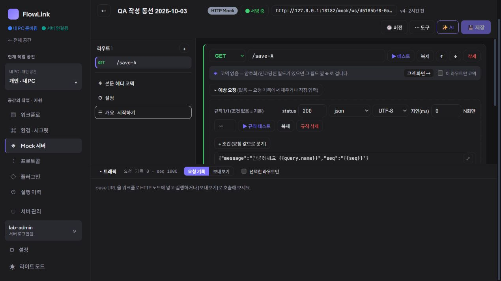

# 지속 제품 탐색 4회차 — Mock 요청 기록 읽기

2026-10-03 19:20 KST heartbeat. **신규 실증 문제 0건. 실제 앱은 확인했지만 기존 요청 기록이 없어 요청 상세를 해석하는 과업은 미검증으로 남겼다.** 제품 소스는 수정하지 않았다.

## 먼저 논의한 사용자 과업

최근 목표 아키텍처, 제품 재검토 결정, 앱 업데이트·UI 검증과 탐색 1~3회차를 읽었다. 3회차 이후 새 개발 기록은 없었다. D-01~03의 수정 항목, D-04의 실행 원본 버전 식별, 기존 목록 규모·authoring·업데이트 검증은 반복하지 않았다.

제품 담당 `product_adoption_review`와 구현 담당 `continuous_product_discovery`가 **이미 받은 Mock 요청에서 메서드·경로·상태·반환 결과를 읽는 작업**을 선택했다. 첫 회의 Mock 경로 검색·정의 조회와 달리 실제 들어온 요청 기록을 해석하는 목적이다.

두 담당은 사전에 다음 반론을 교환했다.

- 규칙 식별자가 UUID라고 해서 현재 규칙으로 이동하는 기능을 반드시 추가해야 하는 것은 아니다. 규칙은 이후 변경·삭제됐을 수 있다.
- 과거 정의 버전 표시 부재만 관찰하면 D-04와 유사한 재발견이므로 새 항목으로 채택하지 않는다.
- 본문 미보관이나 메모리 보존 정책 자체를 결함으로 전제하지 않는다. 새 영속 로그 기능을 미리 해법으로 삼지 않는다.
- 기존 기록이 없으면 새 호출로 자료를 만들지 않고 미검증으로 마감한다.

브라우저 사용 중인 다른 담당자가 없음을 확인했다. 실제 CUA 조작은 루트만 했고 리뷰 담당들은 읽기·토론을 맡았다.

## 실제 브라우저 관찰

| 항목 | 이번 관찰 |
| --- | --- |
| 검증 앱 | `http://127.0.0.1:18182` 개인 격리 앱 |
| 로드된 번들 | DOM script `/assets/index-BcjDk_Wq.js`, 기존 0.3.4 검증 배포와 일치 |
| 화면 | CUA IAB 임시 탭, 1270 × 720, 다크 모드, viewport override 없음 |
| 개인 공간 | `d5185bf8-0a8f-4046-b41b-9af18da00a35` |
| 선택한 기존 자료 | `QA 작성 동선 2026-10-03`, Mock ID `94dd1c0a-34ee-4130-ab2d-0ad9cab6a4c8`, v4 |

**동선:** 개인 공간의 Mock 목록 → 기존 QA Mock 열기 → 트래픽의 `요청 기록` 탭 선택 → 기록 수·필터·빈 상태 안내 읽기.

**실제 결과:**

- 목록은 기존 Mock 7개(HTTP 6개, TCP 1개)를 표시했고 모두 `요청 없음`이었다.
- QA Mock 상세는 `서빙 중`, `GET /save-A`, 정의 v4를 표시했다.
- 트래픽은 `요청 기록 0 · seq 1000`을 표시했다. `선택한 라우트만` 필터는 꺼져 있었다.
- 빈 안내는 `base URL을 워크플로 HTTP 노드에 넣고 실행하거나 [보내보기]로 호출해 보세요`였다.
- 요청 행이 없어 메서드·경로·반환 상태·본문·규칙 정보를 펼쳐 읽는 단계에는 도달하지 못했다.

**기대의 근거:** 화면이 `요청 기록`과 기록 수를 제공하므로 기존 수신 요청을 읽는 작업을 선택했다. 관찰한 0건 상태에서는 특정 요청 상세를 보여줄 근거가 없으며 안내도 현재 상태와 모순되지 않는다. 이전 실행 이력이 있다는 사실만으로 현재 Mock 기록이 남아 있어야 한다고 단정하지 않았다.

## 관찰 후 교차 검토

구현 담당이 `MockRuntimeStore.kt`를 대조했다. 저장소는 인메모리 런타임 상태로 재시작 시 초기화하며, 없는 journal은 빈 목록을 반환한다. `seq`의 기본값은 1000이므로 **화면의 seq 1000은 1,000건을 수신했다는 뜻이 아니다.** `MockServerEditor.tsx`는 journal 0건과 라우트 필터 결과 0건의 안내를 구분한다.

제품 담당은 빈 상태의 원인이 이번 배포 재시작인지, 별도 초기화인지, 현재 프로세스에서 요청하지 않았기 때문인지는 관찰만으로 구분할 수 없다고 반론했다. 두 담당은 원인 추정을 결함으로 승격하지 않는 데 동의했다. 브라우저 자동화 장애는 없었으며 실제 앱을 보았다.

| 상태 | 항목 | 판단 |
| --- | --- | --- |
| 확인 | 기존 자료의 요청 기록 0건과 빈 안내 | 실제 UI 확인. 현재 필터 때문에 기록을 숨긴 상태는 아님. |
| 보류 · 미검증 | 받은 요청의 메서드·경로·응답·규칙 해석 | 현존 요청 행이 없어 정상·결함 어느 쪽으로도 판정하지 않음. |
| 미채택 | 본문·규칙 정보 누락, 기록 유실, 새 영속 journal | 실제 증거 부족. 코드 후보나 메모리 정책만으로 신규 문제를 만들지 않음. |

신규 개선 목록 추가는 없다. 이후 정상 개발 검증에서 자연스럽게 기존 격리 Mock 기록이 생겼을 때 이 과업을 이어갈 수 있다. 탐색만을 위해 반복 호출하거나 테스트 자료를 채우지 않는다.

이번 회에는 저장·실행·재전송·테스트·초기화·규칙 초안·권한 변경을 하지 않았다. MCP 호출·IDE 등록도 하지 않았다. 18080 서버와 설치본 18180을 조작하지 않았다. 인증 토큰·브라우저 티켓을 읽거나 기록하지 않았다. 스크린샷과 이 문서만 추가했으며 임시 탐색 탭은 닫고 사용자 탭은 유지했다.
