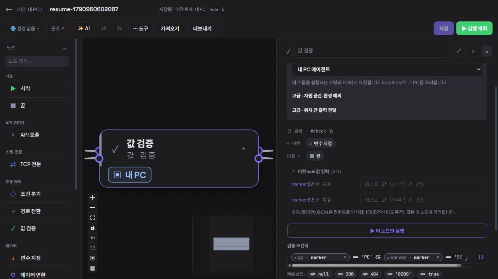
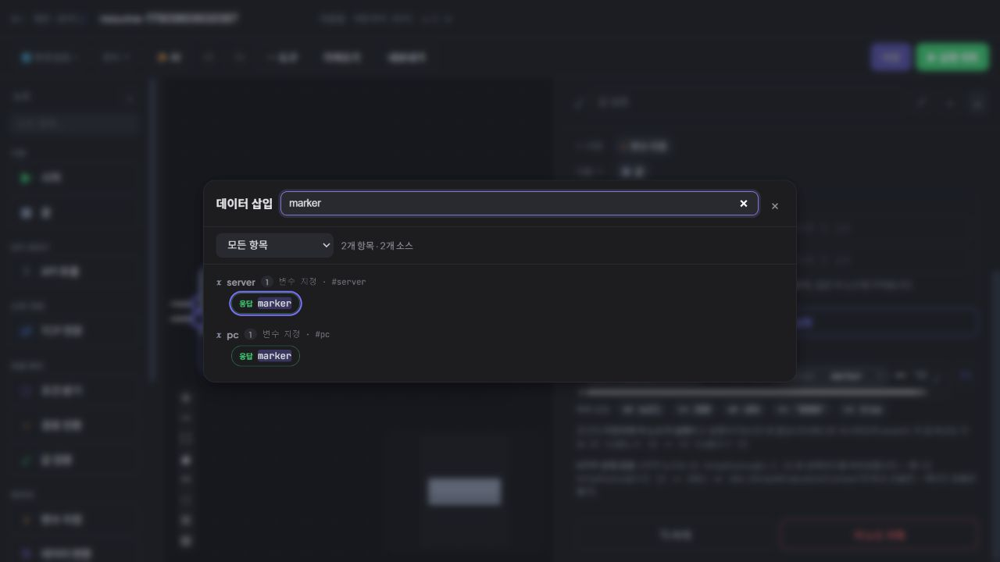

# 지속 제품 탐색 5회차 — 같은 키를 제공하는 상위 노드 구분

2026-10-03 20:20 KST heartbeat. **신규 실증 문제 0건. 기존 복수 상위 노드의 같은 출력 키를 구분하는 읽기 과업은 관찰한 자료에서 성립했다.** 제품 소스·정의·실행 자료는 변경하지 않았다.

## 선정과 사전 반론

목표 아키텍처, 제품 재검토 결정, 앱 업데이트 기록, 탐색 1~4회차와 최근 문서 목록을 대조했다. 4회차 이후 새 개발 기록은 없었다. D-01~04, Mock 빈 요청 기록, 대량 목록, 작성·저장·복원·업데이트 검증을 반복하지 않았다.

제품 담당 `product_adoption_review`와 구현 담당 `continuous_product_discovery`는 다음 후보를 논의했다.

- 기존 복합 흐름에서 하위 노드가 어느 상위 노드의 값을 사용하는지 읽기.
- TCP 프로토콜의 필드·바이트 위치·문자셋을 전송 없이 읽기.

첫 후보는 초기 탐색의 미확인 여정이었고 기존 바인딩 칩·출처 툴팁·선택기라는 정상 대안을 먼저 평가할 수 있어 선택했다. 두 담당은 표시 이름이 같다는 사실만으로 결함을 만들지 않으며, 전역 출처 추적 기능을 미리 해법으로 정하지 않기로 했다. 바인딩 선택기의 검색·펼침·닫기만 허용하고 항목 클릭·Enter 삽입·값 수정·실행은 제외했다.

브라우저를 사용하는 다른 담당자가 없음을 확인했다. 루트만 CUA 임시 탭을 사용하고 두 담당은 관찰 결과를 교차 검토했다.

## 실제 대상과 동선

| 항목 | 이번 관찰 |
| --- | --- |
| 앱 | 격리 개인 앱 `http://127.0.0.1:18182` |
| 실제 로드 번들 | DOM script `/assets/index-BcjDk_Wq.js`, 0.3.4 검증 배포와 일치 |
| 화면 | CUA IAB, 1280 × 720, 다크 모드, viewport override 없음 |
| 공간 | 기존 개인 공간 `d5185bf8-0a8f-4046-b41b-9af18da00a35` |
| 기존 자료 | `resume-1790960602087`, ID `c31d60da-abde-4822-be94-cf7a768bc70a`, 목록 v2·6노드 |
| 연결 | `s → gate → pc → server → check → e` |

**사용자 목적:** 같은 `marker`라는 이름의 값이 여러 상위 노드에 있을 때 검증 조건식의 각 값이 어디서 오는지 확인한다.

**재현 동선:**

1. 워크플로 목록에서 기존 `resume-1790960602087`을 검색해 연다.
2. 하위 `값 검증` 노드의 속성을 연다. 이번 자료의 캔버스 노드들은 겹쳐 있었고 직접 클릭에서는 `끝`이 선택됐다. 속성의 `이전 → 값 검증` 버튼으로 목표 노드에 이동했다.
3. 기존 검증 조건식의 토큰 칩을 읽고 `이전 노드 값 입력`을 펼쳐 출처 설명을 읽는다. 임시 입력값은 넣지 않는다.
4. `데이터 삽입`을 열어 소스별 구분을 읽고 검색에 `marker`를 입력한다. 결과 항목을 누르거나 Enter를 입력하지 않는다.
5. `닫기`로 돌아와 저장 버튼이 계속 비활성임을 확인한다.

## 실제 결과와 기대 근거

검증 조건식은 다음 기존 두 참조를 사용한다.

```text
{{ marker@pc }} == 'PC' && {{ marker@server }} == 'SERVER'
```

- 토큰 칩은 `pc · marker`와 `server · marker`를 구분해서 표시한다.
- `이전 노드 값 입력`의 두 라벨은 모두 `marker @ 변수 지정`이다. 그러나 각각의 툴팁에는 명시적인 `{{ marker@pc }}`와 `{{ marker@server }}`가 들어 있다. 값은 입력하지 않았다.
- 선택기는 처음에 `server`, `pc`, `gate` 3개 소스를 노드 종류와 `#server`, `#pc`, `#gate`로 구분했다.
- `marker` 검색 후 `2개 항목 · 2개 소스`가 표시됐고, `server`와 `pc` 각각의 `응답 marker`를 읽을 수 있었다.
- 선택기를 닫은 뒤 `저장` 버튼은 여전히 비활성이었다. 선택·삽입·저장·실행은 하지 않았다.





**기대 근거:** 기존 토큰 문법이 명시 출처를 지정하며 선택기가 노드별 항목을 제공한다. 같은 키도 소스 ID와 연결해 읽을 수 있으면 이번 목적이 충족된다. 관찰한 칩·툴팁·선택기는 이 계약에 맞았다.

## 관찰 후 반론과 상태

제품 담당은 단일 실행용 입력 영역의 표시 이름이 반복되지만 토큰 칩과 선택기에서 출처가 구분되므로 별도 문제로 채택할 근거가 약하다고 판단했다. 구현 담당은 `PropertyPanel.tsx:715`의 명시 출처 툴팁과 `BindingPicker.tsx:65` 이후의 키·노드 검색, `:83`의 노드 종류·ID 표시가 실제 관찰과 일치함을 확인했다. 두 담당은 신규 0건에 합의했다.

| 상태 | 항목 | 판단 |
| --- | --- | --- |
| 정상 확인 | 복수 상위 노드의 같은 출력 키 출처 읽기 | 기존 pc/server의 marker를 칩·툴팁·검색 결과에서 구분했다. |
| 미채택 | 반복된 단일 실행 입력 라벨 | 명시 ID를 확인할 기존 대안이 있어 새 결함으로 채택하지 않았다. |
| 미판정 | 기존 자료의 캔버스 노드 겹침 | 실제 관찰 제약으로만 기록한다. 저장 좌표의 원인이나 새 노드 배치 회귀를 확인하지 않았다. 기존 노드 이동으로 목적을 수행했다. |

기존 목록과의 차이는 특정 과거 실행의 버전 식별(D-04)이 아니라 **현재 정의 안에서 두 상위 출력의 출처를 읽는 작업**이다. 이번 자료는 직접 참조 두 개와 같은 출력 키를 포함하므로 그 범위만 정상으로 판단한다. 모든 요청/응답 스코프, 환경·시크릿, 동명 사용자 지정 노드, 대규모 그래프까지 검증했다고 확대하지 않는다. 토큰 대체·실제 실행의 정합성도 이번 읽기 관찰의 범위 밖이다.

새 개선 목록이나 구현 작업은 추가하지 않았다. 18080 서버와 설치본 18180을 조작하지 않았고 새 자료·인증·권한 변경, MCP 호출·IDE 등록, 테스트 실행은 없었다. 토큰·브라우저 티켓은 기록하지 않았다. 스크린샷과 이 문서만 추가하고 임시 탐색 탭은 닫았다.
