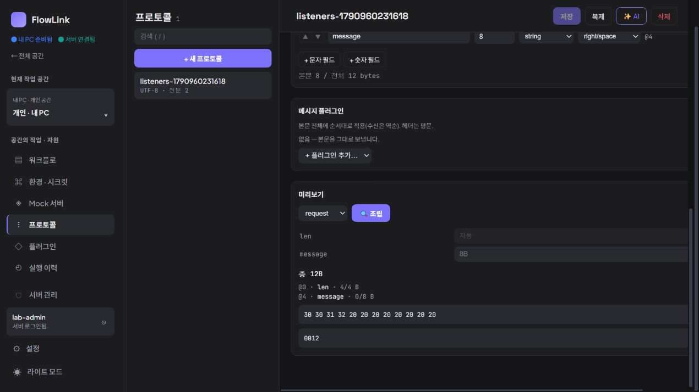

# 지속 제품 탐색 6회차 — TCP 전문 규격 읽기

2026-10-03 21:20 KST heartbeat. **신규 실증 문제 0건. 기존 TCP 규격의 필드·길이·위치를 읽고 TCP 전송 없이 빈 값 조립 결과를 확인했다.** 제품 소스와 저장 정의는 수정하지 않았다.

## 선정과 사전 토론

최근 목표 아키텍처·제품 재검토·앱 업데이트 기록과 탐색 1~5회차를 대조했다. 5회차 이후 새 개발 기록은 없었다. 제품 담당 `product_adoption_review`와 구현 담당 `continuous_product_discovery`는 **기존 전문의 송신·수신 필드와 문자셋, 바이트 배치를 확인하는 작업**을 선택했다.

초기 탐색의 미리보기 응답 순서 경쟁 후보와 달리 이번 목적은 저장된 정상 규격의 해석이다. 경쟁 조건을 만들거나 TCP 요청을 보내지 않는다. 기존 길이·위치·HEX 표시가 충분한지 먼저 평가하고 새 뷰어를 해법으로 전제하지 않았다.

구현 담당은 `ProtocolService.preview`가 정의를 저장하거나 TCP 소켓으로 전송하지 않고 `ProtocolCodec.encode`를 통해 바이트·텍스트·HEX·필드 위치를 반환함을 확인했다. 다만 설정된 코덱을 실행할 수 있고 환경 저장 대기를 처리하는 경로가 있으므로, 환경을 편집하지 않은 새 탭에서 **플러그인이 없는 기존 자료만** 조립하기로 두 담당이 합의했다. 브라우저는 루트만 사용했다.

## 실제 대상과 재현 동선

| 항목 | 이번 관찰 |
| --- | --- |
| 대상 | 격리 개인 앱 `http://127.0.0.1:18182` |
| 실제 번들 | DOM script `/assets/index-BcjDk_Wq.js`, 0.3.4 검증 배포와 일치 |
| 화면 | CUA IAB 임시 탭, 1270 × 720, 다크 모드, viewport override 없음 |
| 기존 프로토콜 | `listeners-1790960231618`, ID `6e72bdda-d53e-4721-a240-5799dfb14bce` |
| 공간 | 개인 공간 `d5185bf8-0a8f-4046-b41b-9af18da00a35` |

1. 개인 공간의 `프로토콜`에서 기존 프로토콜 한 개를 연다.
2. 인코딩·프레이밍과 request의 필드 정의를 읽는다. 헤더·본문의 플러그인 설정을 펼쳐 `(없음)`을 확인한다. 선택값은 변경하지 않는다.
3. `response` 탭으로 전환해 수신 필드를 읽고 `request`로 돌아온다. 전문 탭 이동은 선택 상태만 변경한다.
4. 미리보기 입력은 빈 값 그대로 두고 `조립`을 한 번 누른다. 실제 TCP 전송은 없다.
5. 결과까지 스크롤해 길이·필드 위치·HEX·텍스트를 읽고 저장 버튼이 계속 비활성인지 확인한다.

## 실제 결과와 기대 근거

| 규격 | 화면에서 읽은 값 |
| --- | --- |
| 문자셋 | UTF-8 |
| 헤더 | `len`, 4B, 위치 0, length, left/zero |
| 길이 형식 | ascii-decimal |
| 길이 값 | 헤더 포함 12 선택, 헤더 제외 8 대안 표시 |
| request 본문 | `message`, 8B, 위치 4, string, right/space |
| response 본문 | `origin`, 8B, 위치 4, string, right/space |
| 코덱 | 메시지 플러그인 없음. 헤더·request 필드는 펼친 설정에서 없음, response 필드는 미지정 버튼 설명 확인 |
| 빈 request 조립 | 총 12B, `len` 4/4B, `message` 0/8B |
| HEX | `30 30 31 32 20 20 20 20 20 20 20 20` |
| 텍스트 | `0012` 뒤 공백 8개 |

**기대의 근거:** 화면에 명시된 헤더 포함 길이 12, 4바이트 십진 길이 필드, 8바이트 오른쪽 공백 패딩과 조립 결과가 일치한다. 원래 값과 규격을 바꾸지 않고 이 관계를 읽을 수 있었다. 저장 버튼은 비활성을 유지했다.

## 반증과 한계

조립 후 처음 관찰한 화면에서는 편집 패널의 왼쪽 글자가 일부 잘려 보였다. DOM 확인에서 해당 패널은 `overflow-x: auto`, 표시 폭 748px, 내용 폭 839px, `scrollLeft` 약 36.67px였다. 사용자 방식의 왼쪽 스크롤 한 번으로 `scrollLeft=0`이 됐고 프로토콜 이름과 `@0`, `@4` 전체를 읽을 수 있었다. 수평 스크롤을 발생시킨 동작은 확정하지 않았으며 상시 판독 불가 결함으로 등록하지 않는다.

CUA 접근성 스냅샷은 request/response를 checkbox로 표현했지만 실제 DOM은 `aria-pressed`가 있는 button이었다. 실제 DOM에 맞춰 탭을 조작했고 전환은 정상이다. 자동화 선택자의 첫 실패를 제품 결함으로 삼지 않았다.

이번 자료의 빈 ASCII 값만 조립했다. 한글 멀티바이트·필드 초과·사용자 플러그인·다른 전문으로 빠르게 전환했을 때의 응답 경쟁·실제 TCP 통신은 검증하지 않았다. 이들을 통과했다고 확대하지 않는다.

## 교차 검토와 개선 목록

제품 담당은 바이트·위치·송수신 구분·조립 결과가 일치하므로 선정한 읽기 과업이 성립한다고 판단했다. 구현 담당은 미리보기의 전송·저장 경계와 화면의 기존 대안을 검토했다. 잘림 후보에는 수평 스크롤로 판독이 가능하다는 반증을 반영했다.

| 상태 | 항목 | 판단 |
| --- | --- | --- |
| 정상 확인 | 저장된 송수신 규격과 빈 request 조립 읽기 | 규격과 12바이트 결과가 일치하고 정의 수정·TCP 전송 없이 확인 가능 |
| 미채택 | 일부 글자 잘림 | 수평 스크롤 상태였고 사용자 스크롤로 전체 판독 가능. 발생 원인 미확정 |
| 미검증 유지 | 미리보기 응답 경쟁·멀티바이트·실제 전송 | 이번 목적 밖이며 별도 결함·통과로 추가하지 않음 |

신규 개선 목록은 없다. 기존 탐색과 달리 TCP 규격 해석을 관찰했으며, 이미 알려진 환경 목적지 진단이나 실행 버전 식별을 재등록하지 않았다. 18080 서버와 설치본 18180은 조작하지 않았다. 새 자료·권한·인증 변경, MCP 호출·IDE 등록, 반복 테스트는 없었다. 브라우저 티켓과 인증 토큰은 출력·기록하지 않았다. 결과 스크린샷과 이 문서만 추가하고 임시 탭을 닫았다.
