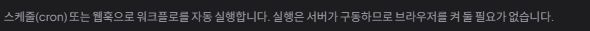

# 지속 제품 탐색 7회차 — 자동 실행 상태와 구동 위치 읽기

2026-10-03 22:21 KST heartbeat. **D-05 자동 실행 안내 개선 한 건을 채택했으며 구현은 시작하지 않았다.** 낮음~중간 우선순위의 표시 개선이다. 예약이 잘못 실행됐다는 증거는 없다.

## 선정과 사전 반론

최근 아키텍처·제품 토론·업데이트 기록과 탐색 1~6회차를 읽었다. 6회차 이후 새 개발 기록은 없었다. 제품 담당 `product_adoption_review`와 구현 담당 `continuous_product_discovery`가 독립적으로 **기존 자동 실행 설정에서 활성 여부·다음/최근 시각·구동 위치를 읽는 작업**을 제안하고 서로 반론을 교환해 선택했다.

기존 설정으로 가는 경로가 충분하면 새 바로가기를 요구하지 않는다. 시간대 라벨 부재만으로 시간 계산 결함을 전제하지 않는다. 목표 아키텍처의 미구현 부분을 새 결함으로 반복 등록하지 않는다. 기존 예약 한 개를 조회하며 생성·활성 전환·삭제·웹훅 복사·호출은 하지 않기로 했다.

`Editor`의 메뉴는 모달을 열고 `TriggersDialog`는 목록을 조회하며, 변경 핸들러는 별도임을 구현 담당이 확인했다. 다른 담당자의 브라우저 점유가 없었고 루트만 CUA 임시 탭을 사용했다.

## 실제 대상과 동선

| 항목 | 이번 관찰 |
| --- | --- |
| 앱 | 격리 개인 앱 `http://127.0.0.1:18182` |
| 실제 번들 | DOM script `/assets/index-BcjDk_Wq.js`, 0.3.4 검증 배포와 일치 |
| 화면 | CUA IAB, 1280 × 720, 다크 모드, viewport override 없음 |
| 공간 | 기존 개인 공간 `d5185bf8-0a8f-4046-b41b-9af18da00a35` |
| 기존 흐름 | `lab-1790961173894 basic`, ID `6a9e21df-d9c3-4c88-95e7-c1e8b320c94c`, v2 |

**사용자 목적:** 현재 예약이 앞으로 실행되는지, 자동 실행을 위해 어느 앱이 켜져 있어야 하는지 확인한다.

**재현:** 개인 워크플로 목록에서 기존 흐름 검색 → 열기 → 도구 → 자동 실행 트리거 → 기존 스케줄과 안내 읽기 → 닫기.

## D-05 — 꺼진 예약의 지난 시각이 다음 실행으로 표시됨

실제 스케줄 행에는 `*/1 * * * * *`, 상태 `꺼짐`, `다음 실행: 10/3 02:13 · 최근 10/3 02:13`이 함께 표시됐다. 관찰 시각은 같은 날 22시 이후였다. 활성 여부는 식별할 수 있지만, 꺼진 예약의 이미 지난 시각이 미래 실행을 뜻하는 `다음 실행`으로 남아 있다.

**기대 근거:** 이 화면의 `켜짐/꺼짐`은 자동 실행 여부를 제어하고 `다음 실행`은 앞으로의 예약을 설명한다. 비활성일 때는 실제 다음 실행이 없다는 사실을 표현해야 한다. 이는 오래된 내부 계산값을 삭제하자는 요청이 아니다.

구현 담당은 `TriggerService`에서 활성 상태 갱신 뒤 켜질 때만 다음 시각을 재계산하고, 꺼질 때 기존 `nextRunAt`을 보존하는 것을 확인했다. 예약 조회와 작업 선점은 비활성 항목을 제외한다. `TriggersDialog.tsx:74`는 활성 상태와 무관하게 이 값을 `다음 실행`으로 표시한다. 따라서 이번 발견은 **상태 표시의 모순**이며 스케줄러 실행 오류가 아니다.

### 같은 과업의 구동 위치 안내

모달은 `실행은 서버가 구동하므로 브라우저를 켜 둘 필요가 없습니다`라고 안내했다. 현재 공간은 `개인 · 내 PC`다.

구현 담당의 소스 대조에서 개인 공간은 local API를 사용하고, desktop 프로파일은 H2를 사용하며 `TriggerScheduler`는 개인 런타임에서 제외되지 않는다. **현재 개인 예약의 구동 프로세스는 PC 앱**이다. 설명의 서버를 기술적인 백엔드라는 뜻으로 읽으면 거짓은 아니라는 반증도 함께 기록한다. 다만 이 제품에서 `내 PC/서버`는 실행 위치를 구분하는 용어이므로 현재 공간에 맞는 주체를 밝혀 주는 작은 문구 보완을 D-05에 포함한다.

PC를 끄거나 프로세스를 중지하는 실험은 하지 않았다. 목표 로컬 Coordinator가 구현됐다고 주장하거나, 그 미구현을 이번 새 결함으로 삼지 않는다.

## 교차 검토와 채택 범위

제품 담당은 `꺼짐`이 명확하므로 자동 실행 오작동이 입증된 것은 아니라는 반론을 제시했다. 구현 담당은 비활성 예약 제외와 재활성 시 재계산이 기존 계약임을 확인했다. 두 담당은 데이터·스케줄러 변경 없이 화면의 의미를 맞추는 범위에 합의했다.

| 상태 | 항목 | 완료 판정과 경계 |
| --- | --- | --- |
| 채택 · 미착수 | D-05 자동 실행 상태·구동 위치 안내 | 꺼진 예약에는 `다음 실행 없음(꺼짐)`을 표시하고 최근 실행 시각은 유지한다. 개인 공간에서는 내 PC 앱, 서버 공간에서는 서버 프로세스가 구동한다는 안내를 사용한다. 원래 nextRunAt 보존·재활성 계산 계약은 변경하지 않는다. |
| 미검증 | 켜진 예약의 다음 시각·시간대·재활성화 | 기존 예약을 켜거나 만들지 않았으므로 정상·결함을 판정하지 않는다. |
| 미채택 | 새 트리거 바로가기·스케줄러 교체 | 기존 도구 메뉴에서 설정을 찾을 수 있었으며 이번 문제의 필수 수정이 아니다. |

**기존 목록과 차이:** D-02는 이력 집계 범위, D-04는 과거 실행의 원본 버전 식별이다. D-05는 현재 자동 실행의 향후 여부와 구동 주체를 읽는 문제다. 같은 과업의 표시·안내로 묶으며 아키텍처 작업의 선행 조건이나 릴리스 차단 항목으로 올리지 않는다.

## 관찰 범위와 기록 제한

기존 비활성 예약 한 개만 읽었다. 실제 자동 실행·웹훅 호출·활성 전환·삭제·저장은 하지 않았다. 18080 서버와 설치본 18180도 조작하지 않았다. MCP 프로토콜·도구·IDE 등록과 새 자료 생성은 없었다. 제품 소스 수정 없이 이 기록과 이미지 두 개만 추가했고 임시 탭은 닫았다.

스크린샷은 웹훅 행을 제외한 예약·안내 영역만 캡처했다. 접근성 출력이 웹훅 경로와 값을 여러 텍스트 조각으로 나누면서 첫 필터가 비활성 테스트 웹훅 값을 한 차례 놓쳤다. 이후 값 출력은 제외했고 문서·이미지에는 넣지 않았다. 브라우저 티켓과 로그인 인증 토큰은 수집하지 않았다. 이 실수를 제품 결함으로 기록하지 않는다.
