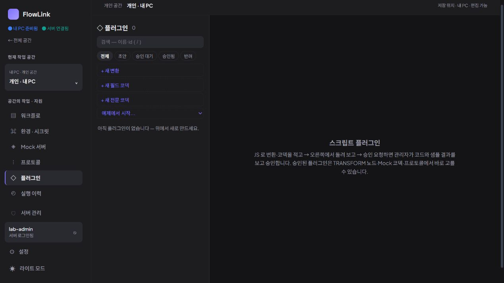

# 지속 제품 탐색 8회차 — 기존 플러그인의 사용 계약 찾기

2026-10-03 23:22 KST heartbeat. **신규 실증 문제 0건. 개인 공간의 스크립트 플러그인 목록이 비어 있어 구체적인 입출력 계약 읽기는 미검증으로 남겼다.** 제품 소스는 수정하지 않았다.

## 선정과 반론

목표 아키텍처·제품 재검토·앱 업데이트와 탐색 1~7회차를 대조했다. 7회차 이후 새 개발 기록은 없었다. D-01~05, Mock 요청 기록, 바인딩 출처, TCP 조립, 트리거, 작성·업데이트·대량 목록 검증은 반복하지 않았다.

제품 담당 `product_adoption_review`와 구현 담당 `continuous_product_discovery`는 **플러그인의 종류·사용 가능 상태·입출력 계약을 읽고 사용 방법을 판단하는 작업**을 논의했다. 기존 변환 노드 속성 조회와 플러그인 카탈로그 조회를 대안으로 검토했다. 여러 흐름의 선택 실행은 버튼이 실제 실행을 시작하므로 이번 읽기 탐색에서 제외했다.

제품 담당의 초기 ‘플러그인 상세 선택은 GET 조회뿐’이라는 가정은 구현 담당의 반론으로 철회했다. `PluginRunPanel`은 마운트 뒤 소스만 포함한 자동 검사 요청을 보내며, 상세 API도 메타데이터를 컴파일한다. 백엔드 대조에서는 입력 없는 검사 경로가 apply/encode/decode·환경/시크릿 해석·저장에 도달하지 않고, 스크립트 런타임은 IO·호스트 접근 등을 제한한다. 따라서 **메타데이터 평가를 수반한 읽기**이며 평가 자체를 결함으로 삼지는 않는다. 이 내용은 소스 확인이고 이번 브라우저에서 상세를 열어 실행한 결과가 아니다.

다른 담당자가 브라우저를 사용하고 있지 않았으며 루트만 CUA 임시 탭을 사용했다. 플러그인 상세·예제·새 작성·실행·승인 버튼은 누르지 않았다.

## 실제 관찰

| 항목 | 이번 관찰 |
| --- | --- |
| 앱 | 격리 개인 앱 `http://127.0.0.1:18182` |
| 실제 번들 | DOM script `/assets/index-BcjDk_Wq.js`, 0.3.4 검증 배포와 일치 |
| 화면 | CUA IAB, 1270 × 720, 다크 모드, viewport override 없음 |
| 공간 | 개인 공간 `d5185bf8-0a8f-4046-b41b-9af18da00a35` |

**사용자 목적:** 이미 등록된 플러그인을 사용하기 전에 역할·승인 상태·입출력 정보를 확인한다.

**동선:** 기존 개인 공간에서 왼쪽 `플러그인` 클릭 → 목록 조회 완료 확인 → 전체 필터의 개수·빈 상태·종류 설명과 사용 절차 읽기.

**실제 결과:** 전체 필터에서 스크립트 플러그인 0개이며 `아직 플러그인이 없습니다 — 위에서 새로 만드세요`라는 안내가 표시됐다. 변환·필드 코덱·전문 코덱의 생성 버튼과 용도 설명이 있고, 작성 → 시험 → 승인 요청 → 승인 후 워크플로·Mock·프로토콜에서 선택하는 절차가 안내됐다. 조회 완료 후에도 목록은 같았다.

**기대 근거:** 기존 목록과 종류·승인 상태를 제공하는 화면이므로 사용 전 계약을 찾는 경로로 선택했다. 현재 0건이라는 표시와 빈 안내는 일치한다. 실제 항목이 없어서 상세 입출력·설정값·승인본 차이를 판단할 단계에는 도달하지 못했다.

## 교차 검토 결과

| 상태 | 항목 | 판단 |
| --- | --- | --- |
| 정상 확인 | 개인 스크립트 목록의 빈 상태·종류·승인 절차 안내 | 현재 목록과 안내 사이의 모순은 관찰하지 못함 |
| 보류 · 미검증 | 구체적인 플러그인의 입출력 계약 읽기 | 기존 항목이 없어 상세 단계에 도달하지 못함 |
| 미채택 | 상세 메타데이터 자동 평가 | 소스에서 분류를 정정한 사항이며 그 자체로 제품 결함이 아님 |

두 담당은 신규 0건에 합의했다. 이 목록이 비었다고 해서 전체 33개 워크플로에 변환 노드가 없거나 내장·JAR 변환이 없다고 주장하지 않는다. 이를 확인하려고 모든 흐름을 순회하거나 새 자료를 만들지 않았다.

기존 5회차의 상위 출력 출처 추적과 달리 이번 목적은 변환 기능 자체의 사용 계약 확인이다. 정상으로 판단한 범위는 빈 목록과 안내까지이며, 구체 플러그인 사용성 검증을 통과했다고 확대하지 않는다.

제품 소스·정의·권한·인증 자료 변경과 새 테스트 자료 생성은 없었다. 18080 서버 및 설치본 18180을 조작하지 않았고, MCP 호출·IDE 등록·실제 외부 요청·반복 테스트도 하지 않았다. 비밀값을 출력하거나 문서에 포함하지 않았다. 이 기록과 스크린샷만 추가하고 임시 탐색 탭을 닫았다.
