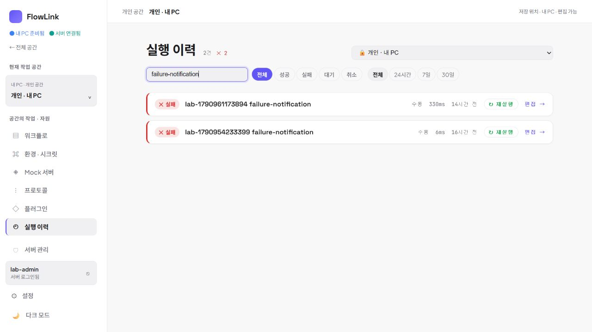
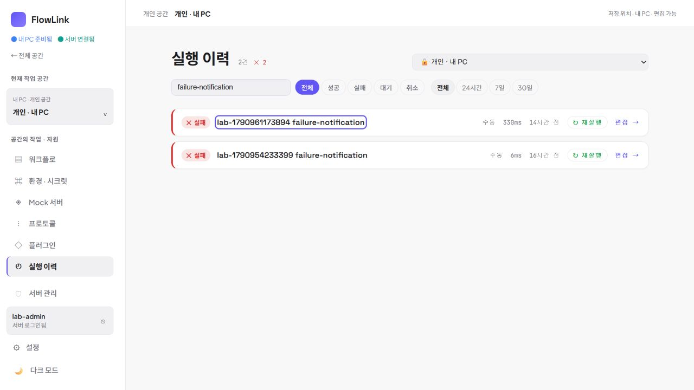
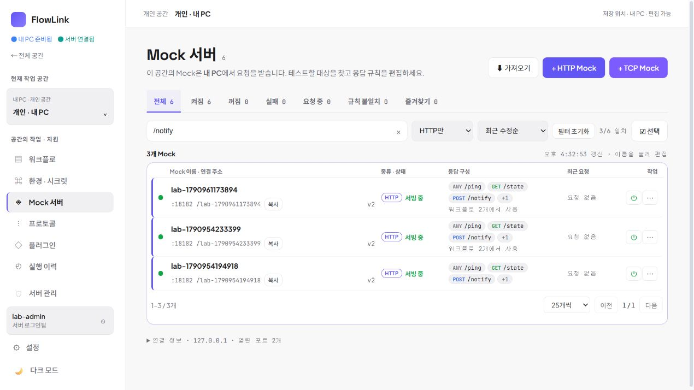

# 탐색에서 채택한 D-01~03 수정·배포 검증

2026-10-03 16:33 KST. 발견 기록에서 멈췄던 세 항목을 구현하고 18182 개인 검증 앱과 18080 Docker 서버에 반영했다. 이 기록은 해당 수정의 검증이며 제품 전체 완성 판정이 아니다.

## 담당과 교차 검토

- 목록 담당: D-01 워크플로·Mock의 출발 목록 맥락 유지 구현.
- 프론트 담당: D-02 이력 집계·빈 상태, D-03 키보드 상세 진입 구현. 목록 구현 독립 검토.
- 제품 담당: 구현 범위·예외 토론, 소스 검토, 실제 캡처 세 장 독립 검토.
- 주 담당: 연결 상태와 계정 식별을 분리하는 반례 제시, 통합 빌드·배포, 실제 브라우저 조작·검증.

제품 담당의 CUA에는 IAB가 노출되지 않아 브라우저 실측은 주 담당이 수행했다. 제품 담당이 같은 조작을 독립 수행했다고 주장하지 않는다.

## 수정 내용

- 워크플로·Mock 목록에서 상세를 열고 돌아오면 출발 목록의 검색·정렬·페이지와 필터를 유지한다. 체크 선택·팝업은 보존하지 않는다.
- 상태는 해당 브라우저 기록에 보관한다. 다른 계정·서버·공간에는 적용하지 않으며, 출발 기록 없는 직접 진입은 기존 소속 폴더/목록으로 돌아간다. 단순 연결 상태 변화는 계정 변경으로 취급하지 않는다.
- 이력 요약은 표시된 검색 결과와 같은 범위로 집계한다. 최초 이력 없음과 필터에 맞는 이력 없음을 구분하고 필터 해제를 제공한다.
- 실행 제목을 기본 버튼으로 제공해 키보드로 상세를 읽는다. 재실행·편집은 별도 동작으로 유지한다.
- 이력 조회 실패 시 현재 개인 PC/서버 공간과 실제 오류를 안내한다. 잘못된 고정 포트·존재하지 않는 개발 스크립트 안내를 제거했다. 이 보완은 제품·프론트 담당 동의 후 적용했다.

## 실제 브라우저 검증

최신 `index-DGMl3Bk3.js`를 로드한 별도 IAB 탭에서 기존 격리 자료를 사용했다. 사용자 기존 탭은 이동·새로고침하지 않았다.

| 작업 | 확인한 결과 |
| --- | --- |
| 워크플로 이름 검색 → 상세 → 목록 | `failure-notification`과 결과 2개 유지 |
| 두 번째 검색 결과 열기 → 브라우저 뒤로 | 같은 검색과 두 결과 유지 |
| 전체 32개 중 2페이지 → 상세 → 목록 | `26–32 / 32개`, `2 / 2` 유지 |
| 이력 이름 검색 | 실패 두 행과 `2건 ✕ 2`가 일치. 이전 전체 성공 34 표시 없음 |
| 이력 없는 검색어 → 필터 해제 | 조건 불일치 안내만 표시. 최초 실행 안내 없음. 해제 후 기존 44행 복귀 |
| 30일 필터에서 Tab | 첫 실행 제목의 상세 버튼에 도달하고 가시적 포커스 표시 |
| Enter → 상세 → Esc → Space | 상세 열림, 닫은 후 원래 제목 버튼으로 포커스 복귀, Space로 다시 열림. 재실행 버튼은 누르지 않음 |
| Mock `/notify` + HTTP만 + 최근 수정순 → 상세 → 목록 | 세 조건과 `3 / 6` 결과 유지 |

추가 캡처: 같은 폴더의 `workflow-search-return.png`, `history-keyboard-detail.png`, `history-no-match.png`. 제품 담당은 집계·포커스·Mock 복귀 캡처에서 이번 수정의 완료를 막는 잘림이나 가독성 문제를 확인하지 못했다.

## 자동 검증과 한계

- `node frontend/scripts/test-catalog-navigation.cjs` 통과: 실제 resolver/hook의 기록 왕복, 홈/폴더/직접 진입, 계정·서버·공간 경계, 연결 상태 변화, 여러 필터 갱신, Mock 페이지 및 축소된 목록 제한.
- `node frontend/scripts/test-executions.cjs` 통과: 실제 컴포넌트 출력·핸들러에서 집계, 검색/서버 상태/기간 필터의 빈 상태, 필터 해제, 상세·재실행·편집의 이벤트 분리, 개인/서버 오류·권한 안내·재시도.
- 변경 파일 lint 오류 0. 기존 Fast Refresh 경고 3개. 프론트 TypeScript/Vite 및 통합 bootJar 통과. Vite 기존 큰 청크 경고는 남는다. 변경 경로 diff 공백 오류 없음.
- 계정 변경·다른 서버·폴더 소속 직접 진입과 서버 필터 0건은 이번 실제 계정/자료를 변경해 재현하지 않았으며 위 focused 검증 범위다. Mock 2페이지 왕복도 이 회차의 개인 자료 6개로 실증했다고 주장하지 않는다.
- 제품 자료 저장·삭제·새 실행·권한 변경은 하지 않았다. MCP 프로토콜·도구 호출·IDE 등록 테스트는 수행하지 않았다.
- 설치된 18180 앱과 다운로드 MSI 0.3.2는 이번 패치의 배포 대상이 아니다.

## 반영된 실행본

- 프론트 빌드: 16:29 KST, `index-DGMl3Bk3.js` / `index-DwowFxS1.css`.
- 개인 앱 18182와 Docker 서버 18080에 동일 JAR 반영. 서버 healthy 확인.
- JAR SHA-256: `47D2D8AA65D92BE47441EE04E0CBB94CA48853C08A921CD413FF08C3277393B7`.
- 빌드 산출물·개인 앱 실행 JAR·Docker 내부 JAR의 해시가 일치한다.
- 원래 [발견·토론 기록](2026-10-03-continuous-discovery.md)의 D-01~03은 이 검증으로 후속 처리했다. 다음 탐색에서 미착수 문제로 중복 등록하지 않는다.
