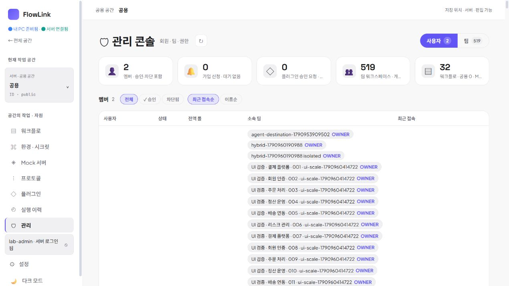

# 제품 재검토 — 관찰, 반론과 구현 결정

이 기록은 0.3.2 이후 재검토다. 앞선 완료 보고를 제품 전체의 완성 검증으로 볼 수 없다. 사용자는 예시만 고치는 방식과 주 담당자가 개선 목표부터 혼자 정하는 방식을 지적했다. 새 구현에 착수했다가 이 지적을 받고 중간 변경을 보존한 채 검토로 돌아갔다. 아래는 그 뒤 실제 담당자 사이에 교환한 의견과 채택 결과다.

## 검토 참여와 근거

- 제품·관리 담당: 설치 이후 작성·공유·관리 동선, 관리 목록과 권한 조작을 검토.
- 자원·프론트 담당: 노드 설정, 브라우저 요청, 환경·Mock 입력과 실제 실행의 불일치를 검토.
- 백엔드 담당: 기존 환경 토큰, 실행 위치와 자원 소유권, 단일 실행·미리보기까지 계약을 추적.
- 주 담당: 실제 브라우저에서 관리 화면을 관찰하고 설정의 영향 범위, 공통 탐색, 개인 설정 저장 계약을 검토.

관리 화면에서 사용자 한 행의 높이가 실제로 21,851px였다. 소속 팀 519개를 한 셀에 모두 출력해 사용자 이름과 조작이 첫 화면에서 보이지 않았다. 이는 대량 데이터 생성 성공과 제품 사용성 검증을 혼동한 누락이었다.

## 결정과 반론

| 문제·제안 | 교환한 반론 | 채택한 범위 |
|---|---|---|
| HTTP 주소·TCP 호스트에 새 환경 참조 필드 세 개 추가 | 백엔드: 기존 `@env`가 목적지에서 이미 해석된다. 프론트: 새 개념을 또 배워야 한다. | 새 HTTP/호스트 필드 보류. 기존 참조의 선택·진단을 개선. 정수만 받는 TCP 포트에만 환경 키 필드 추가. |
| 노드마다 실행기·자원 공간·환경·Mock·출력 키를 항상 설정 | 제품: 실제 주소를 입력하기 전에 너무 많은 인프라 선택이 앞선다. 주 담당: 실행 위치까지 접으면 실제 호출 주체가 숨는다. | 실행 위치·대상은 항상 표시. 실행 환경은 실행 계획에서 목적지 공간별로 한 번 선택, 노드 예외와 전달 키는 고급 설정. |
| 개인 환경 연결을 워크플로별로 저장 | 주 담당: 같은 공간의 개발 환경을 100개 흐름마다 반복 설정하게 된다. 제품 담당이 반론 수용. | 개인 H2의 기존 설정 저장소 재사용. 소유 공간·선택 환경·서버 주소·계정별 목적지 연결. 공유 그래프에는 개인 설정을 넣지 않음. |
| 관리 사용자 행의 소속 팀을 접기만 적용 | 제품: 펼치면 다시 519개가 긴 행이 된다. | 검색·페이지가 있는 별도 소속 목록. 사용자·팀·플러그인 작업 분리, 부분 실패를 정확히 보고. |
| 관리 화면에 현재 공용/팀 공간 헤더 표시 | 실제 관리 API는 선택 팀만 관리하지 않는다. | 서버 관리의 적용 범위를 별도로 표시. 개인 공간에서의 진입도 서버 관리 권한으로 확인. |
| 설정 모달에 개인 서버 연결과 콜백·알림 혼합 | 제품·주 담당: 콜백·알림은 런타임/테넌트 공통인데 현재 팀의 설정처럼 보이며 비관리자 입력도 허용한다. | 개인 앱 연결과 공통 실행 설정 분리. 읽기/편집 권한·로드 실패·저장 실패 표시. |
| 브라우저 직접 HTTP도 에이전트 배지로 표시 | 프론트: 엔진은 브라우저 분기를 먼저 처리하므로 표시가 실제와 다르다. | 브라우저 요청을 명확히 표시하고 소유 공간의 환경을 적용하는 기존 동작과 일치시킴. |
| Mock 선택 후에도 직접 주소 입력과 빈 주소 경고 노출 | 프론트: 엔진은 그 값을 사용하지 않고 Mock 주소로 바꾼다. | 실제 선택 대상에 맞춰 입력과 설명을 바꾸고 실효 주소 표시. |
| 공유 매니페스트·전역 사용처 색인·새 마법사 | 제품·백엔드: 기존 자원 검사로 먼저 해결 가능한지 확인이 필요하다. | 이번 신규 기능으로 확정하지 않음. 기존 검사에서 누락 환경·키·시크릿을 표시. |

주 담당자가 임의로 제시한 ‘복구’는 사용자와 합의된 제품 목표가 아니므로 이번 확정 목표에서 철회했다. 별도 복구 기능은 이 결정에 포함되지 않는다.

## 검증할 사용자 작업

1. 긴 공간·계정 이름을 식별하고 주요 메뉴에 접근한다. 1280×720 및 1024×768에서 확인한다.
2. 수백 팀을 가진 사용자의 이름·역할·조작을 바로 찾고, 특정 소속 팀을 검색한다.
3. 관리 요청 일부가 실패했을 때 성공했다고 표시하지 않는다. 일반 사용자는 관리자 설정을 변경할 수 없는 상태로 본다.
4. 같은 그래프를 유지한 채 PC와 서버가 각각 선택한 환경에서 주소·시크릿을 해석한다. 환경 미선택/참조 키 누락은 실행 전에 구분한다.
5. 브라우저 요청·Mock 요청·직접 주소 요청의 화면 표시와 실제 적용 대상이 일치한다.
6. 환경 연결이 새 브라우저에서도 유지되고, 다른 서버·계정·공간의 연결은 자동 적용되지 않는다.

위 항목은 구현·검증할 기준이다. 이 문서를 작성한 시점에 통과했다고 주장하지 않는다. MCP 프로토콜 및 IDE 실연결 테스트는 사용자 지시에 따라 제외한다.

## 기존 권한·관리 범위 계약

가입 승인과 팀 초대는 별개다. 가입 대기 사용자도 팀 멤버십으로 초대하면 해당 팀에 접근할 수 있으며, 초대가 전역 가입 승인으로 바뀌지는 않는다. 이번 변경은 기존 정책을 유지하고 승인·초대 확인에서 영향을 명시한다.

개인 공간에서 /admin에 직접 진입하면 PC 플러그인 관리로 표시한다. 서버 관리 내비게이션은 서버 권한을 별도로 확인하고 서버 공간 범위로 이동한다. PC 플러그인 승인과 서버 사용자·팀 관리를 동일한 관리 대상으로 취급하지 않는다.
