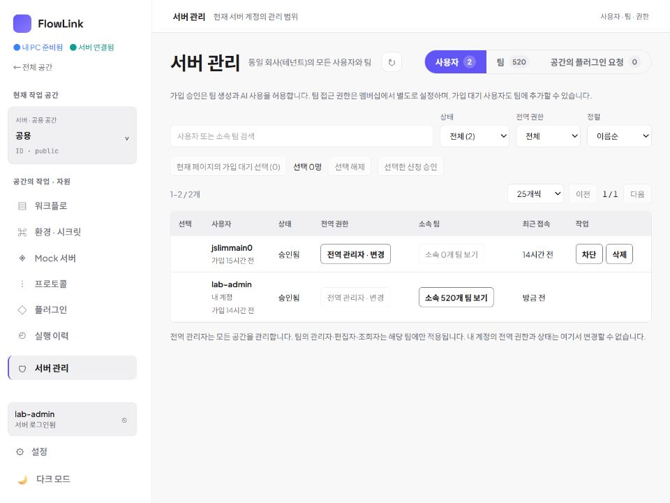
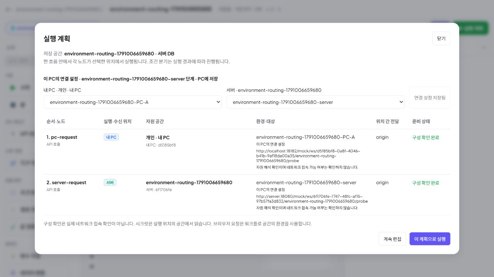
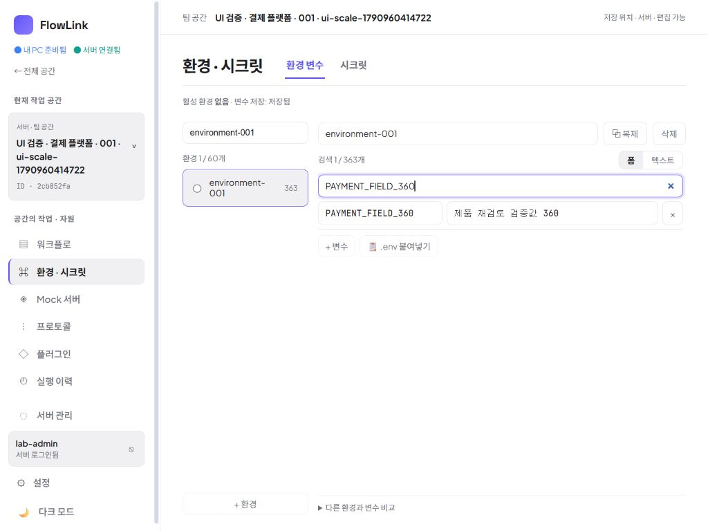

# 제품 선행 문제 수정 — 실제 검증 기록

이 기록은 제품 전체의 완성 선언이 아니다. [토론·결정 기록](2026-10-03-product-rework-decisions.md)에서 합의한 범위를 수정하고, 작성자 외 담당자가 코드와 실제 화면을 교차 검토한 결과다.

## 실행한 사용자 작업

| 작업 | 관찰 결과 | 근거 |
|---|---|---|
| 개인 공간에서 서버 관리 진입 | 개인 공간을 유지할 수 있는 상태에서 서버 권한으로 관리 메뉴 노출. 진입하면 서버 공용 범위로 이동하며 관리 대상이 사용자·팀·권한임을 표시 | 실제 18182 브라우저 |
| 수백 팀에 소속된 사용자 관리 | 이전 사용자 행 높이 21,851px에서 76px로 감소. 두 회원의 이름·역할·작업이 한 화면에 보임 | 관리 목록 스크린샷, DOM 실측 |
| 소속 팀 찾기 | 519개 소속을 10개씩 조회하고 이름·ID로 검색. 첫 페이지 마지막 행까지 스크롤 가능(720px 높이에서 마지막 행 하단 662px) | 소속 목록 실측·검색 |
| 팀 관리자 보호 | 특정 팀 검색 후 멤버 관리 진입. 마지막 팀 관리자의 강등 옵션·제외 버튼 비활성 및 이유 표시 | 실제 팀 모달. 기존 사용자의 권한 변경은 실행하지 않음 |
| 공통 설정 편집 | 개인 PC 연결과 서버 공통 설정을 분리. 서버 공통 설정 영향 범위 표시. 미저장 입력에서 닫기 → 계속 편집 시 값 유지, 변경 버리고 닫기 동작 | 실제 설정 모달. 테스트 알림 URL은 저장·호출하지 않음 |
| 설정 조회 실패 | 알림 설정 요청만 브라우저에서 일시 차단 → 오류와 재시도 표시 → 차단 해제·재시도 후 정상 입력 복귀 | 실제 브라우저. 네트워크 차단은 해제함 |
| 많은 환경·변수 편집 | 환경 60개, 한 환경 변수 363개에서 `PAYMENT_FIELD_360` 검색 → 수정 → 저장됨 확인 → 새로고침 후 저장값 확인 | 실제 브라우저. 검증 후 원래 테스트 값으로 되돌리고 저장됨 확인 |
| 긴 공간 이름과 작은 창 | 1024×768에서 공간 이름이 줄바꿈되고 메뉴 가로 넘침 없음. 설정·테마 버튼 포함 접근 가능, 문서 가로폭 1024px | 실제 화면·DOM 실측. 검증 뒤 viewport override 해제 |
| 목적지별 환경 연결 | 공유 그래프를 바꾸지 않고 PC-A/PC-B의 서로 다른 H2 환경을 선택. Docker 서버는 서버 환경 사용 | 독립 PC 두 개 + Docker 실제 HTTP, 17개 체크 통과 |
| 화면에서 혼합 실행 | 저장된 PC-A/서버 매핑이 실행 계획에 표시. `localhost:18182`와 `server:18080` 주소 구분. 화면 실행 후 두 HTTP 노드 모두 200·전체 성공 | 실제 실행 계획·실행 로그 |
| 환경 미선택과 공통 선택 | PC 환경 미선택은 ‘환경 선택 필요’와 실행 비활성. 명시적 공통 선택은 누락된 `PAYMENT_BASE_URL@env` 표시와 실행 비활성 | 실제 실행 계획. 기존 연결 선택을 복원해 저장 |
| 브라우저 요청과 Mock 지정 | 브라우저 요청 배지·실행 주체 안내 확인. Mock 지정 시 직접 Base URL 입력이 숨겨지고 적용 Mock 주소 표시 | 실제 노드 속성. 테스트 중 변경은 Undo로 되돌렸으며 저장하지 않음 |
| Mock 전체 주소 진단 | HTTP는 Mock 기준 주소 + 실제 Path, TCP는 실제 리스너 host:port 반환. 상류 Path는 실행 시 결정으로 유지 | 마지막 수정 뒤 실제 API 4개 체크 통과 |

팀 수가 마지막 화면에서 520개인 이유는 두 PC 통합 검증용 팀 1개를 추가했기 때문이다. 소속 목록·관리 UI의 수백 개 테스트 데이터는 기존 격리된 실험 서버 자료다.

## 교차 검토에서 추가 수정한 사항

- FORM·INPUT은 워크플로 소유 공간의 환경으로 값을 조립한다. 개인 에이전트 환경 선택을 요구하던 잘못된 표시를 제거하고 필요한 참조는 실행 전 검사한다.
- SWITCH는 저장된 경로 선택을 따른다. 조건을 실행 시 평가한다는 잘못된 안내를 수정했다.
- 설정·소속 목록·팀 멤버 모달에 세로 스크롤 경계를 추가했다.
- 관리 화면의 활성 버튼은 비활성 버튼과 구분되도록 글자·테두리 대비를 높였다. 실제 캡처를 작성자 외 담당자가 검토했다.
- 브라우저 전용 세션의 환경 연결도 서버 origin·사용자별로 분리했다. 사용자 확인 전에는 빈 계정으로 연결 선택을 재사용하지 않는다.
- 실제 오류 화면에서 드러난 `Network Error` 원문은 한국어 연결 안내로 바꾸었다. 서버 오류 메시지는 우선 유지한다.
- Mock 주소 진단이 기본 주소만 보여주던 누락을 수정했다. 실제 실행과 진단이 같은 Mock 대상 변환을 사용하며 기존 Path를 자동 수정하지 않는다.

## 자동 검증과 한계

- `node frontend/scripts/test-admin-users.cjs` 통과: 실제 AdminUsers 컴포넌트 핸들러에 모의 API를 연결해 부분 승인 성공/실패, 페이지·검색 밖 선택, 실패 대상만 재시도 검증. 실제 Admin의 일반 사용자·권한 조회 실패 시 관리 기능 비노출 검증.
- `node frontend/scripts/test-agent-environments.cjs` 통과: 목적지 선택 우선순위, 명시 공통, 원본 공간 해석, 계정·단계 분리, 저장 경쟁, 조회 실패, 초안 보호 검증.
- 프론트 TypeScript/Vite 빌드 통과. 백엔드 full318 통과 이후 변경 경계에 맞춘 focused 검증 수행. 마지막 Mock 진단 focused20 및 source 유지 focused4 통과. 자세한 범위는 [백엔드 기록](2026-10-03-destination-environment-backend.md) 참조.
- 가입 승인 부분 실패와 일반 사용자 UI 차단은 컴포넌트 harness 검증이다. 실제 서버 계정의 권한을 변경해 검증한 것으로 주장하지 않는다.
- 마지막 한국어 오류 문구는 helper 검증·빌드로 확인했다. 미저장 편집 이탈 확인창에서 IAB 자동화가 응답하지 않아 이 마지막 문구의 브라우저 재확인은 완료하지 못했다. 그 이전 설정 오류·재시도 동작은 실제 브라우저에서 확인했다.
- Oracle·Vault와 MSI는 앞선 검증 결과가 존재하지만 이번 변경 전체를 그 대상으로 다시 검증하거나 새 MSI에 반영한 상태는 아니다. MCP 프로토콜·IDE 등록 테스트는 요청대로 수행하지 않았다.

## 현재 실행본

- Docker 서버 `18080`, 개인 앱 검증본 `18182`: 최종 `index-_HT7zFFH.js` / `index-DwowFxS1.css` 포함.
- 최종 JAR SHA-256: `D567AD0B381432C1010D5D581A2D2F572B1147828BFFDD21EDB71A9EBDF2B5F3`.
- 두 번째 개인 앱 `18186`: 17개 통합 체크를 수행한 이전 UI 번들·백엔드 빌드 유지. 이후 Mock 진단 보완은 18080/18182에서 확인했다.
- 설치된 앱 `18180`과 다운로드 MSI는 기존 0.3.2이며 이번 선행 수정이 포함되지 않는다.
- 18182 재시작 전후 개인 H2 환경 매핑 및 revision이 동일함을 확인했다.

## 실제 화면

실행 계획의 반복 경고 문구와 일부 보조 글씨의 가독성은 낮은 우선순위 관찰로 남겼다. 독립 검토자는 이 캡처에서 기본 작업을 막는 문제는 확인하지 못했다. 이를 모든 화면에 대한 검토 완료로 확대 해석하지 않는다.
