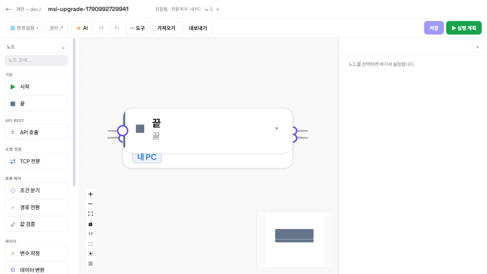

# 0.3.3 릴리스 일관성 · 설치 보존 검증

2026-10-03 · 상태: **최종 MSI 배포·실제 업그레이드·개인 데이터 보존·설치 앱 브라우저 확인 완료**

## 합의한 범위와 완료 기준

제품 담당과 릴리스 담당이 합의했다. 18080 서버와 18182 검증 앱에서 확인한 변경을 새 0.3.3 MSI로 묶고, 기존 18180 설치를 실제로 업그레이드한다. 해시 일치는 같은 산출물을 전달했다는 증거이며 실제 업그레이드 성공을 대신하지 않는다.

설치에 포함한 최신 작성·초안 보호·목록 복귀 기능의 실제 브라우저 증거는 [통합 작성 검증](2026-10-03-authoring-integrated-validation.md)에 분리했다.

- 동일하게 동결한 프론트 번들과 JAR를 서버·검증 앱·MSI에 포함한다.
- 새 MSI의 ProductVersion·ProductCode·UpgradeCode 및 실제 설치된 버전·JAR를 확인한다.
- 서버 배포 metadata의 버전/서버/MCP/다운로드 주소와 실제 HTTP 다운로드의 파일 해시가 새 MSI와 일치한다.
- 기존 개인 자료, 장치 ID, 암호화 키, 서버 주소·계정, 개인 설정을 유지한다. 새 설치 앱의 일회용 티켓으로 실제 자료 한 개를 열고 새 번들인지 확인한다.
- GitHub는 이전 모킹·세션 유지 검증과 실제 사내 인증 연동을 구분한다. MCP 프로토콜·도구 호출·IDE 등록/실연결 테스트는 하지 않는다.

## 확인한 릴리스 불일치

이전 설치본과 다운로드는 0.3.2이며, 그 이후 18080/18182에서 검증한 변경은 포함하지 않았다. 패키징 스크립트, DistributionController, 운영 compose의 버전을 0.3.3으로 올렸다. UpgradeUUID와 사용자 설치 경로는 그대로다. 같은 버전 MSI를 다시 생성해 기존 파일만 교체하지 않는다. 과거 같은 버전의 중간 MSI 교체가 SecureRepair에 차단된 이력이 있다.

DistributionController는 다운로드 디렉터리에 FlowLink.msi가 있는지만 확인하며 해당 MSI의 버전을 분석하지 않는다. 따라서 metadata 값만으로 배포 완료를 판단하지 않는다. 이번에는 배포 순서와 실제 파일 검증으로 일치시키며 자동 업데이트나 새 배포 프레임워크를 추가하지 않는다.

## 동결 이후 실행 순서

1. 주 담당이 UI 수정과 집중 검증을 끝내고 동결을 알린다. 프론트 `npm run build`, 백엔드 `bootJar` 결과의 번들명과 JAR SHA-256을 기록한다. 이후 같은 릴리스 중 소스를 더 바꾸면 산출물을 다시 동결한다.
2. 동결한 JAR로 다음 명령을 실행한다. 운영 배포에서는 `-ServerUrl`을 실제 HTTPS 주소로 바꾸며 localhost 기본값을 그대로 배포하지 않는다. `-SkipBuild`는 단계 1의 결과를 재사용하기 위한 옵션이다.

   ```powershell
   powershell -ExecutionPolicy Bypass -File scripts/package-desktop.ps1 `
     -Type msi -SkipBuild `
     -JdkPath C:\Users\jslim\.jdks\corretto-21.0.10 -WixPath .run\wix3 `
     -OutputDir backend\build\windows-installer-0.3.3 `
     -ServerUrl http://127.0.0.1:18080
   ```

3. MSI를 WindowsInstaller COM으로 읽어 ProductVersion=0.3.3, 기존과 다른 ProductCode, UpgradeCode=`{B06C875D-2E09-4B64-9E3D-2F52E871D069}` 유지, per-user 설치, 언어·업그레이드·완료 시 실행 조건을 확인한다. 패키지 파일 크기와 SHA-256을 기록한다.
4. 실제 설치 18180을 쓰는 작업이 없는지 주 담당과 조율한 뒤 해당 개인 앱만 정상 종료한다. 포트·PID 종료와 H2 잠금 해제를 확인한다. `%LOCALAPPDATA%\FlowLink` 전체와 기존 설치 metadata를 `.run/upgrade-0.3.3-preparation/`에 비공개 오프라인 백업한다. 다른 18182·서버·Oracle·Vault는 이 단계에서 중지하지 않는다.
5. 기존 0.3.2를 `msiexec /i <새 MSI> /qn /norestart /l*v <비공개 로그>`로 업그레이드한다. 같은 사용자 계정으로 실행하고 종료 코드를 확인한다. 새 앱을 켜기 전 H2·device.id·storage.key·server-session.enc 및 존재하는 개인 설정/환경 매핑/저널 파일이 이전과 같은지 비교한다. 로그·키·토큰 내용은 출력하지 않는다.
6. HKCU 설치 버전, launcher cfg, 설치된 JAR 해시와 `app/server.json`의 예상 서버 주소를 확인한다. `Start-Process -WindowStyle Hidden`으로 새 native launcher를 켠다. 개인 runtime/H2, 기존 fixture IDs·내용·시크릿 metadata, 저장된 서버 URL·계정과 실제 개인 자료 한 개를 확인한다. 기존 격리 fixture로 암호화 키 복호화가 필요한 한 번의 실행을 검증할 수 있으며 사용자 자료를 새로 쓰거나 삭제하지 않는다.
7. 새로운 브라우저 티켓으로 18180 첫 화면을 열어 새 번들을 확인하고 기존 개인 자료를 연다. 시작 안내·트레이·로그인·IDE 안내의 기존 검증을 재사용하되, 실제 네이티브 클릭을 하지 못한 범위는 그대로 명시한다. IDE 등록 버튼을 실행하지 않는다.
8. 서버를 새 JAR/이미지로 반영하는 주 담당과 다운로드 교체를 같은 배포 단계로 조율한다. 이전 FlowLink.msi를 비공개 백업하고 새 MSI를 `.run/agent-lab/downloads/FlowLink.msi`에 배치한다. 실제 사내 서버는 `FLOWLINK_DOWNLOAD_DIR`에 배치한다. metadata 0.3.3과 HTTP 다운로드의 Content-Disposition·바이트 SHA-256을 검증한다. 빌드 MSI·다운로드·설치된 JAR의 일치 결과를 기록한다.

## 데이터 보존의 근거와 이번 확인 대상

| 경계 | 소스·기존 증거 | 0.3.3 확인 |
|---|---|---|
| 설치 파일과 사용자 자료 | per-user `FlowLinkApp`과 `%LOCALAPPDATA%\FlowLink` 분리. MSI가 사용자 H2와 키를 소유하지 않음 | 설치 전 종료·전체 백업, 기동 전 기존 파일 해시 동일 |
| 개인 저장소 | application-desktop.yml은 개인 data-dir의 파일 H2 사용. DesktopLaunch.validate가 다른 DB·주소·서버 인증 설정을 차단 | 새 앱의 local runtime 및 개인 공간·기존 자료 확인 |
| 장치·암호화 키 | DesktopSession은 기존 device.id/storage.key 재사용 | 기동 전·후 두 파일 동일, 격리 fixture 암호화 자원 읽기 가능 |
| 서버 연결·계정 | DesktopConnection.load는 기존 server-session.enc를 bundle server.json보다 우선하며 개인 키로 복호화 | 기존 URL·계정·세션 상태 유지. 기존 설정을 새 번들 주소로 덮어쓰지 않음 |
| 개인 환경 매핑·작업 설정 | 같은 data-dir 안의 별도 파일과 H2에 보관 | 존재하는 파일 전체 백업·기동 전 보존 비교. 개인정보 내용 출력 금지 |
| 최초 실행·중복 실행 | 기존 0.3.2에서 profile 강제와 단일 런타임 인계 검증 | 이번 설치의 실제 첫 티켓·번들·기존 자료 확인 |

기존 [0.3.2 업그레이드 결과](2026-10-03-msi-0.3.2-upgrade-result.md)의 오프라인 파일 보존, 11개 REST 확인, 자원 ID/행 수 보존은 메커니즘의 증거다. 이번 0.3.2→0.3.3 설치 결과로 그대로 재기록하지 않는다. 기존 private 검사 스크립트는 경로·버전과 검사 대상만 새 릴리스에 맞게 사용하며 fixture를 불필요하게 다시 만들지 않는다.

## 재사용할 검증과 남은 제한

- 설치 리소스 생성과 DesktopTray를 바꾸지 않으면 한글 문자열·아이콘 크기·Swing 레이아웃 렌더·로그인 창 중복 방지·JSON에 토큰 미포함 검증은 기존 증거를 재사용한다. 새 MSI의 버전/업그레이드 식별자와 포함 파일은 별도로 확인한다.
- 종료·중복 실행·프로파일 경계의 기존 통합 검증을 전체 반복하지 않는다. 새 업그레이드와 첫 실행에서 실패나 변경이 있을 때 관련 검증만 넓힌다.
- 트레이와 설치 마법사의 실제 클릭은 기존 기록에서도 미검증이다. 소스와 렌더 검사 결과를 실제 네이티브 클릭 성공으로 표현하지 않는다.
- 실제 GitHub 앱 등록, 사내 CA·프록시, 운영 Oracle/Vault, 코드 서명, VS Code/IntelliJ 실연결은 이번 로컬 MSI 업그레이드의 검증 범위에 포함하지 않는다.

## 결과 기록

첫 동결 `index-zOFpe5Gn.js`, JAR SHA-256 `4006D51DC795B3B8E46026A199AB46910FC671B0D48DEB651A6215403AEEF260`으로 MSI 생성과 테이블 검사를 마쳤다. 그러나 병렬 브라우저 회귀에서 편집기 변경을 버리고 같은 워크플로에 재진입할 때 초기 로드가 생략되는 문제가 발견되어 이 후보는 배포·설치하지 않았다. `.run/upgrade-0.3.3-preparation/pre-reentry-fix/`에 미배포 후보로 보관했다. 이후 재진입 수정을 포함한 아래 최종 산출물로 다시 패키징했다.

| 항목 | 현재 상태 |
|---|---|
| 코드·compose 버전 0.3.3 | 완료 |
| 최종 UI 번들 | `index-DVV_SSSb.js` / `CodeEditor-C8hnnv-c.js` |
| 최종 JAR SHA-256 | `4D92D0B75EF2D1A40551FC153C03C1A5B40995E5CBA632BC2B5C0C2CD587B25D` |
| MSI 파일 | `backend/build/windows-installer-0.3.3/FlowLink-0.3.3.msi` · 196,511,829 bytes |
| MSI SHA-256 | `1B5A844D709A0AD4FC9467D9209C82F4D8E000A4933DCD1B3D0878087F9414D3` |
| MSI 테이블 | ProductVersion 0.3.3, 새 ProductCode `{18745821-3B59-3A9A-BF6C-B6A5100C0895}`, 기존 UpgradeCode, 언어 1042, per-user, 완료 시 실행 조건 확인 |
| native 0.3.2→0.3.3 업그레이드 | `msiexec` exit 0, HKCU Version=196611, launcher cfg=0.3.3, 설치된 JAR와 동결 JAR 동일 |
| 개인 파일 보존 | 정상 종료 후 9개 파일 전체 오프라인 백업, 설치 직후 기동 전 원본/백업/현재 파일 크기·해시 동일 |
| 기동 후 보존 | device.id/storage.key 동일, 서버 주소·계정·세션 유지, 개인 자원 ID·버전·fixture 정의 보존 |
| 암호화 자원 | 기존 격리 fixture를 한 번 실행해 SUCCEEDED, 결과에 secret 평문 없음 |
| 새 첫 화면 / 실제 자료 열기 | root CUA에서 새 티켓 진입·개인 공간·기존 워크플로 4개 노드·저장됨 확인, DOM 최종 번들 일치 |
| 서버 metadata / HTTP 다운로드 | metadata=0.3.3, 새 filename, HTTP 200, 실제 내려받은 파일 SHA-256과 최종 MSI 일치 |

기존 자원 인벤토리는 개인 워크플로 3개, 공간 1개, 환경 1개, 시크릿 1개, 전문 1개, Mock 1개의 ID 집합과 워크플로 버전 목록을 비교했다. 기존 격리 fixture의 그래프·환경·전문·Mock 정의와 저장된 서버 연결 상태를 확인했으며, 사용자 자료를 생성하거나 수정·삭제하지 않았다. 암호화 확인을 위한 격리 fixture의 새 execution만 추가했다.

검증 스크립트의 첫 Mock 비교는 `listener.checkedAt`을 포함한 API 응답 전체를 해시해 실패했다. 이 값은 매 조회 `Instant.now()`로 생성되므로 저장 자료의 차이가 아니다. 기존 비교 결과를 덮어 성공으로 바꾸지 않고, 업그레이드 전 H2 백업을 `ACCESS_MODE_DATA=r`로 열어 해당 fixture의 저장된 정의를 추출했다. 현재 API의 ID·이름·slug·종류·enabled·spec·공간·버전·생성/수정 시각이 이 백업과 모두 일치했다.

서버는 최종 JAR로 반영되었다는 root 확인을 받았고, `/api/v1/distribution`에서 serverUrl=`http://127.0.0.1:18080`, mcpUrl=`http://127.0.0.1:18090/mcp`, available=true를 확인했다. MCP 주소는 metadata만 읽었고 해당 프로토콜이나 도구에 연결하지 않았다. 이전 다운로드 MSI는 `.run/upgrade-0.3.3-preparation/FlowLink-0.3.2-distribution.msi`로 보존했다.



비공개 증거는 `.run/upgrade-0.3.3-preparation/`의 build-manifest.json, msi-table-result.json, native-data-before-hashes.json, upgrade-results.json, data-before.json, data-after-results.json, distribution-results.json 및 MSI 로그다. 개인 데이터 백업·키·세션·티켓 파일은 커밋하거나 공개하지 않는다.
