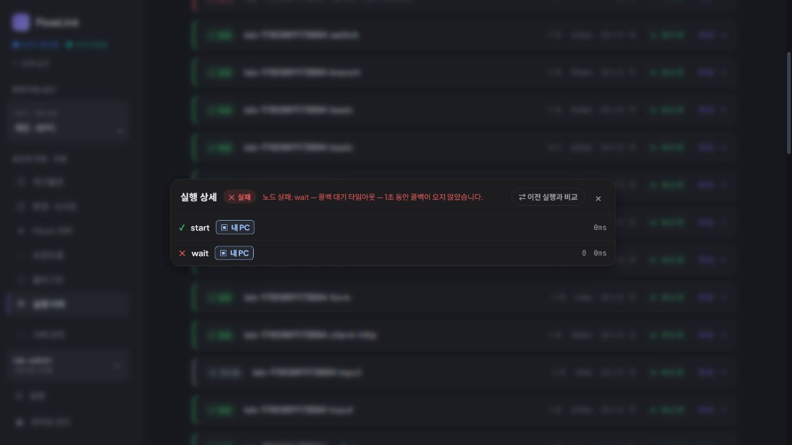
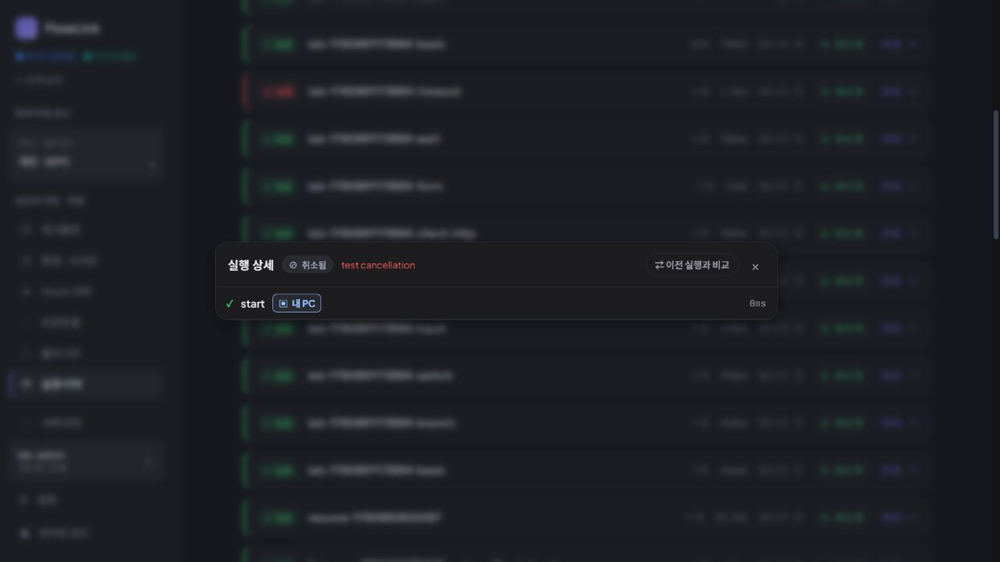

# 지속 제품 탐색 10회차 — 중단된 실행의 종료 이유 읽기

2026-10-04 01:24 KST heartbeat. **신규 실증 결함 0건. 기존 취소와 콜백 시간 초과를 구분할 수 있었다. 취소 당시 처리 단계의 식별은 근거 부족으로 보류한다.** 제품 소스는 수정하지 않았다.

## 선정과 범위

최근 목표 아키텍처·제품 재검토·작성 동선·업데이트 기록과 탐색 원본 및 2~9회차를 대조했다. 9회차 이후 새 개발 기록은 없었다. 제품 담당 `product_adoption_review`와 구현 담당 `continuous_product_discovery`가 후보를 논의했다.

처음 검토한 워크플로 외부 입력(`@input`) 준비 과업은 해당 값이 저장된 기존 자료를 특정하지 못해 보류했다. INPUT 노드 자료로 대신하거나 임의의 빈 입력창을 검증 실적으로 세지 않았다. Mock 변경 영향 찾기도 기존 사용처 색인 보류 항목과 겹쳐 제외했다.

두 담당은 **멈춘 실행을 다시 실행하기 전에 종료 이유와 마지막 처리 단계를 읽는 과업**으로 합의했다. 목록에서 이미 확인되는 취소·시간 초과 두 건만 비교한다. 단순 노드 종류별 검증, D-02 집계·D-03 접근성·D-04 원본 버전 확인을 반복하지 않는다. 전체 취소와 개별 노드 실패가 함께 있다고 해서 상태 오류로 단정하지 않는다는 반론도 반영했다.

다른 담당자의 브라우저 점유는 없었으며 루트만 임시 CUA 탭을 사용했다. 종료된 실행의 상세 조회는 GET이고 새 실행·중단 동작과 분리돼 있음을 소스로 대조했다.

## 실제 관찰

| 항목 | 관찰 |
| --- | --- |
| 앱 | 격리 개인 앱 `http://127.0.0.1:18182` |
| 배포 | DOM script `/assets/index-BcjDk_Wq.js`, 기존 0.3.4 검증 배포와 일치 |
| 화면 | CUA IAB, DOM viewport 1280 × 720, 다크 모드, override 없음 |
| 공간 | 개인 `d5185bf8-0a8f-4046-b41b-9af18da00a35` |
| 시간 초과 자료 | `lab-1790961173894 timeout`, 흐름 `43393c19-01b8-45ee-9998-2264286e4416`, 목록 실패·수동·1.02s |
| 취소 자료 | `lab-1790961173894 input`, 흐름 `173e17b0-c56f-4fd2-befa-6a5809f768f2`, 목록 취소됨·수동·49ms |

**동선:** 개인 공간 → 실행 이력 → 위 timeout의 `실행 결과 상세 보기` → 닫기 → 위 input 중 성공 429ms가 아닌 취소 49ms 행의 상세 보기. 헤더와 접힌 노드 목록만 읽었다. 요청·응답·출력 본문을 펼치지 않았으며 재실행·중단·이어보기·이전 실행 비교는 누르지 않았다.

시간 초과 상세에는 `실패`, `노드 실패: wait — 콜백 대기 타임아웃 — 1초 동안 콜백이 오지 않았습니다.`가 표시됐다. `start`는 성공, `wait`는 실패 표식이었다. 사용자는 콜백 대기가 끝난 원인과 노드를 읽을 수 있다.

취소 상세에는 `취소됨`, `test cancellation`이 표시됐다. 이 문구는 기존 테스트 기록의 이유이며 번역 누락으로 판단하지 않는다. 노드 행은 성공한 `start` 하나뿐이었다. 취소 사실은 구분되지만 어느 대기 단계에서 취소했는지는 이 상세만으로 알 수 없다. 흐름 이름이 input이라는 이유로 INPUT에서 취소됐다고 추정하지 않는다.

**기대 근거:** 실행 이력은 최종 상태와 종료 이유를 제공한다. 실제 표시는 취소와 실패를 구분했고 시간 초과는 대상 노드와 이유까지 설명했다. 취소 위치가 보이지 않는 점은 관찰 사실이지만, 해당 단계가 기록됐어야 한다는 생성 근거는 별도로 필요하다.

## 반론과 채택·보류

구현 담당은 현재 `ExecutionService`의 managed 취소 경로가 이유를 저장하고 suspension을 삭제하며 pending 정보를 비우는 것을 확인했다. 반면 classic 경로는 `FlowExecutor.resume`에서 노드를 기록하고 노드명을 오류에 포함한다. 현재 소스에는 **취소 위치를 보존하지 않는 경로**가 있지만, 이 과거 자료가 어떤 생성 버전·경로에서 어느 pending 상태로 취소됐는지 확정할 기록을 찾지 못했다. source 관찰을 새 실행의 실증으로 바꾸지 않는다.

제품 담당은 최종 상태·이유로 취소와 시간 초과를 구분할 수 있다는 정상 근거와, 취소 위치를 추정할 수 없다는 한계를 함께 검토했다. 두 담당은 다음 범위에 합의했다.

| 상태 | 항목 | 판단 |
| --- | --- | --- |
| 정상 확인 | 기존 두 실행의 종료 이유 구분 | 취소와 시간 초과를 구분하고 시간 초과 노드를 식별함 |
| 보류 · 소스 후보 | 취소 시 처리 단계 식별 | 실제 상세에 위치가 없지만 fixture 생성 경로·취소 순간 근거 부족. 새 결함 ID나 구현 작업으로 승격하지 않음 |
| 미검증 | 외부 입력 준비, 현재 버전에서 새 취소·시간 초과 발생 | 기존 자료 부족 또는 이번 읽기 범위 밖 |

최초 캡처는 상세 영역이 잘렸으나 DOM 경계와 CUA 전체 화면에서는 중앙 모달이 정상이다. 전체 화면으로 두 이미지를 교체하고 제품 담당이 다시 직접 확인했다. 캡처 도구의 결과를 제품 모달 배치 결함으로 기록하지 않는다.

새 자료 생성, 정의·계정·권한·인증 자료 변경, 실제 실행·외부 호출·저장은 없었다. 18080 서버 및 설치본 18180을 조작하지 않았고 MCP 프로토콜·도구·IDE 등록 테스트도 하지 않았다. 브라우저 티켓·인증 토큰을 출력·기록하지 않았다. 이 문서와 이미지 두 개만 추가했으며 임시 탭을 닫았다.
