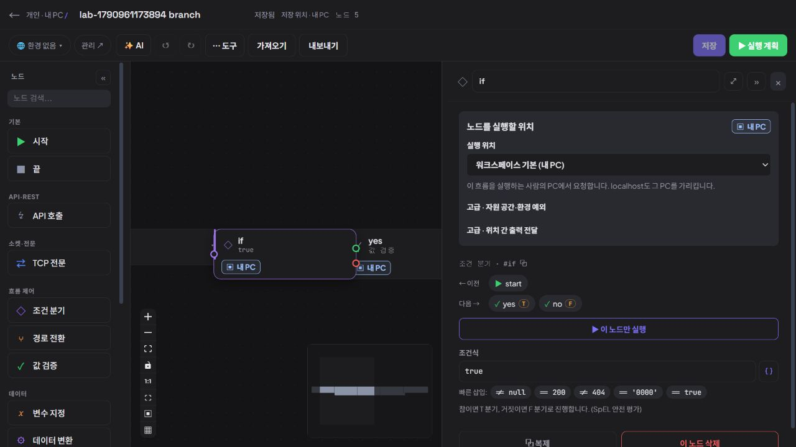
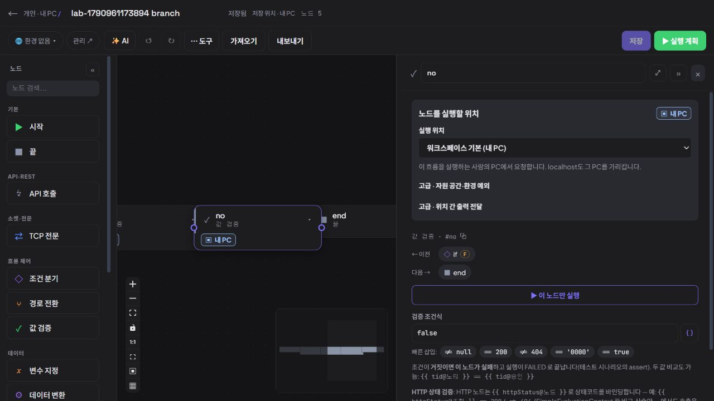

# 지속 제품 탐색 9회차 — 조건 분기의 다음 목적지 읽기

2026-10-04 00:23 KST heartbeat. **신규 실증 문제 0건. 기존 IF 한 개의 조건과 참·거짓 갈래의 목적지를 정의 변경 없이 읽을 수 있었다.** 제품 소스는 수정하지 않았다.

## 선정과 반론

최근 목표 아키텍처·제품 재검토 결정·작성 동선 제품 검토·업데이트 기록과 탐색 원본 및 2~8회차를 대조했다. 8회차 이후 새 개발 기록은 없었다. D-01~05, 작성·목록·업데이트 및 앞선 읽기 과업을 반복하지 않았다.

제품 담당 `product_adoption_review`는 기존 분기 흐름에서 조건별 다음 노드를 읽는 과업을 제안했고, 구현 담당 `continuous_product_discovery`와 반론을 교환했다. 간선·출구·속성의 이웃 안내 중 기존 대안으로 관계를 이해할 수 있다면 정상으로 판단한다. 새 추적 화면을 해법으로 전제하지 않으며 실제 분기 실행까지 요구하지 않는다.

구현 담당은 캔버스 본체 선택과 이웃 이동이 선택·뷰포트 상태만 바꾸는 경로임을 확인했다. 핸들·간선의 T/F 전환 버튼·조건 빠른 삽입·실행 버튼은 누르지 않았다. 다른 담당자의 브라우저 점유가 없었으며 루트만 임시 CUA 탭을 사용했다.

## 실제 대상과 재현

| 항목 | 관찰 |
| --- | --- |
| 앱 | 격리 개인 앱 `http://127.0.0.1:18182` |
| 실제 번들 | DOM script `/assets/index-BcjDk_Wq.js`, 기존 0.3.4 검증 배포와 일치 |
| 화면 | CUA IAB, 1280 × 720, 다크 모드, viewport override 없음 |
| 개인 공간 | `d5185bf8-0a8f-4046-b41b-9af18da00a35` |
| 기존 자료 | `lab-1790961173894 branch`, ID `b8089bf7-79d6-471a-8f92-c15cc3591e05`, v2, 5노드 |

**사용자 목적:** 기존 흐름을 실행하거나 고치기 전에 조건이 참일 때와 거짓일 때 각각 어느 노드로 이어지는지 파악한다.

1. 개인 워크플로 목록에서 기존 이름을 검색해 한 개 결과를 연다.
2. 캔버스의 `if` 본체를 선택해 조건식과 다음 노드 안내를 읽는다.
3. 속성의 `yes T`를 눌러 목적지와 이전 갈래를 확인한다.
4. `if T`로 돌아온 뒤 `no F`를 눌러 다른 목적지와 이전 갈래를 확인한다.
5. 저장 버튼이 계속 비활성인지 확인하고 임시 탭을 닫는다.

## 실제 결과와 기대 근거

IF 조건식은 `true`이고 속성의 다음 노드는 `yes T`, `no F`로 구분됐다. 툴팁도 각각 `T 갈래로 나감`, `F 갈래로 나감`을 설명했다. 조건식 아래에는 참이면 T, 거짓이면 F로 진행한다는 안내가 있었다.

`yes T`로 이동하면 검증 노드 `yes`의 조건 `true`, 이전 `if T`, 다음 `end`를 읽을 수 있었다. IF로 돌아와 `no F`로 이동하면 검증 노드 `no`의 조건 `false`, 이전 `if F`, 다음 `end`를 읽을 수 있었다. 이 값은 기존 테스트 정의의 리터럴이며 실행한 결과가 아니다. 저장 버튼은 비활성을 유지했다.

**기대 근거:** IF는 참·거짓 출구가 있는 노드이며 화면이 조건식·T/F 표기·이웃 이동을 제공한다. 현재 정의의 연결 목적지가 이 안내와 함께 식별되면 선정한 읽기 과업이 성립한다. `PropertyPanel.tsx`의 `fromPort` → T/F 안내와 선택 전용 `focusNode` 경로도 실제 관찰과 일치한다.

## 교차 검토와 개선 목록

캔버스는 기존 노드가 한 줄로 놓인 상태에서 작게 표시돼 선을 눈으로 추적하기 어려웠다. 제품 담당은 이 제약을 인정하면서도 속성의 이웃 안내로 두 갈래를 읽을 수 있으므로 과업 실패로 분류하지 않았다. 구현 담당도 저장 좌표의 생성 원인이나 새 배치 기능의 회귀를 확인하지 않았다는 반론에 동의했다. 이 현상을 새 레이아웃 결함으로 채택하지 않는다.

| 상태 | 항목 | 판단 |
| --- | --- | --- |
| 정상 확인 | IF 조건과 두 목적지, 목적지의 이전 갈래 읽기 | 기존 속성 안내와 이웃 버튼으로 T→yes, F→no를 확인함 |
| 미채택 | 작은 캔버스의 간선 판독 제약 | 기존 대안으로 목적 수행 가능. 저장 좌표 원인·배치 회귀 미확정 |
| 미검증 | 실제 분기 실행, 복수·중첩 IF, 대규모 그래프 | 이번 자료와 읽기 과업 범위 밖 |

두 담당은 신규 0건에 합의했다. 5회차는 같은 출력 키의 데이터 출처를 읽었고, 이번에는 조건별 제어 흐름을 읽었다. D-04의 실행 원본 버전 식별과도 다르다. 전체 워크플로 이해나 실행 엔진 정합성 검증으로 확대하지 않는다.

정의·권한·인증 자료와 제품 소스 변경, 새 자료 생성, 실제 호출·실행·저장은 없었다. 18080 서버와 설치본 18180을 조작하지 않았으며 MCP 프로토콜·도구·IDE 등록 테스트도 하지 않았다. 브라우저 티켓·인증 토큰을 출력하거나 기록하지 않았다. 이 문서와 스크린샷 두 개만 추가하고 임시 탐색 탭을 닫았다.
