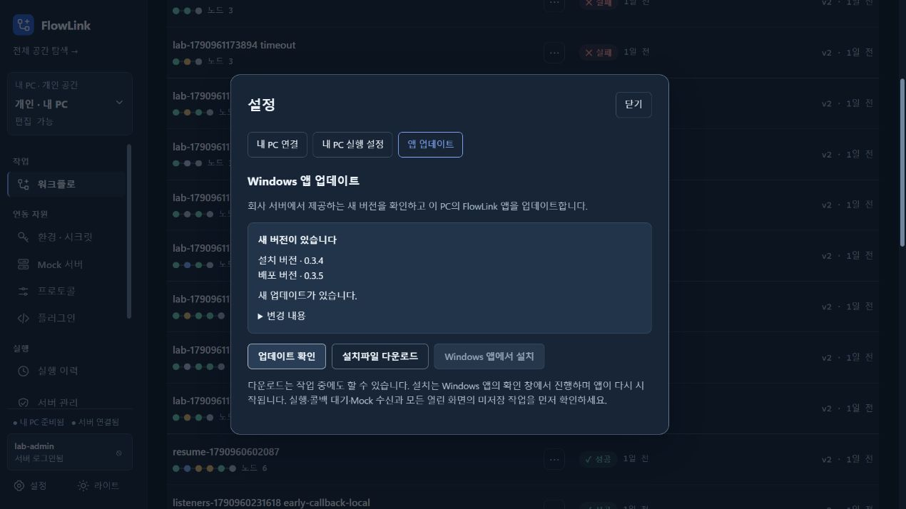

# 0.3.5 서버 게시 및 업데이트 감지

2026-10-04. 사용자가 Windows 앱 업데이트를 직접 시험할 수 있도록 검증 서버 18080에 최신 서버와 MSI를 게시했다. 실제 설치·종료·재시작은 수행하지 않았다.

## 배포 결과

| 항목 | 확인 결과 |
|---|---|
| VERSION / JAR / MSI / 서버 | 0.3.5 |
| 프론트 번들 | `index-Dm-9QkrH.js` — frontend/dist, JAR 내 HTML, 서버 HTML 일치 |
| JAR SHA-256 | `ee8864e16dd2b918d4205e62a61196573a2147ca0c0710f85d5c8dc7173ec463` |
| MSI 크기 | 196,589,871 bytes |
| MSI SHA-256 | `27d26d2c54277a640f6e3365e649035045cc2aeb2a90ef810c91ad84cb4d4877` |
| MSI ProductCode | `{CD1511EE-C08D-3C4D-80FF-108CFA647308}` |
| MSI UpgradeCode | `{B06C875D-2E09-4B64-9E3D-2F52E871D069}` 유지 |
| MSI 언어 | 1042 |
| 배포 API | serverVersion=0.3.5, version=0.3.5, releaseStatus=AVAILABLE, automaticUpdateAllowed=true |
| 실제 HTTP 다운로드 | 크기·SHA-256이 MSI 및 manifest와 일치 |
| 18182 검증 앱 | 현재 0.3.4 → 배포 0.3.5, ‘새 버전이 있습니다’, 다운로드 버튼 활성화 |

산출물: `backend/build/windows-installer-0.3.5/FlowLink-0.3.5.msi`. 게시 위치: `.run/agent-lab/downloads`. 서버는 기존 Docker compose로 같은 JAR를 반영했고 healthy 상태를 확인했다. 개인 검증 앱 18182는 업데이트 감지를 관찰하기 위해 0.3.4 상태로 유지했다.

기존 UI 수정의 집중 검증은 [레이아웃 검증](2026-10-04-layout-readability.md)을 참조한다. 이번에는 bootJar와 MSI 패키징, 설치파일 식별자, 배포·다운로드 일치, 실제 브라우저 업데이트 확인을 검증했다. MCP 프로토콜·도구 호출·IDE 등록은 시험하지 않았다.

## 게시 스크립트 수정

기존 manifest를 바꿀 때 `File.Replace(..., $null)`이 PowerShell에서 빈 문자열로 전달되어 ‘The path is empty’ 오류가 재현됐다. `[NullString]::Value`로 실제 null 문자열을 전달하도록 수정했다. 제품 검토 담당과 검토했으며 기존의 동일 디렉터리 원자 교체 방식을 유지했다. Windows PowerShell 5.1과 현재 PowerShell에서 격리 파일 교체를 확인하고 실제 재게시를 완료했다. 실패 시 기존 manifest는 보존됐고 기존 버전 MSI도 교체하지 않았다.

## 사용자 시험 순서

설치 경로의 JAR는 기존 0.3.3 릴리스 기록의 SHA-256 `4d92d0b75ef2d1a40551fc153c03c1a5b40995e5cba632bc2b5c0c2cd587b25d`와 일치하며 업데이트 서비스 클래스가 없다. Windows Installer 등록 조회로 버전을 확인한 것은 아니다. 설치 앱 18180의 업데이트 상태 API도 정상 응답하지 않아 해당 구버전에서 바로 자동 업데이트할 수 있다고 안내하지 않는다.

1. [0.3.4 MSI](http://127.0.0.1:18080/downloads/FlowLink-0.3.4-windows-x64.msi)를 한 번 설치해 업데이트 기능이 있는 앱으로 시작한다. 이전 설치파일의 다운로드 응답 200을 확인했다.
2. 앱의 **설정 → 앱 업데이트 → 업데이트 확인**을 누른다.
3. 배포 버전 0.3.5를 확인하고 **설치파일 다운로드 → Windows 앱에서 설치**로 진행한다.

최신 버전만 바로 설치하려면 [0.3.5 MSI](http://127.0.0.1:18080/downloads/FlowLink-0.3.5-windows-x64.msi)를 사용할 수 있다. 설치 성공, 기존 데이터 보존, 설치 후 자동 재시작은 이번 게시 검증의 결과가 아니다.

