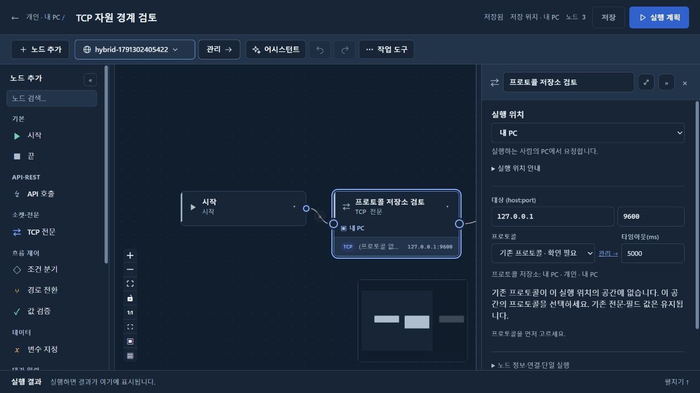

# 아키텍처·제품 동작 일치 검토 — 2026-10-07

확정 구조와 실제 소스·빌드·화면을 대조했다. 이번 수정은 저장소·실행 위치 정책을 바꾸지 않고, 조회 실패를 무시하던 경로와 잘못된 화면 상태를 바로잡는다.

## 유지한 경계

| 대상 | 실제 소유자·동작 | 확인 근거 |
|---|---|---|
| 개인 화면·API·H2 | flow-desktop. 서버 연결 없이 개인 자료와 로컬 작업 사용 | 실행 JAR 검사, 임시 H2 launcher 기동 검사 |
| 공용·팀 API·Oracle·로그인·배포 | flow-server. 작업 SPA를 제공하지 않음 | 서버 자산·클래스 경계 검사, 실제 `/flows` 미제공 검사 |
| HTTP·TCP·Mock·콜백 수신 | flow-agent. DB 없는 라이브러리를 두 호스트가 사용 | plain JAR·bytecode 의존 검사, agent/core 테스트 |
| 관리·저장·실행 조정 | flow-core. desktop과 server가 재사용 | 호스트·DB 설정 및 클래스 경계 검사 |
| 플러그인·Vault | 공용·팀 중앙 서버 전용. 개인 실행·관리 차단 | 중앙 승인·실행 및 개인 API·Mock·흐름 차단 launcher 검사 |
| 환경·프로토콜·직접 입력 시크릿 | 개인은 H2·PC 키, 공용·팀은 중앙 DB. 위임 시 목적지 공간 자원 사용 | ResourceBoundaryTest, 프론트 자원·환경 검사 |
| 변환 노드 | 현재 흐름 공간·환경으로 중앙 실행. 별도 실행 위치 선택 없음 | 기존 PC 설정 무시 및 중앙 실행·이력 launcher 검사 |
| MCP | 서버 JVM 라이브러리. desktop에는 MCP SDK·Oracle 드라이버 없음 | 배포 JAR 경계 검사. 프로토콜·도구·IDE 등록 호출은 수행하지 않음 |

개인 프로토콜과 환경을 중앙 전용으로 바꾸지 않았다. 중앙 전용인 플러그인·Vault와 개인의 프로토콜 정의·환경변수·직접 입력 시크릿은 서로 다른 자원이다. HTTP/TCP의 PC·서버 실행 위치는 계속 필요하다.

## 확인한 괴리와 수정

1. **미리보기·Mock의 환경 실패 무시.** 실제 실행은 없는 환경을 거부하지만 공통 MockScopeLoader는 환경을 확인하지 않고, 시크릿·환경 조회 예외를 빈 맵으로 바꿨다. Mock 서빙·프로토콜 미리보기·플러그인 시험이 다른 조건으로 진행할 수 있었다. 공통 loader에서 환경 존재를 확인하고 조회 장애 시 안전한 503으로 중단한다. tenant 복원은 유지한다. 수정 전 새 검사 두 개가 실패했고 수정 후 통과했다.
2. **Mock 내부 오류 원문 노출.** 승인 플러그인이 해석된 시크릿 입력을 예외에 담으면 HTTP 오류 응답과 로그가 원문을 출력했다. 일반 예외는 고정 오류 안내와 오류 유형만 기록한다. 없는 환경은 400, 자원 조회 장애는 503으로 구분한다. 실제 MockGateway와 승인 플러그인으로 응답에 시크릿이 남지 않는 것을 검사했다.
3. **TCP 프로토콜 선택의 오해.** 실행 위치의 목록에 기존 ID가 없거나 조회가 실패해도 빈 선택처럼 보였다. 저장소·공간을 표시하고 로딩·오류·오프라인을 구분한다. 없는 기존 프로토콜을 명시하며 전문·필드 값을 보존한다. 없는 ID의 관리 링크는 해당 공간의 목록으로 이동한다. 브라우저에서 누락 안내가 상세 조회의 404에 덮이는 것을 추가로 확인해 안내 우선순위도 수정했다.
4. **배포 검증 누락.** GitHub Actions에 프론트 실행 검사와 서버·desktop JAR 경계 검사를 연결했다. Linux 서버 job에서도 두 호스트 산출물을 만든 뒤 기존 PowerShell 검사를 실행한다. 실제 Actions 배포 실행은 이번 작업에 포함하지 않았다.
5. **오래된 아키텍처 설명.** 모듈 그림 하단에 이미 제거한 desktop→server 의존이 ‘현재’로 남아 있었다. 실제 desktop→core←server 관계로 고쳤다. README의 서로 다른 시점 테스트 수를 현재 상태로 혼동하지 않도록 날짜별 기록과 최신 검토를 구분했다.

## 실제 화면 확인

- 검증 앱: 개인 18322, Oracle/Vault 중앙 API 18183. 개인 기존 DB·키·저장 로그인은 유지했다.
- 사용자 작업: TCP 노드가 참조하던 프로토콜이 현재 실행 위치의 공간에 없는 이유를 확인하고 올바른 관리 화면으로 이동한다.
- 재현: 격리 개인 공간의 `TCP 자원 경계 검토`를 열고 `프로토콜 저장소 검토` 노드를 선택한다. 실행은 하지 않았다.
- 결과: ‘기존 프로토콜 · 확인 필요’, ‘프로토콜 저장소: 내 PC · 개인 · 내 PC’, 누락 이유와 필드 보존 안내가 표시된다. 관리 링크는 같은 개인 공간의 프로토콜 목록이다.
- 기대 근거: 프로토콜 UUID는 공간마다 다를 수 있고, 실행 위치 변경·삭제 후에도 사용자가 작성한 전문·필드 값은 자동 삭제하면 안 된다.

## 검증과 배포 범위

- agent/core/server/desktop 테스트는 검토 시작 시 통과했다. 수정 후 agent 전체 142개·core 전체 159개를 다시 실행해 실패·오류·건너뜀 없이 통과했다. server 53개·desktop 31개는 시작 시 통과한 결과이며 최종 호스트 동작은 아래 실제 launcher 검사로 확인했다.
- 프론트 `npm test`: 실제 컴포넌트·API 라우팅·환경 저장·개인 identity 등 14개 실행 파일 통과. `npm run build`·`npm run lint` 통과. 기존 Fast Refresh·큰 bundle 경고는 남는다.
- 두 실행 JAR 빌드와 `scripts/test/module-artifacts.ps1` 통과. Oracle·MCP SDK·중앙 서버 클래스가 desktop에 섞이지 않고 agent는 DB에 의존하지 않는다.
- `scripts/test/module-launchers.ps1` 통과. 임시 H2의 실제 두 JVM에서 개인 접근 보호·중앙 플러그인 승인/실행·개인 차단·잘못된 프로파일/바인딩 거부를 검사했다.
- 개인 검증 앱 18322와 Docker 중앙 서버 18183에 수정 JAR를 반영했다. 중앙 승인 플러그인과 기존 흐름이 PC의 로그인 중계를 통해 다시 조회되는 것을 확인했다. Oracle/Vault 데이터 볼륨은 유지했다.
- MSI·18088 배포본을 이번 변경으로 재게시하지 않았다. VERSION은 0.3.9를 유지한다. 실제 GitHub OAuth, MCP 프로토콜·도구 호출·IDE 등록은 검증하지 않았다. 검증용 로그인·REST 및 임시 자료만 사용했다.

브라우저 티켓·인증 토큰·실제 시크릿 값은 이 기록에 포함하지 않는다. 확인된 수정 범위의 검증이며 실제 사내 인증·IDE까지 모두 검증했다는 의미는 아니다.
