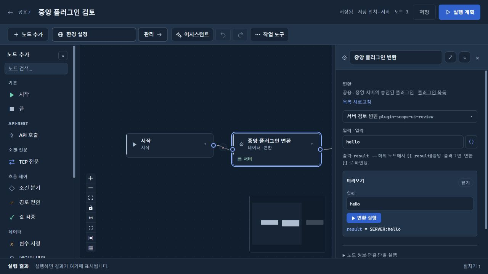
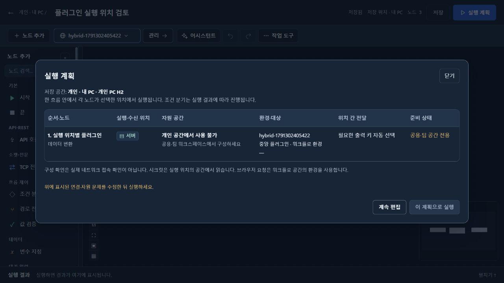

# 중앙 플러그인·시크릿 적용 검증

확정 기준: 플러그인과 중앙 Vault 시크릿은 공용·팀 워크스페이스에서만 사용한다. 개인 워크스페이스에는 개인 H2, 환경 변수, PC 키로 암호화하는 직접 입력 시크릿, 개인 Mock을 유지한다.

## 적용 결과

- 변환 노드는 중앙 서버에서 현재 워크스페이스와 활성 환경으로 실행한다. 실행 위치 선택을 제거하고 과거 PC·다른 공간·다른 환경 지정은 무시한다. 실행 이력도 서버로 기록한다.
- HTTP·TCP 등의 기존 PC/서버 선택은 유지한다. 변환만 있는 실행 계획에는 목적지 환경 연결 설정을 표시하지 않는다.
- 개인 공간은 플러그인 메뉴·변환 추가·코덱 추가를 제공하지 않는다. 직접 개인 플러그인 API 호출은 403, 개인 변환 실행과 플러그인 코덱 저장은 거부한다. 개인 프로세스는 기존 승인 스크립트와 JAR를 로드하지 않는다.
- 기존 개인 정의를 삭제하지 않는다. 남은 변환은 사용 불가 안내와 실행 차단을 표시하고, 기존 Mock·프로토콜 코덱은 제거할 수 있다. 개인 Mock 활성화·버전 복원에도 검증을 적용한다.
- 화면 명칭은 ‘플러그인 목록’, ‘시크릿’을 사용한다. 중앙 Vault는 원래 서버 전용이며 개인 직접 입력 시크릿과 구별한다.

## 실행 검증

- Gradle agent/core/desktop 테스트 및 server/desktop JAR 빌드 통과. 이후 변경한 경계는 AgentRequestBuilderTest, CodecRegistryTest, DesktopAccessFilterTest, ProtocolServiceTest, MockServerVersionTest, ManagedExecutionIntegrationTest로 재확인했다.
- `powershell -File scripts/test/module-launchers.ps1` 통과: 임시 H2를 사용하는 실제 server/desktop JVM 두 개에서 플러그인 승인·미리보기·중앙 실행 성공, 개인 API 차단·변환 거부·Mock 코덱 거부 확인. 과거 PC/다른 공간/다른 환경 설정이 있는 중앙 흐름도 성공하고 서버 실행으로 기록했다. 개인 시크릿 API는 정상 접근했다.
- `scripts/test/module-artifacts.ps1` 통과: 배포 산출물 모듈 경계 확인.
- `node frontend/scripts/test-plugin-resources.cjs`, `test-agent-environments.cjs`, `test-authoring-save.cjs` 통과. 프론트 빌드 통과. lint 오류 없음(기존 Fast Refresh 경고 23개).

## 실제 브라우저

검토 PC 앱 `18322`에서 서버 공간을 선택하고 기존 승인 플러그인을 미리보기 실행했다. 중앙 목록 안내와 플러그인 선택은 있지만 실행 위치 선택은 없으며 입력 `hello`의 응답은 `SERVER:hello`였다. 개인 공간에는 변환 추가가 없고, 기존 변환 흐름의 실행 계획은 ‘개인 공간에서 사용 불가’와 ‘공용·팀 공간 전용’을 표시하며 실행을 막았다.

아키텍처 HTML/SVG의 중앙 플러그인·개인 실행 경계도 수정하고 브라우저에서 그림 배치를 확인했다.

## 반영 범위

- 검토 PC `http://127.0.0.1:18322` 및 Oracle/Vault 실험용 Docker 서버 `18183`에 반영했다. 개인 DB와 기존 저장 로그인은 유지했다.
- 실제 GitHub OAuth 대신 기존 실험용 인증을 사용했다. MCP 프로토콜·도구 호출·IDE 등록 검증은 수행하지 않았다.
- 이번 변경으로 MSI 배포본을 재발행하거나 별도 EC2 실험 서버 `18088`을 갱신하지 않았다. 검토 앱 변경과 설치 배포본의 버전을 혼동하지 않는다.
