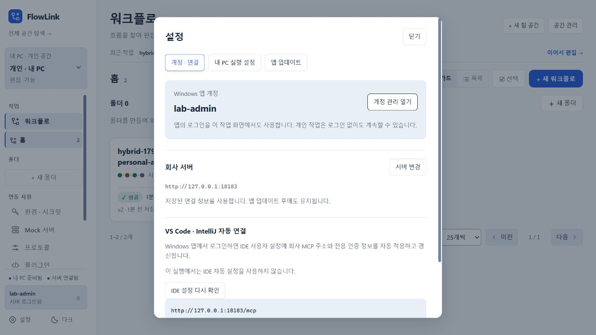
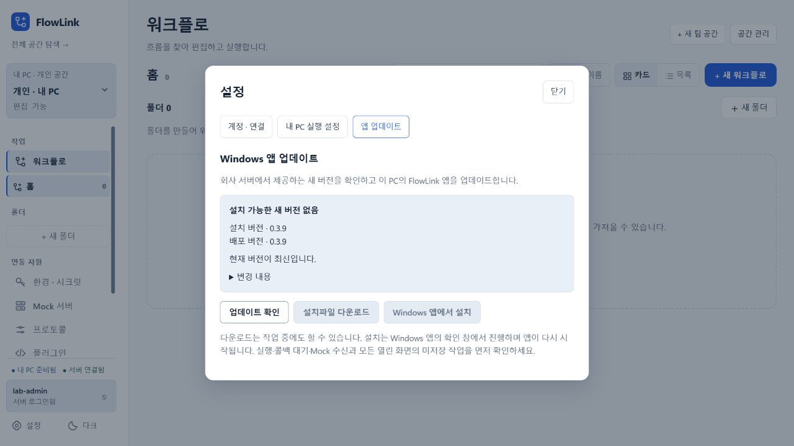

# 0.3.9 확정 아키텍처 구현·검증

구현 커밋: `0c1ddcdb86ac430e55638df738a81d5758756d0f` (`codex/trim-config`).

공통 관리·저장 구현을 실제 `flow-core`로 분리했다. desktop과 server는 core를 사용하며 desktop은 server 소스에 의존하지 않는다. DB 없는 agent는 HTTP/TCP 호출·Mock·콜백 수신을 맡는다. 개인 H2·키·기존 API는 유지하며 Oracle 설정과 중앙 로그인/MCP는 server에만 있다.

Windows 앱 로그인 후 MCP 전용 자격을 발급받아 VS Code와 IntelliJ Copilot 사용자 설정에 자동 적용한다. 일반 앱/GitHub 토큰을 IDE에 쓰지 않는다. 갱신·로그아웃·계정/서버 변경·오프라인 해제 재시도, 기존 항목과 수동 편집 보호를 구현했다. 전용 자격은 원본 세션과 PC 장치에 고정하며 다른 PC의 개인 자료로 조용히 전환하지 않는다. 기존 OAuth 호환 클라이언트의 연결은 장치를 미리 고정하지 않는다.

| 검증 | 결과 |
|---|---|
| 단위 검증 | agent 140 · core 155 · server 53 · desktop 31 · MCP 8 = **387**, 실패/오류/건너뜀 0 |
| 프론트 | lint/build 통과, 기존 Fast Refresh 23개·bundle 크기 경고 유지 |
| JAR 경계 | agent DB 없음, core 호스트 기능 없음, desktop server/MCP/SDK/Oracle 없음, 버전 0.3.9 |
| 격리 launcher | 개인 API 보호, 중앙 기능의 server 전용 제공, 잘못된 프로파일/바인딩 거부 |
| 인증 REST | 두 로그인 세션 분리, 전용 자격 발급/갱신/해제, 관리 API 401, 재시작 보존, 다른 PC 제출/결과 409·동일 PC 200 |
| 임시 IDE JSON | 두 IDE 형식, 기존 항목 보존, 수동/동시 편집 거부, 암호화·재시작·갱신·오프라인 해제, 가득 찬 큐와 오프라인 서버 간 공정 재시도 |
| Oracle/Vault 도커 | 실제 Transit/AppRole·환경별 시크릿·암호문·마스킹·앱/DB 재시작·Vault 장애/복구 13개, 잘못된 AppRole 기동 거부 |
| Oracle 기존 REST | HTTP Mock·분기·입력·폼·콜백·타임아웃·취소·웹훅·스케줄·suite·실패 알림 14개 |
| 실제 H2↔Oracle 혼합 실행 | 한 실행 ID의 PC→서버→PC, 물리 Mock/환경 분리, 허용 출력만 공유, 개인 정의/이력 서버 미복제, 로그아웃 후 개인 실행 23개 |
| MSI | 최신 desktop JAR와 Java 포함, 406개 파일, Node/Docker/중앙 server/MCP 앱 없음 |
| Docker 가상 EC2 | 동일 deploy.sh로 server·프록시 healthy, SPA/정적 자원·배포 metadata·업데이트 허용 확인, 실행 server JAR SHA-256이 빌드와 일치 |
| 다운로드 | `/downloads/FlowLink-0.3.9-windows-x64.msi` **149,395,173 bytes**, 실제 다운로드 SHA-256이 manifest와 일치 |
| 배포 후 개인 앱 | 별도 H2의 18323 앱이 18088 서버에서 모의 로그인 성공, 중앙 MCP 주소 자동 조회, 앱 업데이트에서 설치/배포 0.3.9와 최신 상태 확인 |

MSI SHA-256: `c2509be82f4688460d307807c1888e8a63be8166ad809abf00928f91fcfb0900`.

중앙 서버와 다운로드: <http://127.0.0.1:18088>. Oracle/Vault 실험 서버: <http://127.0.0.1:18183>. Windows 개인 화면 검토 앱: <http://127.0.0.1:18322> (별도 실험용 H2). 일반 MSI는 회사 서버 18088을 포함하며 개인 앱 기본 포트는 18180이다. 이 브라우저 검토 앱에서는 실제 IDE 파일을 바꾸지 않도록 자동 설정을 끈 상태를 명시한다.

Docker 가상 EC2의 18088은 검토용 모의 인증으로 `lab-admin` 로그인이 가능하다. 기존 lab `.env`의 `SPRING_PROFILES_ACTIVE=local,agent-lab`, `FLOWLINK_AUTH_GITHUB_ENABLED=true`, `FLOWLINK_AUTH_GUEST_ENABLED=false`, `FLOWLINK_AUTH_MOCK_LOGIN=true`만 변경하고 동일 release를 재배포했다. 실제 GitHub 인증을 거치지 않으며 production 기본 설정을 변경하지 않았다. 18323은 이 배포 서버에 연결한 별도 개인 검토 앱이고 18322의 Oracle 검증 자료와 분리했다.

검증 자료는 `.run/mcp-credentials-5b964bd572e64b698906ff162f12e380/results.json`, `.run/desktop-bridge-3644b24ac8f6447f83013945703c2e5d/`, `.run/oracle-vault/results.json`, `.run/desktop-review-0.3.9/data/hybrid-fixtures.json`, `.run/ec2/msi-0.3.9-release/`, `.run/ec2/release-0.3.9/`에 있다. 티켓·인증 토큰과 실험용 비밀번호는 이 문서와 Git에 넣지 않았다.

배포 후 로그인·주소 조회·업데이트 확인 결과는 `.run/desktop-login-review-0.3.9/results.json`에 있다. 이 앱의 IDE 자동 설정도 비활성화하여 실제 사용자 설정은 바꾸지 않았다. MSI 포함 파일과 다운로드는 검증했으며 실제 Windows 설치 및 버전 전환은 수행하지 않았다.

실제 사용자 설치 앱·H2·IDE 설정은 변경하지 않았다. GitHub는 기존 실험용 모의 로그인을 사용했다. 사용자 지시대로 MCP 프로토콜·도구 호출·실제 IDE 등록은 검증하지 않았다. GitHub Actions의 runner 등록·환경 secrets 설정과 실제 workflow 실행은 별도 운영 설정이며 [배포 안내](../../infra/ec2/README.md)에 남겨 두었다. 중앙 자격 저장소는 현재 단일 서버 JVM 구성이다.

Oracle와 혼합 실행 테스트 자료는 현재 환경 검증 규칙에 맞춰 환경을 먼저 만들고 PC의 목적지 환경을 명시하도록 갱신했다. 존재하지 않는 환경의 400 거부를 정상 동작으로 확인했으며 제품 코드의 검증을 완화하지 않았다.
