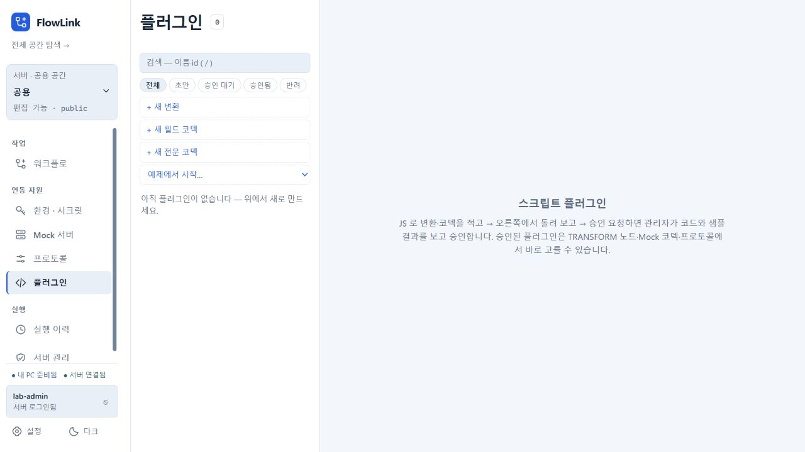

# 작업 화면의 desktop 전용 배포와 플러그인 격리

중앙 서버에 작업 프론트가 포함되어 별도 브라우저 로그인을 요구하던 경로를 제거했다. `frontend/dist` 복사는 `flow-desktop`에만 적용하고 SPA 라우팅 클래스도 core에서 desktop으로 이동했다. server에는 인증·관리 REST·다운로드·중앙 MCP 구현을 유지한다. MCP 프로토콜·도구 호출·IDE 등록 검증은 하지 않았다.

두 실행 JAR 빌드와 DesktopLaunch 회귀 검사, `module-artifacts.ps1` 및 확장한 `module-launchers.ps1`이 통과했다. artifact 검사는 서버 정적 작업 자산의 부재와 desktop의 프론트·SPA 클래스를 확인한다. 실제 격리 launcher에서는 서버 작업 경로 404, desktop 플러그인 딥링크 200, 인증·배포 API 유지, 개인 API 접근 보호를 확인했다.

플러그인 저장 구현을 새로 분리할 필요는 없었다. 개인은 개인 H2, 서버는 중앙 DB에 저장하며 각 JVM의 레지스트리는 자기 DB의 승인본을 로드한다. 각 호스트에서 같은 `host-isolation` ID를 서로 다른 소스로 저장·제출·승인한 뒤 변환 미리보기가 각각 `desktop`·`server`를 반환했다. 상대 호스트의 스크립트 UUID 조회는 양쪽 모두 404였다. 테스트는 자체 임시 DB에만 자료를 생성한다. 운영자 JAR은 각 호스트 디렉터리에서 로드하며 기본 비활성이다. UI의 워크스페이스별 캐시와 API 중계는 기존 구현을 유지한다.

구현 커밋 `fb70d4ced0eff59910c1755da270ecee34419d10`의 서버 JAR를 Oracle/Vault Docker 18183과 가상 EC2 Docker 18088에 반영했다. 각 서버의 `/`, `/index.html`, `/flows`, `/plugins`는 404이고 auth/config·distribution은 200이다. 18183에서는 저장된 실험 로그인으로 인증한 `/plugins`도 404, `/api/v1/plugins/scripts?workspaceId=public`는 200이었다. 가상 EC2는 기존 deploy.sh의 SHA-256·manifest 검증 및 health 확인을 통과했다. DB·Vault 설정과 볼륨을 유지했고 기존 0.3.9 MSI의 149,395,173 bytes 다운로드 및 업데이트 metadata를 확인했다. 이번 서버 수정에서 MSI를 재제작하거나 같은 버전의 설치파일을 덮어쓰지 않았다.

CUA에서 Windows 검토 앱이 발급한 접속 링크로 진입한 후 `http://127.0.0.1:18322/plugins?space=server%3Apublic`를 열었다. PC 주소에서 서버 공용 공간과 저장된 lab-admin 로그인, 플러그인 목록이 표시되는 것을 확인했다. 중앙 작업 경로의 404는 CUA가 `ERR_BLOCKED_BY_CLIENT`로 처리해서 해당 경로의 화면 캡처 대신 REST 응답으로 확인했다. 이를 제품 결함으로 기록하지 않는다.

