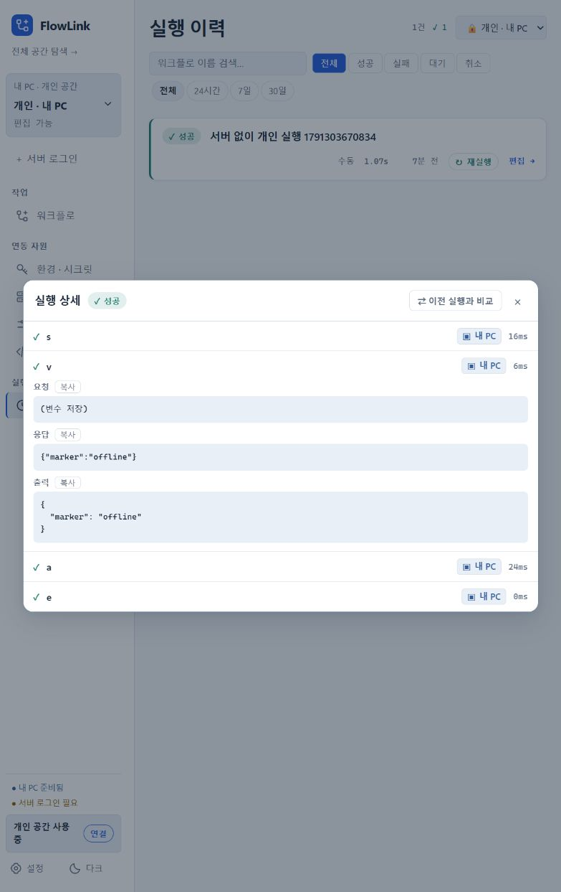

# 실행 이력 배치 수정

개인 검토 앱 18325의 실행 이력 화면을 CUA로 확인했다. 783px 폭에서 ‘실행 이력’ 제목이 글자 단위로 세로 줄바꿈되고 ‘성공’ 배지도 두 줄이 되었다. 공통 PageHeader는 inline-size container라 외부 flex 행에서 명시적인 폭 배분 없이 사용하면 제목 영역의 고유 폭이 사라진다. 실행 행에서도 고정된 작업 영역이 상태 배지와 제목의 폭을 압박했다.

- 실행 이력의 PageHeader에 flex basis와 가변 폭을 지정했다.
- 공통 상태 배지의 축소와 줄바꿈을 막았다.
- 실행 제목은 남는 폭을 사용하고, 작업면 650px 이하에서는 시간·재실행·편집 영역을 다음 줄에 배치했다.
- 검색·필터와 상세 결과의 긴 이름·오류 문구도 화면 안에서 줄바꿈하도록 정리했다.

프론트 lint/build와 실행 이력 동작 회귀 검증을 통과했다. 기존 테스트가 PageHeader 전환 이전의 직접 h1 구조를 찾고 있어 현재 제목 영역에 맞춰 갱신했다. 필터별 집계·빈 결과·오류 표시·상세 조회와 재실행의 분리는 그대로 검증한다.

최신 개인 JAR로 18325를 다시 기동해 기존 개인 H2와 실행 이력을 유지했다. CUA에서 1280px와 783px 폭을 확인했다. 783px에서 제목 높이 33.79px/line-height 33.8px로 한 줄이며, 문서 가로 넘침 없음·배지 nowrap·작업 영역의 다음 줄 배치를 확인했다. 상세 결과의 요청·응답·출력도 조회했다. 임시 viewport는 검증 후 복원했다. 서버 Docker 및 배포된 0.3.9 MSI는 이번 화면 수정으로 덮어쓰지 않았다.

실행 중인 빌드 JAR를 교체해 검토 프로세스가 잠깐 끊겼으며, 격리 검토 앱은 각각 별도 실행 JAR 복사본으로 재기동했다. 사용자 설치 앱·DB·MCP·IDE 설정은 변경하지 않았다.

