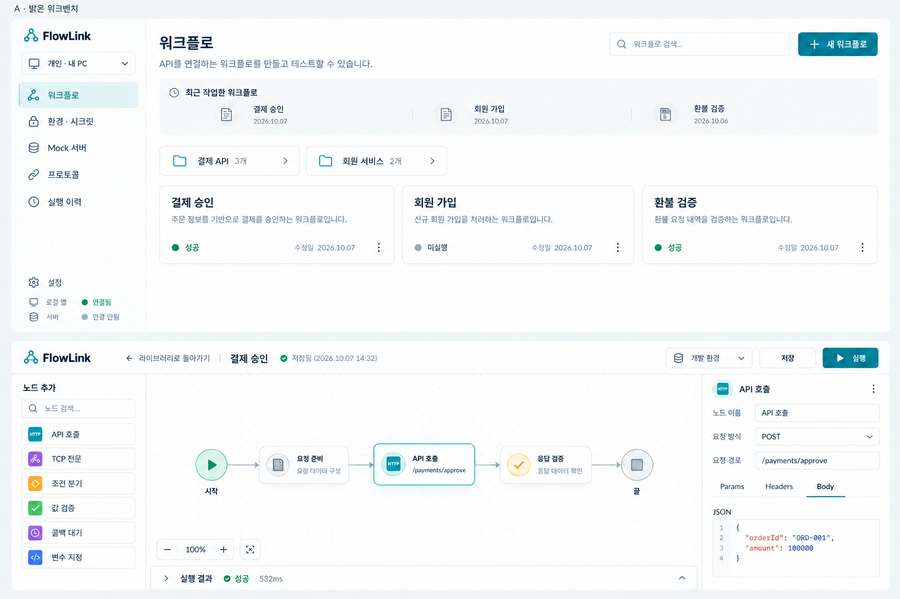
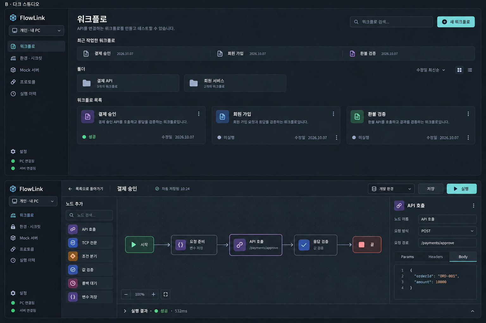

# FlowLink 프론트 이미지 시안 — 2026-10-07

내장 image_gen으로 생성했다. 실제 프론트는 새 0.3.16 JAR로 18322에서 열었고, 서버 18088의 소개·다운로드 페이지도 확인했다. 사용자가 승인한 v2 방향을 0.3.17 프론트와 서버 다운로드 페이지에 적용했다. 이미지의 예시 콘텐츠와 실제 화면 데이터는 다르며, 사용자가 추가 요청한 최근 작업 영역은 실제 화면에서 제거했다.

- A: 밝은 워크벤치. 카드·폴더 탐색, 넓은 캔버스, 단일 툴바와 오른쪽 요청 설정 패널. 권장 방향.
- B: 다크 스튜디오. 같은 카드·폴더 구조와 차분한 어두운 화면. 편집기의 중복 내비게이션은 실제 구현 시 줄여 캔버스 폭을 확보한다.
- 이미지 속 자동 저장 문구나 예시 데이터는 기능 명세가 아니다. 기존 저장·실행·공간 권한 계약을 따른다. Mock은 별도 자원이며 워크플로의 새 노드 타입으로 추가하지 않는다.

카드 수정(v2): 사용자 요청에 따라 목록 카드 안의 노드·연결선·흐름 미리보기를 제거했다. 이름·설명·실행 상태·수정일·작업 메뉴만 남기고 카드 높이를 줄였다. 편집기 캔버스의 흐름은 유지한다. 아래 이미지는 최신 수정본이며, 원본은 별도 파일로 보존했다.





## 카드 수정 공통 프롬프트

```text
Use case: precise-object-edit / ui-mockup. Edit the supplied FlowLink frontend concept image. ONLY change the workflow CARDS in the TOP workflow-library screen. Completely REMOVE every miniature flow/graph preview within those three cards: node icons, node labels, connecting arrows, routes and process strips. Make these simple compact library cards with title, existing short description, existing latest-execution status, modification date and kebab menu. Reduce each card's height noticeably so the removed graph area is not an empty gap; use clear text hierarchy and clean aligned status/date footer. Do not add charts, replacement icons, new information, badges or additional cards. Keep folder tiles and compact recent-work row. Keep exactly the existing light or dark palette, typography, overall board size, screen framing, all other sidebar/header/toolbars. CRITICAL: preserve the entire LOWER WORKFLOW EDITOR exactly, especially all full-sized nodes, arrows/connections, palette and property panel; those full-sized editor flow graphs MUST remain. No flow visualizations inside upper library cards, but lower editor graph must remain fully visible. Preserve accurate Korean names "결제 승인", "회원 가입", "환불 검증".
```

## 생성 프롬프트 A

```text
Use case: ui-mockup. Create a high-fidelity Korean FlowLink FRONTEND design concept image, entirely the actual desktop web application. NO marketing website, download page, laptop hardware, phones, scenery or people. Wide high-resolution board with TWO large front-facing full application screenshots stacked vertically: workflow library in upper 45%, workflow editor in lower 55%. Both screens occupy nearly all board width. Tiny heading naming the concept only, otherwise maximize readable interface area. All panels completely within their screen frames, no horizontal clipping. Strong refined spacing and hierarchy with practical enterprise density. Korean neo-grotesk text, clear large labels, mono only endpoints/data. Actual FlowLink is an API workflow authoring/testing tool, not a chat app or analytics dashboard. No invented charts, metrics or fake features.

Shared actual content:
Library: sidebar around 180px with FlowLink, single workspace switcher "개인 · 내 PC", navigation "워크플로", "환경 · 시크릿", "Mock 서버", "프로토콜", "실행 이력", bottom settings and small PC/server connectivity states. Main single heading "워크플로", search, button "새 워크플로". One compact recent-work strip. A folder row "결제 API", "회원 서비스". Below it a 3-column card grid: "결제 승인", "회원 가입", "환불 검증". Each card has a small connected node preview, concise description, status "성공" or "미실행", modification date "2026.10.07" and kebab menu. Cards have generous text room and sensible hierarchy; no redundant workspace header, oversized welcome banner, statistics panels, or hundreds of tiny badges.
Editor: ONE concise toolbar with back to library, "결제 승인", saved status, environment picker "개발 환경", "저장", primary "실행". Narrow searchable node palette with visible node entries "API 호출", "TCP 전문", "조건 분기", "값 검증", "콜백 대기", "변수 지정". Broad subtly dotted canvas dominates, with correctly CONNECTED and fully visible cards "시작" → "요청 준비" → "API 호출" → "응답 검증" → "끝". Colored icons distinguish node types, selected API card has a crisp thin focus border, endpoint "/payments/approve". Right properties panel ~270px: title "API 호출", visible labels "노드 이름", "요청 방식", "요청 경로", concise "Params", "Headers", "Body" tabs, JSON fields "orderId", "amount". Comfortable fields, never clipped. Bottom execution drawer collapsed to a neat strip "실행 결과 · 성공 · 532ms". A small canvas zoom/fit toolbar with a few controls only.

Critical semantic invariant: Mock is a resource/listener configured under "Mock 서버" and can be an HTTP request target; it is NOT a workflow node. DO NOT create a "Mock" node, Mock palette button or decorative branch to a Mock node. No transform/plugin node in this personal workflow. Team/shared resources exist in company workspaces, do not show personal Vault/plugin management. No Java/H2/Oracle/Vault implementation details, tokens or multiple sign-in screens. No corporate photos, fake testimonials, promotional slogans or footnotes. Render key text verbatim with correct Korean. Incidental small text may be sparse, not gibberish. Aim for a credible frontend redesign ready to translate into CSS and components.
Concept heading: "A · 밝은 워크벤치". Color system: cool mineral #F1F5F7 background, #FFFFFF cards/canvas, midnight #18313F text, slate #687B87 secondary, teal #087F80 action, border #D9E3E7. Fresh confident white UI, refined 8–12px corners, restrained shadows, organized aligned cards and iconography. Memorable fine connected paths and tiny endpoint dots, no gradients/glass/glow. Quiet cyan active-nav tint. The library feels like a well-designed file organizer, the editor feels like a large precise working desk. Visually bright, distinct from the existing dark purple FlowLink.
```

## 생성 프롬프트 B

```text
Use case: ui-mockup. Create a high-fidelity Korean FlowLink FRONTEND design concept image, entirely the actual desktop web application. NO marketing website, download page, laptop hardware, phones, scenery or people. Wide high-resolution board with TWO large front-facing full application screenshots stacked vertically: workflow library in upper 45%, workflow editor in lower 55%. Both screens occupy nearly all board width. Tiny heading naming the concept only, otherwise maximize readable interface area. All panels completely within their screen frames, no horizontal clipping. Strong refined spacing and hierarchy with practical enterprise density. Korean neo-grotesk text, clear large labels, mono only endpoints/data. Actual FlowLink is an API workflow authoring/testing tool, not a chat app or analytics dashboard. No invented charts, metrics or fake features.

Shared actual content:
Library: sidebar around 180px with FlowLink, single workspace switcher "개인 · 내 PC", navigation "워크플로", "환경 · 시크릿", "Mock 서버", "프로토콜", "실행 이력", bottom settings and small PC/server connectivity states. Main single heading "워크플로", search, button "새 워크플로". One compact recent-work strip. A folder row "결제 API", "회원 서비스". Below it a 3-column card grid: "결제 승인", "회원 가입", "환불 검증". Each card has a small connected node preview, concise description, status "성공" or "미실행", modification date "2026.10.07" and kebab menu. Cards have generous text room and sensible hierarchy; no redundant workspace header, oversized welcome banner, statistics panels, or hundreds of tiny badges.
Editor: ONE concise toolbar with back to library, "결제 승인", saved status, environment picker "개발 환경", "저장", primary "실행". Narrow searchable node palette with visible node entries "API 호출", "TCP 전문", "조건 분기", "값 검증", "콜백 대기", "변수 지정". Broad subtly dotted canvas dominates, with correctly CONNECTED and fully visible cards "시작" → "요청 준비" → "API 호출" → "응답 검증" → "끝". Colored icons distinguish node types, selected API card has a crisp thin focus border, endpoint "/payments/approve". Right properties panel ~270px: title "API 호출", visible labels "노드 이름", "요청 방식", "요청 경로", concise "Params", "Headers", "Body" tabs, JSON fields "orderId", "amount". Comfortable fields, never clipped. Bottom execution drawer collapsed to a neat strip "실행 결과 · 성공 · 532ms". A small canvas zoom/fit toolbar with a few controls only.

Critical semantic invariant: Mock is a resource/listener configured under "Mock 서버" and can be an HTTP request target; it is NOT a workflow node. DO NOT create a "Mock" node, Mock palette button or decorative branch to a Mock node. No transform/plugin node in this personal workflow. Team/shared resources exist in company workspaces, do not show personal Vault/plugin management. No Java/H2/Oracle/Vault implementation details, tokens or multiple sign-in screens. No corporate photos, fake testimonials, promotional slogans or footnotes. Render key text verbatim with correct Korean. Incidental small text may be sparse, not gibberish. Aim for a credible frontend redesign ready to translate into CSS and components.
Concept heading: "B · 다크 스튜디오". Color system: calm graphite #171C24 background, elevated blue-grey #222A35 surfaces, #E4E7ED main text, #99A6B6 secondary, muted mint #75D2CE action, subdued lilac #AC9BD4 selected-node cue, fine borders #36414E. Professional dark UI with clear contrast, no neon glow, no gradients or glass. Left library rail darker than content. Workflow cards have subtle separated headers and elegant colored miniature node routes, compact readable footers. Editor canvas is expansive and lighter graphite than rails; panels are disciplined and visually quiet; selected node feels lifted by one fine outline only. Crisp mint run button. Refined 10px card corners with generous gutters. Do not merely recolor a generic dashboard; match this concrete workflow/file-organizer/editor structure.
```

