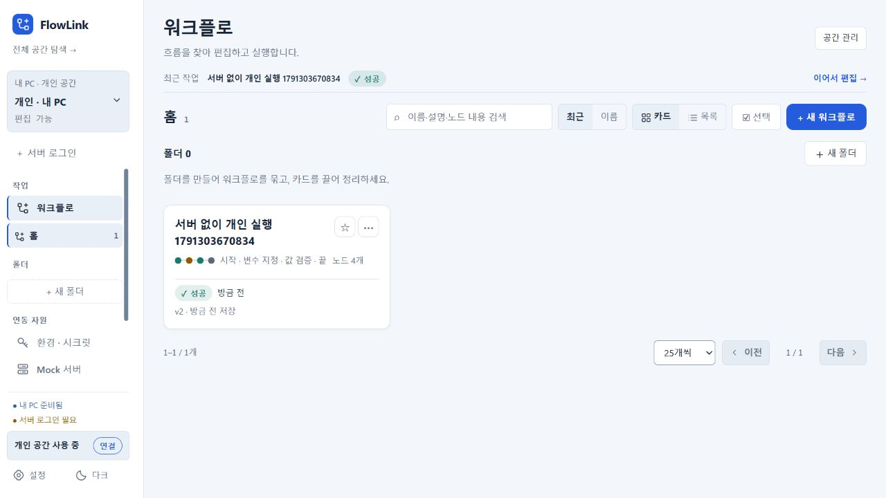

# 개인 워크스페이스 오프라인 확인

화면은 기본 브라우저에서 표시하며 Windows 앱의 `flow-desktop`이 개인 API·정적 화면·H2를 제공한다. 그 화면에서 개인 공간은 PC API, 공용·팀 공간은 중앙 API를 사용한다. 현재 서버 JAR에도 같은 프론트가 동봉되어 중앙 URL로 작업 화면을 열 수 있다. 중앙 화면은 개인 H2에 접근하지 않는다. 이 검증에서는 중앙 화면 제공 정책을 변경하지 않았다.

격리된 PC 앱을 연결 불가능한 `http://127.0.0.1:18401`로 설정한 상태에서 실제 기동했다. 서버나 사용자의 설치 앱·개인 자료·IDE 설정을 변경하지 않았다.

- 중앙 서버 없이 첫 기동, 개인 인증 부트스트랩과 편집 권한 확인.
- 개인 H2 공간 조회, 실패한 중앙 로그인 후 흐름 생성·저장·조회 성공.
- PC의 SET→ASSERT 실행 성공 및 개인 공간 유지.
- CUA 브라우저에서 개인 작업 카드와 실행 성공 표시 확인.
- 서버 연결 실패를 일반 500 대신 503과 개인 작업 지속 안내로 변환. 로그인·주소 조회·원격 API 전송에 같은 처리 적용. 자동 재전송이나 저장된 세션 삭제는 하지 않는다.
- 시작 창의 개인 진입 버튼을 ‘개인 워크스페이스 열기’로 명시.

검증 명령: `pwsh -NoProfile -File scripts/test/desktop-offline.ps1 -AgentFile .run/desktop-offline-review-fixed/data/agent.json`. 7개 확인 통과. `:flow-desktop:test :flow-desktop:bootJar` 통과. 기존 인증 테스트에서 로그인 후 서버 단절에 대한 세 경로의 503과 세션 유지도 확인했다.

이번 연결 오류 안내·버튼 문구 수정은 소스/JAR에 반영했으며 이미 배포한 0.3.9 MSI는 덮어쓰지 않았다. 개인 오프라인 동작 자체는 기존 0.3.9에도 구현되어 있다. 원격 실행 노드·중앙 MCP·외부 Vault 등 연결이 필요한 기능은 오프라인에서 사용할 수 없다. 실제 MCP·IDE 등록이나 사용자 MSI 설치를 테스트하지 않았다.

