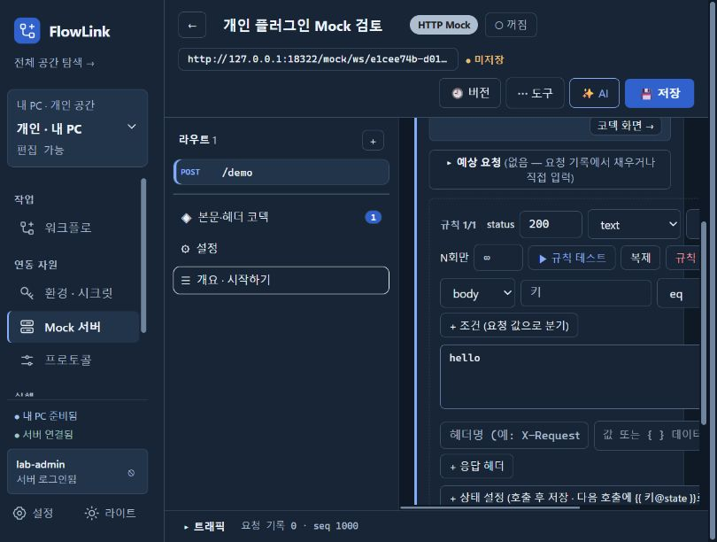
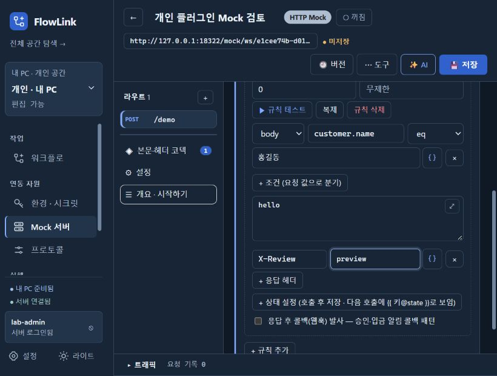

# UI 실제 사용 검토 — 2026-10-07

현재 소스의 프론트엔드 빌드를 `flow-desktop` JAR에 포함하고, 개인 검증 앱 `127.0.0.1:18322`를 다시 실행해 CUA 브라우저로 확인했다. 개인 H2와 저장된 실험용 로그인은 유지했다. 중앙 검증 서버는 `18183`이며 운영 계정·데이터는 사용하지 않았다.

## 확인하고 수정한 문제

### 1. Mock 규칙 편집의 가로 잘림과 편집 영역 부족 — 수정 완료

- 사용자 목적: 요청 조건의 값과 응답 헤더를 입력하고 필요 없는 행을 삭제한다.
- 재현: 820×620 창 → Mock 목록 → 꺼진 `개인 플러그인 Mock 검토` → `/demo` 라우트 → 조건 추가 → 응답 헤더 추가.
- 실제 결과: 상세 영역의 너비는 344px인데 내용은 566px까지 늘어나 조건 값과 삭제 버튼이 오른쪽으로 잘렸다. 고정 268px 구성 메뉴와 줄바꿈 없는 입력 행이 원인이었다. 트래픽을 펼치면 고정 300px 패널이 편집 영역을 크게 줄였다.
- 수정: 구성 메뉴 폭을 창 크기에 맞게 조정하고 조건·헤더·예상 요청·상태·콜백 입력 행에 줄바꿈과 축소 가능한 폭을 적용했다. 트래픽 높이는 최대 300px, 창 높이의 32% 이내로 제한했다.
- 재검증: 820×620에서 상세 영역 `clientWidth = scrollWidth = 442px`, 페이지 폭 820px. 조건 값 `홍길동`, 헤더 `X-Review: preview`, 두 삭제 버튼 모두 영역 안에 표시됐다. 트래픽을 펼치면 높이 약 198px, 상세 영역 높이 287px이었다. 1100×700에서도 가로 넘침이 없었다.
- 판단 근거: 기능에 필요한 입력과 삭제 작업이 창 크기 때문에 접근 불가능해진 실제 결함이다. WCAG 1.4.10 관련 개선이지만, 이 검토만으로 전체 320px 리플로우 준수를 판정하지 않는다.

수정 전:

수정 후 — 같은 창 크기에서 조건 값과 헤더, 삭제 버튼 확인:

### 2. Mock 응답 설정 입력의 이름 누락 — 수정 완료

- 사용자 목적: 응답 코드·형식·문자셋·지연·적용 횟수를 구분해 편집한다.
- 재현: 같은 라우트의 응답 규칙을 열고 접근성 트리를 확인한다.
- 실제 결과: 주요 input/select/textarea 10개에 연결된 label 또는 접근성 이름이 없었다. 화면의 `status`, `지연(ms)` 같은 별도 글자는 입력 이름으로 연결되지 않았다.
- 수정: 응답 설정에 눈에 보이는 한국어 label을 연결하고, 조건·헤더·예상 요청·상태·콜백 입력과 삭제 버튼에 행 문맥을 포함한 이름을 붙였다.
- 재검증: 접근성 트리에 `규칙 1 응답 코드`, `규칙 1 응답 형식`, `규칙 1 문자셋`, `조건 1 customer.name 값`, `응답 헤더 1 X-Review 값`이 표시됐다. 상태·콜백까지 펼친 화면에서 이름 없는 native input/select/textarea는 0개였다.
- 판단 근거: 입력 목적을 프로그램으로 식별할 수 없어 보조 기술 사용에 영향을 준다(WCAG 3.3.2, 4.1.2). 실제 스크린 리더 낭독 검증은 수행하지 않았다.

## 함께 사용해 본 동선

| 동선 | 실제 확인 결과 |
|---|---|
| 워크플로 카드 목록·검색·페이지 영역 | 기본 창에서 새로운 잘림을 확인하지 못함 |
| 워크플로 생성 → API 노드 → JSON 필드 입력 → 미저장 이동 경고 → 계속 편집 → 저장 | 정상. `UI 검토 · 편집과 입력 동선` 검증용 워크플로 1개만 생성·저장. 실행은 하지 않음 |
| 좁은 창 워크플로 편집 | 팔레트 축소와 속성 패널 표시 확인 |
| 환경 `.env 붙여넣기` → 두 변수 미리보기 → 취소 | 정상. 환경에 저장하지 않음 |
| Mock 응답 본문 크게 편집 → Escape | 닫힘과 원래 버튼으로 포커스 복귀 확인 |
| 기존 실행 이력 상세 → 출력 확대 → Escape | 출력 확인, 닫힘과 포커스 복귀 확인. 재실행하지 않음 |
| Mock 조건·헤더 값 입력 → 상태·콜백 펼치기 → 목록 이동 | 경고 후 변경을 버리고 이동. 기존 Mock은 꺼짐·v2 유지 |

## 검증과 범위

- `npm run build`, `npm test`(14개 검사), `npm run lint`, `:flow-desktop:bootJar`, `git diff --check` 통과.
- lint의 기존 Fast Refresh 경고와 Vite의 기존 큰 번들 경고는 남아 있다.
- Mock 호출·콜백 발사·실행 재시도는 수행하지 않았다. MCP 프로토콜·도구 호출·IDE 등록, 실제 GitHub 로그인, Windows MSI 설치 검증도 수행하지 않았다.
- 앱 재시작 직후 이전 브라우저 진입 세션에서는 다시 열기 안내가 나타났다. 앱이 발급한 새 진입 경로로 열자 정상 연결됐다. 이 현상을 새 제품 결함으로 등록하지 않았다.
- 이번 수정은 편집 레이아웃과 입력 이름에 한정한다. 전체 UI, 모든 창 크기·권한 조합의 무결함을 주장하지 않는다. MSI는 이번 변경으로 다시 패키징하지 않았다.
